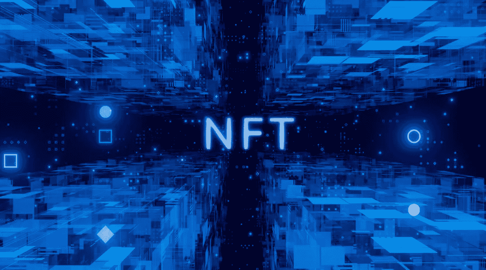
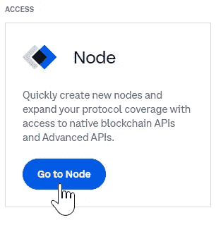
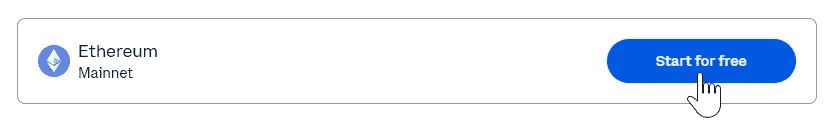
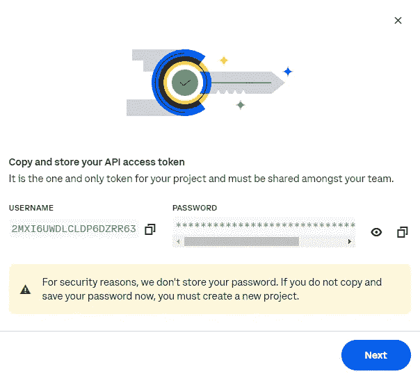
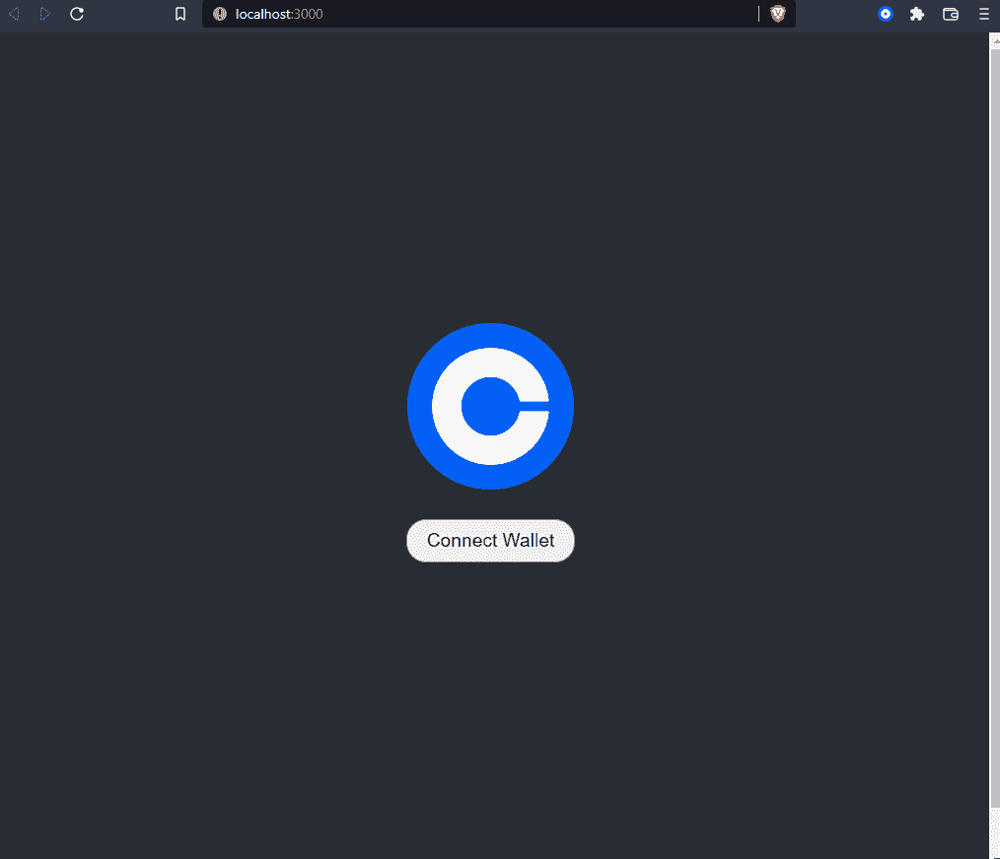

# 使用比特币基地云节点和 NFT API 构建功能性 Dapp

> 原文：<https://betterprogramming.pub/build-a-functional-dapp-using-coinbase-cloud-node-and-nft-apis-5196bb1f3e24>

## 读取 NFT 数据，甚至显示用户的 NFTs



[图片来自 unive.it](https://www.unive.it/pag/16584/?L=0&tx_news_pi1%5Bnews%5D=12035&cHash=6779c13c7e9082f41e146891c4531c1d)

[摩尔定律](https://en.wikipedia.org/wiki/Moore's_law)，实际上更像是一条经验法则，它观察到密集集成电路中的晶体管数量大约每两年翻一番。在我职业生涯的最初几年，随着个人电脑革命开始蓬勃发展，我感受到了摩尔定律的影响。

在个人电脑革命的高峰时期，事情发展得很快，而微软、Novell 和 Borland 等公司声称拥有所有权，并帮助为这个新的计算时代制定标准。事实上，CPU 能力每 18 到 24 个月翻一番，这在当时成为一项非常需要的资产，使复杂的特性和功能成为现实。

我感觉 Web3 也处于类似的位置，不断有新的工具、框架、协议和多链等概念发布。很明显，18 到 24 个月前 Web3 可用的选项数量与今天相比显得微不足道。

一个例子是[比特币基地云](https://www.coinbase.com/cloud)如何发展其工具套件——引入其具有高级 API 和全面的 [NFT API](https://www.coinbase.com/cloud/products/nft-api) 的[节点服务。](https://www.coinbase.com/cloud/products/node)

在这篇文章中，我将深入研究，看看开始创造有价值的东西是多么容易。但首先，让我们确保每个人都在同一页上。

# 快速回顾比特币基地入门

在我的上一篇文章中，我们从 Web2 的起点探索了比特币基地 API。对于那些可能错过它的人，我创建了一个简单的前端，允许我们连接我们的钱包，并使用比特币基地 API 发送一些以太网。

该出版物的目标是为 Web2 开发人员提供与区块链交互的基本介绍。它允许早期用户向自己转移资金——只需一点点汽油费。

这当然不是比特币基地 API 所能提供的全部，这就是为什么一个自然的进展是探索比特币基地的一些新技术，使我们的 dapp 更具功能性。最近发布的比特币基地云节点和 NFT API 确实吸引了我的眼球。

# 关于比特币基地云节点和 NFT API 的更多信息

比特币基地云节点和 NFT API 带来了一些吸引人的好处来推动开发人员的采用:

*   默认情况下包括企业级安全性。
*   该解决方案由 Web3 领导者之一构建。
*   开发人员可以免费开始——随着您的成功，可以选择扩展。

Web3 开发者面临的挑战之一是通过多个区块链网络进行查询/交易的能力。比特币基地云节点服务和高级 API 使在多个区块链网络上进行查询和交易变得轻而易举——并包括来自您的查询的全面数据。

从 NFT 的角度来看，比特币基地·NFT API 可以快速方便地从多个区块链的集合中收集 NFT 元数据，解决了 Web3 不断增长的 NFT 方面的相同问题。

让我们看看如何将它们放在一起构建一个 dapp，在集合中显示用户的 NFTs。值得注意的是，在它们目前的状态下，这些 API 目前只能在以太坊网络上使用，所以这就是我们将要使用的。

# 示范

对于本文的演示部分，我们将基于我上一篇文章中的前一个项目，并使用比特币基地云节点和 NFT API 使我们的 dapp 功能更强大。我们将包括以下功能:

*   输入 NFT 合同地址
*   比特币基地云节点的高级 API 读取合同元数据以显示集合名称
*   高级 API 检查关联帐户的钱包，以确定集合中的 NFT 数量
*   根据 NFT 的数量，弹出输入字段以输入 NFT ID 号
*   NFT API 使用这些 ID 号从集合中返回帐户的 NFT 的图像

## 1.设置您的帐户

在开始这个项目之前，请在这里注册一个比特币基地云账户。

设置您的帐户后，选择仪表板上的“转到节点”选项，然后创建新项目。



正如您在本页的网络列表中所看到的，有很多可供选择！然而，为了简单起见，我们将选择以太坊主网。



选择免费计划并为您的项目命名，然后单击“转到项目”按钮。

> 注意:点击按钮后，会弹出一个对话框，包含您的用户名和密码。
> 
> **不要关闭这个对话，直到你复制了你的密码。**
> 
> 比特币基地不会存储您的密码，因此如果您未能复制您的密码，您将不得不开始一个新的项目。



复制用户名和密码后，单击“下一步”接收您的端点。复制这个连同你的用户名和密码，我们将在项目中使用它。

## 2.设置项目

要继续项目的其余部分，您需要以下内容:

*   [吉特](https://git-scm.com/downloads)
*   你最喜欢的[代码编辑器](https://code.visualstudio.com/)
*   [节点包管理器](https://nodejs.org/en/download/) (NPM)
*   一个 Web3 钱包浏览器扩展，或者是[比特币基地钱包](https://www.coinbase.com/wallet)，或者是[元掩码](https://metamask.io/)
*   以太坊主网上的一个 NFT(NFT 合同地址和 NFT 身份证号码)

如果你跟随我的上一个教程，那太好了！你已经有了这个的起点。如果没有，不要担心，您可以在这里找到我们将要开始的项目:

[https://gitlab.com/johnjvester/coinbase-wallet-example](https://gitlab.com/johnjvester/coinbase-wallet-example)

或者只需在您希望工作的目录中从您的终端运行此命令:

```
git clone [https://gitlab.com/johnjvester/coinbase-wallet-example.git](https://gitlab.com/johnjvester/coinbase-wallet-example.git)
```

接下来，将目录更改到新文件夹并安装依赖项:

```
cd coinbase-wallet-example && npm i
```

现在运行`npm start`来确保到目前为止一切都正常。导航到`[http://localhost:3000/](http://localhost:3000/)`，您应该会看到如下所示的页面:

安装了 Web3 wallet 浏览器扩展后，选择 Connect Wallet 以连接并切换到 Ropsten 网络。完成后，您应该会看到您的钱包地址作为连接的帐户。

厉害！现在我们知道一切正常，让我们添加新的功能。在您的代码编辑器中打开项目，并导航到`./src/App.js`文件。

# 3.更改代码

## 3.a .凭证和标题

首先，让我们添加一点我们自己的代码。在导入语句下面，我们将添加我们的比特币基地 URL、用户名、密码和一些代码来创建我们将与 API 调用一起传递的头。

接下来，我们需要调整`DEFAULT_CHAIN_ID`、`DEFAULT_ETHEREUM_CHAIN_ID`和`DEFAULT_ETH_JSONRPC_URL`。我们将分别将其更改为`1`、 `‘0x1’`和`COINBASE_URL`。这是因为我们将与以太坊主网交互，而不是 Ropsten Testnet。

接下来，我们可以删除声明`DONATION_ADDRESS`变量的行，因为我们不会使用它。

现在我们将添加一些我们自己的代码。

应用程序声明之前的所有代码现在应该如下所示:

**注意**:一定要在上面的代码中添加自己的 API 端点、用户名和密码。

## 3b .反应状态变量

添加几个新的 React 状态变量并删除 responseMessage 变量。我们的状态变量部分现在应该是这样的:

```
*// React State Variables* const [isWalletConnected, setIsWalletConnected] = useState(false);
const [account, setAccount] = useState();
const [walletSDKProvider, setWalletSDKProvider] = useState();
const [web3, setWeb3] = useState();
const [nftAddress, setNftAddress] = useState();
const [ownedNFTs, setOwnedNFTs] = useState(0);
const [nftContractName, setNftContractName] = useState();
const [imageSource, setImageSource] = useState([]);
const [displayNFTs, setDisplayNFTs] = useState(false);
```

## 3.c .创建新功能—比特币基地云节点高级 API 调用

直到捐赠函数的其余代码不需要更改，除非您想将消息`‘Successfully switched to Ropsten Network’`更改为`‘Successfully switched to Ethereum Mainnet’`以更加准确。

接下来，我们可以完全删除捐赠功能，因为我们将不再使用它。所以只剩下 HTML 了。然而，在此之前，让我们添加一些新的功能。

首先，添加获取 NFT 集合名称的函数，并检查连接的帐户，以查看他们拥有多少来自集合的 NFT。代码如下:

让我们浏览一下这段代码，这样我们就能理解发生了什么。

首先，我们将状态变量`displayNFTs`设置为`false`，这样当我们输入一个新的合同地址时，它将重置我们的接口。(我们将在以后为此更改 HTML。)

接下来，我们从用户输入中获取 NFT 合同地址，并将其设置为我们的`nft_Address`状态变量。

然后，我们使用我们的`COINBASE_URL`、`HEADERS`和`NFT_ADDRESS`变量向比特币基地云节点高级 API 发出两个获取请求，并使用来自响应的数据设置我们的`nftContractName`和`ownedNFT`状态变量。注意我们调用了`[coinbaseCloud_getTokenMetadata](https://docs.cloud.coinbase.com/node/reference/advanced-api-reference#coinbasecloud_gettokenmetadata)`和`[coinbaseCloud_getBalances](https://docs.cloud.coinbase.com/node/reference/advanced-api-reference#coinbasecloud_getbalances)`高级 API 方法。

## 3.d .创建新函数—添加输入字段

太棒了。接下来，我们将添加一个函数，根据帐户在集合中拥有的 NFT 数量来创建输入字段:

## 3.e .创建新功能—获取 NFT 图像

我们要添加的最后一个函数是查询比特币基地·NFT API，根据用户添加的 NFT id 返回 NFT 图像 URL，并将它们推送到`imageSource`状态变量数组。然后我们将状态变量`displayNFTs`设置为`true`:

这就是所有的 JavaScript 代码。现在，让我们更改 React 代码的`html`部分，以正确显示所有内容。

## 3.f .更改 HTML

我们将对 HTML 进行一些修改，这样它就能显示我们需要的所有内容。代码的 HTML 部分应该如下所示:

在上面的代码中有一些事情需要注意。首先，我们提供一个默认的 NFT 合同地址，以防用户没有。在这种情况下，无聊猿游艇俱乐部的合同地址。

我们的`Check Contract`按钮调用`getNftContract`函数，然后显示连接的帐户从合同地址拥有多少 NFT，以及集合的名称。

如果用户拥有来自所提供合同地址的 NFTs，则调用`addFields`函数，并根据他们拥有的数量显示一些输入字段。

最后，`Get NFTs`按钮将调用`getImages`函数，下面的代码遍历`imageSource`数组以显示来自它包含的 NFT URL 的图像。

## 4.看看它的实际效果

就是这样！如果所有内容都输入正确，并且您提供了自己的比特币基地节点 API 端点、用户名和密码，那么您应该有一个功能如下的项目:



该项目的整个源代码应该如下所示:

# 结论

自 2021 年以来，我一直试图按照以下使命宣言生活，我觉得这可以适用于任何技术专业人士:

> *“将您的时间集中在提供扩展您知识产权价值的特性/功能上。将框架、产品和服务用于其他一切。”— J. Vester*

Web3 开发者发现自己处在一个和我职业生涯开始时相似的位置——在个人电脑革命的希望和梦想中航行。随着计算能力每 18 到 24 个月翻一番，似乎没有什么特性或功能会超出范围。然而，我们都很快了解到，不仅仅是 CPU 能力应该驱动决策。

Web3 开发者需要一套合适的工具、框架、产品和服务来帮助他们取得成功。在这篇文章中，我们探讨了比特币基地云节点和 NFT API，它们强烈地坚持了我的个人使命。

在一组合理的程序逻辑中，我们能够成功地使用这些 API 来读取 NFT 数据，甚至显示用户的 NFT。利用比特币基地云选项节省的时间将允许开发人员专注于他们的主要目标和目的。

如果您对本文的源代码感兴趣，可以在以下 URL 找到它:

[https://git lab . com/johnj vester/coin base-node-NFT-API-tutorial](https://gitlab.com/johnjvester/coinbase-node-nft-api-tutorial)

摩尔定律在 2010 年开始放缓，大多数人认为，由于物理限制，它将在大约三年内达到其生命的终点。这将有可能为新的解决方案铺平道路——比如量子计算、人工智能和机器学习。这与 Web3 如何成为满足业务需求的一个有吸引力的选择没有太大区别。

祝你今天过得愉快！