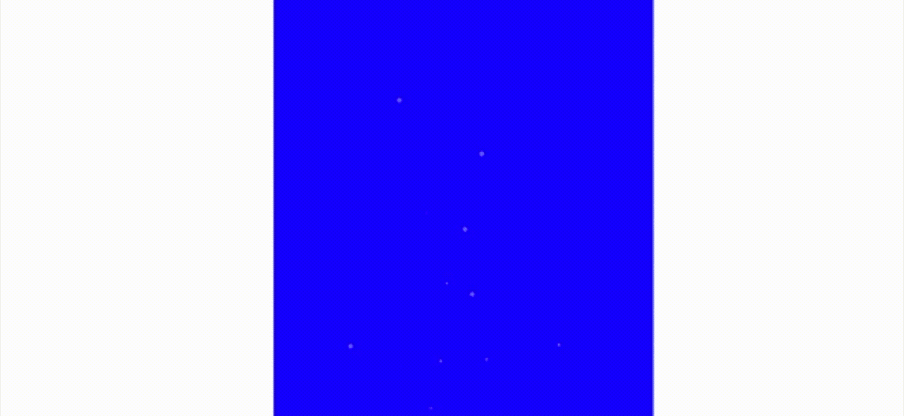
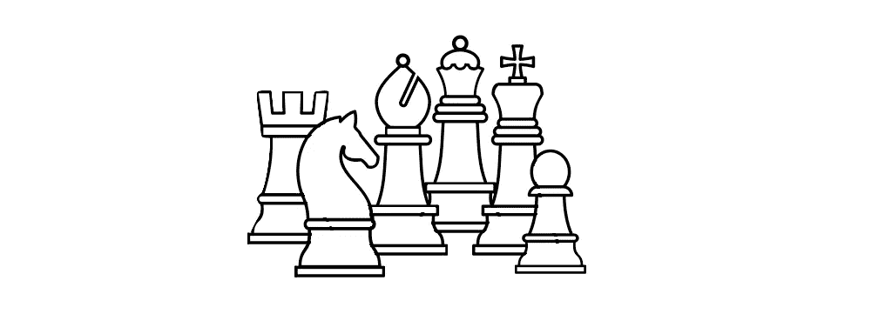
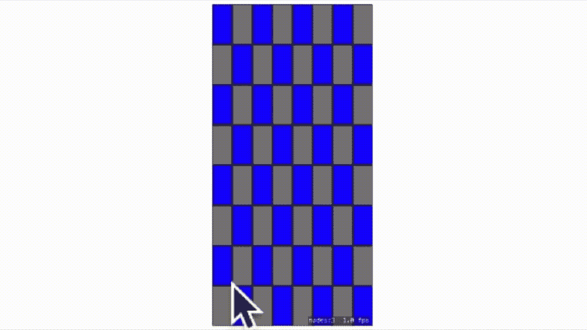

# 用 SpriteKit 构建一个国际象棋游戏

> 原文：<https://betterprogramming.pub/build-a-game-of-chess-with-spritekit-3229c23bdba0>

## 在 SpriteKit 中以编程方式使用 tilesets



国际象棋比赛中的头球

当我开始涉足计算机领域时，那是很久很久以前的 1982 年，在一个很远很远的地方，名叫英格兰。微软没有垄断市场，Windows [1995]也不存在。命令行是可行的方法——一边是 MSDOS，另一边是 UNIX。

当我在 1985 年去大学学习计算机科学时，一切都是以命令行为中心的。甚至连 IDE 都不在大计划中；直到 1991 年才出现。这是一种从未离开我的工作方式；只是感觉键入一个命令来做你想做的事情比使用 GUI 更有效。

当我告诉你我想在 SpriteKit 中讨论 tilemaps 时，你不会感到惊讶，这里不是通过 GUI Apple build，而是通过代码。感觉像命令行的代码。加入我的旅程，使用 tilemaps 构建一个国际象棋游戏。Tilemaps 是程序员，不是设计师。尽管在我们开始之前，让我们确保我们在这一页上是一致的。

自从游戏引擎出现以来，“TileMaps”就一直是游戏引擎不可或缺的一部分。它们的出现是因为设计者和编码者需要有效地描绘背景场景的方法。在初始构建和实际更新方面都很高效。拼贴贴图通过将背景分解成由重复拼贴集合组成的网格来解决这个问题。

现在，棋盘游戏都是关于格子的。tilemap 的理想工作，具有附加价值，tile map 旨在提供一种简单/有效的方法来检测您所在的瓷砖-实际上非常适合棋盘游戏。一盘棋。

我们从基本代码开始:SwiftUI 界面中的一个`SpriteKit`场景。实际上是两个，因为我想要一个动画封面，你可以在这里读到:

[](/text-sfx-with-swiftui-spritekit-c3f9777f0f1c) [## 使用 SpriteKit 在 SwiftUI 中创建漂亮的文本效果

### 将 SpriteKit 和核心图像过滤器集成到 SwiftUI 应用程序中

better 编程. pub](/text-sfx-with-swiftui-spritekit-c3f9777f0f1c) 

# 棋盘

为了搭建这块板，我们需要两种瓷砖:深色的和浅色的。为了制作瓷砖，我将使用`CoreImage`来绘制和创建纹理。它在编码设计中工作良好，因为它易于布局。所绘制的图像是带有黑色轮廓的着色盒子。代码如下:

值得一提的是，网格的布局是纯数学的。场景尺寸为 512 x 256 这些瓷砖是 64 x 32 的。为此，单幅图块的大小需要是场景的倍数。除此之外，我需要用它来构建我的代码板。为此，单幅图块的大小需要是场景的倍数。代码如下:

接下来是棋子。我将从[新项目](https://thenounproject.com/)下载棋子。我只需要每种类型的一个副本，因为我计划再次使用 CoreImage 过滤器来着色。我下载它们，给我的图像集命名，这样我就可以很容易地迭代，并创建我的精灵。我需要 16 个兵，4 个城堡，4 个骑士，4 个主教，2 个女王和 2 个国王。这是我将使用的所有图片的合成，我将单独加载。



由 Joni 为 [thenounproject](https://thenounproject.com) 创建

在应用程序中，这个方法有三个调用，带有要加载的图像的名称，也就是“a00”、“b0”和“c0”。我将使用这些图像来建立精灵。代码如下:

这个方法创建了我使用的精灵，其中有两个值得注意的方法。第一，`resizedImage`函数做三件事:

*   运行一个`CIFilter`将图像中所有白色像素的颜色改为颜色 X，不幸的是，它的副作用是将透明度也改为白色。
*   运行一个`CIFilter`把新的白色像素变回透明。
*   用新尺寸重绘图像。

代码如下:

第二个“可触摸的 sprite”就是这样做的:创建一个可以在棋盘上拖动的 sprite，并使用可触摸的 Sprite 协议触发两个委托方法。这些方法由触地/上升事件触发。

```
protocol touchMe: NSObjectProtocol {
  func spriteTouched(box: TouchableSprite)
  func spriteSelected(box: TouchableSprite)
}
```

第一种方法基本上是从那个方块中取消所述精灵的注册。第二个将 sprite 注册在一个新的方块中。在注册它之前，该方法还检查在所述方块上是否已经有一个棋子，如果有，则移除它。



使用 spriteKit 牌组的国际象棋游戏

所有这些都让我想到了这篇文章的结尾。这里是`ContentView.swift`和主`GameView`的完整代码。我没有包括您在本文开头看到的标题。我把它留给你玩。

`GameView.swift`的代码:

接下来去哪里？以下是一些想法:

*   修正被拖动的精灵不总是出现在顶部的问题。
*   更新用户界面，这样你就可以看到谁赢了/谁输了。
*   实现一个网络代码，这样你就可以和你的朋友一起玩了。
*   设置一个某种形式的时钟，这样你就可以记录每个玩家花了多长时间才轮到他们。
*   验证请求的移动，并且只允许有效的移动。
*   以此为基础，创建一个不同的广泛的游戏(跳棋，有人吗？或者可能是围棋比赛)。

感谢阅读。