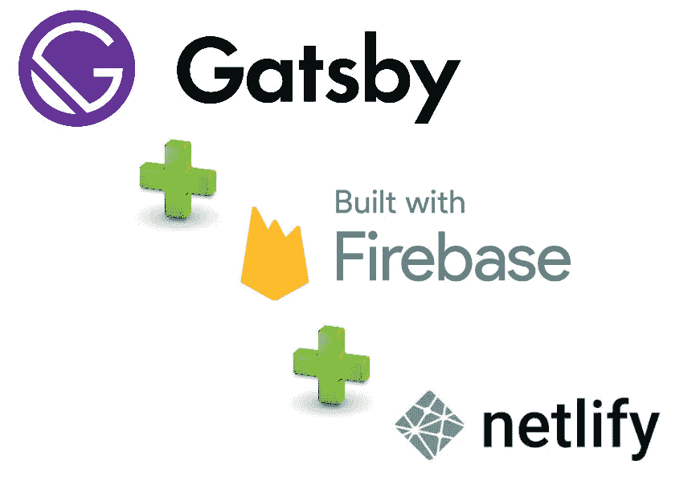
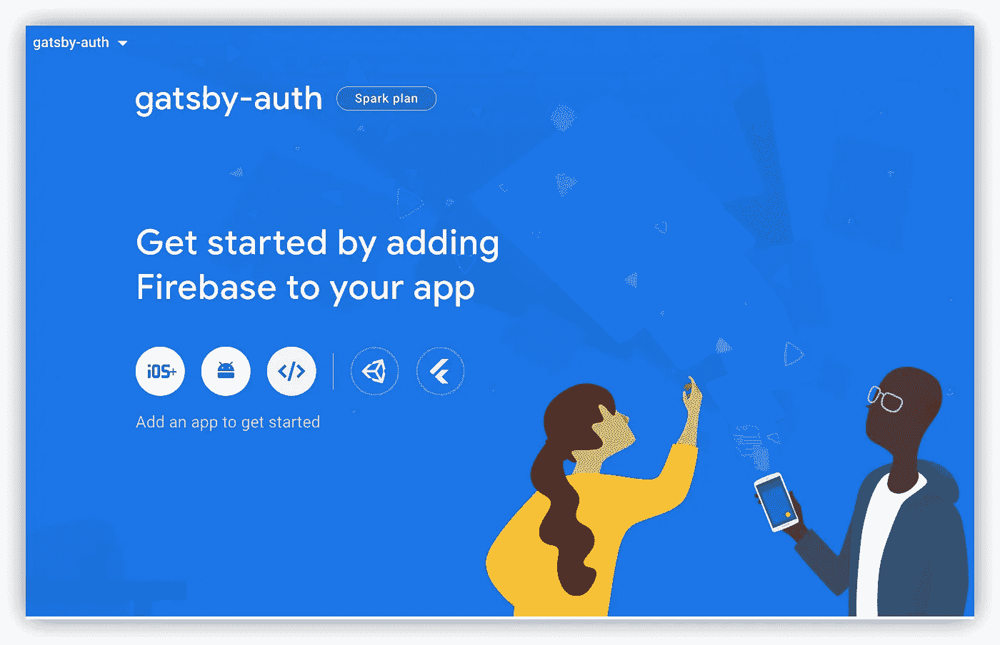
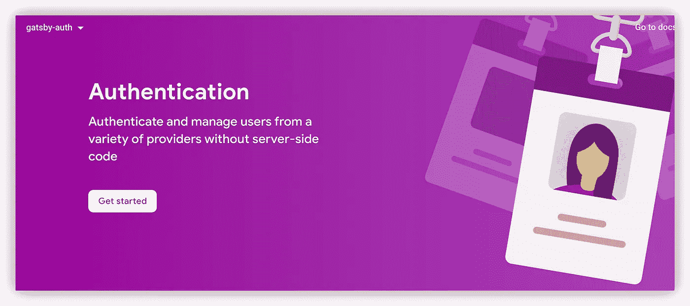
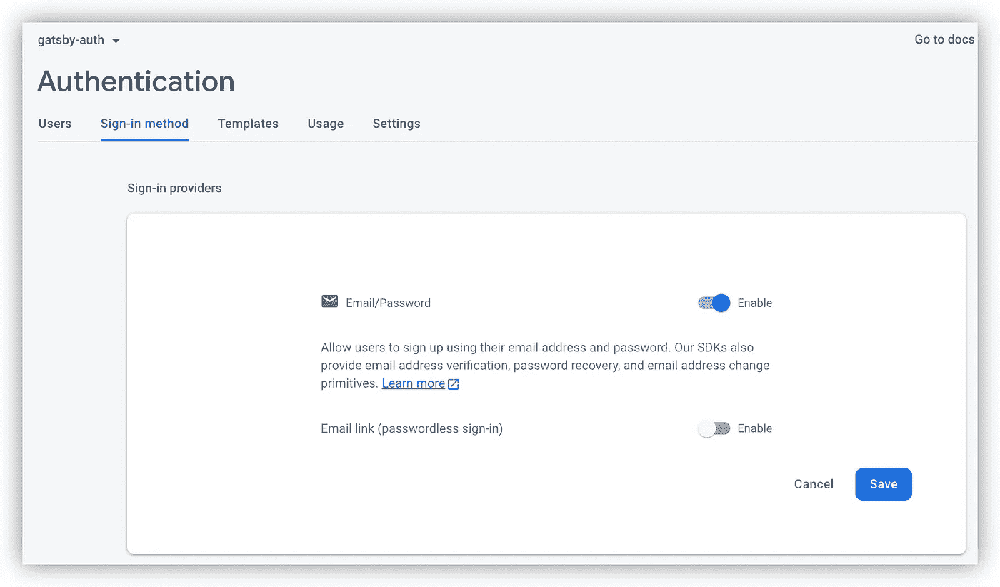
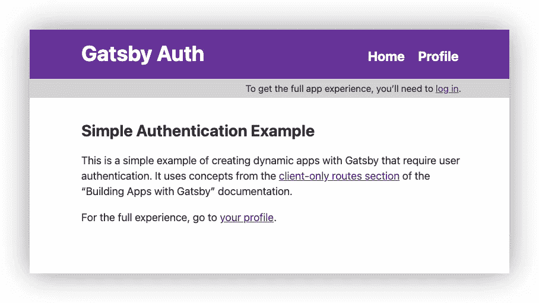
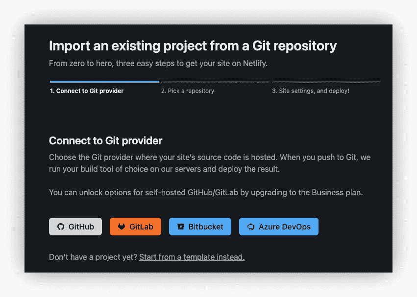
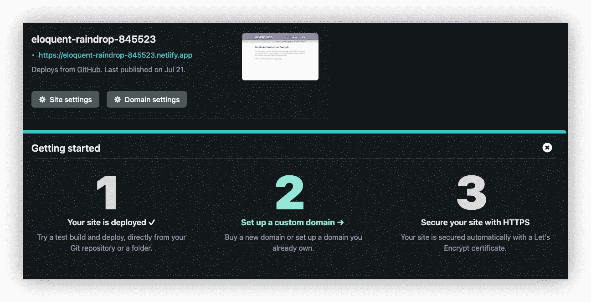
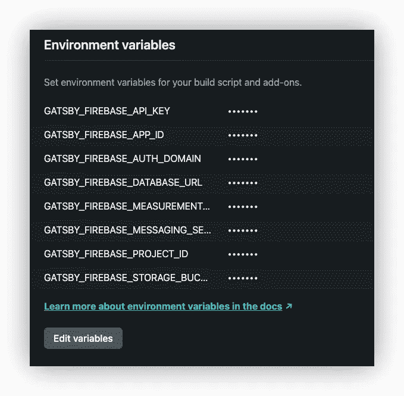
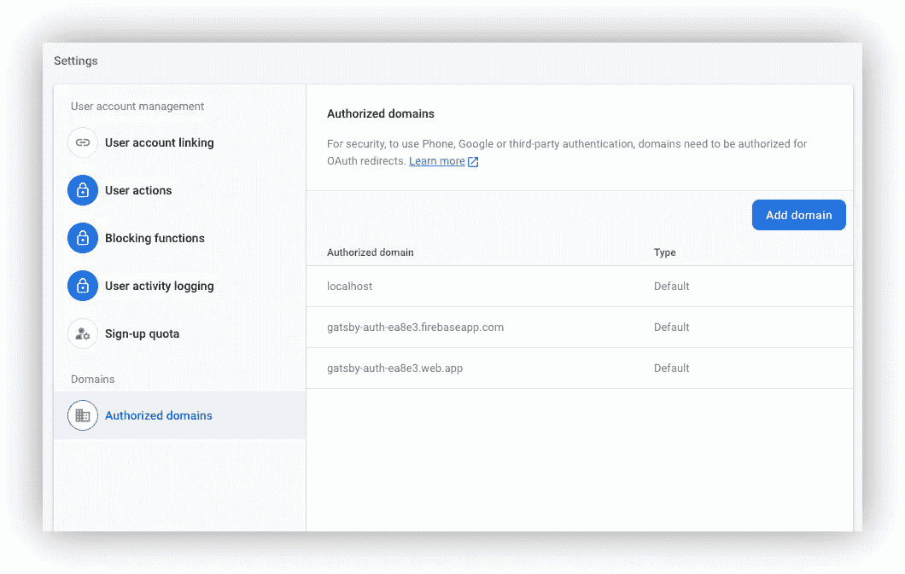

# 用 Firebase 构建一个 Gatsby 认证流

> 原文：<https://betterprogramming.pub/build-a-gatsby-authentication-flow-with-firebase-72b9514f6c9b>

## 使用 Firebase 身份验证保护您的 Gatsby 应用程序



# TL；速度三角形定位法(dead reckoning)

本指南将带您了解如何在 Gatsby 应用程序中使用 Firebase 建立一个认证流，并将其部署到 Netlify 主机。遵循本指南后，您将拥有一个可用的 Gatsby 应用程序，包括:

*   成熟的登录和注册流程。
*   安全电子邮件/密码认证。
*   重置密码
*   安全的用户配置文件页面。
*   部署到网络

这里有一个可用的演示应用程序。提供了完整的源代码。

# 关于盖茨比

[Gatsby](https://www.gatsbyjs.com/) 创建于 2015 年，是一个基于 Node.js 使用 React 和 GraphQL 构建的开源静态站点生成器。它提供了超过 2500 个插件来创建基于 Markdown 文档、MDX、图像和众多内容管理系统(如 WordPress、Drupal 等)的静态站点。它的速度快得像闪电一样，因为服务器端将 JavaScript 渲染到静态站点文件中，这些文件被缩小，可以通过内容交付网络提供服务。

由于 Gatsby 中的所有页面都呈现为静态内容，所以 Gatsby 站点的用户身份验证不能在服务器上执行，而必须通过客户端路由进行保护。

本教程将带您在 Gatsby 中使用一个健壮的解决方案(如 Firebase)来设置客户端身份验证，以及如何在您的 Gatsby 应用程序中管理登录的用户。

# 出发点

我们从 Gatsby examples 文件夹中的简单认证流程开始。我已经分叉了 Gatsby 项目，并在这里用简单的 auth 创建了一个起点:【https://github.com/mlomboglia/simple-auth

只需克隆项目:

```
$ git clone [https://github.com/mlomboglia/simple-auth](https://github.com/mlomboglia/simple-auth)$ cd simple-auth
```

我假设您已经安装了 NodeJS。如果没有，您可以在此安装它:

[](https://nodejs.org/en/download/) [## 下载| Node.js

### Node.js 是基于 Chrome 的 V8 JavaScript 引擎构建的 JavaScript 运行时。

nodejs.org](https://nodejs.org/en/download/) 

## 升级至 Gatsby 的最新版本

在项目根文件夹中

```
$ npm install gatsby@latest --legacy-peer-deps
```

# Firebase 设置

Firebase Authentication 提供后端服务、易于使用的 SDK 和现成的 UI 库，用于向您的应用程序验证用户。它支持使用密码、电话号码、流行的联合身份提供商(如谷歌、脸书和 Twitter)等进行身份认证。

Firebase 身份验证与其他 Firebase 服务紧密集成，它利用了 OAuth 2.0 和 OpenID Connect 等行业标准，因此可以轻松地与您的自定义后端集成。

在这个演示中，我将设置一个电子邮件/密码身份验证提供者。许多其他选项是可用的。

打开 Firebase 控制台。

添加新项目，选择名称，并创建项目:


点击 Web 图标，添加新的 Web 应用程序:



复制 Firebase 配置项目，并保存它们以备后用。

我将把它们作为环境变量添加进来。

点击认证。



启用电子邮件/密码选项。



在您的项目根文件夹中，安装 Firebase SDK

`$ npm i firebase`

## 燃烧基成分

现在，让我们创建 Firebase 组件。

打开你最喜欢的 IDE。我用的是 Visual Studio 代码。

在你的`src/components`上创建一个文件夹`Firebase`。

创建`Firebase.js`文件:

## 环境变量

Gatsby 内置了将环境变量加载到浏览器和函数中的支持。

要将这些加载到 Node.js 中，请将以下代码片段添加到您的`gatsby-config.js`文件的顶部:

```
require("dotenv").config({
   path: `.env.${process.env.NODE_ENV}`, 
})
```

在开发中，Gatsby 将从名为`.env.development`的文件中加载环境变量。对于构建，它将从`.env.production`开始加载。

在项目的根文件夹中创建一个文件`**env.development**`。

添加以下变量:

```
GATSBY_FIREBASE_API_KEY=<from firebase console config>
GATSBY_FIREBASE_AUTH_DOMAIN=<from firebase console config>
GATSBY_FIREBASE_DATABASE_URL=<from firebase console config>
GATSBY_FIREBASE_PROJECT_ID=<from firebase console config>
GATSBY_FIREBASE_STORAGE_BUCKET=<from firebase console config>
GATSBY_FIREBASE_MESSAGING_SENDER_ID=<from firebase console config>
GATSBY_FIREBASE_APP_ID=<from firebase console config>
GATSBY_FIREBASE_MEASUREMENT_ID=<from firebase console config>
```

## 将`.env*`文件添加到。gitignore

环境变量文件不应该提交给 Git，因为它们通常包含秘密，添加到 Git 是不安全的。相反，将`.env.*`添加到您的`.gitignore`文件中，并在 Gatsby Cloud 和本地手动设置环境变量。

# 反应上下文 API

为了在 Gatsby 站点的全局级别上管理我们的`user`的状态，我们将实现 React 上下文 API。让我们将 Gatsby 根元素包装在我们的上下文提供程序中，以确保我们的上下文值对我们应用程序中的所有消费组件都可用。

在 [React 文档](https://reactjs.org/docs/context.html)中可以找到更多相关信息。

## 语境

在 components 文件夹中创建一个 Auth 文件夹。

创建`AuthContext.js`文件。

为了让我们应用程序中的所有组件成为**上下文消费者**，我们需要将我们的自定义`<AuthProvider>`组件包装在 Gatsby 根元素周围。

让我们在我们的`AuthContext.js`文件中使用一个辅助函数`wrapRootElement`组件，它导出了我们的`<AuthProvider>`组件，该组件包装了将被传递给我们的`wrapRootElement`函数的`{ element }`属性。我们现在需要做的就是使用`gatsby-browser.js`来导入(并立即导出)我们的`wrapRootElement`函数。

打开项目目录中的`gatsby-browser.js`,添加:

## 状态

状态组件将显示是否经过身份验证的用户。

编辑状态文件夹中的`index.js`:

# 按指定路线发送

要创建一个内容受限的网站，仅限认证用户，我们可以使用[客户端专用路由](https://www.gatsbyjs.com/docs/client-only-routes-and-user-authentication/)的概念来定义用户只有在登录后才能查看哪些页面。

使用 [@reach/router](https://reach.tech/router/) 库，你可以创建只对登录用户可用的路线。这个库是盖茨比引擎盖下用的，你甚至不用安装。

首先，在项目的根目录下创建`gatsby-node.js`。您将定义任何以`/app/`开头的路线都是您的受限内容的一部分，页面将按需创建:

现在，我们将在我们的`./src/pages/`文件夹中创建一个名为`app.js`的页面，它将导入我们的组件，并使用`@reach/router`库中的一个助手来处理客户端专用的动态路由。在`./src/pages/app.js`中创建如下所示的文件:

## 登录路线

对于登录组件，我将使用`firebase/auth`库中可用的`signInWithEmailAndPassword`方法:

在组件文件夹中创建`Login.js`

## 注册路线

要注册用户，我们可以使用 firebase/auth 组件中可用的`createUserWithEmailAndPassword`方法:

在组件文件夹中创建`Register.js`

## 重置密码路由

类似于密码重置，我将使用`sendPasswordResetEmail`

创建`Reset.js`:

Firebase 允许您自定义您的电子邮件域，以及用于密码重置的电子邮件模板消息。

## 专用路由组件

`<PrivateRoute />`组件将验证用户是否通过认证。如果当前用户存在，它将加载门控组件。

在组件文件夹中创建`PrivateRoute.js`。

## 安全配置文件路由

如果用户通过身份验证，将加载配置文件路由。

在`components`文件夹中创建`Profile.js`。

## 页眉

在您的`Header/index.js`上将链接调整到`<Link to=”/app/profile” className={header__link}>`

# 测试

现在，我们准备测试应用程序

使用`$ gatsby develop`运行您的应用程序

打开`[http://localhost:8000/](http://localhost:8000/)`



注册新用户，登录以导航到配置文件屏幕。

此处 有可用的演示应用[](https://eloquent-raindrop-845523.netlify.app)

**完整的源代码可从以下网址获得:**

**[](https://github.com/mlomboglia/gatsby-auth-firebase) [## GitHub-mlomboglia/gatsby-auth-firebase:带有 Firebase 的 Gatsby 认证流

### 基于 Firebase 的 Gatsby 认证流程。为 mlomboglia/Gatsby-auth-firebase 开发做出贡献，创建一个…

github.com](https://github.com/mlomboglia/gatsby-auth-firebase) 

# 网络部署

让我们将应用程序部署到 Netlify。

在你最喜欢的 Git 提供者中提交你的所有代码，比如 Github。

如果你没有的话，创建一个 Netlify 帐户(注册是免费的)。

## 步骤 1:添加新站点

点击**添加新站点** →从模板导入选项



## 第 2 步:链接到您的 Git 提供者(或者选择支持的版本控制工具)

我用的是 GitHub。将您的回购推送到 GitHub，这样我们需要做的就是将 Netlify 链接到 GitHub。点击 GitHub 按钮，如上图所示。

## 步骤 3:授权网络生活

如果未授权，请通过单击授权选项允许 Netlify 和 GitHub 相互对话。

## 第四步:选择你的回购

现在您已经连接了 Netlify 和 GitHub，您可以看到您的 Git repos 列表。从列表中选择要部署的存储库。点击**部署站点**

几分钟后，你应该你的新网站上市。

## 步骤 5:配置您的设置



单击站点设置→构建和部署→环境

添加您的环境变量，因为它们在`env.development`文件中。



## 第六步:建立你的网站

重建你的网站！

## 步骤 7:在 Firebase 中授权您的域

现在，我们需要在 Firebase 中授权新的域

转到 Firebase 控制台→身份验证→设置

单击添加域，将您的 Netlify 部署的应用程序域添加到授权列表中



## 步骤 8:在 Netlify 中测试你的应用

在 Netlify 中单击您的应用程序 URL，您应该有一个部署了 Firebase 的 Gatsby 身份验证流程的完整工作版本

搞定了。**