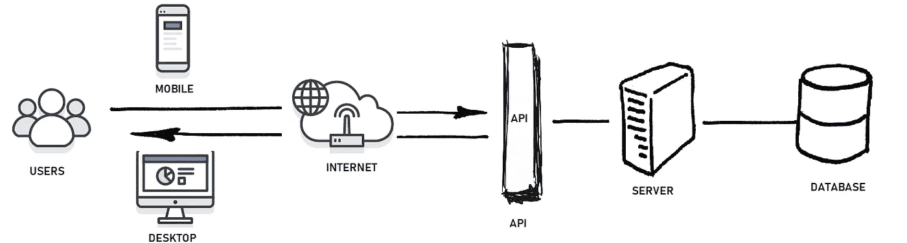

# 用 Combine 构建一个通用 API 包

> 原文：<https://betterprogramming.pub/build-a-general-purpose-api-kit-with-combine-9344cfcf5a1b>

## 无论远程主机、HTTP 方法或响应类型如何，这种方法都可以满足您的应用程序可能需要的任何目的



图片来源: [Bytenbit](https://bytenbit.com/best-guidelines-design-restful-api/)

# 介绍

无论如何，99%的应用程序需要访问存储在远程服务器上的数据，因此有一个 API 客户端来处理 HTTP 请求/响应是必不可少的。现在，尽管这些数据通常来自单一来源，但有多个来源也并不罕见。例如，假设您希望通过使用 [AccuWeather](https://www.accuweather.com) 在您的应用程序中显示天气信息，或者您希望通过使用 [Firebase](https://firebase.google.com/docs/reference/swift/firebasedatabase/api/reference/Classes) 实现一个仅限移动设备的功能。

此外，这些远程数据可能不总是像我们习惯的那样是 JSON 文件。它可以是 JSON 类型……也可以是图像、存折、XML、PDF……或者简单的纯文本！在这些场景中，我们倾向于创建一个不同的`Webservice/Repository/API Client`，但是这是完全必要的吗？

在本教程中，我们将实现一个通用的 API 客户端，将所有这些方法统一到一个通用的解决方案中。我们将应用以下概念:

*   关注点分离原则
*   协议扩展
*   无商标消费品
*   一等职能或作为一等公民的职能

我们的目标是实现一个优雅且易于使用的 API 客户端，它允许我们发出任何类型的 HTTP 请求:

```
@Published var beers: [Beer] = []
@Published var beerPassbook: PKPass?
@Published var beersMenu: PDFDocument?func fetchData() {
    apiClient
        .send(BeersRequest())
        .json()
        .replaceError(with: [])
        .assign(to: \.beers, on: self)
        .store(in: &disposeBag) apiClient
        .send(BeerPassbookRequest())
        .passbook()
        .replaceError(with: nil)
        .assign(to: \.beerPassbook, on: self)
        .store(in: &disposeBag) apiClient
        .send(BeersMenuRequest())
        .pdf()
        .replaceError(with: nil)
        .assign(to: \.beersMenu, on: self)
        .store(in: &disposeBag)
}
```

# SRP 和协议扩展:请求与 API 客户端

当实现远程存储库时，我们有时倾向于将端点或 URL 耦合到存储库:

```
class MyRemoteRepository {
    let usersURL = "https://api.example.com/users" func fetchUsers() -> AnyPublisher<[User], Never> {
        let url = URL(string: usersURL)!
        URLSession.shared
            .dataTaskPublisher(for: url)
            .decode(type: [User].self, decoder: JSONDecoder())
            .replaceError(with: [])
            .eraseToAnyPublisher()
    } func fetchUser(id: Int) -> AnyPublisher<User, Never> {
        ...
    }}
```

在这个实现中，`MyRemoteRepository`服务于两个不同的目的:

*   `URLRequest`一代
*   HTTP 请求/响应处理

当处理需要 HTTP 头、HTTP 查询项和/或 HTTP 主体的请求时，这一点尤其明显。在这种情况下，方法实现开始变得有点混乱和不可维护:

```
func fetchData() {
    let headers = [
        "Authorization": token,
        "Content-Type": "application/json",
        ...
    ] let queryItems = [
        URLQueryItem(name: "someKey", value: someValue),
        ...
    ] let body = [...]
    let bodyData = JSONSerialization.data(withJSONObject: data, options: .prettyPrinted) // generate URLRequest // Handle HTTP request/response
}
```

出于可重用性和关注点分离的考虑，我们为什么不创建一个`Request`协议，让我们的存储库只处理 URL 会话呢？

```
protocol Request {
    // protocol "contract" here
}class MyRemoteRepository {
    func fetchUsers(request: UsersRequest) -> AnyPublisher<[User], Never> {
        guard let urlRequest = request.urlRequest else { 
             Just([User]()).eraseToAnyPublisher()
        } URLSession.shared
            .dataTaskPublisher(for: request.urlRequest)
            .decode(type: [User].self, decoder: JSONDecoder())
            .replaceError(with: [])
            .eraseToAnyPublisher()
    }
}
```

太好了！通过这个简单的步骤，我们已经成功地从我们的存储库中提取出了所有的`URLRequest`生成逻辑。那么一个`Request`到底应该定义什么呢？这是任何 HTTP 请求都应该具有的基本结构:

在`Request`之上，我们可以创建`GetRequest`:

还有`JSONRequest`:

通过扩展这些协议，我们为它们的所有实例提供了默认实现。此时，我们可以开始定义我们自己的 API 端点了:

```
public enum ApiHosts: String, HTTPHost {
    case punk = "https://api.punkapi.com"
    case cats = "https://api.thecatapi.com" public var url: String { rawValue }
}public struct BeersGetRequest: JSONGetRequest {
    public typealias ResponseType = [Beer]
    public var queryParameters = ["page": "\(page)"]
    public let host: HTTPHost = Hosts.punkApi
    public let path: String = "/v2/beers"
    public let page: Int public init(page: Int = 1) {
        self.page = page
    }
}
```

# 使用泛型:通用客户端

在上一节中，我们定义了一个协议`Request`,允许我们定义 API 请求，并将请求创建与请求/响应处理分开。然而，我们的存储库仍然使用请求实现，而不是抽象协议。这意味着我们需要一个函数来处理每种请求:

```
class MyRemoteRepository { func fetchUsers(request: UsersRequest) -> AnyPublisher<[User], Never> { ... } func fetchUserDetails(request: UserDetailsRequest) -> AnyPublisher<User, Never> { ... } func updateUsers(request: UpdateUserRequest) -> AnyPublisher<User, Never> { ... }}
```

这看起来工作量很大，尤其是因为每个方法的实现看起来都非常相似。为什么不使用泛型并创建一个方法来“统治它们”？

通过使用泛型，我们成功地用一种方法处理了所有的请求……但是我们真的做到了吗？注意`send`只处理`JSONRequest`。即使这是最常见的情况，可能对我们来说已经足够了，有人可能需要下载一些纯文本、XML、PDF……在这种情况下该怎么办？我们需要添加一个不同的`send`实现来接受不同类型的请求:

```
public typealias PlainTextGetRequest = PlainTextRequest & GetRequestpublic protocol PlainTextRequest: GetRequest { }extension PlainTextRequest {
    public var headers: HTTPHeaders {
        ["Content-Type": "text/plain"]
    }
}extension ApiClient {
    public func send<T: PlainTextRequest>(_ request: T) -> AnyPublisher<String, ApiClientError> {
        ...
    } // More overloads to support PDF, UIImage, PKPass, XML, ...
}
```

然而，我们将再次重复不必要的代码。大多数实现看起来都是一样的；差异将出现在解码级别。

另一个选择是让`ApiClient`返回`Data`，每次我们使用这个类时，我们自己做解码部分:

```
public func send<T: PlainTextRequest>(_ request: T) -> AnyPublisher<Data, ApiClientError> {
    // remove decode line
}
```

但是，同样，这个解决方案并不理想，因为我们会重新陷入代码重复。我们如何用一种可读性强又不失优雅的方式来解决这个问题呢？

# APIClient。任务:一级功能

我们已经完成了上一节，实现了 API 客户端。然而，我们在尝试解码不同类型时遇到了一些问题。为了解决这个问题，我们将改变`ApiClient`实现来返回一个`Task`。这个`Task`将允许我们通过使用函数作为*一等公民*来解码多种类型，也就是函数作为自变量。

这就是`send`的样子:

```
public func send<T: Request>(_ request: T) -> Task<T> {
    Task(session: session, request: request)
}
```

注意，我们在这里使用了一个通用的`Request`，而不是一个更具体的类型，比如`JSONRequest`。

那么什么是`Task`？`Task`是一个助手类，它将返回一个我们可以订阅的`publisher`。同样，通过使用泛型和使用不同的解码函数，我们将能够扩展它的功能，并能够解码我们感兴趣的任何类型:

```
extension ApiClient {
    class Task {
        var session: URLSession
        var request: T init(session: URLSession, request: T) {
            // assign arguments
        } private func publisher<R>(type: R.Type, decode: @escaping (Data) throws -> R) -> AnyPublisher<R, ApiClientError> {
            // implementation here
        }
}
```

漂亮！现在我们只需要用我们需要的类型来扩展`Task`。例如，纯文本:

```
extension ApiClient.Task { public func plainText() -> AnyPublisher<String, ApiClientError> {
        publisher(type: String.self) { data in
            guard let string = String(data: data, encoding: .utf8) else {
                throw ApiClientError.unknown("Couldn't decode response as plain text")
            }
            return string
        }
    }}
```

JSON:

```
extension ApiClient.Task where T: JSONRequest {

    public func json() -> AnyPublisher<T.ResponseType, ApiClientError> {
        publisher(type: T.ResponseType.self) { (data) in
            do {
                let result = try JSONDecoder().decode(T.ResponseType.self, from: data)
                return result
            } catch let error {
                 throw ApiClientError.decodingError(error)
            }
        }
    }}
```

或 PDF:

```
import PDFKitextension ApiClient.Task { public func pdf() -> AnyPublisher<PDFDocument, ApiClientError> {
        publisher(type: PDFDocument.self) { data in
            guard let pdf = String(data: data, encoding: .utf8) else {
                throw ApiClientError.unknown("Couldn't decode response as pdf")
            }
            return pdf
        }
    }}
```

这是不是很容易扩展？你能看到它所有的潜力吗？你可以解码任何类型的文字！

```
// IMAGE
UIImage(data: data)// Passbook
try PKPass(data: data)...
```

下面是完整的实现:

# 后续步骤

下一步是什么？您可以尝试一下实现，并对以下内容进行一些小的修改:

*   重用`json()`实现并允许它解码一个*属性列表*
*   统一从`Data`开始初始化的`image()`、`passbook()`和其他类型。你甚至可以创建自己的`JSONDecodable`，并用使用`JSONDecoder()`的`init(data:) throws`来扩展它。
*   将相关调用分组到*存储库*中以增加详细程度:

```
class UsersRepository {
    let webservice: Webservice init(webservice: Webservice = ApiClient()) {
        self.webservice = webservice
    } func fetchUsers() -> AnyPublisher<[User], ApiClientError> {
        webservice.send(UsersRequest()).json()
    } func fetchUserDetails(id: Int) -> AnyPublisher<User, ApiClientError> {
        let request = UserDetailsRequest(id: id)
        return webservice.send(request).json()
    } func updateUserDetails(user: User) AnyPublisher<User, ApiClientError> {
        ...
    }}
```

*   通过一点重构，扩展了`ApiClient`的概念，并支持其他类型的请求，而不仅仅是 HTTP，例如，对数据库的查询或来自`UserDefaults`或`FileManager`的搜索。`Task`的思想保持不变(从`Data`解码)，唯一的区别是我们构建请求/查询的方式。