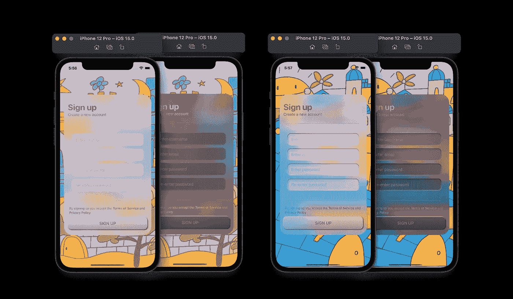
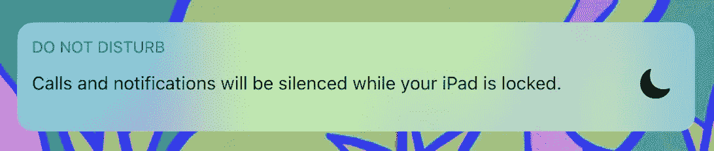
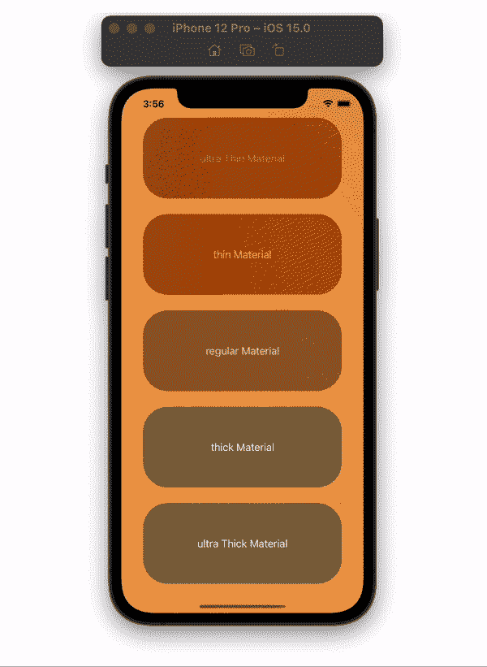
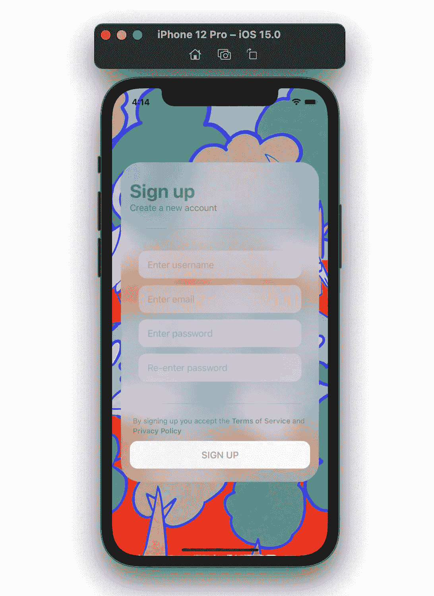
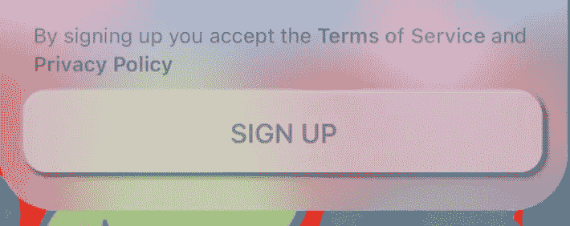
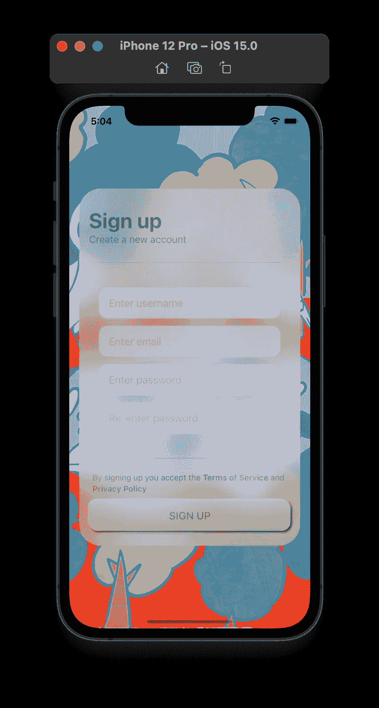
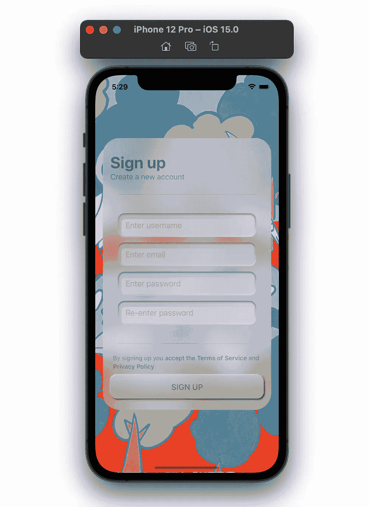
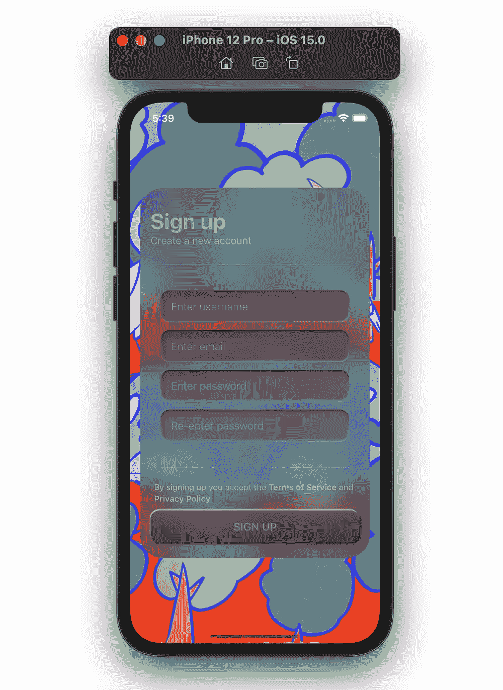
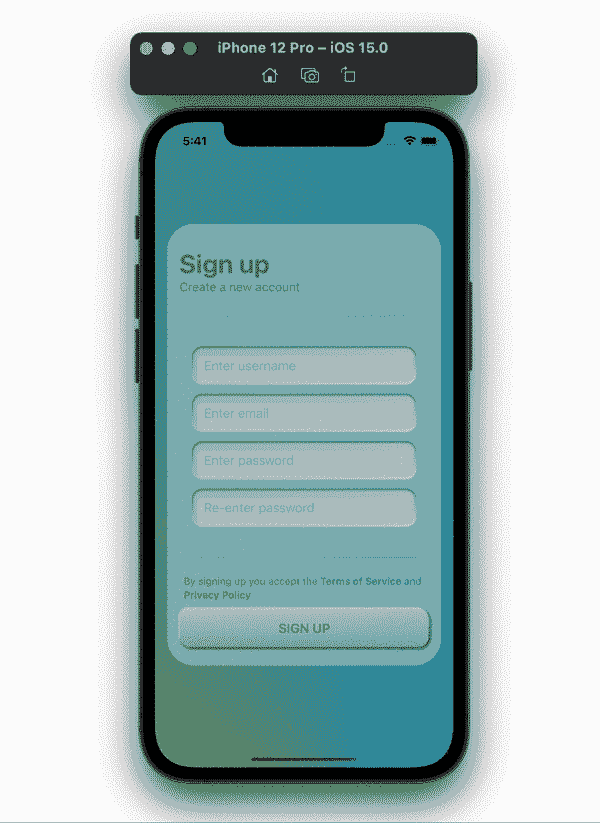

# SwiftUI Materials 教程:构建一个 Glassmorphism 登录屏幕

> 原文：<https://betterprogramming.pub/build-a-glassmorphism-login-screen-using-swiftui-materials-b909b1527414>

## 平面、凸面和凹面玻璃视图

Glassmorphism 用户界面。由 [JuiceBox](https://twitter.com/juicebo04840840) 提供的艺术

在 iOS 15 中，我们在 SwiftUI 中为`background` 和`foreground` 样式修改器准备了素材。

材质的工作原理是模糊背后的视图，同时保持边缘清晰(不模糊)。这就造成了我们在 iOS 通知、macOS dock 和菜单栏背景以及其他地方看到的类似玻璃的效果。

iOS 通知的玻璃形态设计。

为了获得玻璃般的外观，我们可以单独使用 iOS 15 中提供给我们的材料。我们有 5 种材料可以使用；`ultraThinMaterial`*`thinMaterial`*`regularMaterial`*`thickMaterial`*`ultraThickMaterial`。****

************

***明暗模式下具有背景和前景样式的材质***

***在本文中，我们将展示如何实现平面、凸/凸和凹的玻璃视图。我们将使用由艺术家 [juicebox](https://twitter.com/juicebo04840840) 提供的带有彩色背景的注册视图来展示 SwiftUI 中的 glassmorphic UI 设计。***

# ***板玻璃***

***从平板玻璃视图开始，简单使用 iOS 15 中提供给我们的材料。***

***你可以创建一个视图修改器，如下图所示，将`ultraThin`材质和其他你想要的修改器一起应用到背景中。***

***我们在这里使用`ultraThin`材质，因为我们将它层叠在另一个`ultraThin`材质之上。我们不想让背景太模糊。***

***现在，我们可以在我们的`TextField`上的自定义注册视图中使用`.modifier(FlatGlassView)` ，而不是在注册按钮上使用相同的修改器，使用厚材质使按钮弹出更多。***

**对于`Text` s，我添加了前景样式(`.ultraThinMaterial`和`.foregroundColor(Color.primary.opacity(0.35))`，这是因为超薄材质本身几乎看不见。**

**这是我们用平板玻璃修改器得到的结果:**

****

**平板玻璃视图**

# **凸透镜**

**为了给用户界面一个突出的外观，我们需要给我们的视图修改器添加一些阴影。我们将把它应用到我们仅有的按钮上；注册按钮。向视图修改器添加白色和黑色阴影，并降低其不透明度值。将阴影放置在彼此相对的位置。**

****

**要让按钮突出更多，在它上面覆盖一个`LinearGradient`。保持覆盖在`cornerRadius`之前，这样它可以和我们的按钮有相同的角。**

****

**凸透镜视图**

# **凹面玻璃**

**对于这一个，我们可以使用我们之前使用的相同的修改器，只改变`LinearGradient`颜色的顺序。**

****

**另一种方法是添加两个重叠的形状。在我们的例子中，我们使用了两个圆角矩形，它们的`cornerRadius`与我们的`TextField`相同。第一个`RoundedRectangle`给了我们一个黑白阴影效果，给了我们深度。我们需要黑色的阴影在顶部，白色的阴影在底部。不要忘记保持这个覆盖在圆角半径修改器上，以保持边缘清晰。**

**第二个叠加圆角矩形会给你更多的深度。用清晰透明的黑色添加径向渐变。径向渐变将在视图的一侧(顶部和左侧)创建阴影效果，使其更有深度。**

********

**凹面玻璃视图**

**最后，下面是注册视图代码的完整版本:**

**以及运行中的应用程序:**

****

**决赛成绩**

**这一次到此为止。感谢您的阅读！**