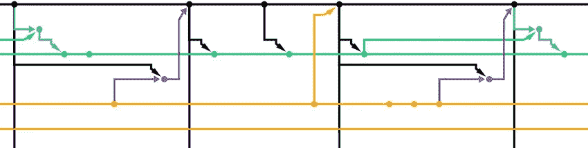
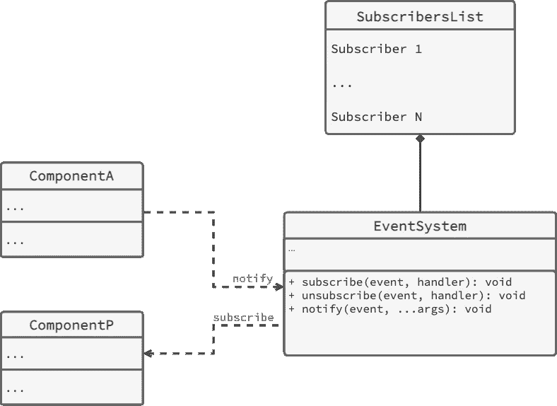

# 用 TypeScript 构建全局事件系统

> 原文：<https://betterprogramming.pub/build-a-global-event-system-using-custom-observers-and-subscribers-d3a409eb7d6e>

## 使用带有观察者、订阅者和单例模式的 Typescript 跟踪自定义事件的基础结构



编写复杂的项目可能需要处理组件之间的不同事件。这些组件中的一些可能在编程方式上彼此相距太远。建立一个全球事件系统来处理这个问题可以解决这个问题。

# 事件系统模式

事件系统应该包含以下方法:

*   `subscribe(event, handler)`。此方法用于订阅实体以接收事件并运行这些事件的处理程序。它将被一个对某些事件感兴趣的实体使用。
*   `unsubscribe(event, handler)`。此方法用于取消实体接收事件的订阅。它将被一个对某些事件感兴趣的实体使用。
*   `notify(event, ...args)`。此方法用于向订阅该事件的所有实体通知已触发的事件。它将被一个向其他人发送事件的实体使用。



## 什么是单例

Singleton 是一种编程模式，它确保一个类在内存中只有一个实例。这对于管理一次只能用于一个实例的资源的类很有用。

单例模式是通过为类创建一个私有构造函数来实现的，这样可以防止其他代码实例化它。获取类的实例的唯一方法是通过一个静态方法，该方法返回一个现有的实例。

## 事件系统单例

事件系统将使用单例模式来避免内存泄漏，并确保整个代码中只有一个事件系统实例，以确保逻辑一致性。这将使事件系统类在代码中全局表现相同，并允许通过`getInstance`静态方法访问事件系统逻辑。

# 事件

事件系统将能够触发事件并通知订阅者。这个过程应该尽可能的类型化。第一次，事件可以与它们的名称、处理程序参数和处理程序返回类型一起存储在接口中。稍后我们将使用 [TypeScript generics](https://www.typescriptlang.org/docs/handbook/2/generics.html) 扩展它，这样就有可能使用你自己的类型，这将使事件系统更加可定制。

## 事件订阅者

订户将被通知正在发生的事件。每个订阅者都将收到一个事件通知，以及一个用于处理该事件的处理程序。

函数在 JavaScript 世界中是非原语(此外，它们是[对象](https://developer.mozilla.org/en-US/docs/Web/JavaScript/Reference/Functions))，并作为指针存储在程序中。这样，即使函数内部有相同的代码，它们也可以是唯一的。这允许识别唯一的订阅者使用他们订阅的事件和用于该事件的事件处理程序。

## 订阅者方法

由于 EventSystem 类的`subscribers`字段是一个数组，所以添加或删除数组的一个条目就足够了。触发事件处理程序的逻辑将在`notify`方法中实现。

## 通知方法

事件系统方法`notify`将被打算触发一些动作的组件使用。该方法将触发所有订阅者的事件处理程序。

# 使用

所以在所有这些逻辑实现之后，事件系统就准备工作了。目前，不可能扩展事件，所以它们应该是预定义的。这种扩展和一些其他功能将在第二部分中实现[。](/extending-global-event-system-with-typescript-generics-16c2c626fa25)

```
Github Repository: [https://github.com/NickSettler/events-system](https://github.com/NickSettler/event-system)
```