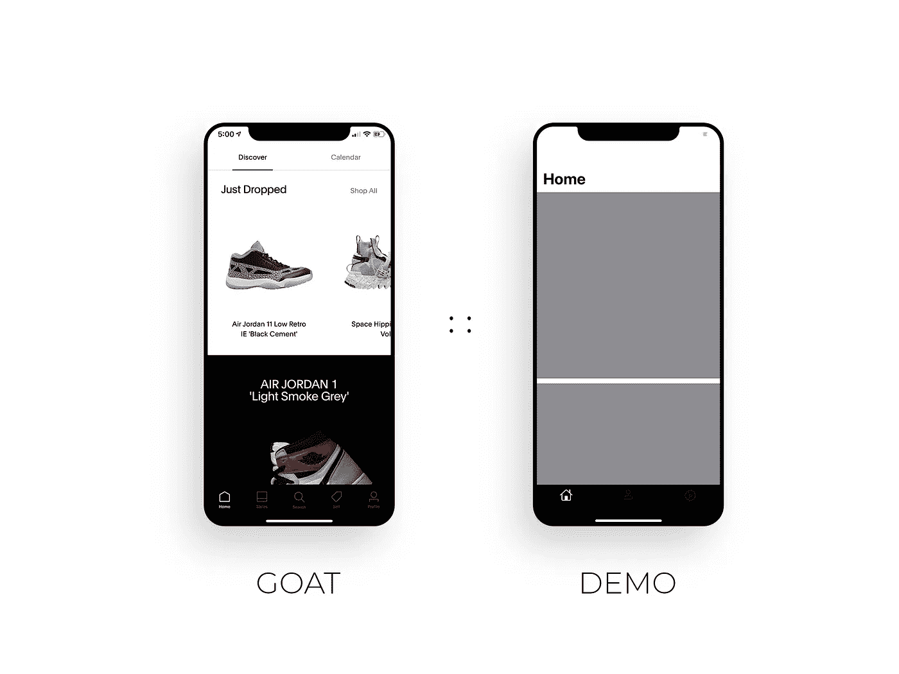

# 构建一个受山羊启发的动画解散 TabBar: Swift 5 和 UIKit

> 原文：<https://betterprogramming.pub/build-a-goat-inspired-animated-dismissing-tabbar-swift-5-with-uikit-bd6506f3af01>

## 给你的 tabBar 添加一些 UI 风格



作者照片。

GOAT 是一个广泛使用的街头服饰市场应用程序。我一直在使用这个应用，它对我的 UI/UX 设计产生了巨大的影响。它是最小的，干净的，反应灵敏的，易于使用的。它最突出的一点是滚动条上的取消标签栏。当您向下滚动时，tabBar 会向下消失。向上滚动，tabBar 再次出现。这里有一个我所说的演示:

它集成到应用程序中的方式非常干净，这增强了我对应用程序的体验。

使用一个`UICollectionView`，这是我基于滚动方向消除和显示 tabBar 的实现。

# 开始项目

这是我最初的开始项目。它只是一个简单的带有 tabBar 的`collectionView`:

# 确定滚动方向

我们需要做的第一件事是确定滚动的方向。这将允许我们根据滚动方向决定是关闭还是显示 tabBar。

我们将首先声明一个变量，该变量将在`collectionView`所在的类中跟踪先前的滚动方向。在我的项目中，它是`HomeViewController`。

```
**private** **var** prevScrollDirection: CGFloat = 0
```

接下来，既然我们使用的是`UICollectionView`，我们可以调用`scrollViewDidScroll` 函数。该函数通过名为(`scrollView` ) 的函数传递一个变量，该变量将给出 y 轴偏移量和`scrollView`高度。我们将从 y 内容偏移量和滚动高度比较先前的滚动方向，以检查用户是否向上滚动。当他们向下滚动时，我们将比较前一次滚动和 y 内容偏移量，并检查 y 内容偏移量是否大于零。

使用`scrollView`功能，我们现在可以确定滚动方向。我们在控制台上打印滚动方向，以验证我们确实捕捉到了正确的方向。

确定滚动方向后，我们将把 y 内容偏移量存储到我们创建的`prevScrollDirection`变量中。

# 通知中心

以下是苹果公司对通知中心的描述:

> "一种通知调度机制，能够向注册的观察者广播信息."

我决定使用 notification center*而不是委托协议方法，因为后者需要非常严格的语法。使用 NotificationCenter 允许更少的代码行，并且非常容易实现。我们只需要确保取消分配我们将创建的 NotificationCenter 观察器。*

*我们将首先为通知名声明一个全局变量。对于这个例子，我们可以在`HomeViewController` 类之外做。*

```
***public** **let** tabBarNotificationKey = Notification.Name(rawValue: "tabBarNotificationKey")*
```

*接下来，让我们发布通知并根据滚动方向传递布尔值。经过对`scrollViewDidScroll` 函数的返工，我们得到这个:*

*我们创建一个名为`isHidden`的变量。如果用户向上滚动，则为`false`。如果他们向下滚动，将会是`true`。我们发布一个通知，并使用字典通过`userInfo` ***传递布尔值。****

*接下来，我们将进入`tabBar`类，在那里我们将添加一个观察者。*

*我们可以在`viewDidLoad`中添加这个观察者:*

```
*NotificationCenter.default.addObserver(**self**, selector: **#selector**(**self**.notificationReceived(**_**:)), name: tabBarNotificationKey, object: **nil**)*
```

*创建它将需要我们创建一个函数，在这个函数中我们可以访问从发布的通知中传递的布尔值:*

*运行项目。如果你滚动，你会得到隐藏的 tabBar，但它非常突兀:*

*在我们继续之前，我们需要解除分配我们在同一个类中创建的 NotificationCenter 观察者:*

```
***deinit** {NotificationCenter.default.removeObserver(**self**)}*
```

# *动画 Tabbar 解散*

*我们的最后一步是动画 tabBar。*

*在做了一些研究后，我发现了一篇由我是 Simme 写的关于如何动画演示 tabBar 消失的文章。我们可以添加这个扩展来扩展`UITabBarController`类:*

*一旦我们添加了这个扩展，我们就可以调用`notificationReceived` 函数，并通过`isHidden`将其传递给我们添加的`setTabBar` 函数。*

*运行这个项目，我们应该得到这个结果:*

*请随意下载 [GitHub 项目](https://github.com/ModernProgrammer/DismissTabBarDemo)来亲自测试一下。干杯。*