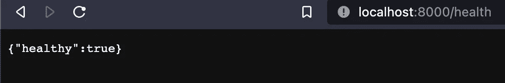
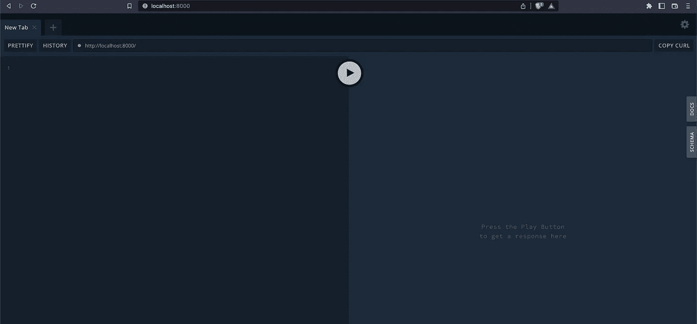
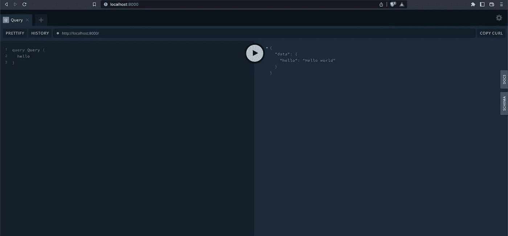
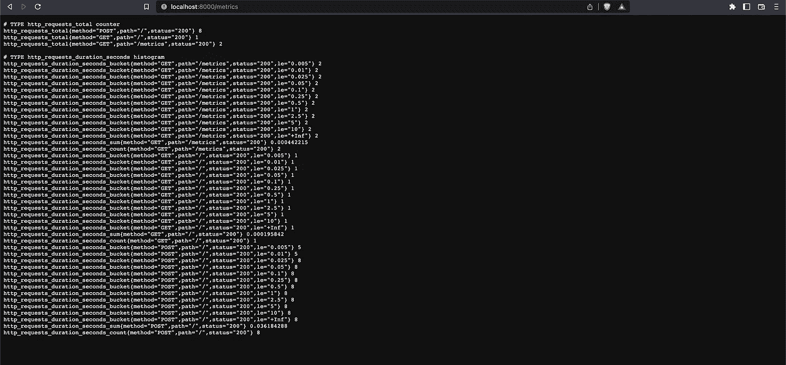
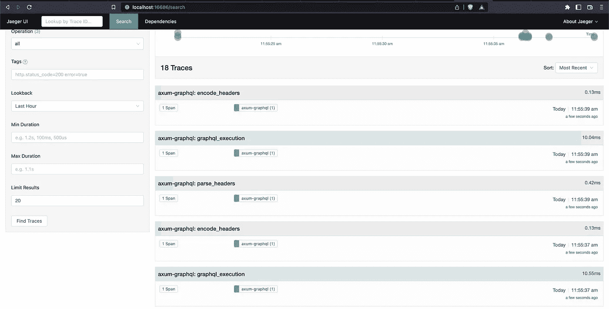

# 使用 Rust 构建一个 GraphQL API

> 原文：<https://betterprogramming.pub/build-a-graphql-api-using-rust-edf3554adf8f>

## 利用 [axum](https://github.com/tokio-rs/axum) web 框架


在 [Unsplash](https://unsplash.com/s/photos/programming?utm_source=unsplash&utm_medium=referral&utm_content=creditCopyText) 上[的照片](https://unsplash.com/@ffstop?utm_source=unsplash&utm_medium=referral&utm_content=creditCopyText)

本指南将教你如何用 Rust 构建一个强大的 GraphQL API。您将使用 Rust 和一些著名的库来创建一个 HTTP 服务器，添加 GraphQL 支持，甚至实现一个小 API。之后，您将学习如何通过添加跟踪和指标来使该服务为生产做好准备，然后您将把所有东西放入 Docker 容器中，准备进行部署。

GraphQL 现在是一项至关重要的 API 技术。脸书、网飞、Spotify、Shopify 和许多更著名的科技公司都在构建和维护这样的 API。特别是联邦 GraphQL APIs(这些 API 带有一个 API 网关和许多单独的微服务，组成一个大型超图)为表带来了很大的灵活性。团队可以独立工作，同时为单个 API 表面做出贡献，使客户可以在单个端点上轻松使用他们可能需要的任何后端功能，同时足够灵活，只查询他们真正需要的数据。

有一天，您很可能会遇到实现 GraphQL API 的任务。也许您已经构建了 GraphQL APIs，并且正在寻找更令人兴奋的方法来构建它们。在任何一种情况下，这个指南都适合你。

(**快速提示:**如果您在浏览本指南时遇到困难，您可以在这里找到[的完整代码](https://github.com/oliverjumpertz/axum-graphql)。)

# 关于 Rust 和 GraphQL

## GraphQL

[GraphQL](https://graphql.org/) 是一种用于 API 的开源数据查询和操作语言，也是一个用现有数据完成查询的运行时。它最初于 2012 年在脸书开发，并于 2016 年公开发布。

如今，许多公司，如网飞、Spotify、Shopify 等，都构建了 GraphQL APIs，因为该技术比传统的 REST APIs 为客户端提供了更多的灵活性。客户端可以指定它们想要获取的数据，只有客户端请求的数据才会从 API 端点返回。使用 GraphQL，带有许多不需要的字段的大型 JSON blobs 已经成为过去。

## 锈

Rust 是一种静态类型的系统编程语言，可以编译成机器代码。它在运行时的速度通常与 C 和 C++相当，同时提供了现代语言结构和丰富成熟的生态系统。有了固执己见的工具和快速增长的生态系统，Rust 是在考虑一种新的编程语言来学习或构建您的系统时要考虑的绝佳人选。

# 准备

本教程假设您使用 Unix 风格的终端。如果你在 Windows 上，请看 [Windows 子系统 for Linux](https://learn.microsoft.com/en-us/windows/wsl/install) 。如果您决定继续使用 Windows，本教程的大部分内容应该是有用的。你需要确保相应地调整你的路径(例如，Windows 使用`\`而不是`/`作为路径分隔符)。

如果你还没有安装 Rust，你可以使用 [rustup 作为安装 Rust](https://rustup.rs/) 的最快方法，你需要的所有工具都遵循这篇文章。

一旦安装了 rustup，或者如果你已经有了一个完整的工具链，确保你使用的至少是 Rust 版本`1.65.0`。

如果不确定安装了哪个版本，可以使用以下命令:

```
❯ rustup show
Default host: x86_64-apple-darwin
rustup home:  /Users/oliverjumpertz/.rustup
installed toolchains
--------------------
stable-x86_64-apple-darwin (default)
1.59.0-x86_64-apple-darwin
1.60.0-x86_64-apple-darwin
1.61.0-x86_64-apple-darwin
1.62.1-x86_64-apple-darwin
1.64.0-x86_64-apple-darwin
1.65.0-x86_64-apple-darwin
active toolchain
----------------
1.65.0-x86_64-apple-darwin (overridden by '/Users/oliverjumpertz/projects/axum-graphql/rust-toolchain.toml')
rustc 1.65.0 (897e37553 2022-11-02)

# OR
❯ rustc --version
rustc 1.65.0 (897e37553 2022-11-02)
```

你需要的最后一件事是安装 [Docker](https://www.docker.com/) 。确保你已经安装了 Docker Desktop(Mac 和 Windows)或者 Docker(Linux)本身。

# 设置项目

是时候开始用 Rust 构建你的 GraphQL API 了。打开您喜爱的终端应用程序，并导航到您想要项目驻留的文件夹。

为您的项目创建一个新文件夹，然后直接进入该文件夹:

```
❯ mkdir axum-graphql
❯ cd axum-graphql
```

接下来，您需要使用 cargo 创建一个新的 Rust 项目:

```
❯ cargo init
Created binary (application) package
```

Cargo 自动创建一个二进制项目，并为您初始化一个 git 存储库。您的项目文件夹现在应该如下所示:

```
| Cargo.toml
| .git/
| .gitignore
| src/
  | main.rs
```

这种设置通常足以满足业余爱好项目，但是您需要稳定性，尤其是在构建生产级服务时。

例如，如果每个开发人员都安装了不同版本的 Rust，你很快就会遇到只发生在特定版本上的错误。为了避免这种情况，Cargo 提供了一种支持，可以锁定您希望用来构建项目的 Rust 版本。

创建一个新文件，并将其命名为`rust-toolchain.toml`。然后插入以下内容:

```
[toolchain]
channel = "1.65.0"
```

行`channel = "1.65.0"`告诉 cargo，无论何时运行 Cargo 命令，您都希望 Cargo 确保您使用 Rust 版本 1.65.0。如果未激活或安装该版本，它会自动为您激活或安装。

下一件你想做的事情是确保至少某种程度的代码质量。很高兴的是，Rust 在它生命的早期就决定固执己见。这意味着有一种官方支持的代码风格。这种代码风格已经在官方的 Rust 格式化程序 [rustfmt](https://github.com/rust-lang/rustfmt) 中完全实现。

您可以手动安装 rustfmt，但是您必须告诉您潜在的合作伙伴，他们也需要安装这个组件。这就是为什么`rust-toolchain.toml`支持所谓的组件(可以做大量工作的工具，比如格式化你的代码)。

将下面一行`components = [ "rustfmt" ]`添加到您的`rust-toolchain.toml`中，这会使整个文件看起来像这样:

```
[toolchain]
channel = "1.65.0"
components = ["rustfmt"]
```

添加了 rustfmt 后，现在可以自动格式化代码了。但是，在继续之前，最好将该工具放在一个它可以使用的配置文件中。在您的项目中创建一个名为`.rustfmt.toml`的新文件，并添加以下内容:

```
edition = "2021"
newline_style = "Unix"
```

目前这只告诉 rustfmt 两件事:

*   你用的 Rust 的版本是 2021
*   换行符应该采用 Unix 风格的格式

例如，如果您想在 Docker 容器中构建，但自己却在 Windows 上工作，这就变得很有趣了

如果你想知道你还有哪些配置选项，你可以在这里查看[设置的完整列表](https://rust-lang.github.io/rustfmt/?version=v1.5.1&search=)。

你现在最不需要的就是棉绒。大多数编程语言都有以一种特定的方式做事的方法(通常称为惯用法)，而且它们通常也有一些常见的陷阱。铁锈也不例外。 [Clippy 是 Rust 的短绒](https://github.com/rust-lang/rust-clippy)它附带了 550 多条林挺规则。这足以确保您避免常见错误，并使您的代码对其他 Rust 开发人员可读。

将另一个条目添加到您的`rust-toolchain.toml`中名为`"clippy"`的组件中，这会使文件看起来像这样:

```
[toolchain]
channel = "1.65.0"
components = ["rustfmt", "clippy"]
```

与 rustfmt 一样，Clippy 支持一个配置文件，您可以在其中更改特定 lints 的设置。在您的项目中创建另一个名为`.clippy.toml`的文件，并添加以下内容:

```
cognitive-complexity-threshold = 30
```

上面一行告诉 clippy 允许它所分析的任何方法的认知复杂度为 30(方法越复杂，越难阅读，编译器也越难优化)。当然，还有更多的设置，你可以在这里查看[完整的可用棉绒设置列表](https://rust-lang.github.io/rust-clippy/master/index.html)。

完成所有设置和配置后，现在有两个命令可以帮助您 lint 和格式化代码。

`cargo fmt — all`检查你的代码，并根据官方风格指南和你在`.rustfmt.toml`中配置的规则格式化一切。

`cargo clippy — all — tests`负责林挺你的代码。

这是作为 Rust 的 GraphQL API 的基础所需要的一切。终于到了跳入实际实现的时候了。

# 创建 Web 服务器

现在有很多针对 Rust 的 web 服务器实现，通常很难选择正确的一个。您将为您的 GraphQL API 使用 [axum](https://github.com/tokio-rs/axum) 来使事情变得更简单。它目前被认为是社区内任何新项目的最佳选择(无论您是否需要 HTTP、REST 或 GraphQL API)。

axum 是由已经构建和维护了 [tokio (Rust 最早的异步运行时)](https://tokio.rs/)的同一批开发人员创建和维护的 web 框架。它速度快，易于使用，并完美地集成到 tokio 生态系统中，这使它成为任何规模的项目的可靠选择。

第一步是向项目中添加两个依赖项。打开`Cargo.toml`并添加以下依赖项:

*   axum
*   时男

你的`Cargo.toml`现在应该是这个样子:

```
[package]
edition = "2021"
name = "axum-graphql"
version = "0.1.0"

[dependencies]
axum = "0.5.17"
tokio = {version = "1.18.2", features = ["full"]}
```

现在打开`src/main.rs`，用下面的代码替换它的内容:

```
use axum::{Router, Server};

#[tokio::main] // (1)
async fn main() {
    let app = Router::new(); // (2)

    Server::bind(&"0.0.0.0:8000".parse().unwrap()) // (3)
        .serve(app.into_make_service())
        .await
        .unwrap();
}
```

让我们快速看一下这段代码做了什么:

(1): `#[tokio::main]`是一个宏，抽象出启动线程池和设置 tokio 的基本设置逻辑。

(2):路由器是 axum 路由请求的方式。稍后，您将在这里添加路由，以将不同的端点映射到函数。

(3): Server 是 axum 的 HTTP 服务器的实际实现。它接受一个路由器，并为它收到的每个传入请求调用它。

这个 web 服务器的基本实现没有提供任何可以远程调用的方法，但是它是添加更多端点的完美基础。说到端点，您可能应该添加一个您需要的端点(例如，只要您的服务能够在 Kubernetes 上的容器内运行)。

再次打开`Cargo.toml`并将 [serde](https://serde.rs/) 添加到您的依赖项中，如下所示:

```
[package]
edition = "2021"
name = "axum-graphql"
version = "0.1.0"

[dependencies]
axum = "0.5.17"
tokio = {version = "1.18.2", features = ["full"]}
serde = {version = "1.0.147", features = ["derive"]}
```

serde 是任何想要处理序列化和反序列化的 Rust 应用程序的默认选择。因为您的端点将使用 JSON 进行响应，所以您需要这个 crate，它的“派生”特性使您能够使用`derive`宏为您的任何结构添加完整的 JSON 支持。

现在 serde 是您的项目的一个依赖项，创建一个新文件夹`src/routes`并添加一个文件`mod.rs`到其中。打开文件并添加以下内容:

```
use axum::{http::StatusCode, response::IntoResponse, Json};
use serde::Serialize;

#[derive(Serialize)] // (1)
struct Health { // (2)
    healthy: bool
}

pub(crate) async fn health() -> impl IntoResponse { // (3)
    let health = Health {
        healthy: true
    };

    (StatusCode::OK, Json(health)) // (4)
}
```

下面是上面代码中发生的另一个快速浏览:

(1): `derive(Serialize)`自动为您实现所有逻辑，以便下面的结构可以被序列化(在本例中为 JSON)。

(2):健康只是这个特定用例的一个基本结构。它包含一个属性，仅此而已。

(3):这是即将出现的端点方法。它不需要参数，并返回 axum 的`IntoResponse`，这是一个标记结构的特征，这些结构可以序列化为 axum 可以理解并返回给用户的响应。

(4):这个元组响应是 axum 中返回响应的几种方法之一。在这种情况下，它只是一个 HTTP 状态代码和一个序列化版本的`Health`结构的组合。

接下来，您需要注册端点方法，以便每当有人向特定路径发出 HTTP 请求时，axum 都可以获取并调用它。在这种情况下，该方法将在路径`/health`下可用。

打开`src/main.rs`并注册您的新方法，如下所示:

```
use crate::routes::health;
use axum::{routing::get, Router, Server};

mod routes;

#[tokio::main]
async fn main() {
    let app = Router::new().route("/health", get(health));

    Server::bind(&"0.0.0.0:8000".parse().unwrap())
        .serve(app.into_make_service())
        .await
        .unwrap();
}
```

`route("/health", get(health))`告诉 axum 任何对`/health`的 HTTP GET 请求都应该调用您的方法`health`。您可以尝试通过 cargo 启动您的服务，并使用`curl`或其他工具快速发送测试请求:

```
❯ cargo run
   Compiling axum-graphql v0.1.0 (/Users/oliverjumpertz/projects/axum-graphql)
    Finished dev [unoptimized + debuginfo] target(s) in 1.13s
     Running `target/debug/axum-graphql`

❯ curl http://localhost:8000/health   
{"healthy":true}
```

如果你手头没有 curl 这样的工具，也不用担心。只需打开您的浏览器并导航到`http://localhost:8000/health`，它应该看起来像这样:



恭喜，您已经设置了一个基本的 web 服务器，并实现了您的第一个端点。不过，这还不是 GraphQL API。这就是为什么您将在下一步添加 GraphQL 并实现一个非常基本的模式。

# 添加 GraphQL

您目前已经有了一个基本的 web 服务器。现在是时候给它添加 GraphQL 功能了。

从概念上讲，GraphQL(基于 HTTP)只不过是位于普通 HTTP 端点之上的一个附加处理器。它期望通过 HTTP POST 请求(或带有查询参数的 GET)发送一个查询(和变量)，将该数据传递给查询处理器，然后将响应返回给用户。这就是为什么将 GraphQL 添加到任何 Rust web 服务器都相对简单的原因。

在本指南中，您将使用 [async-graphql](https://github.com/async-graphql/async-graphql) 。它是一个 Rust crate，支持最新的 GraphQL 规范，另外还支持 Apollo Federation(包括 v2)。

再次打开`Cargo.toml`，再添加两个依赖项:

*   async-graphql
    -async-graph QL 为您的 Rust 服务增加了 graph QL 支持
*   async-graphql-axum
    -一个集成机箱，提供 async-graphql 与 axum 协同工作所需的一切

您的`Cargo.toml`现在应该是这样的:

```
[package]
edition = "2021"
name = "axum-graphql"
version = "0.1.0"

[dependencies]
async-graphql = "4.0.16"
async-graphql-axum = "4.0.16"
axum = "0.5.17"
serde = {version = "1.0.147", features = ["derive"]}
tokio = {version = "1.18.2", features = ["full"]}
```

现在您的项目中已经有了 async-graphql，您可以开始向您的服务添加 graphql 支持了。

GraphQL 服务需要一些模式和模型来工作。在 async-graphql 的情况下，您可以使用代码优先的方法进行模式设计。这意味着您在代码中创建模式，添加宏，然后 crate 为您正确地映射一切。

创建一个新文件夹`src/model`并添加一个文件`mod.rs`到其中。然后添加以下内容(作为您的第一个模型/模式):

```
use async_graphql::{Context, Object, Schema};
use async_graphql::{EmptyMutation, EmptySubscription};

pub(crate) type ServiceSchema = Schema<QueryRoot, EmptyMutation, EmptySubscription>;

pub(crate) struct QueryRoot; // (1)

#[Object] // (2)
impl QueryRoot { // (3)
    async fn hello(&self, _ctx: &Context<'_>) -> &'static str { // (4)
        "Hello world"
    }
}
```

让我们快速回顾一下这段代码的作用:

(1):这是您的模式中的`Query`对象。它是用户可以在您的服务中使用的所有查询的根。

(2):`Object`宏将 Rust 结构与 async-graphql 的底层框架逻辑连接在一起。

(3):`QueryRoot`的实现包含了您的服务支持的所有查询。

(4): `hello`是你的第一个查询。它只是暂时返回一个静态字符串。

是时候创建处理函数来处理传入的 GraphQL 查询了。打开`src/routes/mod.rs`并添加以下代码:

```
use crate::model::ServiceSchema;
use async_graphql::http::{playground_source, GraphQLPlaygroundConfig};
use async_graphql_axum::{GraphQLRequest, GraphQLResponse};
use axum::{
    extract::Extension,
    http::StatusCode,
    response::{Html, IntoResponse},
    Json,
};
use serde::Serialize;

#[derive(Serialize)]
struct Health {
    healthy: bool,
}

pub(crate) async fn health() -> impl IntoResponse {
    let health = Health { healthy: true };

    (StatusCode::OK, Json(health))
}

// Your two new functions start here
pub(crate) async fn graphql_playground() -> impl IntoResponse {
    Html(playground_source( // (1)
        GraphQLPlaygroundConfig::new("/").subscription_endpoint("/ws"),
    ))
}

pub(crate) async fn graphql_handler(
    req: GraphQLRequest,
    Extension(schema): Extension<ServiceSchema>, // (2)
) -> GraphQLResponse {
    schema.execute(req.into_inner()).await.into() // (3)
}
```

您正在慢慢接近完成 Rust 服务的基本 GraphQL 支持，但是有一些新的东西需要您首先了解:

( **1** ): async-graphql 附带了一个 GraphQL Playground 的完整实现。幸运的是，您可以将它称为一个函数，并将其包装在 axum 的`Html`助手中，该助手负责正确返回所有内容。

(**2**):graph QL 处理函数接收请求，更重要的是，接收您设计和实现的模式的实例。`Extension`是 axum 的一个特殊助手，它允许您向处理程序函数添加数据和其他特定于上下文的内容。

( **3** ):还记得我跟你说过，GraphQL over HTTP 在概念上不过是一个带有特殊处理器的 API 端点？这正是这里发生的事情。实际的逻辑是在`schema.execute(...)`中实现的，因此这是您在这里需要执行的唯一调用。

现在您已经有了这些新的处理程序，是时候集成它们了。再次打开`src/main.rs`，像这样注册游戏场和手柄:

```
use crate::model::QueryRoot;
use crate::routes::{graphql_handler, graphql_playground, health};
use async_graphql::{EmptyMutation, EmptySubscription, Schema};
use axum::{extract::Extension, routing::get, Router, Server};

mod model;
mod routes;

#[tokio::main]
async fn main() {
    // You now need to build your schema
    let schema = Schema::build(QueryRoot, EmptyMutation, EmptySubscription).finish();

    let app = Router::new()
        // Both routes are registered here
        .route("/", get(graphql_playground).post(graphql_handler))
        .route("/health", get(health))
        // You need to make the schema available to your route handlers
        .layer(Extension(schema)); // (1)

    Server::bind(&"0.0.0.0:8000".parse().unwrap())
        .serve(app.into_make_service())
        .await
        .unwrap();
}
```

在上面的代码中，您只需要理解一件事:

(1):您需要可以在端点中访问编译的模式。通过为 axum 提供一个层，您可以做到这一点。您在上面几行构建的模式现在被传递到 axum 中，因此您可以在 GraphQL 处理程序中访问它。

现在是时候测试您的 GraphQL API 是否工作了。用`cargo run`启动你的服务，打开浏览器，导航到`http://localhost:8000`。您应该看到类似如下的视图:



这是操场。您可以在这里输入查询并使用您的 API(因此得名)。

尝试运行您之前实现的查询，以测试您的实现是否有效。在左侧输入查询，然后单击播放按钮:



当您在左侧输入查询时，您可以按播放按钮并运行这些查询。然后，响应显示在右侧。

如果您的服务成功地返回了上图中看到的响应，那么您已经用 Rust 完成了一个基本的 GraphQL API 的设置。接下来，您将通过向服务添加度量来关注 API 的可观察性。

# 添加指标

大多数微服务运行在 Docker 容器中，这些容器现在部署在 Kubernetes 上。通常，必须有人来看看这些服务在部署时的表现。度量是使您的服务可观察的一种方式。

通过发布某些关键指标，您可以更好地了解 GraphQL API 如何执行，以及在运行和处理请求时可能会遇到什么问题。像 [Prometheus](https://prometheus.io/) 这样的服务会定期抓取暴露指标的端点，然后这些指标可以用于在像 [Grafana](https://grafana.com/) 这样的工具中创建图表。

再次打开`Cargo.toml`，添加两个新的依赖项:

*   [指标](https://github.com/metrics-rs/metrics) —为收集指标提供一个门面。它负责收集指标并将它们存储在内部
*   [metrics-exporter-prometheus](https://github.com/metrics-rs/metrics/tree/main/metrics-exporter-prometheus)—这种板条箱为您的服务增加了与 Prometheus 兼容的功能

总的来说，该文件现在应该如下所示:

```
[package]
edition = "2021"
name = "axum-graphql"
version = "0.1.0"

[dependencies]
async-graphql = "4.0.16"
async-graphql-axum = "4.0.16"
axum = "0.5.17"
metrics = "0.20.1"
metrics-exporter-prometheus = "0.11.0"
serde = {version = "1.0.147", features = ["derive"]}
tokio = {version = "1.18.2", features = ["full"]}
```

添加了这两个依赖项之后，您就可以开始设置您的指标了。集成相对简单。从概念上讲，度量标准需要某种形式的注册表来注册度量标准。每当您想要使用这些注册的指标时，您需要从注册表中检索它们，添加一个新值，或者增加一个计数器(或者其他任何东西)。

这意味着至少您必须设置一次度量注册表，并将其集成到 axum 中。此外，您还希望记录一些指标，这就是为什么您还将添加一些最基本的指标:

*   计算针对您的 API 的请求数量
*   记录每个请求实际花费的时间

创建一个新文件夹`src/observability`并添加一个文件`metrics.rs`。然后添加以下代码:

```
use axum::{extract::MatchedPath, http::Request, middleware::Next, response::IntoResponse};
use metrics_exporter_prometheus::{Matcher, PrometheusBuilder, PrometheusHandle};
use std::time::Instant;

const REQUEST_DURATION_METRIC_NAME: &str = "http_requests_duration_seconds";

pub(crate) fn create_prometheus_recorder() -> PrometheusHandle { // (1)
    const EXPONENTIAL_SECONDS: &[f64] = &[
        0.005, 0.01, 0.025, 0.05, 0.1, 0.25, 0.5, 1.0, 2.5, 5.0, 10.0,
    ];

    PrometheusBuilder::new()
        .set_buckets_for_metric( // (2)
            Matcher::Full(REQUEST_DURATION_METRIC_NAME.to_string()),
            EXPONENTIAL_SECONDS,
        )
        .unwrap_or_else(|_| {
            panic!(
                "Could not initialize the bucket for '{}'",
                REQUEST_DURATION_METRIC_NAME
            )
        })
        .install_recorder()
        .expect("Could not install the Prometheus recorder")
}

pub(crate) async fn track_metrics<B>(req: Request<B>, next: Next<B>) -> impl IntoResponse { // (3)
    let start = Instant::now();
    let path = if let Some(matched_path) = req.extensions().get::<MatchedPath>() {
        matched_path.as_str().to_owned()
    } else {
        req.uri().path().to_owned()
    };
    let method = req.method().clone();

    let response = next.run(req).await;

    let latency = start.elapsed().as_secs_f64();
    let status = response.status().as_u16().to_string();

    let labels = [
        ("method", method.to_string()),
        ("path", path),
        ("status", status),
    ];

    metrics::increment_counter!("http_requests_total", &labels); // (4)
    metrics::histogram!(REQUEST_DURATION_METRIC_NAME, latency, &labels);

    response
}
```

为了让您更好地了解上面的代码中到底发生了什么，让我们再仔细看看:

(1): `create_prometheus_recorder`只是一个简单的函数，它返回一个`PrometheusHandle`。后者是指标箱的一个构造。用简单的术语解释:这是一种访问实际记录器的方法，记录器是存储您记录的所有指标的注册表。

(2):桶是所谓直方图所需的构造。你可以把它想象成真正的水桶并排放在一起。每当您为直方图记录一个新条目时，它会自动分类到它所适合的存储桶中。这意味着你不能得到精确的值。每个值都被分类到适合它的最小存储桶中。

(3):该函数的任务是记录对您的服务的请求所花费的时间。您将立即将其注册为 axum 的中间件。每当一个请求到达您的 API 时，就会运行这段代码，收集请求所用的时间，并增加一个计数器，这样您就可以跟踪您的 API 已经处理了多少个请求。

(4):这些宏使得使用度量变得更加容易。您通常需要获得一个度量注册中心的实例，并向其中添加度量或者从中检索现有的度量。由于有了这些宏，您只需进行一次调用，而不必担心进一步的实现细节。

在使用这个子模块之前，您需要创建另一个新文件`src/observability/mod.rs`并添加以下内容:

```
pub(crate) mod metrics;
```

为了将您新创建的模块集成到您的服务中，您必须对您的`main.rs`做一些修改。打开文件并添加以下代码，这将使整个文件如下所示:

```
use crate::model::QueryRoot;
use crate::observability::metrics::{create_prometheus_recorder, track_metrics};
use crate::routes::{graphql_handler, graphql_playground, health};
use async_graphql::{EmptyMutation, EmptySubscription, Schema};
use axum::{extract::Extension, middleware, routing::get, Router, Server};
use std::future::ready;

mod model;
mod observability;
mod routes;

#[tokio::main]
async fn main() {
    let schema = Schema::build(QueryRoot, EmptyMutation, EmptySubscription).finish();

    let prometheus_recorder = create_prometheus_recorder();

    let app = Router::new()
        .route("/", get(graphql_playground).post(graphql_handler))
        .route("/health", get(health))
        .route("/metrics", get(move || ready(prometheus_recorder.render()))) // (1)
        .route_layer(middleware::from_fn(track_metrics)) // (2)
        .layer(Extension(schema));

    Server::bind(&"0.0.0.0:8000".parse().unwrap())
        .serve(app.into_make_service())
        .await
        .unwrap();
}
```

以下是更多的解释:

(1):这一行看起来有点笨拙，但是最后，它只不过是将您的记录器连接到一个 HTTP GET 请求(在`/metrics`)。

(2):这就把你的追踪功能整合成了一个 axum 中间件。

为了测试您是否成功地将指标集成到您的服务中，使用`cargo run`启动您的服务，再次打开您的浏览器，导航到`http://localhost:8000`并启动几个查询。之后，导航到`http://localhost:8000/metrics`，您应该会看到一些返回的指标，如下所示:



由您新集成的指标端点返回的普罗米修斯式指标。

从现在开始，您可以使用 metrics crate 的宏来注册新的指标或添加到现有指标中。你在哪里追踪什么完全取决于你自己。请记住，如果您意识到您不需要某个指标，添加该指标并再次删除它通常比保持盲目要好。

# 添加跟踪

跟踪是提高 GraphQL API 可观察性的另一种方法。跟踪通常通过在代码路径周围放置一些上下文来跟踪代码路径的执行，这些上下文称为跨度。在这些时间跨度内，可能会发生某些事件。然后，所有这些事件都被附加到它们各自的范围。反过来，这些跨度连接到它们的父跨度，直到根跨度。如果您知道根 span 的 id，您可以很容易地跟踪任何请求或代码的执行。

[Jaeger](https://www.jaegertracing.io/) 是一个端到端的分布式追踪解决方案。它有自己的前端和多个支持服务，帮助微服务收集或接收跟踪。如今，它建立在分布式追踪标准 OpenTelemetry 的基础上。

大多数语言都有 OpenTelemetry 的实现，Rust 也不例外。再次打开您的`Cargo.toml`，添加以下依赖项:

*   [跟踪](https://github.com/tokio-rs/tracing) —实现一个 facade(类似于 metrics ),并提供宏，使得发出跟踪变得容易
*   [跟踪-opentelemetry](https://github.com/tokio-rs/tracing/tree/master/tracing-opentelemetry) —增加对 opentelemetry 的支持
*   [追踪订户](https://github.com/tokio-rs/tracing/tree/master/tracing-subscriber)——这个箱子包含了一些实用程序，可以更容易地集成多个输出通道，如 Jaeger 或登录到 stdout
*   [opentelemetry](https://github.com/open-telemetry/opentelemetry-rust) —这个机箱为客户实现了 opentelemetry 标准
*   [opentelemetry-jaeger](https://github.com/open-telemetry/opentelemetry-rust/tree/main/opentelemetry-jaeger) —增加 jaeger 的互操作性
*   [dotenv](https://github.com/dotenv-rs/dotenv)——这种板条箱本身与追踪没有太大关系，但总是不得不让一个耶格代理人或收藏家来经营会阻碍当地的发展。您将使用 dotenv 快速启用或禁用跟踪

添加完依赖项后，您的`Cargo.toml`应该如下所示:

```
[package]
edition = "2021"
name = "axum-graphql"
version = "0.1.0"

[dependencies]
async-graphql = "4.0.16"
async-graphql-axum = "4.0.16"
axum = "0.5.17"
dotenv = "0.15.0"
metrics = "0.20.1"
metrics-exporter-prometheus = "0.11.0"
opentelemetry = {version = "0.18.0", features = ["rt-tokio"]}
opentelemetry-jaeger = {version = "0.17.0", features = ["rt-tokio"]}
serde = {version = "1.0.147", features = ["derive"]}
tokio = {version = "1.18.2", features = ["full"]}
tracing = "0.1.37"
tracing-opentelemetry = "0.18.0"
tracing-subscriber = {version = "0.3.16", features = ["std", "env-filter"]}
```

既然您的项目中有了另一组依赖项，那么是时候回到代码上了。您需要创建一个可以用来发出跟踪事件的跟踪器实例。在这种情况下，您将创建一个 jaeger 代理(通常是在 Kubernetes 上您的服务舱旁边运行的边车)管道，将这些事件发送到代理。它以构建器的形式出现，最终返回一个跟踪程序，供您以后使用。

在`src/observability`中创建一个名为`tracing.rs`的新文件，并添加以下代码:

```
use opentelemetry::sdk::trace::{self, Sampler};
use opentelemetry::{
    global, runtime::Tokio, sdk::propagation::TraceContextPropagator, sdk::trace::Tracer,
};
use std::env;

struct JaegerConfig { // (1)
    jaeger_agent_host: String,
    jaeger_agent_port: String,
    jaeger_tracing_service_name: String,
}

pub fn create_tracer_from_env() -> Option<Tracer> {
    let jaeger_enabled: bool = env::var("JAEGER_ENABLED")
        .unwrap_or_else(|_| "false".into())
        .parse()
        .unwrap();

    if jaeger_enabled {
        let config = get_jaeger_config_from_env();
        Some(init_tracer(config))
    } else {
        None
    }
}

fn init_tracer(config: JaegerConfig) -> Tracer {
    global::set_text_map_propagator(TraceContextPropagator::new()); // (2)
    opentelemetry_jaeger::new_agent_pipeline() // (3)
        .with_endpoint(format!(
            "{}:{}",
            config.jaeger_agent_host, config.jaeger_agent_port
        ))
        .with_auto_split_batch(true)
        .with_service_name(config.jaeger_tracing_service_name)
        .with_trace_config(trace::config().with_sampler(Sampler::AlwaysOn))
        .install_batch(Tokio)
        .expect("pipeline install error")
}

fn get_jaeger_config_from_env() -> JaegerConfig {
    JaegerConfig {
        jaeger_agent_host: env::var("JAEGER_AGENT_HOST").unwrap_or_else(|_| "localhost".into()),
        jaeger_agent_port: env::var("JAEGER_AGENT_PORT").unwrap_or_else(|_| "6831".into()),
        jaeger_tracing_service_name: env::var("TRACING_SERVICE_NAME")
            .unwrap_or_else(|_| "axum-graphql".into()),
    }
}
```

这又是一小段代码，所以让我们快速浏览一下它最重要的部分:

(1):这只是一个帮助器结构，用于保存配置跟踪器所需的属性。在这种情况下，这是一种设置代理的主机和端口以及注册其跟踪的名称的方法(当您的服务在附加了 Jaeger sidecar 的 Kubernetes 中运行时，默认设置通常就足够了)。

(2):跟踪可以在多个服务之间传播。这一行只是确保跟踪由 traceparent 头(W3C 跟踪上下文传播器)传播。你可以[在这里](https://w3c.github.io/trace-context/)了解更多信息。)

(3):管道是创建跟踪器的实际核心逻辑。在这种情况下，一个所谓的代理管道期望向 Jaeger 代理发送跟踪。它配置了更多的设置，比如设置一个显式的服务名(在 Jaeger 的 UI 中找到您的服务的踪迹)和将采样器设置为始终打开，这意味着没有跨度被丢弃，所有内容都被存储。

接下来，您需要像这样将新创建的模块添加到`src/observability/mod.rs`:

```
pub(crate) mod metrics;
pub(crate) mod tracing;
```

既然您的新模块是可访问的，那么是时候将一切集成到您的服务中了。再次打开`src/main.rs`，添加以下代码:

```
use crate::model::QueryRoot;
use crate::observability::metrics::{create_prometheus_recorder, track_metrics};
use crate::observability::tracing::create_tracer_from_env;
use crate::routes::{graphql_handler, graphql_playground, health};
use async_graphql::{EmptyMutation, EmptySubscription, Schema};
use axum::{extract::Extension, middleware, routing::get, Router, Server};
use dotenv::dotenv;
use std::future::ready;
use tracing::info;
use tracing_subscriber::layer::SubscriberExt;
use tracing_subscriber::util::SubscriberInitExt;
use tracing_subscriber::Registry;

mod model;
mod observability;
mod routes;

#[tokio::main]
async fn main() {
    // You need to add this
    dotenv().ok(); // (1)

    let schema = Schema::build(QueryRoot, EmptyMutation, EmptySubscription).finish();

    let prometheus_recorder = create_prometheus_recorder();

    // and you need to add the code below to initialize tracing correctly
    let registry = Registry::default().with(tracing_subscriber::fmt::layer().pretty()); // (2)

    match create_tracer_from_env() { // (3)
        Some(tracer) => registry
            .with(tracing_opentelemetry::layer().with_tracer(tracer))
            .try_init()
            .expect("Failed to register tracer with registry"),
        None => registry
            .try_init()
            .expect("Failed to register tracer with registry"),
    }

    info!("Service starting"); // (4)

    let app = Router::new()
        .route("/", get(graphql_playground).post(graphql_handler))
        .route("/health", get(health))
        .route("/metrics", get(move || ready(prometheus_recorder.render())))
        .route_layer(middleware::from_fn(track_metrics))
        .layer(Extension(schema));

    Server::bind(&"0.0.0.0:8000".parse().unwrap())
        .serve(app.into_make_service())
        .await
        .unwrap();
}
```

又有一些新的代码需要理解，所以让我们复习一下重要的部分:

(1):这是设置 dotenv 需要做的所有事情。您将在几秒钟内创建一个小 dotenv 文件，以便在本地开发时快速启用或禁用 Jaeger exporter。

(2):注册表是注册所谓跟踪层的一种方式。在这种情况下，将添加一个记录到 stdout 的跟踪器。这确保了您总是有一些用于调试目的的日志消息。

(3):可以禁用 Jaeger 导出。这就是为什么你需要检查是否有追踪器让你额外注册。否则，该服务将通过登录到 stdout 来运行。如果启用了 Jaeger，标准输出记录和导出到 Jaeger 代理都会被注册。

(4):该宏是记录或跟踪特定事件的方法之一。

既然已经集成了跟踪，那么创建一些跟踪可能是个好主意。一个跟踪跨度绝对属于的地方是对 GraphQL 端点的任何调用。您可以创建一个根范围，您在处理 GraphQL 请求时创建的所有其他范围或事件都附加到该根范围。

跳回`src/routes/mod.rs`，将代码更改如下:

```
use crate::model::ServiceSchema;
use async_graphql::http::{playground_source, GraphQLPlaygroundConfig};
use async_graphql_axum::{GraphQLRequest, GraphQLResponse};
use axum::{
    extract::Extension,
    http::StatusCode,
    response::{Html, IntoResponse},
    Json,
};
use opentelemetry::trace::TraceContextExt;
use serde::Serialize;
use tracing::{info, span, Instrument, Level};
use tracing_opentelemetry::OpenTelemetrySpanExt;

#[derive(Serialize)]
struct Health {
    healthy: bool,
}

pub(crate) async fn health() -> impl IntoResponse {
    let health = Health { healthy: true };

    (StatusCode::OK, Json(health))
}

pub(crate) async fn graphql_playground() -> impl IntoResponse {
    Html(playground_source(
        GraphQLPlaygroundConfig::new("/").subscription_endpoint("/ws"),
    ))
}

pub(crate) async fn graphql_handler(
    req: GraphQLRequest,
    Extension(schema): Extension<ServiceSchema>,
) -> GraphQLResponse {
    // Your newly refactored and improved graphql_handler starts here
    let span = span!(Level::INFO, "graphql_execution"); // (1)

    info!("Processing GraphQL request");

    let response = async move { schema.execute(req.into_inner()).await } // (2)
        .instrument(span.clone())
        .await;

    info!("Processing GraphQL request finished");

    response
        .extension( // (3)
            "traceId",
            async_graphql::Value::String(format!(
                "{}",
                span.context().span().span_context().trace_id()
            )),
        )
        .into()
}
```

让我们看看上面代码中最重要的部分发生了什么:

(1):跨度可以说是一个语境。在一个范围内，所有事件和进一步的范围都附加到该范围。这有助于创建在语义和技术上属于一起的事件块。

(2):要理解为什么这个异步块是必要的，你需要理解异步函数是如何工作的。在任何执行点，异步函数都可以停止执行。span 的生命周期与其保护者的生命周期是绑定在一起的。当你进入一个跨度，有一个后卫返回。当这个保护被丢弃时，span 被退出。当一个异步函数的执行被中止时，保护不会被放弃；因此，其他代码将在此范围内发出跟踪。这就是为什么您需要使用 span 来检测异步块。

(3):有跨度和跟踪是很好的，但是返回跟踪 id 也是一个好主意，这样用户就可以在遇到错误时给你一些可以搜索的东西。这就是为什么将跟踪 id 放入 GraphQL 响应的扩展中。

还记得我们可以禁用耶格追踪吗？默认值已经是 false，但是如果您想要在本地启用它，您必须将环境变量设置为 true 来启动您的服务。一个更好的方法是使用一个`.env`文件，你可以快速打开，调整值，然后再次启动你的服务。

在你的项目根目录下快速添加一个新文件`.env`，并添加以下内容，确保你的 jaeger exporter 被启用(不要忘记将`.env`添加到你的`.gitignore`)。您不希望秘密泄露到公共 git 存储库中！):

```
JAEGER_ENABLED=true
```

你快完成了。您只需要做最后一件事，但让我们先来看看运行时跟踪的过程(简化):

*   您的代码发出跟踪
*   这些痕迹被收集起来
*   收集更多的痕迹
*   跟踪信息会定期发送给代理

这意味着在收集跟踪和关闭服务之间有一个短暂的窗口，其中一些跟踪可能会丢失。当您的 GraphQL API 在 Kubernetes 中运行时尤其如此，在 Kubernetes 中可以随时重新安排 pods。令人高兴的是，axum 有一个关闭挂钩，OpenTelemetry 有一个功能可以明确触发关闭您的跟踪器，在它们丢失之前发送任何留下的痕迹。

打开`src/main.rs`并添加以下代码，使您的服务和跟踪能够正常关闭:

```
use crate::model::QueryRoot;
use crate::observability::metrics::{create_prometheus_recorder, track_metrics};
use crate::observability::tracing::create_tracer_from_env;
use crate::routes::{graphql_handler, graphql_playground, health};
use async_graphql::{EmptyMutation, EmptySubscription, Schema};
use axum::{extract::Extension, middleware, routing::get, Router, Server};
use dotenv::dotenv;
use std::future::ready;
use tokio::signal;
use tracing::info;
use tracing_subscriber::layer::SubscriberExt;
use tracing_subscriber::util::SubscriberInitExt;
use tracing_subscriber::Registry;

mod model;
mod observability;
mod routes;

// A new shutdown signal handler
async fn shutdown_signal() { // (1)
    let ctrl_c = async {
        signal::ctrl_c()
            .await
            .expect("failed to install Ctrl+C handler");
    };

    #[cfg(unix)]
    let terminate = async {
        signal::unix::signal(signal::unix::SignalKind::terminate())
            .expect("failed to install signal handler")
            .recv()
            .await;
    };

    #[cfg(not(unix))]
    let terminate = std::future::pending::<()>();

    tokio::select! {
        _ = ctrl_c => {},
        _ = terminate => {},
    }

    opentelemetry::global::shutdown_tracer_provider();
}

#[tokio::main]
async fn main() {
    dotenv().ok();

    let schema = Schema::build(QueryRoot, EmptyMutation, EmptySubscription).finish();

    let prometheus_recorder = create_prometheus_recorder();

    let registry = Registry::default().with(tracing_subscriber::fmt::layer().pretty());

    match create_tracer_from_env() {
        Some(tracer) => registry
            .with(tracing_opentelemetry::layer().with_tracer(tracer))
            .try_init()
            .expect("Failed to register tracer with registry"),
        None => registry
            .try_init()
            .expect("Failed to register tracer with registry"),
    }

    info!("Service starting");

    let app = Router::new()
        .route("/", get(graphql_playground).post(graphql_handler))
        .route("/health", get(health))
        .route("/metrics", get(move || ready(prometheus_recorder.render())))
        .route_layer(middleware::from_fn(track_metrics))
        .layer(Extension(schema));

    Server::bind(&"0.0.0.0:8000".parse().unwrap())
        .serve(app.into_make_service())
        // You need to register the signal handler here
        .with_graceful_shutdown(shutdown_signal()) // (2)
        .await
        .unwrap();
}
```

让我们再次看看上面代码中的重要行:

(1):这个函数正好做两件事:它首先等待两个可能的关闭信号之一，并且一旦它接收到一个，它就触发跟踪系统的关闭。

②:`with_graceful_shutdown`获得一个未来。如果未来解决了，服务将关闭。这正是函数接收到终止信号时的情况。

现在是测试一切是否如预期那样工作的时候了。Jaeger 很乐意提供一个一体化的 Docker 映像，它拥有您需要的一切。当然，这不是通常应该使用的方式，但足以测试您的服务是否按预期发出跟踪。

打开终端并执行以下命令:

```
❯ docker run -d --name jaeger \
  -e COLLECTOR_ZIPKIN_HTTP_PORT=9411 \
  -p 5775:5775/udp \
  -p 6831:6831/udp \
  -p 6832:6832/udp \
  -p 5778:5778 \
  -p 16686:16686 \
  -p 14268:14268 \
  -p 9411:9411 \
  jaegertracing/all-in-one:1.6
```

这将启动一个 docker 容器，其中包含一个 Jaeger 代理、Jaeger 本身、一个前端以及更多内容。

接下来，用`cargo run`启动您的服务，并通过 GraphQL Playground 执行一些请求。之后，打开一个新的浏览器选项卡并导航至`http://localhost:16686/search`。从左侧的下拉列表中选择 axum-graphql(或者您称之为服务的任何其他名称)，然后单击“Find Traces”这将为您呈现如下视图:



如果你看到的和上图类似，恭喜你。基本的设置现在已经完成，只剩下一件事要做:用 Rust 封装您的 GraphQL API。

# 容器化您的 GraphQL API

如今，大多数服务都被容器化了，你的 GraphQL API 也不例外。是时候为您的服务创建一个容器了，您几乎可以将它部署到任何地方。

您首先应该创建一个`.dockerignore`文件。这确保了 Docker 守护进程不会拾取不必要的文件。例如，如果您自己不在 Linux 机器上工作，那么您的目标文件夹就毫无用处。

将以下内容放入您的`.dockerignore`:

```
target/
.git/
.env
```

你需要的下一件东西是一个`Dockerfile`。创建一个并添加以下行:

```
FROM --platform=linux/amd64 lukemathwalker/cargo-chef:latest-rust-1.65.0 AS chef # (1)

WORKDIR /app

FROM --platform=linux/amd64 chef AS planner

COPY . .

RUN cargo chef prepare --recipe-path recipe.json

FROM --platform=linux/amd64 chef AS builder

COPY --from=planner /app/recipe.json recipe.json

RUN cargo chef cook --release --recipe-path recipe.json

COPY . .

RUN cargo build --release

FROM debian:bookworm-slim

RUN mkdir -p /app

RUN groupadd -g 999 appuser && \ # (2)
    useradd -r -u 999 -g appuser appuser

USER appuser

COPY --from=builder /app/target/release/axum-graphql /app

WORKDIR /app

ENV JAEGER_ENABLED=true

EXPOSE 8000

ENTRYPOINT ["./axum-graphql"]
```

已经这样了。只有两件事可能需要专门的解释:

(1): cargo-chef 是一个工具，可以更容易地使用 Docker 的层系统。这大大加快了构建容器的过程。你可以在这里了解更多关于 cargo-chef 的信息。

(2):以 root 身份在容器中运行任何软件从来都不是一个好主意。一个新的用户很快就被创建了，并使你(很可能)免受某些攻击。

你现在可以用`docker build -t axum-graphql:latest .`构建你的容器，并用`docker run -p 8000:8000 axum-graphql:latest`快速启动它。然后再次打开浏览器，导航至`http://localhost:8000`。你应该看到操场运行，并能够发送一些查询。

如果一切正常，就大功告成了。恭喜你！

# 快速回顾一下

是时候快速回顾一下到目前为止你所取得的成绩了。

你有:

*   建立一个新的 Rust 项目
*   添加了格式和林挺
*   创建了一个基本的 web 服务器
*   在上面添加了一个非常基本但有效的 GraphQL API
*   将指标集成到您的服务中，并注册(和收集)一些最重要的指标
*   在顶部添加了跟踪并创建了一个根跨度
*   将您的应用程序容器化，这样您几乎可以将它部署到任何地方

那是相当大的成就。再次恭喜你！

# 下一步是什么？

从现在开始，您可以自由地使用新的 GraphQL API 了。如果你对想要实现的 API 有什么计划，可以看看 [async-graphql 的书](https://async-graphql.github.io/async-graphql/en/index.html)。它回答了您在使用 Rust 实现更高级的 GraphQL API 时可能会遇到的大多数问题。关于 GraphQL 和 Rust，你还可以学到不少东西。

如果您想更进一步，创建一个 [Helm](https://helm.sh/) 图表，并尝试将您的服务部署到一个真正的 Kubernetes 集群(或者像 [minikube](https://minikube.sigs.k8s.io/docs/) 这样的本地版本)。你会发现这也是另一个挑战性的任务，教会了你很多。