# 用 Spring Boot 和 MySQL 构建一个 GraphQL 服务器

> 原文：<https://betterprogramming.pub/build-a-graphql-server-with-spring-boot-and-mysql-df427cbba26d>

## 从头开始构建 GraphQL 服务器


我用 [Unsplash](https://unsplash.com/?utm_source=unsplash&utm_medium=referral&utm_content=creditCopyText) 上的[约翰·皮尔](https://unsplash.com/@johnpeel?utm_source=unsplash&utm_medium=referral&utm_content=creditCopyText)的资源修改的照片

你有没有想过一个客户可以影响一个 API 请求？他能要求他真正需要的东西并得到吗？如果你对这些问题感到惊讶，我可以肯定你从未听说过 GraphQL。

因此，对上述问题的回答肯定是肯定的，因为 graph QL 100%可能做到这一点。如果你没有听说过，不要担心。我将带您进入这个最新的、令人惊奇的 GraphQL 世界，如果您从这篇文章中获得了最大的收益，您将不会后悔。

我希望您熟悉 Java 编程语言、Spring Boot 框架和 REST APIs。继续之前不需要 GraphQL 经验。我知道你对这个话题很感兴趣。那么我们为什么要等呢？但是在开始编码之前，我将快速概述一下 GraphQL 以及它如此特别的原因。

# GraphQL 的第一步

我知道你现在在努力寻找什么。这个 GraphQL 到底是什么？深呼吸，听我解释。简单地说，它是一种用于 API 的数据查询和操作语言。

GraphQL 公开了一个端点，从前端接收查询作为请求的一部分，在一个响应中准确返回请求的数据部分。当然，我必须说:不要低估一个普通客户的力量。

看这张 GIF 就能有个清晰的思路了。此外，这是我们今天要实现的应用程序的一部分。

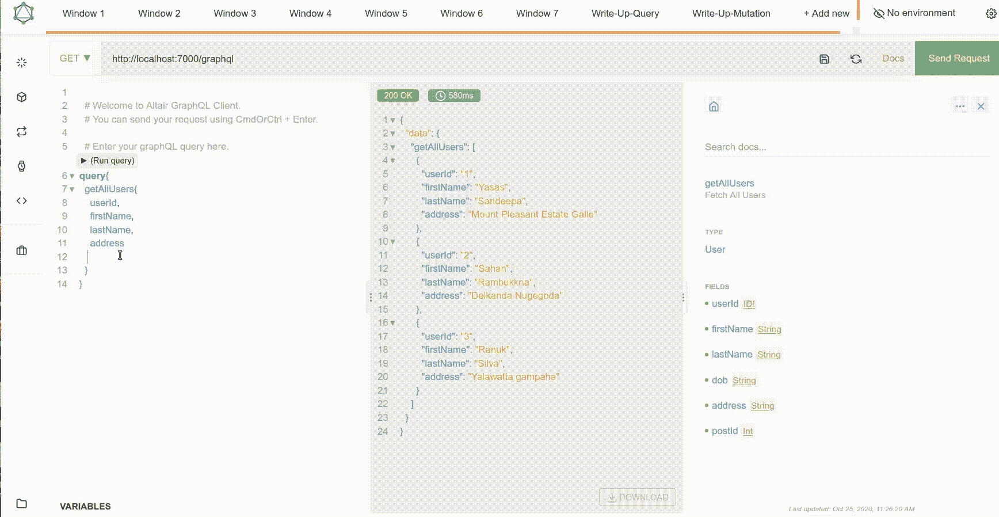

GraphQL 如何工作

GraphQL 被各种规模的数百家组织用于生产，包括脸书(实际上 GraphQL 是脸书在 2012 年内部开发的，然后在 2015 年公开开源)、Credit Karma、GitHub、Intuit、PayPal、New York Times 等等。

嘿，等一下！那休息呢。难道这还不够有价值吗？看看这个。

# *之战:GraphQL Vs REST*

*我们大多熟悉 web 开发中的 REST APIs，因为它在世界各地广泛使用。但最近，由于其灵活性和性能，有转向 GraphQL 的趋势。*

*那么 REST 和 GraphQL 的核心区别是什么呢？REST 是基于网络的软件的架构概念。另一方面，GraphQL 是一种查询语言、一种规范和一组在单个端点上操作的工具。让我用一个例子来解释一下。*

*假设您想从图书实体请求信息。同时，您想要请求关于作者的信息(这是一个不同的实体)。通常，这是通过向 REST API 发送两个请求(两个 GET 请求)来完成的。书籍和作者的端点可能是:*

```
*localhost:8080/book/:id
localhost:8080/author/:id*
```

*但是使用 GraphQL，我们不仅可以从一个 API 端点获取这两个信息，还可以获取任何信息
。*

```
*localhost:8080/graphql*
```

*正如您在我之前的 GIF 中看到的，如果您想从特定的端点收集一些信息，我们可以限制 GraphQL API 返回的字段。但是在 REST 中，你将总是得到一个完整的数据集，并且不可能被限制。*

*有时响应数据是不充分的(比如嵌套的结果)，你不得不发出另一个请求来得到你真正需要的。另一方面，传入的响应数据太多(没有必要),您只使用一两个数据字段。*

*这种现象被称为欠取和过取。GraphQL 解决了这些问题并优化了您的应用程序。通过对比 REST 和 GraphQL，就像一家没有服务员的餐厅。*

*然而，对于 GraphQL，有一个学习曲线，它不像 REST APIs 那样确定，但是这个学习曲线是值得的。当创建用户友好的大型应用程序时，如果用户只收到他请求的数据而没有收到其他数据，他会更高兴。*

*额外的好处是，您的应用程序的性能将大大提高，因为您不必处理大量数据。(最好的例子是脸书应用程序)在规模上，你可以获得的任何性能改进都是巨大的胜利。*

*许多不同的编程语言都支持 GraphQL，如 Java、JavaScript、Python、Scala 等。你可以通过访问 [GraphQL 官方网站](https://graphql.org/code/)找到更多关于服务器和客户端语言的信息。*

*随着我对 Java 和 JavaScript 越来越熟悉，我考虑使用 Spring Boot 应用程序，因为支持该技术的文章较少。Node.js 上有合理的文章/教程，用它实现并不难。*

*然而，如果你想要一篇关于用 Node.js 实现 GraphQL 服务器的文章，请在评论区留言，我也非常乐意就此写一篇单独的文章。*

*好了，说够了。让我们来点实际的东西。没有比亲身体验更好的了。*

# *基础:设置项目*

*作为一个简单的场景，我正在创建一个获取用户及其帖子的应用程序。我将此命名为**评论**，并希望在未来进一步发展它。*

*我将从头开始实现这一点。如果您熟悉 spring boot，请跳过基础知识快速浏览一遍。所以首先，要么通过 [Spring Initializr](https://start.spring.io/) 要么用 IntelliJ idea 创建新的 Spring Boot 应用程序。*

*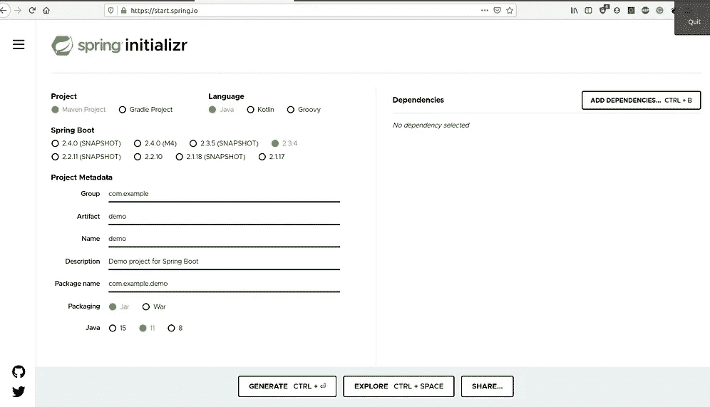**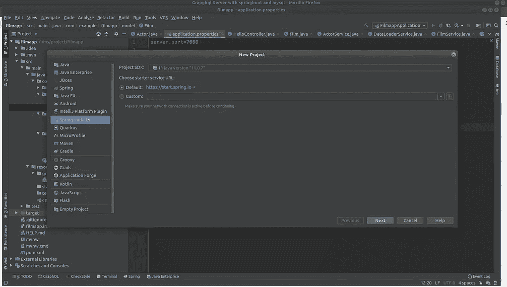*

*作者提供的截图。*

*请确保添加这些依赖项。*

1.  *Spring Data JPA:处理基于 JDBC 的数据库访问的大部分复杂性，ORM(对象关系映射)
    减少 JPA 所需的样板代码。*
2.  *MySQL 驱动:Java MySQL 连接器，用于连接 SQL 数据库。*
3.  *Lombok:减少模型/数据对象的样板代码。它可以通过使用 Lombok 注释为这些对象自动生成 getters 和 setters(以及更多)。*

*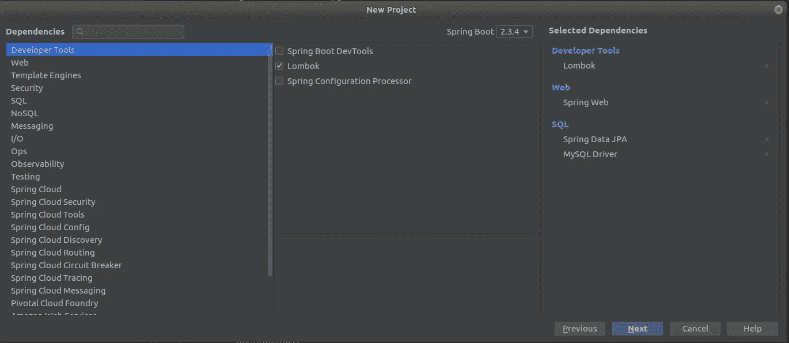*

*作者提供的截图。*

*好吧。稍微休息一下，让 IntelliJ 来解决依赖性。*

# **要点:*配置基础*

*至于初始设置，我们可以创建实体模型并向 MySQL 数据库添加一些虚拟数据。*

*为此，我在根文件夹中创建了一个新的包，并将其命名为 model，在这个包中，我定义了两个模型 user 和 post。使用 Lombok，代码是干净的，不需要生成 setters 和 getters，因为它们可以插入注释。但是请记住，您必须创建一个没有 id 字段的构造函数，因为在实例化时需要它。*

*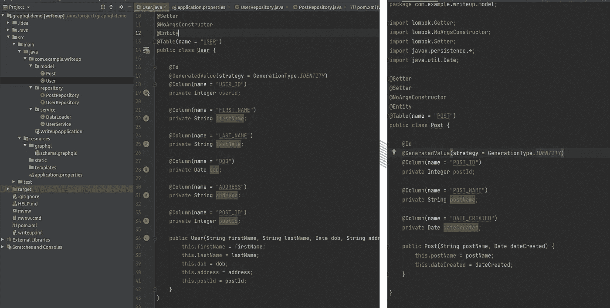*

*用户和发布实体*

*让我们创建一个存储库层来连接数据库。因此，我创建了一个名为 repository 的新包，在其中，我为实体创建了两个接口，并用`JpaRepository`进行了扩展。确保在`JpaRepository`上的通用参数中专门添加实体类型和 ID。*

*我们可以用`CrudRepository`扩展，但我更喜欢`JpaRepository`，因为它在 find 方法中返回一个列表，而不是由 curd 方法提供的一个可迭代列表。(如果你想找到更多关于这些库的信息，你可以使用[这个](https://stackoverflow.com/questions/14014086/what-is-difference-between-crudrepository-and-jparepository-interfaces-in-spring)线程。)*

*然后，我实现了一个组件，向我们的数据库添加一些虚拟数据。为此，我创建了一个服务包，并在其中定义了一个数据加载器服务。这将在初始化项目时添加指定的数据。*

*用于向 SQL 数据库插入虚拟数据的数据加载器服务*

*好极了。现在你必须在`application.properties`中进行配置，确保创建一个名为 writeup 的新数据库，并提供正确的凭证来连接 MySQL 数据库。*

*基本结构都做好了。嘿，控制器呢？如果你认为我忘记了，那你就大错特错了。在 REST API 中，我们使用控制器来处理多个端点。但是正如您已经知道的，在 GraphQL 中，您只需要一个 API 端点。所以你不需要任何控制器来处理。*

*好吧！让我们做一个快速的演示运行，以检查所有的工作是否正常。*

*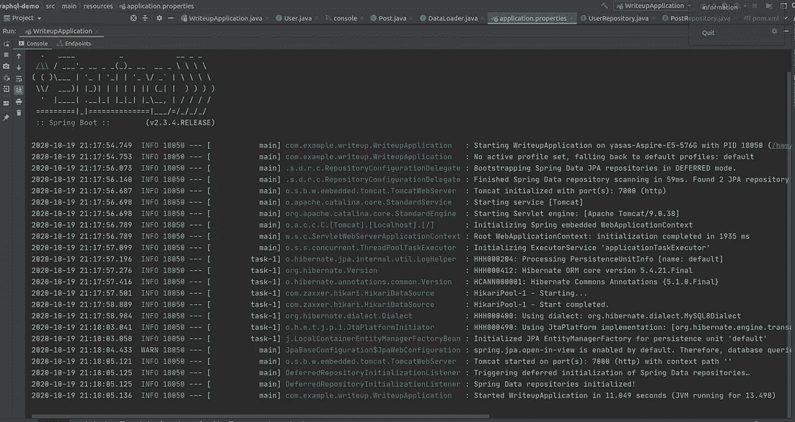**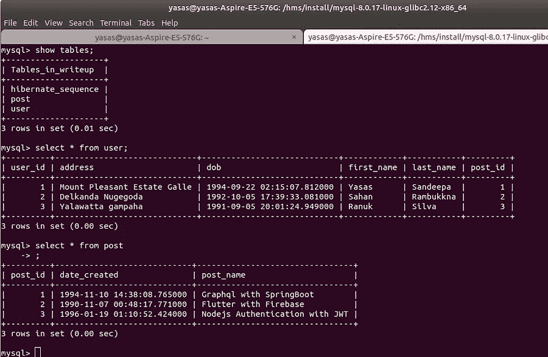*

*作者提供的截图。*

*太好了。如你所见，我们的基本结构已经如预期的那样工作了。让我们进入大的一步。*

# **释放野兽:*设置 GraphQL*

*重要的事情先来！您需要向项目中添加 GraphQL 依赖项。
因此，在`pom.xml`中，将这两个依赖项添加到`<dependencies>`部分中，并通过单击右上角的 *m* 图标来更新项目(解析依赖项)。*

```
*<!-- GraphQL dependencies -->
<dependency>
    <groupId>com.graphql-java</groupId>
    <artifactId>graphql-spring-boot-starter</artifactId>
    <version>5.0.2</version>
</dependency>
<dependency>
    <groupId>com.graphql-java</groupId>
    <artifactId>graphql-java-tools</artifactId>
    <version>5.2.4</version>
</dependency>*
```

*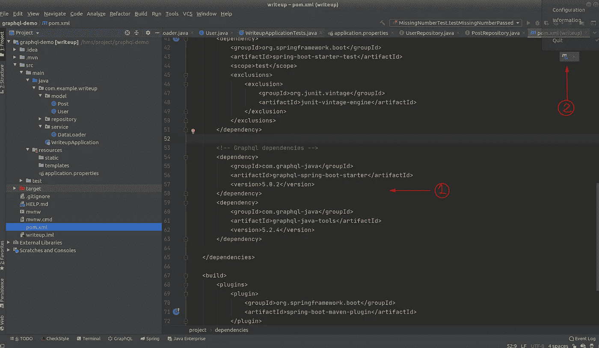*

*作者提供的截图。*

*GraphQL 有两个主要的构建块:模式和解析器。作为在我们的应用程序中实现 GraphQL 的第一步，我们需要定义一个模式。*

*GraphQL 模式最基本的组成部分是对象类型，它代表一个对象(如学生、动物等)。)以及它有哪些字段。*

```
*type Director {
  name: String!
  age: Int
  films: [Film]
}*
```

*如你所知，在像 java 这样的语言中有如此多的原始和非原始数据类型。但是这里我们只能看到有限数量的数据类型(称为标量类型)。*

*   *Int:一个有符号的 32 位整数。*
*   *Float:有符号的双精度浮点值。*
*   *字符串:UTF 8 字符序列。*
*   *布尔值:真或假。*
*   *ID:唯一的标识符*

*但是，您可以根据自己的喜好定义自定义标量。
(如日期、货币等..)*

*模式中的大多数类型都是普通的对象类型，但是在模式中有两种特殊的类型。*

1.  *查询:数据提取(读取)的入口点*
2.  *突变:数据修改(写)的入口点*

*您可以通过访问[官方 GraphQL 网站](https://graphql.org)了解更多关于这些概念的信息。*

*好吧。让我们定义我们的模式。为此，我在资源文件夹中创建了一个名为`graphql`的目录，并在其中创建了一个`schema.graphqls`文件。(确保扩展名应该是`.graphqls`，因为它是一个模式文件。)*

*如果您已经在 IntelliJ 上安装了 GraphQL 插件，那么在创建文件之后，您可以看到 GraphQL 图标。它可以通过在插件部分进行搜索来轻松安装。在进行 GraphQL 模式文件的
开发时，这将非常有用。*

*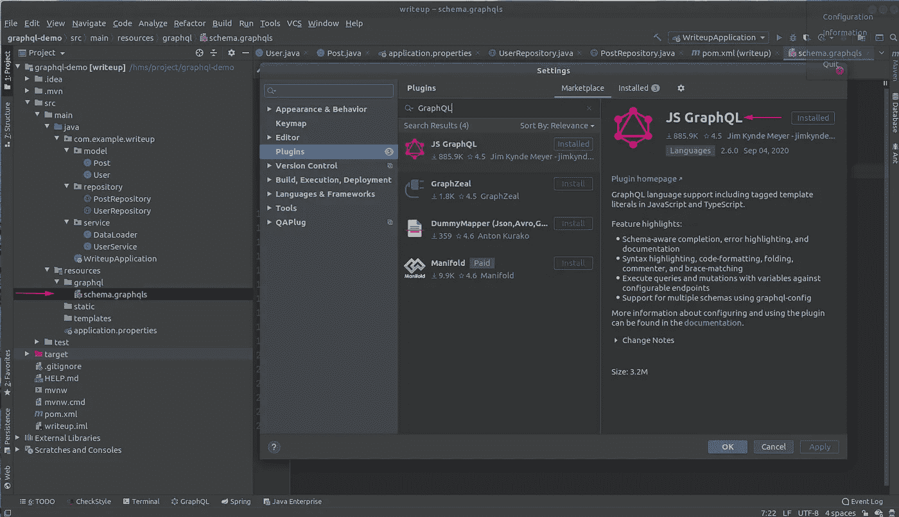*

*作者提供的截图。*

*下面是我为自己的写文章应用程序定义的模式。首先我用一个查询，很容易理解其中的东西，然后我会解释突变。*

```
*schema {
    query: Query,   
}type Query{
    # Fetch All Users
    getAllUsers:[User]
}type User {
    userId : ID!,
    firstName :String,
    lastName :String,
    dob:String,
    address:String,
    postId : Int,
}*
```

*请务必在此处添加评论。因此，我们可以在使用 Altair 等第三方工具测试服务器时查看这些描述(大多数情况下，我们使用这个客户端来测试 GraphQL 端点，而不是 postman。)*

*现在我们必须定义我们的解析器。(如果你想知道这个`getAllUsers`方法是什么[不是一个方法而是一个字段]以及它在哪里引用，等等，就是这个)*

*解析器是每个字段的函数，这些函数都有一个父对象、参数和执行上下文。它们负责返回该字段的相应数据结果。*

*我们可以通过多种方式实现这一点。大多数大型项目(行业标准)倾向于在根层中创建一个单独的`graphql`包，在这个包中，它将定义解析器接口和实现。此外，请求和响应的映射类型可以在单独的包中定义。*

*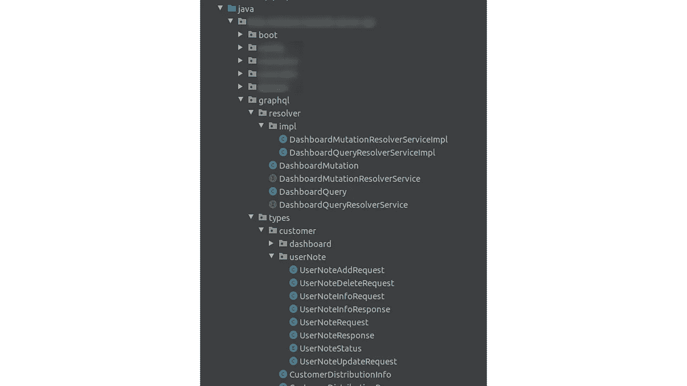*

*定义解析器的行业标准*

*因为这是为了理解概念，所以我将在服务层实现它。*

*我创建了一个名为`UserService`的新服务，并实现了作为`graphql-java-tools`中的库接口的`GraphQLQueryResolver`接口*

*然后，我自动连接用户存储库，以获得与数据库的连接。(但是，在最新版本中不推荐这种现场注入。你可以做的是，点击左上角的黄色灯泡图标时，通过点击自动连线的注释出现，并重新格式化的想法建议。)*

*现在希望您还记得我们在 GraphQL 模式中定义的`getAllUsers`字段。这应该完全符合这个类的方法。所以我在这里定义了这个方法，并按照预期返回了用户列表。*

*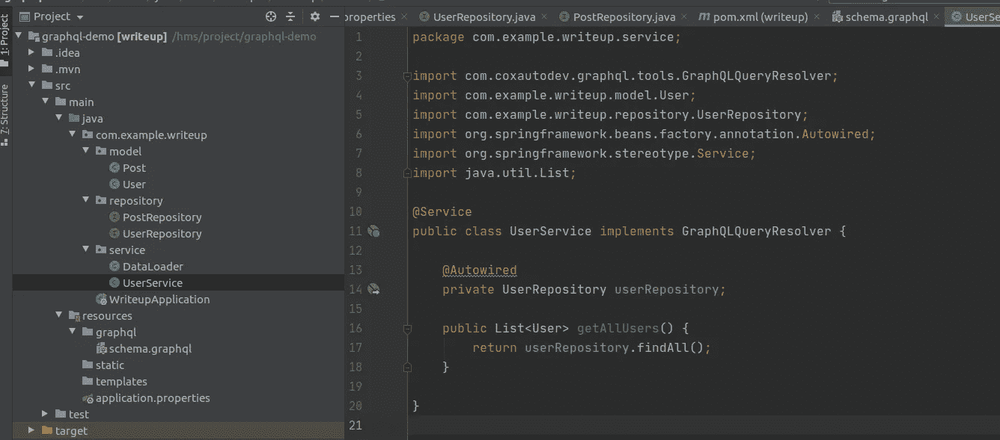*

*文件夹结构和服务层*

*最后，我们必须在`application.properties`文件中定义我们的 GraphQL 配置。*

```
*#graphql properties
graphql.servlet.corsEnabled=true
graphql.servlet.mapping=/graphql
graphql.servlet.enabled=true*
```

*从配置中可以看到，`/graphql`端点将处理所有的请求。所以不需要定义控制器。*

*一切就绪！我们的服务器现在准备好了。进行一次测试运行，瞧:您将会看到这样一条消息，如“*已开始编写应用程序...(JVM 运行…)"**

*所以现在测试。正如我前面提到的，您可以使用 Altair 客户端来测试这些端点。它既是一个桌面应用，也是一个浏览器扩展。您可以通过点击[此处](https://altair.sirmuel.design/docs/)将其添加到您的机器中。*

*现在使用 Altair 转到服务器端点。*

*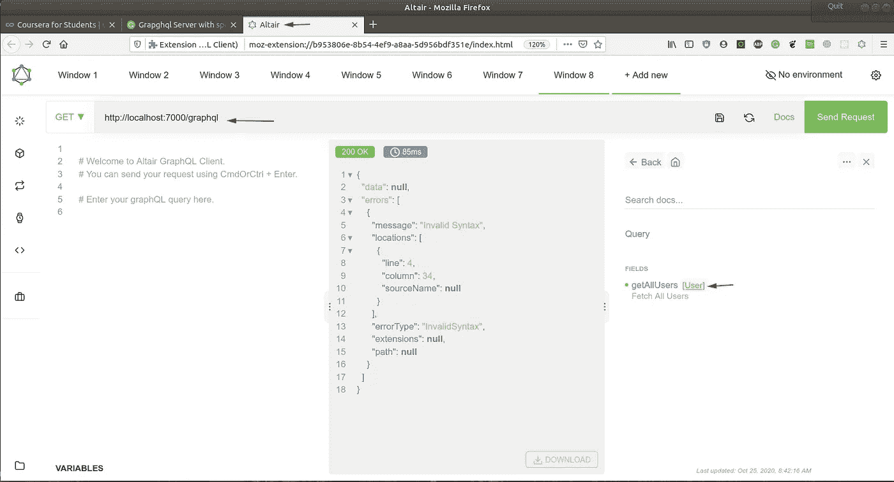*

*[http://localhost:7000/graph QL](http://localhost:7000/graphql)*

*如果您重新加载 docs 部分，您可以看到带有注释消息的字段。你可以点击它，了解更多详情。在左上角写一个查询。你可以看到牛郎星给出了自动完成。通过单击运行查询或发送请求按钮，您可以获得结果。*

*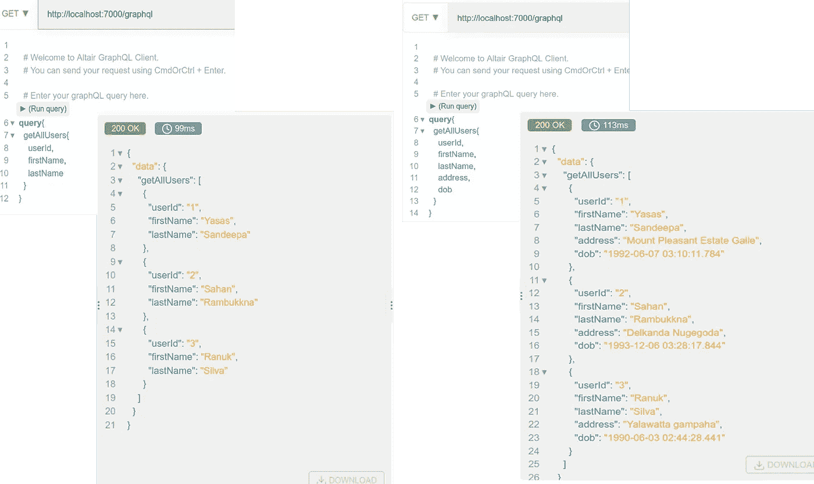*

*作者提供的截图。*

*看，多酷啊！我们可以得到我们所要求的细节。我希望现在你们都清楚这个概念以及它的实用性。我将解释突变以及我的文章的完成。*

*首先，您可以向模式文件添加一个变体。我做过更新用户地址的例子。为此，我将突变添加到模式中，并将突变定义如下。所以最终的模式如下。*

*我向用户存储库添加了一个 SQL 查询，以便根据传入的参数更新用户。*

*在用户服务中，我们必须实现另一个名为`GraphQLMutationResolver`的接口，然后我们可以在那里定义我们的`updateUserAdress`方法。确保所有方法都可以公开访问。所以最后的`UserService`会如下。*

*好吧！我们也定义了我们的突变。现在像往常一样做测试。您可以通过检查数据库来确认 API 是否工作正常。*

*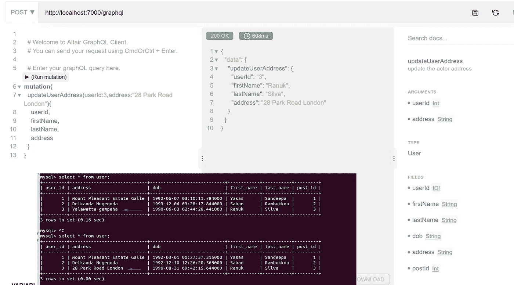*

*作者提供的截图。*

*太好了！您已经完成了 GraphQL 中的大多数概念。但是在这个神奇的世界里，我们还有很多东西需要探索。等等，我再透露一些事情。*

*除了查询和变异，GraphQL 还支持第三种操作类型，称为**订阅**。*

*像查询一样，订阅使您能够获取数据。与查询不同，订阅保持与 GraphQL 服务器的活动连接。(最常见的是通过 Web 套接字)这使您的服务器能够随着时间的推移推送订阅结果的更新。*

*这在实时通知您的客户端后端数据的变更时非常有用，例如用户通知、重要更新、文件更改等。*

*此外，GraphQL 还涵盖了更多内容，如错误处理、spring 安全、验证等。因此，我也打算就这些主题发表单独的文章。*

# *内心平静:结论*

*这是一个我们今天构建的小演示，项目的完整源代码可以在下面看到。*

*资源: [WriteUp](https://github.com/Yasas4D/WriteUp) 应用程序的源代码。*

*[](https://github.com/Yasas4D/WriteUp) [## yasas 4d/报道

### 此时您不能执行该操作。您已使用另一个标签页或窗口登录。您已在另一个选项卡中注销，或者…

github.com](https://github.com/Yasas4D/WriteUp)*