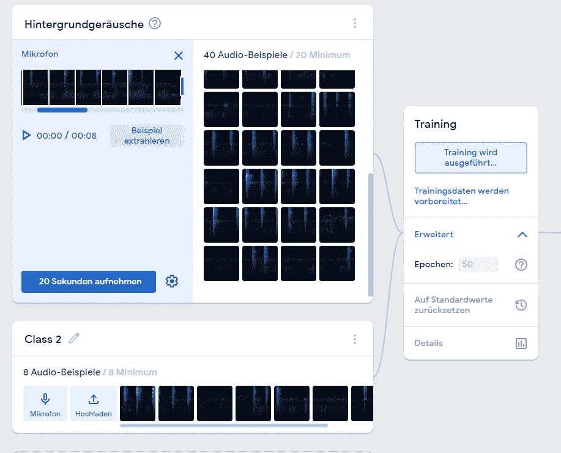
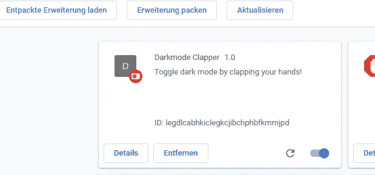

# 利用机器学习在 Chrome 中构建一个免提黑暗模式切换器

> 原文：<https://betterprogramming.pub/build-a-hands-free-dark-mode-switcher-in-chrome-with-machine-learning-2faa9417d3f4>

## 通过拍手使你的网页进入黑暗模式


照片由[奥斯汀·班](https://unsplash.com/@austinban?utm_source=medium&utm_medium=referral)在 [Unsplash](https://unsplash.com?utm_source=medium&utm_medium=referral)

我今天有点时间，所以我决定分享一些有趣的信息。在我的家庭办公室里，我制作了一个小型的黑暗和光明模式切换器，但是是免提的…做了一点调查，几个小时后我得到了这个结果:

所以…让我们开始吧。

# 训练模型

首先，我训练这个模型，以确保检测拍手的声音是可行的。我使用了[可教机器平台(打开新窗口)](https://teachablemachine.withgoogle.com/)，并开始了一个音频项目。



第一步是为你的背景音录一些例子。在那之后，你可以记录一些其他的**类**(定义)比如用手拍手。

例如，我还记录了语音样本，以便模型能够识别语音“看起来像什么”,而不会误认为是拍手。

在您录制了一些示例声音并将它们添加到类中之后，您就可以开始训练模型了。训练结束后，您可以**导出**模型以备使用。我决定把它放在谷歌上，因为这是存储训练好的模型的最快最简单的方法。

# 构建 Chrome 扩展

关于如何构建一个 Chrome 扩展，我不会说太多细节，因为有很多不同的选择，但这里是我为自己做的。

您至少需要一个 manifest.json 文件，它将包含关于您的扩展的详细信息。

```
{
    "name": "Darkmode Clapper",
    "description": "Toggle dark mode by clapping your hands!",
    "version": "1.0",
    "manifest_version": 3,
    "permissions": ["storage", "activeTab"],
       "content_scripts": [
      {
        "js": ["content.js"],
        "matches": ["https://app.netlify.com/*"],
        "all_frames": true
      }
    ]
  }
```

这个项目最重要的部分是权限和内容脚本。

# 内容脚本

[内容脚本(打开新窗口)](https://developer.chrome.com/docs/extensions/mv2/content_scripts/)是在网页环境中运行的文件，因此它们可以访问浏览器当前正在访问的页面。

根据您在 manifest.json 文件中的配置，这将在任何选项卡或仅特定选项卡上触发。由于我添加了参数“matches”:[“https://app . netlify . com/*]，这仅在我使用 web 应用程序时触发。

然后，我可以开始触发声音检测专用代码。

# 设置 TensorFlow.js 以检测声音

当使用 TensorFlow.js 时，我通常在我的机器上将模型导出为文件，但这次我决定使用另一个选项，并将其上传到 Google Cloud。这样，就可以通过 URL 访问它。否则，您可以将其存储在自己的 web 服务器或像 Azure blob 存储这样的存储中。

现在你可以开始破解了，你需要从创建你的模型开始:

```
const URL = SPEECH_MODEL_TFHUB_URL; //URL of your model uploaded on Google Cloud.
const recognizer = await createModel();

async function createModel() {
  const checkpointURL = URL + "model.json";
  const metadataURL = URL + "metadata.json"; // model metadata

  const recognizer = speechCommands.create(
    "BROWSER_FFT",
    undefined,
    checkpointURL,
    metadataURL
  );

  await recognizer.ensureModelLoaded();
  return recognizer;
}
```

一旦完成，你就可以开始实时预测了:

```
const classLabels = recognizer.wordLabels(); // An array containing the classes trained. In my case ['Background noise', 'Clap', 'Speech']

recognizer.listen(
  (result) => {
    const scores = result.scores; // will be an array of floating-point numbers between 0 and 1 representing the probability for each class
    const predictionIndex = scores.indexOf(Math.max(...scores)); // get the max value in the array because it represents the highest probability
    const prediction = classLabels[predictionIndex]; // Look for this value in the array of trained classes

    console.log(prediction);
  },
  {
    includeSpectrogram: false,
    probabilityThreshold: 0.75,
    invokeCallbackOnNoiseAndUnknown: true,
    overlapFactor: 0.5,
  }
);
```

如果一切正常，当这段代码运行时，它应该会根据现场音频数据的预测记录“背景噪音”或“拍手声”。

现在，为了切换 Netlify 的黑暗模式，我用一些小逻辑替换了 console.log 语句。目前实现黑暗模式的方式是在主体上添加一个 tw-dark 类。

```
if (prediction === "Clap") {
  if (document.body.classList.contains("tw-dark")) {
    document.body.classList.remove("tw-dark");
    localStorage.setItem("nf-theme", "light");
  } else {
    document.body.classList.add("tw-dark");
    localStorage.setItem("nf-theme", "dark");
  }
}
```

我还更新了 localStorage 中的值，使其持久化。

# 安装延伸部分

为了能够测试这段代码是否有效，您必须在浏览器中安装该扩展。

(在这样做之前，您可能需要捆绑您的扩展，这取决于您使用的工具。)

要安装它，请遵循以下步骤:

*   访问 chrome://extensions
*   切换位于页面右上角的开发人员模式
*   单击 Load unpacked 并选择包含捆绑扩展的文件夹



如果一切顺利，你应该访问任何你想运行扩展的页面，它应该请求麦克风的许可，以便能够检测现场音频，并开始预测！

就是这样！总的来说，这个项目甚至不是真正的切换黑暗模式，但我想学习使用 TensorFlow.js 作为 Chrome 扩展有一段时间了，所以这似乎是一个完美的机会！

你可以在我的 [Github](https://github.com/SBajonczak/BlogClapExample) 上查看这个项目的源代码

```
**Want to Connect With the Author?**This post was originally posted on this [blog](https://blog.bajonczak.com/Machinelearning/#what-the-heck).
```