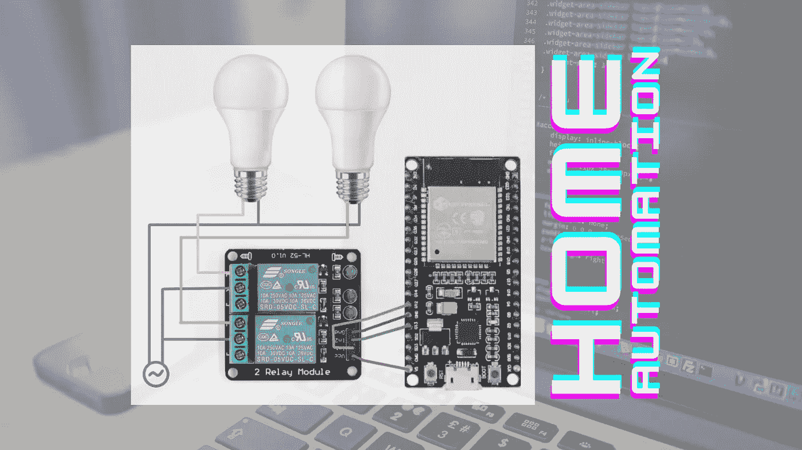
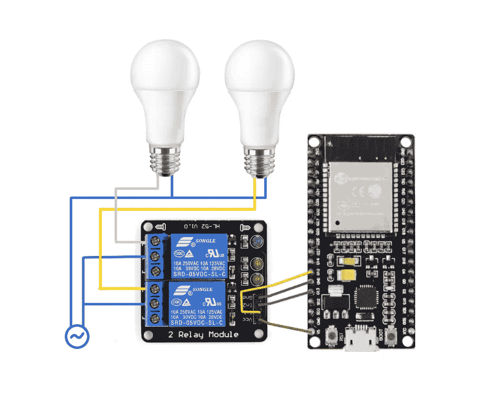

# 使用 ESP-32 和继电器模块构建家庭自动化——通过手机控制灯、风扇和电器

> 原文：<https://betterprogramming.pub/build-a-home-automation-with-esp-32-and-relay-modules-control-lights-fans-and-appliances-from-a-572a060e926f>

## 通过一些编码，我以 8 美元的价格制作了我的家用电器



带 ESP32 和继电器模块的家庭自动化。图片:Self 和 [Canva](https://www.canva.com/) 。

我是一个懒惰的家伙。我不喜欢起床。所以我必须想办法在上床后把灯关掉。不，我床边没有开关。所以，不得不集思广益来解决这个问题。

我的一个想法是做一个加长开关，但我不喜欢电线挂在我的床顶上的天花板上。另外，如果有一天保护涂层从电线上脱落，我可不想被电死。

剩下的唯一选择就是建造一个遥控系统。然后，我想制作一个带有红外发射器和接收器的遥控器。但后来，我认为制作一个看起来也很好的遥控器会非常累。另外，我没有 3D 打印机来制作遥控器的外壳。

那是我想把手机当遥控器用的时候。挑战是建立一个可以在我的手机上显示的界面，它将是交互式的，并将控制一个充当开关的继电器模块。

我想到了使用 ESP32 构建一个 WiFi 接入点来托管交互式网页作为界面。所以我立刻买了所有的部件。这里列出了所有需要的组件:

*   ESP32
*   5V 继电器模块
*   试验板
*   跳线

就是这样。

我买的是 ESP32 开发板，但是你也可以买 ESP Wroom 32 板。然后，用跳线，我在试验板上做了连接。我连接了两个电器(本例中是两个灯泡)。

这是电路图。



带 ESP32 和继电器模块的家庭自动化电路图。图片:自我。

# **理论**

一个继电器模块共有 6 个引脚。VCC、GND、信号、常开(NO)、常闭(NC)和公共触点(CC)。在这里，我使用了一个 2 继电器模块，所以，VCC 和 GND 引脚是相同的两个继电器。引脚 In1 和 In2 分别是第一和第二继电器的信号引脚。

In1 和 In2 引脚分别与 GPIO12 和 GPIO13 引脚相连。ESP32 电路板的引脚编号可在电路板上找到。

公共连接引脚必须与电源连接。对于我的家用电器，我在这里使用交流电源。交流电源的一条线直接与设备相连。另一条线进入公共连接引脚。

现在，是否从 NO 或 NC 引出一条线来连接设备，取决于您是想将继电器用作“高电平有效”还是“低电平有效”。

## **低电平有效**

“低电平有效”意味着当其逻辑电平为 0 时，信号将执行其功能。

## **高电平有效**

“低电平有效”意味着当其逻辑电平为 1 时，信号将执行其功能。

当信号引脚中的输入为低电平或 0 时，常开(NO)端口常开。这意味着，如果我们不向信号引脚发送正信号，如果与常开引脚连接，电器将保持打开，即继电器充当打开的开关。

但是在同样的情况下，常闭销保持闭合。它就像一个关闭的开关。

现在，如果我们在 signal 引脚中发送一个正信号或 1，常闭引脚将充当一个打开的开关，常开引脚将充当一个关闭的开关。

## 使用低电平有效

现在，要使用低电平有效，我们必须将常开引脚与器件相连，因为当信号引脚上的输入为低电平时，它充当有源开关(打开的开关)。

为了保持开关闭合，我们必须保持信号引脚的输入为高电平(我们通过代码做到了这一点)。

## WiFi 接入点

我们可以用 ESP32 创建一个 WiFi 接入点。然后，我们可以将手机连接到该接入点，就像我们将手机连接到任何 WiFi 一样。

然后，我们可以托管一个带有开关和这些开关的逻辑的网页，以控制来自 ESP32 的输出，该输出作为继电器模块的信号引脚的输入。我们将使用 ESP32 的 GPIO12 引脚的输出作为继电器模块的 In1 引脚(第一个继电器的信号引脚)的输入，使用 ESP32 的 GPIO13 引脚作为继电器模块的 In2 引脚(第二个继电器的信号引脚)的输入。

# 密码

我定义了一个 SSID 名称和一个密码来访问 ESP32。

```
const char* ssid = "My Home Appliances";
const char* password = "ABCD2021";
```

在函数 *setup()，*内部，为了将 ESP32 设置为接入点，我们使用了 softAP()方法。不要为开放的接入点传递密码参数(不安全)。

```
WiFi.softAP(ssid, password);
```

还有其他可选参数可以传递给 softAP()方法。

```
WiFi.softAP(const char* ssid, const char* password, int channel, int ssid_hidden, int max_connection)
```

*   频道:Wi-Fi 频道号(1–13)
*   ssid_hidden: (0 =广播 ssid，1 =隐藏 SSID)
*   max_connection:同时连接的最大客户端数量(1–4)

我们需要使用 *softAPIP()* 方法获取接入点 IP 地址，并在串行监视器中打印出来。一旦我们的手机(或任何设备)连接到 WiFi 接入点，我们就可以通过从任何浏览器打开这个 IP 地址作为 URL 来访问网页。

```
IPAddress IP = WiFi.softAPIP();  
Serial.print("Access Point IP address: ");  
Serial.println(IP);
```

串行监视器的输出如下所示:

```
Access Point IP address:
194.168.0.4
```

接下来，我们需要将端口 80 设置为 webserver 端口(以便可以通过 web 浏览器访问服务器)。

```
WiFiServer server(80);
```

我们还需要将 HTTP 请求存储在一个变量中。

```
String header;
```

我们需要创建开关变量，并将它们分配给 GPIO 引脚。下面是我如何创建开关变量。

```
const int switch1 = 12;
const int switch2 = 13;
const int switch3 = 14;
const int switch4 = 27;
```

我们在 setup()方法中将它们分配给 GPIO 引脚。

```
pinMode(switch1, OUTPUT);  
pinMode(switch2, OUTPUT);  
pinMode(switch3, OUTPUT);  
pinMode(switch4, OUTPUT);
```

我们还主要将所有开关的状态设置为“关”。

```
String switch1_state = "off";
String switch2_state = "off";
String switch3_state = "off";
String switch4_state = "off";
```

## 在 setup()函数中

请记住，我们使用的是低电平有效型继电器模块。因此，我们默认将输出设为高电平，这样开关默认关闭。

```
digitalWrite(switch1, HIGH);  
digitalWrite(switch2, HIGH);  
digitalWrite(switch3, HIGH);  
digitalWrite(switch4, HIGH);
```

## loop()函数:

`loop()`函数基本上是一个无限循环，会被反复执行。

在这里，我们需要继续监听新客户。客户端是连接到 WiFi 接入点的设备。

```
WiFiClient client = server.available();
```

为了在客户端的浏览器上显示网页，我们需要使用`client.println()`函数用 HTML 构建一个网页。看看下面的代码，看看我们是如何用 HTML 构建整个网页的。

点击按钮会把你带到不同的网址，比如`/switch2/turn_on`。例如，如果基本 IP 地址是 192.168.0.2，那么单击打开第二台设备的按钮会将您带到 URL 192.168.0.2/switch2/turn_on。

然后，我们使用 if 块来检查我们在哪个 URL 上，然后发送一个高电平或低电平信号，作为与该开关/按钮对应的 GPIO 引脚的输出。

```
// GPIO12            
if (header.indexOf("GET /switch1/turn_on") >= 0){
              Serial.println("Switch 1 (GPIO 12) ON");
              switch1_state = "on";
              digitalWrite(switch1, LOW);
}             
else if (header.indexOf("GET /switch1/turn_off") >= 0){  
            Serial.println("Switch 1 (GPIO 12) OFF"); 
            switch1_state = "off";
            digitalWrite(switch1, HIGH);
}
```

最后，这里是该项目的代码。您需要将此代码闪存到您的 ESP32 板上，就这样，您就可以开始了。

你可以在网上观看任何教程，学习如何在你的 ESP32 中刷新代码。这很简单。稍后我会就此写一篇文章。

该代码适用于 4 台设备。但是我只用了 2 个继电器模块，因此，只能控制 2 个电器。但是它也可以扩展到更多的继电器模块和更多的设备。

# 使用

然后我用‘我的家电’WiFi 接入点连接了手机，用浏览器打开了串口显示器上打印的 IP 地址。就是这样。页面上有控制我的电器的按钮。

就是这样。就这么简单！

```
**Want to Connect?**You can follow me on [GitHub](https://github.com/SamratDuttaOfficial) and [LinkedIn](https://www.linkedin.com/in/SamratDuttaOfficial).
```