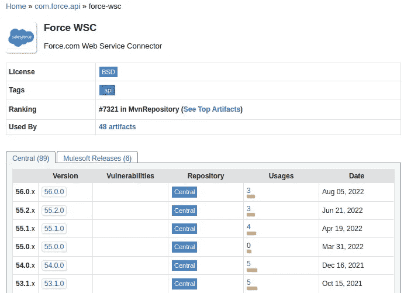
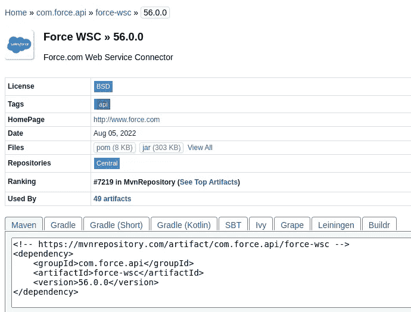
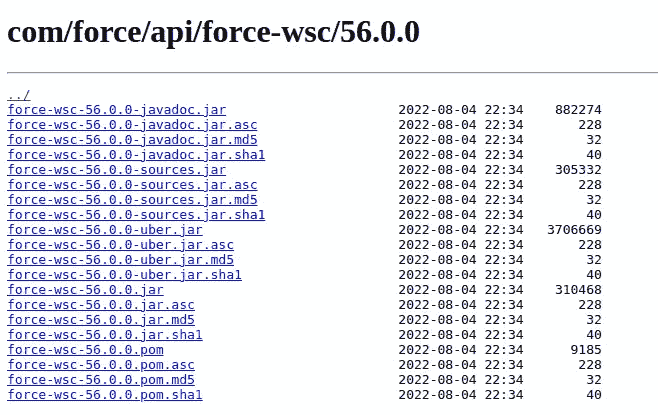
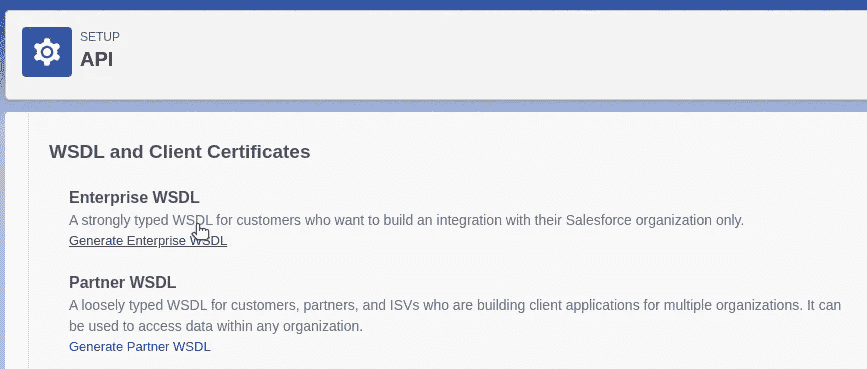
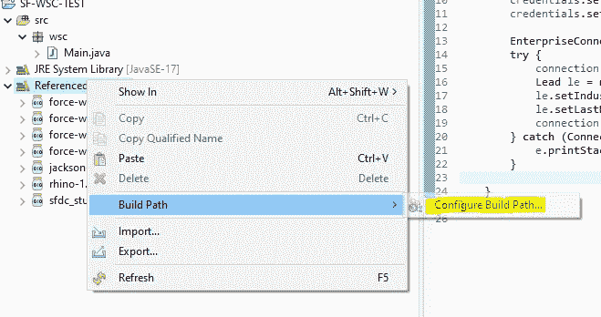
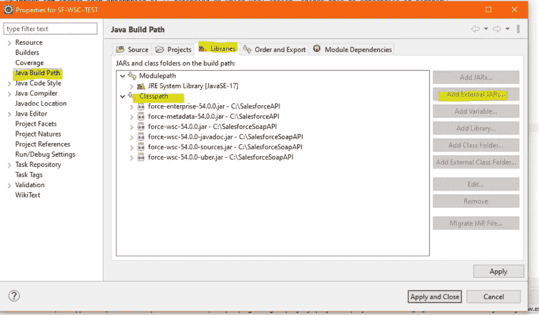
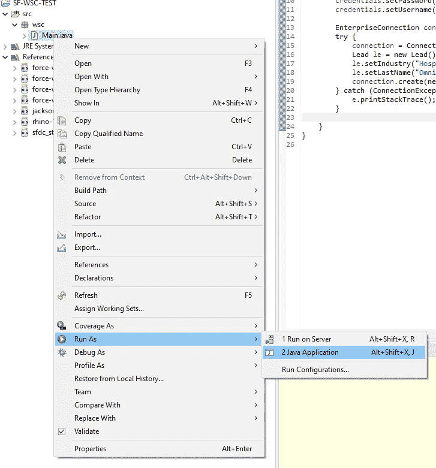

# 构建与 Salesforce 连接的 Java 后端

> 原文：<https://betterprogramming.pub/build-a-java-backend-that-connects-with-salesforce-43909df29143>

## 关于如何实现 Java 和 SFDC 应用程序的讨论？我们开始谈吧！


奥马尔·弗洛雷斯在 [Unsplash](https://unsplash.com/?utm_source=medium&utm_medium=referral) 上拍摄的照片

# 第一部分:Java 调用 Salesforce

Salesforce 生态系统相当庞大。开发人员必须努力工作，以保持与 Salesforce 的最新和最棒的功能和工具同步。在这篇文章中，我们将混合一点新旧。我们将把基于 Java 的应用程序与 Salesforce 结合起来，我们将通过 web 服务来实现。

Java 是一种编程语言和计算平台，由 Sun Microsystems 于 1995 年首次发布。从那以后，我们看到了 Web 2.0 和 Web 编程语言、容器、微服务和云原生架构的兴起。然而，即使是现在，许多为未来设计的新产品和数字服务仍然依赖于 Java。在可预见的未来，Java 仍将存在。

与此同时，Salesforce 已经成为世界顶级的 CRM 和客户成功平台。如今的企业依赖于需要无缝集成应用程序的多云和混合云设置，因此 Java 应用程序和 Salesforce 云需要交叉也就不足为奇了。那么，我们如何将我们的 Java 和 Salesforce.com(SFDC)应用程序集成在一起，并相互通信呢？

本文将讨论如何使用 Web 服务连接器(WSC)实现这种集成。我们将使用一个示例用例—一家希望使用其 Java 应用程序来操作 Salesforce org 数据的企业—并向您展示如何设置您的开发人员环境并连接各个部分。

然而，在我们开始之前，让我们简单地谈谈 Salesforce 及其 API 优先的方法。

# Salesforce 和 API 优先方法

如果您熟悉 SFDC 生态系统，您会知道 Salesforce 在其平台上构建功能时采用 API 优先的方法。事实上，Salesforce 是[首批部署 web APIs 的公司之一。虽然该平台具有许多出色的内置功能，但 Salesforce 希望其客户能够为自己的平台创建所需的功能和定制体验。](https://www.google.com/url?q=https://blog.postman.com/intro-to-apis-history-of-apis&sa=D&source=docs&ust=1665513405618360&usg=AOvVaw1aHWllLUfwdN90JcxSUynU)

通过提供 API，Salesforce 确保 SFDC 可以定制并连接到任何可以与 web 服务交互的外部应用程序。来自 Salesforce 的一些 API(有很多这样的 API)包括:

*   [SOAP API](https://developer.salesforce.com/docs/atlas.en-us.api.meta/api/sforce_api_quickstart_intro.htm)
*   [REST API](https://developer.salesforce.com/docs/atlas.en-us.api_rest.meta/api_rest/intro_rest.htm)
*   [散装 API](https://developer.salesforce.com/docs/atlas.en-us.224.0.api_asynch.meta/api_asynch/asynch_api_intro.htm)
*   [元数据 API](https://developer.salesforce.com/docs/atlas.en-us.api_meta.meta/api_meta/meta_intro.htm)
*   [Chatter REST API](https://developer.salesforce.com/docs/atlas.en-us.216.0.chatterapi.meta/chatterapi/intro_what_is_chatter_connect.htm)
*   [流式 API](https://developer.salesforce.com/docs/atlas.en-us.api_streaming.meta/api_streaming/intro_stream.htm)
*   [工具 API](https://developer.salesforce.com/docs/atlas.en-us.api_tooling.meta/api_tooling/intro_api_tooling.htm)

请注意，Salesforce 的平台被 API 很好地覆盖，为无数不同的用例开放了对其功能的访问。也就是说，让我们深入我们的用例。

在我们的示例用例中，我们有一个 Java 应用程序，它帮助企业为他们的销售组织生成销售线索。该企业希望 Java 应用程序将合格的潜在客户直接推送到他们的 Salesforce CRM，从而避免将潜在客户数据手动输入 Salesforce。

为了集成 Java 和 Salesforce，我们将使用 Salesforce SOAP API 和 [Web 服务连接器(WSC)](https://github.com/forcedotcom/wsc) 库，它作为一个包装层，简化了在 Java 中使用 API 的工作。

# 初始设置

我们的 Java 开发人员环境的初始设置需要几个步骤。幸运的是，我们从这份 [Salesforce tipsheet](https://resources.docs.salesforce.com/latest/latest/en-us/sfdc/pdf/salesforce_developer_environment_tipsheet.pdf) 中获得了指导。尽管如此，我们将在这里提供主要步骤的概述。

# 安装 Java 开发工具包(JDK)

为了在我们的 Java 应用程序中使用 Salesforce APIs，我们将在版本 11.0 或更高版本中安装 Java Developer Kit (JDK)。你可以通过访问[这个页面](https://www.oracle.com/java/technologies/downloads/)找到适合你本地机器的二进制文件。

# 安装 Eclipse

接下来，您需要一个 Java 开发 IDE。虽然有几个选项可用，但我们的演练步骤将与 Eclipse IDE 一起进行。你可以在这里找到最新的 Eclipse IDE 包。在本地计算机上下载并安装 IDE。

# 安装 WSC

由于我们将使用 Salesforce SOAP API，我们需要安装 WSC。

## 下载 WSC 预建。jar 文件

WSC 的 [Maven 资源库](https://mvnrepository.com/artifact/com.force.api/force-wsc)显示了所有可用的版本:



导航到与您正在使用的 Salesforce 的 API 版本相匹配的版本页面。在我们的例子中，我们将使用 [56.0.0](https://mvnrepository.com/artifact/com.force.api/force-wsc/56.0.0) 。



在“文件”下，我们单击“查看全部”。这将我们带到需要下载的实际`.jar`文件的`[`](https://repo1.maven.org/maven2/com/force/api/force-wsc/54.0.0/)`。



将以下四个文件下载到您的本地计算机上:

1.  `force-wsc-56.0.0-javadoc.jar`
2.  `force-wsc-56.0.0-sources.jar`
3.  `force-wsc-56.0.0-uber.jar`
4.  `force-wsc-56.0.0.jar`

我们将使用这些文件从我们的 Salesforce 组织生成带有 WSDLs 的存根文件。

# 为您的 Salesforce 组织生成并下载 WSDL

接下来，我们将生成一个 WSDL 来生成我们的。jar 存根文件。我们不能用预制的。jar 文件，因为 WSDL 特定于我们的 Salesforce 组织。如果在我们的组织中定义了自定义对象和字段，那么 WSDL 将反映这些内容，并且生成。罐子会装它们。

我们登录我们的 Salesforce 开发人员组织。然后，我们导航到设置、平台工具、集成、API。我们点击“生成企业 WSDL”



这将在您的浏览器中打开一个新标签，显示您的 WSDL 文件。用名称`sfdc.wsdl`将该文件保存到您的本地机器。把它放到你下载 WSC 的同一个文件夹里。jar 文件。

## 生成 Java 存根文件

为了在 Java 中使用 SOAP API，我们需要生成。我们应用程序项目的 jar 存根文件。我们运行以下命令来生成存根文件:

```
$ java -classpath force-wsc-56.0.0-uber.jar com.sforce.ws.tools.wsdlc sfdc.wsdl sfdc_stub.jar
[WSC][wsdlc.main:72]Generating Java files from schema …
[WSC][wsdlc.main:72]Generating 1206 java files.
[WSC][wsdlc.main:72]Compiled 1210 java files.
[WSC][wsdlc.main:72]Generating jar file … sfdc_stub.jar
[WSC][wsdlc.main:72]Generated jar file sfdc_stub.jar
```

# 在 Eclipse 中创建 Java 项目

在 Eclipse 中，使用下面的代码启动一个新的 Java 项目和一个新的 Java 类`Main`:

# 补充。要投影的 jar 文件

接下来，我们需要连接生成的四个。包含我们项目的构建路径的 jar 文件。右键单击项目并选择“构建路径”、“配置构建路径”。



在出现的模式中，执行以下操作:

*   导航到左侧面板中的 Java 构建路径。
*   单击“库”选项卡。
*   选择模块路径
*   单击添加外部 jar 按钮。
*   找到那四个。从 Maven 资源库下载的 jar 文件和生成的存根文件(`sfdc_stub.jar`)，并添加它们。
*   点击应用并关闭。



# 测试应用程序

我们已经准备好了代码和。jar 文件全部就绪。现在，在 Eclipse 中右键单击您的`Main.java`文件。选择运行方式- > Java 应用程序。



运行应用程序后，我们导航到 Salesforce 组织中的销售线索，看到我们有了一个新线索！


我们的 Java 应用程序已经通过 SOAP API 成功接入我们的 Salesforce 组织，使用 WSC 来插入新的销售线索！

# 后续步骤

一旦我们验证了最初的概念证明，您就可以扩展您的 Java 应用程序来执行其他操作，包括读取、更新和删除。您可以合并您自己的自定义业务逻辑来创建一个 Java 应用程序，为您处理您的 Salesforce 组织数据！

有关我们所涉及的许多核心概念的更多信息，以下是有用资源的链接:

*   [网络服务连接器(GitHub)](https://github.com/forcedotcom/wsc)
*   [sales force Master GitHub Repo(SFDC 仓库的宝库)](https://github.com/forcedotcom)