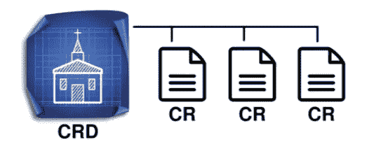
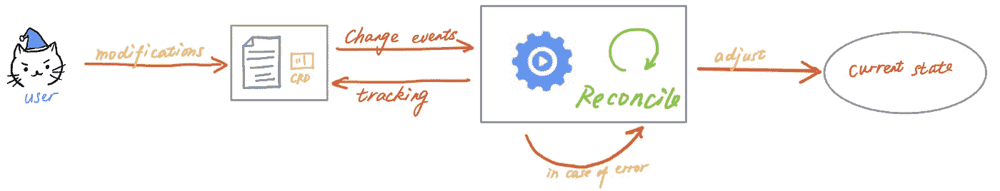

# 在 10 分钟内构建一个 Kubernetes 操作器

> 原文：<https://betterprogramming.pub/build-a-kubernetes-operator-in-10-minutes-11eec1492d30>

## Kubernetes 运营商 101

您可能对 [Kubernetes](https://kubernetes.io/) 很熟悉，但是您知道什么是操作符，它们是如何工作的，以及如何构建一个操作符吗？这是一个复杂的主题，但幸运的是，自从[在 2016 年](https://web.archive.org/web/20170129131616/https://coreos.com/blog/introducing-operators.html)发明以来，许多工具已经被开发出来，以简化工程师的生活。

它们允许您将定制逻辑合并到 Kubernetes 中，以自动化大量任务，这超出了软件本身所能做的。

事不宜迟，让我们深入了解一下运营商吧！


图一。[摄影](https://unsplash.com/photos/Esq0ovRY-Zs)马克西米连·魏斯贝克尔在 Unsplash。

```
Table of Contents[What is an operator?](#6313)
[Practical work](#685b)
[1\. Set up your environment](#9a3d)
[2\. Create a simple operator](#beac)
[3\. Customize the CRD and the controller](#7954)
[4\. Run the controller](#d224)
[5\. Test the controller](#414e)[To go further](#c22c)
```

# 什么是运营商？

等一下，你知道什么是 [Kubernetes](https://kubernetes.io/) (或者 k8s)吗？给大家提个醒，这是一个“在任何地方部署、扩展和管理容器化应用的开源系统”，由[谷歌云](https://cloud.google.com/learn/what-is-kubernetes)开发。

大多数人使用 Kubernetes 是通过使用本地资源(如 pods、部署、服务等)部署他们的应用程序。但是，可以扩展软件的功能，使其逻辑符合特定的需求。这就是操作符发挥作用的地方。

*操作员的主要目标是将工程师的逻辑翻译成代码，以便自动化某些 Kubernetes 本身无法完成的任务。*

处理应用程序或服务的工程师对系统应该如何运行、应该如何部署以及在出现问题时如何反应有着深刻的了解。将这些技术知识封装在代码中并自动化操作的能力意味着在重复性任务上花费更少的时间，而在重要问题上花费更多的时间。

例如，可以想象一个操作员在 Kubernetes 中部署和维护工具，如 [MySQL](https://www.mysql.com/) 、 [Elasticsearch](https://www.elastic.co/) 或 [Gitlab runners](https://docs.gitlab.com/runner/) 。操作员可以配置这些工具，根据事件调整系统状态，并对故障做出反应。

听起来很有趣，对吧？让我们把手弄脏吧。

# 实际工作

你可以使用 Kubernetes 开发的[控制器-运行时](https://github.com/kubernetes-sigs/controller-runtime)项目从头构建一个操作器，或者你可以使用最流行的框架之一来加速你的开发周期并降低复杂性( [Kubebuilder](https://github.com/kubernetes-sigs/kubebuilder) 或 [OperatorSDK](https://github.com/operator-framework/operator-sdk) )。我会选择 Kubebuilder 框架，因为它非常容易使用，文档也很容易阅读，而且它是一个久经考验的产品。

无论如何，这两个项目目前正在合并成一个单一的项目。

## 1.设置您的环境

你需要一些工具来开发你的操作员。以下是必备条件:

*   [go](https://golang.org/dl/)v 1 . 17 . 9+版
*   [docker](https://docs.docker.com/install/)17.03+版本
*   [kubectl](https://kubernetes.io/docs/tasks/tools/install-kubectl/) 版本 1.11.3+
*   访问 Kubernetes v1.11.3+集群(我强烈建议使用[类](https://kind.sigs.k8s.io/)来建立自己的本地集群，它非常容易使用！).

然后我们可以安装 kubebuilder:

```
$ curl -L -o kubebuilder [https://go.kubebuilder.io/dl/latest/$(go](https://go.kubebuilder.io/dl/latest/$(go) env GOOS)/$(go env GOARCH) && chmod +x kubebuilder && mv kubebuilder /usr/local/bin/
```

如果一切正常，您应该会看到类似的输出(版本可能会根据您阅读本文的时间而有所变化):

```
$ kubebuilder versionVersion: main.version{KubeBuilderVersion:"3.4.1", KubernetesVendor:"1.23.5", GitCommit:"d59d7882ce95ce5de10238e135ddff31d8ede026", BuildDate:"2022-05-06T13:58:56Z", GoOs:"darwin", GoArch:"amd64"}
```

太棒了，现在我们可以开始了！

## 2.创建简单的运算符

让我们做一个小练习:我们将构建一个简单的 foo 操作符，除了演示操作符的功能之外，它没有任何实际用途。

通过运行以下命令初始化一个新项目。它将下载控制器运行时二进制文件，并搭建一个可供我们定制的项目。

```
$ kubebuilder init --domain my.domain --repo my.domain/tutorialWriting kustomize manifests for you to edit...
Writing scaffold for you to edit...
Get controller runtime:
$ go get sigs.k8s.io/controller-runtime@v0.11.2
go: downloading sigs.k8s.io/controller-runtime v0.11.2
...
Update dependencies:
$ go mod tidy
go: downloading github.com/onsi/gomega v1.17.0
...
```

下面是项目的结构(正如您所注意到的，这是一个 Go 项目):

```
$ ls -a-rw-------   1 leovct  staff    129 Jun 30 16:08 .dockerignore
-rw-------   1 leovct  staff    367 Jun 30 16:08 .gitignore
-rw-------   1 leovct  staff    776 Jun 30 16:08 Dockerfile
-rw-------   1 leovct  staff   5029 Jun 30 16:08 Makefile
-rw-------   1 leovct  staff    104 Jun 30 16:08 PROJECT
-rw-------   1 leovct  staff   2718 Jun 30 16:08 README.md
drwx------   6 leovct  staff    192 Jun 30 16:08 config
-rw-------   1 leovct  staff   3218 Jun 30 16:08 go.mod
-rw-r--r--   1 leovct  staff  94801 Jun 30 16:08 go.sum
drwx------   3 leovct  staff     96 Jun 30 16:08 hack
-rw-------   1 leovct  staff   2780 Jun 30 16:08 main.go
```

让我们来看一下操作符最重要的组件:

*   `main.go`是项目的切入点；它设置并运行管理器。
*   `config/`包含在 Kubernetes 中部署操作员的清单。
*   `Dockerfile`是用于构建经理形象的容器文件。

## **等等，这个管理器组件是什么？！**

这可能有点理论性。坚持住！

*操作符由两部分组成，一个自定义资源定义(CRD)和一个控制器。*

CRD 是一个“Kubernetes 定制类型”或者资源的蓝图，用来描述它的规格和状态。我们可以定义 CRD 的实例，称为定制资源(或 CR)。



图二。自定义资源定义(CRD)和自定义资源(CR)。

控制器(也称为控制回路)持续监控集群的状态，并根据事件进行更改。它的目标是使资源的当前状态达到用户在自定义资源的规范中定义的期望状态。



图三。高层操作的一个控制器由[斯蒂芬妮来](https://medium.com/swlh/kubernetes-operator-for-beginners-what-why-how-21b23f0cb9b1)。

一般来说，控制器特定于一种资源，但它可以对一组不同的资源执行 CRUD(创建、读取、更新和删除)操作。

Kubernetes 文档中介绍的控制器的一个例子是恒温器。当我们设定温度时，我们告诉恒温器想要的状态。实际状态是由房间的实际温度决定的。然后，恒温器通过打开或关闭加热器来使实际状态更接近期望状态。

那么经理呢？该组件的目标是启动所有不同的控制器，并使一组控制回路共存。假设您的项目中有两个 CRD。然后，您将有两个控制器:每个 CRD 一个。管理器将启动这两个控制器，并使它们共存。

如果你想知道更多关于操作者如何工作的细节，你可以在评论中留下问题或者浏览文章末尾提供的资源列表。我以后一定会就这个概念做一篇详细的文章。

现在我们知道了操作符是如何工作的，我们可以开始使用 Kubebuilder 框架创建一个操作符。我们将从创建一个新的 API(组/版本)和一个新的种类(CRD)开始。当要求创建 CRD 和控制器时，请按“是”。

```
$ kubebuilder create api --group tutorial --version v1 --kind FooCreate Resource [y/n] y
Create Controller [y/n] y
Writing kustomize manifests for you to edit...
Writing scaffold for you to edit...
api/v1/foo_types.go
controllers/foo_controller.go
Update dependencies:
$ go mod tidy
Running make:
$ make generate
mkdir -p /Users/leovct/Documents/tutorial/bin
GOBIN=/Users/leovct/Documents/tutorial/bin go install sigs.k8s.io/controller-tools/cmd/controller-gen@v0.8.0
/Users/leovct/Documents/tutorial/bin/controller-gen object:headerFile="hack/boilerplate.go.txt" paths="./..."
```

这就是有趣的开始！我们将定制 CRD 和控制器来满足我们的需求。您会注意到已经创建了两个新文件夹:

*   `api/v1`其中包含我们的 Foo CRD(见`foo_types.go`)。
*   `controllers`包含 Foo 控制器(见`foo_controller.go`)。

## 3.自定义 CRD 和控制器

这是我们可爱的福 CRD 定制的(见`api/v1/foo_types.go`)。如我之前所说，这个 CRD 没有目的。它只是展示了如何使用操作符在 Kubernetes 中执行简单的任务。

Foo CRD 在其规范中有一个`name`字段，它引用 Foo 正在寻找的朋友的名字。如果 Foo 找到一个朋友(与他的朋友同名的 pod)，它的`happy`状态将被设置为 true。

现在，让我们实现控制器的逻辑。这里没什么复杂的。我们获取触发协调请求的 Foo 资源，以获得 Foo 朋友的名字。然后，我们列出所有与 Foo 的朋友同名的 pod。如果我们找到一个(或多个)，我们将 Foo 的`happy`状态更新为`true`，否则我们将其设置为`false`。

请注意，控制器也会对 Pod 事件做出反应(参见`mapPodsReqToFooReq`)。事实上，如果创建了一个新的 pod，我们希望 Foo 资源能够相应地更新它的状态。每次发生`Pod`事件(创建、更新或删除)时，都会触发该方法。只有当 Pod 的名称是集群中部署的 Foo 自定义资源之一的“朋友”时，它才会触发 Foo 控制器的协调循环。

我们已经完成了对 API 定义和控制器的编辑，因此我们可以运行下面的命令来更新操作者清单。如果您注意的话，您会看到一些清单文件已经被更新。

```
$ make manifests/Users/leovct/Documents/tutorial/bin/controller-gen rbac:roleName=manager-role crd webhook paths="./..." output:crd:artifacts:config=config/crd/bases
```

## 4.运行控制器

我正在使用由 Kind 建立的本地 Kubernetes 集群，我建议您也这样做。非常好用。

首先，我们将 CRDs 安装到集群中。

```
$ make install/Users/leovct/Documents/tutorial/bin/controller-gen rbac:roleName=manager-role crd webhook paths="./..." output:crd:artifacts:config=config/crd/bases
kubectl apply -k config/crd
customresourcedefinition.apiextensions.k8s.io/foos.tutorial.my.domain created
```

你可以看到 Foo CRD 已经创建好了。

```
$ kubectl get crdsNAME                               CREATED AT
foos.tutorial.my.domain            2022-06-30T17:02:45Z
```

然后我们在终端中运行控制器。请记住，我们也可以将其部署为 Kubernetes 集群中的部署。

```
$ make run/Users/leovct/Documents/tutorial/bin/controller-gen rbac:roleName=manager-role crd webhook paths="./..." output:crd:artifacts:config=config/crd/bases
/Users/leovct/Documents/tutorial/bin/controller-gen object:headerFile="hack/boilerplate.go.txt" paths="./..."
go fmt ./...
go vet ./...
go run ./main.goINFO controller-runtime.metrics Metrics server is starting to listen {"addr": ":8080"}INFO setup starting managerINFO Starting server {"path": "/metrics", "kind": "metrics", "addr": "[::]:8080"}INFO Starting server {"kind": "health probe", "addr": "[::]:8081"}INFO controller.foo Starting EventSource {"reconciler group": "tutorial.my.domain", "reconciler kind": "Foo", "source": "kind source: *v1.Foo"}INFO controller.foo Starting EventSource {"reconciler group": "tutorial.my.domain", "reconciler kind": "Foo", "source": "kind source: *v1.Pod"}INFO controller.foo Starting Controller {"reconciler group": "tutorial.my.domain", "reconciler kind": "Foo"}INFO controller.foo Starting workers {"reconciler group": "tutorial.my.domain", "reconciler kind": "Foo", "worker count": 1}
```

如您所见，管理器启动了，然后 Foo 控制器启动了。控制器现在正在运行并监听事件！

## 5.测试控制器

为了测试一切都正常工作，我们将创建两个 Foo 定制资源和一些 pods 来看看控制器是如何工作的。

首先，在`config/samples`中创建 Foo 定制资源清单，并运行以下命令在本地 Kubernetes 集群中创建资源。

```
$ kubectl apply -f config/samplesfoo.tutorial.my.domain/foo-1 created
foo.tutorial.my.domain/foo-2 created
```

您应该看到控制器为每个 Foo 自定义资源创建事件触发了两个协调循环。

```
INFO controller.foo reconciling foo custom resource {"reconciler group": "tutorial.my.domain", "reconciler kind": "Foo", "name": "foo-1", "namespace": "default"}INFO controller.foo foo's happy status updated {"reconciler group": "tutorial.my.domain", "reconciler kind": "Foo", "name": "foo-1", "namespace": "default", "status": "false"}INFO controller.foo foo custom resource reconciled {"reconciler group": "tutorial.my.domain", "reconciler kind": "Foo", "name": "foo-1", "namespace": "default"}INFO controller.foo reconciling foo custom resource {"reconciler group": "tutorial.my.domain", "reconciler kind": "Foo", "name": "foo-2", "namespace": "default"}INFO controller.foo foo's happy status updated {"reconciler group": "tutorial.my.domain", "reconciler kind": "Foo", "name": "foo-2", "namespace": "default", "status": "false"}INFO controller.foo foo custom resource reconciled {"reconciler group": "tutorial.my.domain", "reconciler kind": "Foo", "name": "foo-2", "namespace": "default"}
```

如果您检查 Foo 定制资源的状态，您可以看到它们的状态是空的。这正是我们所期望的，所以到目前为止一切都很好！

```
$ kubectl describe foosName:         foo-1
Namespace:    default
API Version:  tutorial.my.domain/v1
Kind:         Foo
Metadata:     ...
Spec:
  Name:       jack
Status:Name:         foo-2
Namespace:    default
API Version:  tutorial.my.domain/v1
Kind:         Foo
Metadata:     ...
Spec:
  Name:       joe
Status:
```

现在，让我们来增加情趣吧！我们将部署一个名为`jack`的吊舱，看看系统如何反应。

完成后，您应该看到控制器对 pod 创建事件做出了反应。然后，它按照预期更新第一个 Foo 自定义资源的状态。你可以通过描述 Foo 自定义资源来自己验证。

```
INFO pod linked to a foo custom resource issued an event {"name": "jack"}INFO controller.foo reconciling foo custom resource {"reconciler group": "tutorial.my.domain", "reconciler kind": "Foo", "name": "foo-1", "namespace": "default"}INFO controller.foo pod linked to a foo custom resource found {"reconciler group": "tutorial.my.domain", "reconciler kind": "Foo", "name": "foo-1", "namespace": "default", "name": "jack"}INFO controller.foo foo's happy status updated {"reconciler group": "tutorial.my.domain", "reconciler kind": "Foo", "name": "foo-1", "namespace": "default", "status": true}INFO controller.foo foo custom resource reconciled {"reconciler group": "tutorial.my.domain", "reconciler kind": "Foo", "name": "foo-1", "namespace": "default"}
```

让我们更新第二个 Foo 定制资源的规范，并将其名称字段的值从`joe`更改为`jack`。控制器应该捕捉更新事件并触发一个协调循环。

```
INFO controller.foo pod linked to a foo custom resource found {"reconciler group": "tutorial.my.domain", "reconciler kind": "Foo", "name": "foo-2", "namespace": "default", "name": "jack"}INFO controller.foo foo's happy status updated {"reconciler group": "tutorial.my.domain", "reconciler kind": "Foo", "name": "foo-2", "namespace": "default", "status": true}INFO controller.foo foo custom resource reconciled {"reconciler group": "tutorial.my.domain", "reconciler kind": "Foo", "name": "foo-2", "namespace": "default"}
```

是的，成功了！今天的测试足够了；我想你明白了！如果删除名为`jack`的 pod，自定义资源的`happy`状态将被设置回 false。

我们可以确认操作员按预期工作！编写单元测试和 e2e 测试会更好，但这不是本文的目的，我将在另一篇文章中讨论这个主题。

你可以为自己感到骄傲。您已经设计、部署并测试了您的第一个操作员！恭喜你！！

如果你需要浏览代码，这里有 GitHub 库的链接。

[](https://github.com/leovct/kubernetes-operator-tutorial) [## GitHub-leovct/kubernetes-Operator-教程:在 10 分钟内构建一个 Kubernetes 操作器

### 您将需要一个 Kubernetes 集群来运行。您可以使用 KIND 来获取一个本地集群进行测试，或者针对一个…

github.com](https://github.com/leovct/kubernetes-operator-tutorial) 

# 走得更远

我们已经看到了如何创建一个非常基本的 Kubernetes 操作符，但它远非完美。有很多方法可以改善。如果你愿意，这里有一个你可以探索的主题列表:

*   优化事件过滤(有时，事件会提交两次……)。
*   细化 RBAC 权限。
*   完善日志系统。
*   当操作员更新资源时，发出 Kubernetes 事件。
*   获得 Foo 自定义资源时添加自定义字段(也许显示快乐状态？).
*   编写单元测试和 e2e 测试。

这里有一个资源列表，你可以用它来更深入地研究这个主题。

玩得开心！

[](https://book.kubebuilder.io/) [## 简介 Kubebuilder 图书

### 我们声援黑人社区。种族主义是不可接受的。这与……的核心价值观相冲突

book.kubebuilder.io](https://book.kubebuilder.io/) [](https://cloudark.medium.com/kubernetes-custom-controllers-b6c7d0668fdf) [## 编写 Kubernetes 自定义控制器

### 新闻:本文现已被 Kubernetes 官方文档接受:

cloudark.medium.com](https://cloudark.medium.com/kubernetes-custom-controllers-b6c7d0668fdf) [](https://medium.com/swlh/kubernetes-operator-for-beginners-what-why-how-21b23f0cb9b1) [## 面向初学者的 Kubernetes 运算符—什么、为什么、如何

### 解释基本知识和方法，使用 Kubebuilder 从头构建一个操作符

medium.com](https://medium.com/swlh/kubernetes-operator-for-beginners-what-why-how-21b23f0cb9b1) [](https://medium.com/swlh/advanced-kubernetes-operators-development-988edad5f58a) [## 高级 Kubernetes 运营商开发

### 如何基于 Kubebuilder 构建生产标准操作符？提示和陷阱

medium.com](https://medium.com/swlh/advanced-kubernetes-operators-development-988edad5f58a)  [## operator hub . io | Kubernetes 操作员的注册表

### 这个应用程序是用 JavaScript 构建的，旨在提供快速搜索体验。此应用程序呈现的基础数据是…

operatorhub.io](https://operatorhub.io/)