# 在 Node.js 中构建一个登录系统

> 原文：<https://betterprogramming.pub/build-a-login-system-in-node-js-f1ba2abd19a>

## 如何在您的节点应用程序中使用 Passport.js 进行用户验证


照片由[弗雷迪婚姻](https://unsplash.com/@fredmarriage?utm_source=unsplash&utm_medium=referral&utm_content=creditCopyText)在 [Unsplash](https://unsplash.com/s/photos/gate?utm_source=unsplash&utm_medium=referral&utm_content=creditCopyText) 上拍摄

你是一个极受欢迎的天才网络开发人员。一次又一次，你证明了自己有能力构建极其复杂的应用程序并取得巨大成功。

先说个例子。当地一所学校希望学生能直接从应用程序上查看他们的学业进展和家庭作业。由于你热情洋溢的推荐，学校自然会雇用你。这些是他们的要求:

*   学生首先使用他们的电子邮件和所需的凭据登录应用程序。如果找不到现有帐户，系统会提示他们创建一个帐户。
*   如果找到一个现有的帐户，学生现在可以查看他们的学业进展和家庭作业。
*   还提供了一个注销选项，如果学生使用公共计算机，他们可以从应用程序中注销。
*   除非学生登录，否则他们无法访问仪表板。

本教程将集中在网站的登录和注销系统部分。这称为用户认证。如果您使用 JavaScript，名为 [Passport.js](http://www.passportjs.org/) 的库可以用于用户认证。Passport.js 本质上是 Node.Js 中用于认证的中间件。

这是您的目标，因为它符合客户的要求:

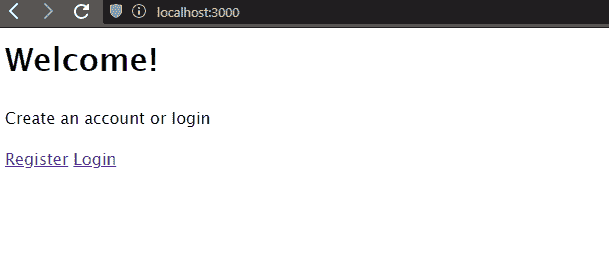

本教程的目标是

# 开始

在键入任何代码之前，首先安装以下模块:

*   `express`用于处理您的路线
*   `express-session`用于建立用户会话
*   `express-ejs-layouts`支持`ejs`在快递中的布局
*   `connect-flash`将用于显示 flash 消息。稍后我们将对此进行详细介绍。
*   `passport`处理用户认证
*   `passport-local`，这是一种带有用户名和密码的策略(认证机制)
*   `mongoose` 用于在数据库中存储用户
*   `bcrypt`用于在将密码存储到数据库之前对其进行加密。出于明显的安全原因，绝对不要以纯文本形式存储密码。
*   `ejs`模块将数据从 Express 发送到`ejs`文件

这是您应该运行的命令:

```
npm i express express-session express-ejs-layouts connect-flash passport passport-local mongoose bcrypt ejs
```

完成后，按照下面列出的初始阶段的进一步步骤。

## index.js 路线

在项目目录中创建一个名为`route`的文件夹。在这里，创建一个名为`index.js`的 JavaScript 文件。最终，`index.js`T32 的位置会在`routes/index.js`。

在`routes/index.js,`中编写以下代码:

*   `line 4`:当用户导航到`root` 目录(执行`GET` 请求)时，呈现`welcome.ejs`页面。
*   `line 8`:当用户对`register`页面做`GET`请求时，渲染`register.ejs`页面。
*   `line 12`:导出路由器实例，以便在其他文件中使用。

## users.js 路线

转到您的`routes`文件夹，创建一个名为`users.js`的文件，这样`users.js`的位置就是`routes/users.js`。

在`routes/users.js`中，

*   `Lines 5 to 9`:处理各自的`GET` 请求并呈现适当的页面
*   `Lines 12 to 14`:处理各自的`POST` 请求。它们将在本教程的后面部分进行填充。

## app.js

这将是您的主文件。在您的根目录中，创建一个名为`app.js`的文件。在这里，编写以下代码:

*   `line 11`:告诉 Express 您将使用`ejs`作为您的模板引擎

现在您已经定义了您的路线，让我们创建将呈现到屏幕上的`ejs`文件。

在您的根目录中创建一个`views`文件夹，并编写以下文件。这些是标准的静态文件。你可以在 [EJS 文档网站](https://ejs.co)中找到代码的解释。

## 布局. ejs

在`views/layout.ejs`中:

```
<html>
<head>
<title>Node.Js and Passport App</title>
</head>
<body>
<%- body %>
</body>
</html>
```

## 注册. ejs

## 欢迎. ejs

```
<html>
<h1>Welcome!</h1>
<p>Create an account or login</p>
<a href="/users/register">Register</a>
<a href="/users/login"> Login</a>
</html>
```

## login.ejs

注意:您已经为表单中的元素使用了`name`属性，因为您将通过按名称识别每个元素来提取表单中的值。

要运行这段代码，请转到命令行来运行`app.js`文件。

```
node app
```

转到`localhost:3000`，您会发现您的输出与此相同:

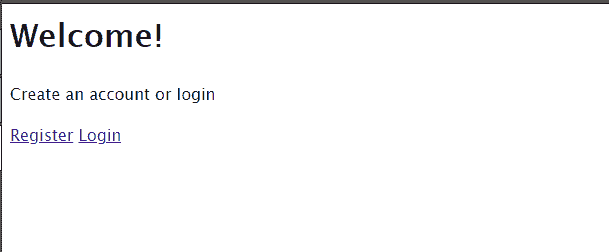

显示每条相应路线的代码输出

你终于完成了你的开始阶段。现在是时候使用[mongose](https://mongoosejs.com/docs/)来保存数据库中的用户了。

# 将用户保存到数据库

## 用户模式和模型

通常，在创建文档并将其保存到数据库之前，必须定义一个模式。首先，创建`models`目录，在那里创建一个名为`user.js`的文件，这样它就是`models/user.js`。首先，让我们在`user.js`中创建一个模式。接下来，我们将从该模式中创建一个模型。

在`models/user.js`中:

这意味着您的模型将有一个名称、一个电子邮件、相关的密码和创建日期。

在`line 20`上，我们将在您的`User`模型中使用该模式。您的所有用户都将拥有这种格式的数据。

## 处理对注册目录的 POST 请求:验证检查

在这一步中，您将使用客户机提供的数据在 MongoDB 数据库中创建一个文档。

在`routes/users.js`文件的开头，导入 Mongoose 库，并导入刚刚创建的`User`模型。

```
const User = require("../models/user.js")
```

现在，在`routes/users.js`文件中，找到下面这段代码:

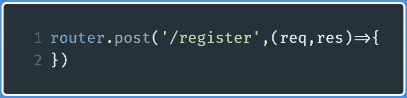

处理注册发布请求

在此句柄中，编写以下代码:

*   `Line 1`:从表单的元素中提取值。你拿出邮件，用户名，密码。最后一个字段(`password2`)是一个验证检查，确保用户已经确认他们输入的密码是正确的。
*   `Lines 4-6`:如果有任何字段未填写，则向`error`数组添加适当的信息。
*   `Lines 8–10`:如果密码不匹配，将适当的消息添加到`error`数组。
*   `Lines 13–15`:检查密码是否至少有六个字符。
*   `Lines 16–23`:如果`error`数组中存在任何内容，重新呈现`register.ejs`页面，然后将适当的数据与`errors`数组一起发送。该数组的所有内容都将显示在页面上。
*   `Lines 24–36`:您已经成功通过验证！现在，您将首先通过电子邮件发现数据库中是否已经存在一个用户。如果有，那么您将重新呈现`register.ejs`页面并显示相关错误。否则，使用提供的电子邮件、名称及其相关密码创建一个新用户。记住你还没有保存它。您将在加密密码后保存它。

例如，让我们运行代码并输入一个单字符密码，以便重新呈现页面:

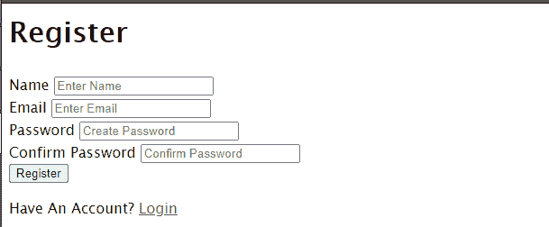

故意输入错误选项后输出的代码

你现在需要显示错误，也就是显示`errors`数组的内容。

## 显示错误

现在转到`views/register.ejs`并找到下面这段代码(这将在文件的开头附近):

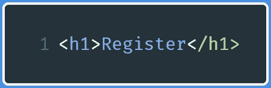

要在 views/register.ejs 中查找的代码

当你找到它时，在这个`h1`标签下写下下面一行:

```
<%- include ('./partials/messages') %>
```

这一行意味着导入一个新文件，这将有助于显示消息。

转到您的`views`目录，创建一个名为`partials`的新目录，并在`partials`中创建一个名为`messages.ejs`的文件。在那里，编写下面的代码。

`views/partials/messages.ejs`

```
<% if(typeof errors!= 'undefined') { %>
<%    errors.forEach(function(error){ %>
<p> <%= error.msg %></p>
<%    })        %>
<% } %>
```

这段代码告诉我们，如果存在任何错误，那么用它自己的 paragraph( `p`)元素显示数组的内容。

重新运行代码并编写一个单字符密码。这将是输出:

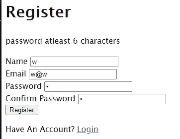

请注意，您现在已经显示了错误消息

如果您将任何字段留空，您将收到以下错误消息:

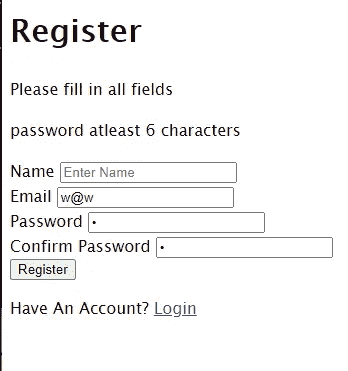

此表单中显示两条错误消息

使两个密码字段包含不同的值:

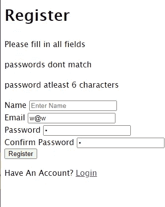

该表单中显示了三条错误消息

## 处理对注册的 POST 请求:将用户保存到数据库

在这一步中，您将把注册用户保存到 MongoDB 数据库中。您将首先加密他们的密码，然后将它们保存到数据库中。

在`routes/users.js`中，找到下面这段代码:

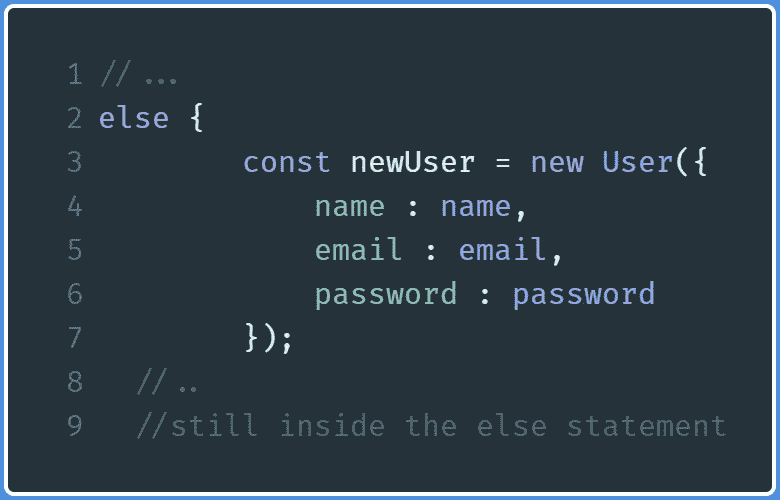

routes/users.js 中的代码

在这个`else`块中，编写以下代码:

注意，在这里结束`else`语句。

*   `Lines 2–7`:生成一个 salt，散列用户的密码。将这个加密值分配给用户的密码，然后将客户端保存到数据库。
*   `Line 10` :当文档保存无误后，将用户重定向到`login`目录，用户现在将使用其凭证登录。

这将是您将自己注册为用户时的代码输出:

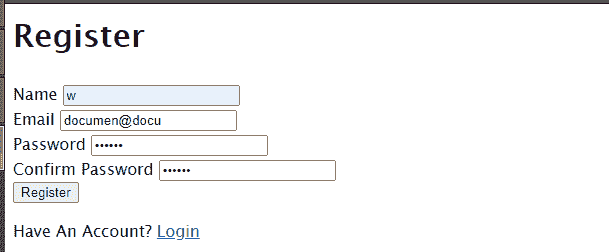

代码输出

因为您已经在控制台中注销了文档的内容，所以控制台中的输出如下:

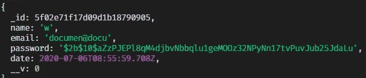

新用户文档的内容

输入注册的电子邮件。不出所料，您会收到一条错误消息，告诉您电子邮件已经被存储:

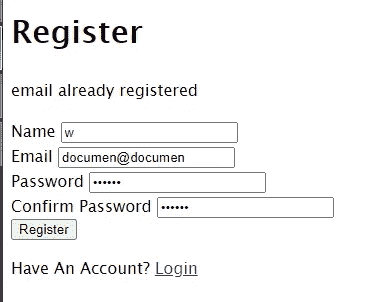

代码输出显示您有一个错误

通过这一步，您最终将用户保存到了数据库中。让我们继续使用 Express 创建即时消息。

在本节的最后，您的代码看起来是这样的:

# 使用 Express 发送即时消息

当您在网站上注册帐户时，请注意它会将您重定向到登录页面，并显示一条成功信息，表明您已成功登录。该成功消息被称为*快速消息*。
在这一部分，我们将创建一条简讯。

在继续之前，首先在`app.js`中导入以下两个库。

```
const session = require('express-session');
const flash = require('connect-flash');
```

## 成功快讯

当用户注册并被重定向到登录页面时，您将显示此消息。

转到项目目录中的`app.js`,找到下面几行代码:

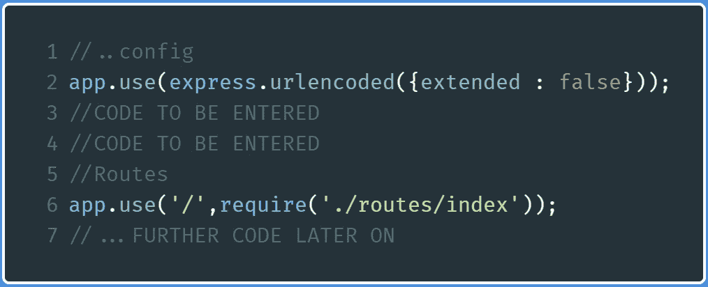

app.js 中的代码

在编写`CODE TO BE ENTERED`的地方，编写下面的代码:

这段代码现在基本上允许你在应用程序中使用 flash 消息。

现在转到`routes/users.js`，找到下面几行代码:

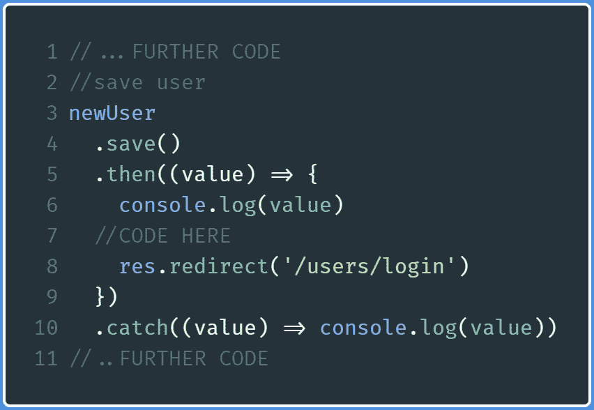

routes/users.js

在写`CODE HERE`( `line 7`)的地方写下下面一行代码:

```
req.flash('success_msg','You have now registered!')
```

但是，你还没有完成。去`views/login.ejs`找到这段代码。它位于文件的开头。

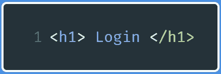

views/login.ejs 中的代码

就在这一行之后，键入这一行:

```
<%- include ('./partials/messages') %>
```

现在，您已经导入了您的`messages`文件，以便在您的`login`目录中显示消息。

转到`views/partials/messages.ejs`并在末尾添加这些行:

```
<% if(success_msg!= '') { %>
<p><%=success_msg %> </p>
<% } %>
```

这是代码的输出:

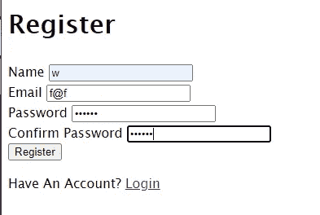

步骤 1:注册用户

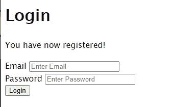

你现在有一个 flash 消息显示！

## 错误提示信息

现在，您还将实现一个错误提示消息。当发生错误时，它将在用户验证期间显示。

转到`views/partials/messages.ejs`，然后在文件末尾添加以下代码:

```
<% if(error_msg != '') { %>
  <%= error_msg %> 
<% } %> 
<% if(error != '') { %>
  <%= error %>
<% } %>
```

现在让我们通过引入 Passport.js 框架来继续进行用户认证

# 使用 Passport 进行用户验证

## 本地策略

创建一个文件`/config/passport.js`，然后从导入以下库开始:

```
const LocalStrategy = require('passport-local').Strategy;
const bcrypt = require('bcrypt');
const User = require("../models/user");
```

您现在正在导入带有其`Strategy`实例的`passport-local`,用于一个带有简单用户名和密码的用户认证机制。因为这次您将比较密码，所以您需要解密数据库返回的密码。因为这个原因，你也会把`bcrypt`带进来。此外，因为您实际上是在比较从数据库返回的密码，所以您将为数据库相关的操作导入`User`模型。

接下来，键入以下代码:

*   `Line 2`:配置`passport`实例，使其使用`LocalStrategy`策略。您必须指定`usernameField`选项，因为该选项将用于识别将与数据库进行比较的电子邮件地址。您已通过该选项确认您将在表单中使用`email input type`元素。您也可以指定`passwordField`选项。不过默认是`password`，这里不需要指定。
*   `Lines 5–24`:首先，查找数据库中是否存在给定的电子邮件地址。如果不是，它将抛出一个错误，说明该电子邮件未被识别。稍后，您将比较用户输入的密码是否与数据库中的密码匹配。如果是，它将返回相关的用户信息。
*   `Lines 25–34`:为了支持登录会话， `passport`将在`user`实例上使用`serialize`和`deserialize`方法来访问会话。

## 处理登录目录的 POST 请求

您现在需要告诉 Passport 您希望在哪里使用用户身份验证。您将在`login`页面上使用该认证机制。

转到`/routes/users.js`并找到以下代码:

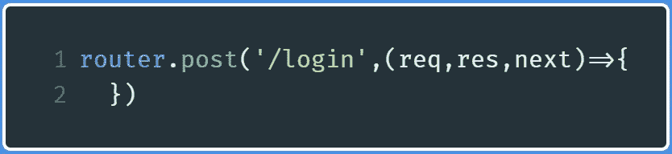

routes/users.js

在这个 POST 处理程序中，编写下面几行代码:

```
passport.authenticate('local',{
successRedirect : '/dashboard',
failureRedirect : '/users/login',
failureFlash : true,
})(req,res,next);
```

这意味着:

*   如果用户成功登录，他们将被重定向到`dashboard`目录(`successRedirect`)。
*   如果用户没有成功登录，将他们重定向到`login`目录(`failureRedirect`)。
*   出现错误时，获取紧急信息(`failureFlash`)。

现在转到`app.js`，开始导入`passport`库:

```
const passport = require('passport');
```

然后将这个配置指定为您之前创建的`LocalStrategy`配置。导入后立即执行此步骤:

```
require("./config/passport")(passport)
```

现在，找到下面几行代码:

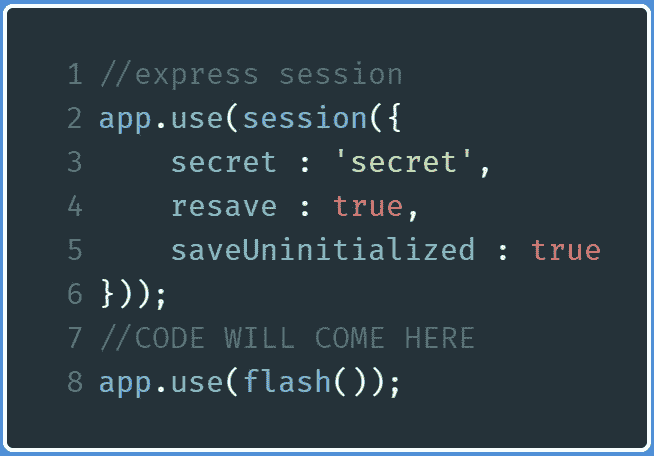

要在 app.js 中查找的行

在注释`CODE TO COME HERE` ( `line 7`)处编写以下代码:

```
app.use(passport.initialize());
app.use(passport.session());
```

现在，您可以在应用中使用用户身份验证功能。然而，你还没有完成。您仍然需要处理到`dashboard`目录的重定向。

转到`/routes/index.js`并输入以下代码:

```
router.get('/dashboard',(req,res)=>{
res.render('dashboard');
})
```

现在运行代码并转到`localhost:3000/users/login`。这将是输出:

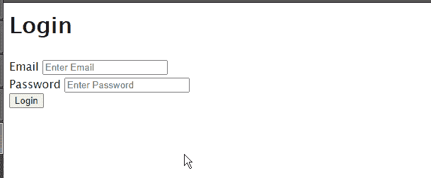

代码的输出

请注意，您终于可以登录了。这表示用户验证成功。

输入错误的密码会出现以下情况:

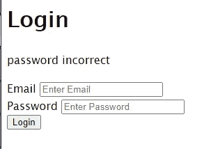

输入错误密码的结果

您可以尝试输入一个未注册的电子邮件来接收相应的错误信息。

现在让我们继续显示用户数据。

# 呈现仪表板以显示用户数据

你快完成了！

转到`/routes/index.js`并找到以下代码:

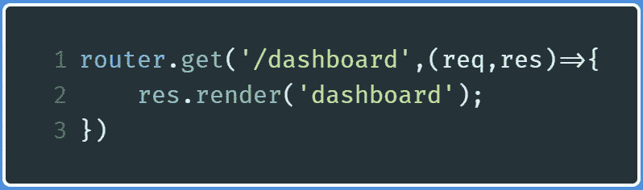

要在 index.js 中查找的代码

按照以下步骤更换`res.render`方法:

```
res.render('dashboard',{
user: req.user
});
```

现在，您已经将用户信息数据发送到了网页。这个用户信息数据由 Passport 返回。

然后转到`/views/dashboard.ejs`，修改欢迎消息，如下所示:

```
<p> Welcome <%= user.name %></p>
```

您正在显示来自登录用户的`user`数据的`name`字段。

如果您使用正确的凭据登录，则输出如下:

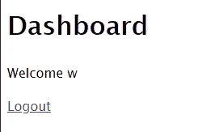

成功的代码输出

# 处理注销请求

这是你的最后一步，也是最容易的一步。

转到`/routes/users.js`并找到以下代码:

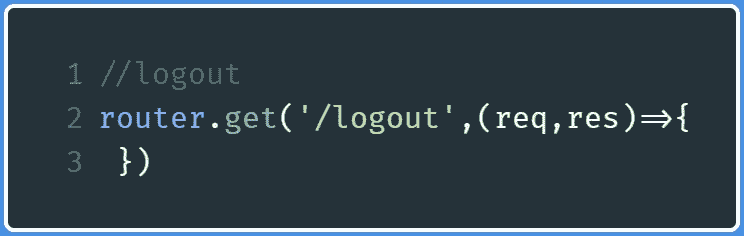

要在 routes/users.js 中查找的代码

在此处理程序中，编写以下代码:

```
req.logout();
req.flash('success_msg','Now logged out');
res.redirect('/users/login');
```

`req.logout`功能由 Passport 创建。顾名思义，它注销用户会话。稍后，您发送一条成功的 flash 消息，然后将用户重定向到`login`页面。

这将是代码的输出:

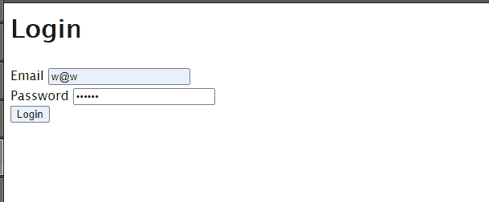

代码的输出

然而，如果你现在转到`localhost:3000/dashboard`，你会看到一个服务器错误。现在让我们来处理这个。

## 注销时禁止访问仪表板

转到`config`并创建一个名为`auth.js`的文件。

在`/config/auth.js` 中增加:

```
module.exports = {
ensureAuthenticated : function(req,res,next) {
if(req.isAuthenticated()) {
return next();
}
req.flash('error_msg' , 'please login to view this resource');
res.redirect('/users/login');
}
}
```

这将创建一个名为`ensureAuthenticated`的函数，它将确保用户已经登录(`req.isAuthenticated()`)。如果是这样，它就转移到下一个中间件。如果没有，它会抛出一个错误，并再次将用户重定向到`login`页面。

现在，转到`/routes/index.js`并导入该功能:

```
const {ensureAuthenticated} = require("../config/auth.js")
```

找到以下代码:

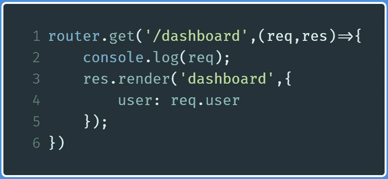

要在 index.js 中查找的代码

现在把`router.get`功能修改成这样:

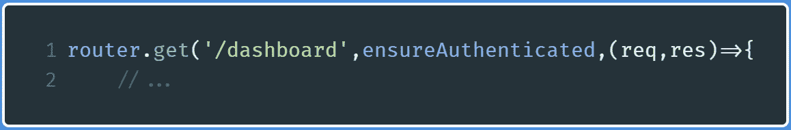

添加安全认证中间件

现在，您已经表示希望在这个目录中使用这个函数作为中间件。

该代码将输出以下内容。点击注销:

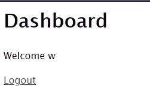

仪表板的屏幕截图

然后转到`localhost:3000/dashboard`

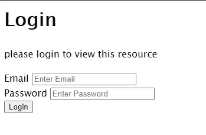

注销后转到仪表板

# 链接

*   [Github 回购](https://github.com/HussainArif12/UserAuthentication-In-JavaScript)

Passport 文档包含了您需要知道的关于用户身份验证的所有内容，但是它是无序的，这就是为什么我觉得它有点混乱。然而，这里是学习 Passport 所需的最佳资源。

*   [通过旅行媒体进行 Passport 验证的节点](https://www.youtube.com/watch?v=6FOq4cUdH8k)
*   [Passport 登录系统教程](https://www.youtube.com/watch?v=-RCnNyD0L-s)由 Web Dev 简化
*   [网络忍者 OAuth 登录播放列表](https://www.youtube.com/watch?v=sakQbeRjgwg&list=PL4cUxeGkcC9jdm7QX143aMLAqyM-jTZ2x)

# 结论

这是一个很长的教程！谢谢你能走到这一步。在困惑的情况下，建议你解构代码，研究什么功能做什么——永不放弃！非常感谢你坚持到最后。祝您愉快！

下一篇: [React 的上下文 API 解释](https://medium.com/better-programming/reacts-context-api-explained-baebcee39d2f?source=your_stories_page---------------------------)
上一篇:[用 React 获取你每天的灵感剂量。Js](https://levelup.gitconnected.com/get-your-daily-dose-of-inspiration-with-reactjs-fa529940326d?source=your_stories_page---------------------------)