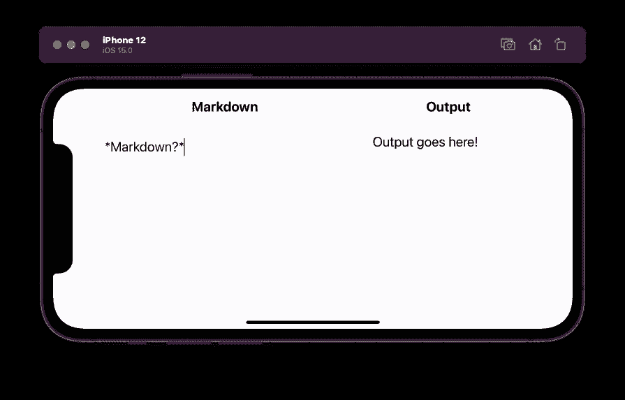
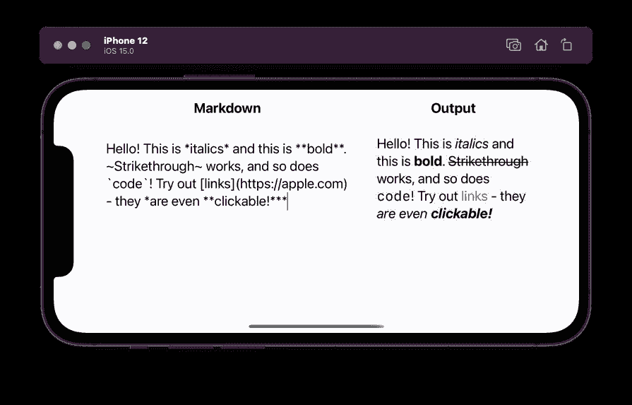

# 在 iOS 15 中用 SwiftUI 构建 Markdown 编辑器

> 原文：<https://betterprogramming.pub/build-a-markdown-editor-with-swiftui-in-ios-15-767a2e9348a9>

## 只需要 43 行代码

Anton Maksimov juvnsky 在 [Unsplash](https://unsplash.com/s/photos/typewriter?utm_source=unsplash&utm_medium=referral&utm_content=creditCopyText) 上拍摄的照片

Markdown 可能是编辑和格式化富文本最简单的方法。它也非常受欢迎，几乎每个人都知道如何使用它。

所以，想在你的应用中实现 Markdown？它曾经是…复杂的。您需要使用第三方 Markdown 解析器，然后在 web 视图中显示结果。如果你想和 SwiftUI 一起使用，那么，祝你和`UIViewRepresentable`一起工作好运。

不过，好消息是:在 WWDC21 上，苹果发布了支持 Markdown 的 SwiftUI 3！这是一个被忽略的特性，但也是最有趣的特性之一。在本文中，我们将用 43 行代码构建一个 Markdown 编辑器。

让我们从一个基本的界面开始:

结果

目前，我们可以在 Markdown 字段中输入，文本存储在`markdownText`中。然而，输出并没有改变。这是意料之中的，因为我们只是在展示`Text(“Output goes here!”)`。

那么我们如何在输出文本字段中呈现`markdownText`？使用新发布的`AttributedString` API 很简单。你可以在这篇[文章](/ios-15-attributed-strings-in-swiftui-markdown-271204bec5c1)中找到更多细节。

我们将使用`AttributedString`的`[init(markdown:options:baseURL:)](https://developer.apple.com/documentation/foundation/attributedstring/3796160-init)`方法从 Markdown 创建一个属性化的字符串。将此添加到`ContentView`的底部:

这个方法接受一个 Markdown 的`String`，然后将其转换为一个`AttributedString`。

现在剩下的就是调用它了！

…我们还有降价编辑。

这里有一个快速降价备忘单:

*   *斜体*
*   **加粗**
*   删除线`~Strikethrough~`
*   代码``Code``
*   链接`[Link](https://apple.com)`

你可以在这里获得完整的应用程序源代码:

 [## aheze/MarkdownTextEditor

### 在 GitHub 上创建一个帐户，为 aheze/MarkdownTextEditor 开发做贡献。

github.com](https://github.com/aheze/MarkdownTextEditor) 

## 结论

很简单，对吧？今天只是 WWDC21 的第三天。还有更多的东西值得期待。

感谢阅读！