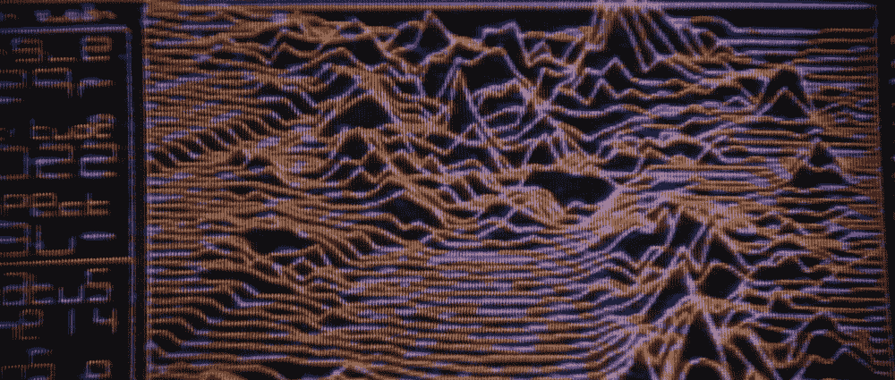
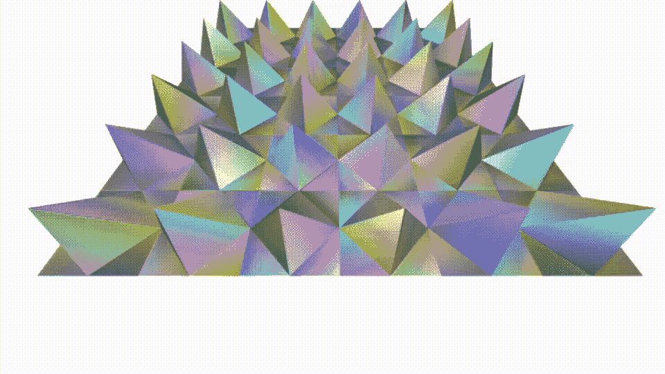
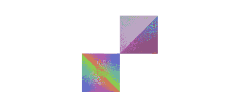
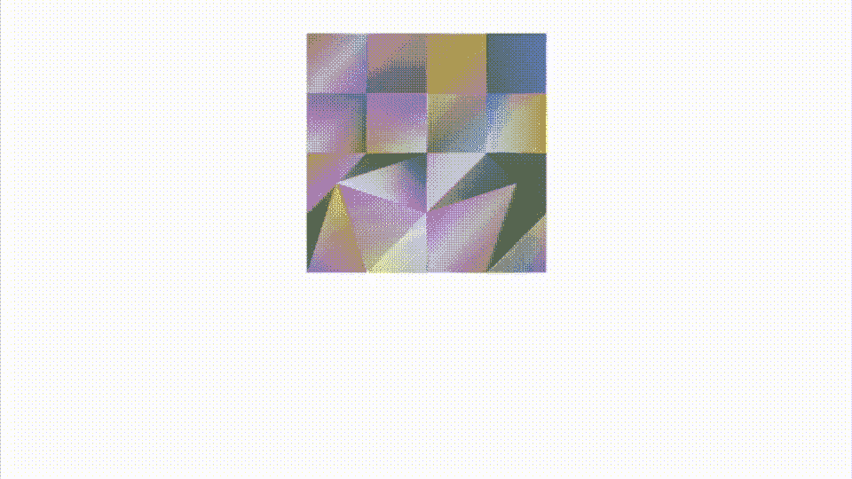
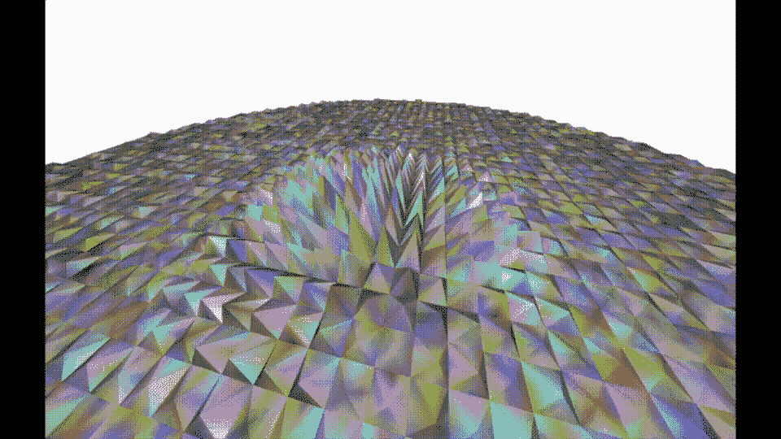
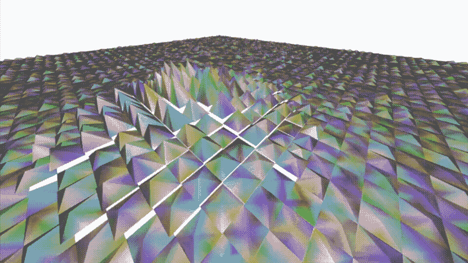
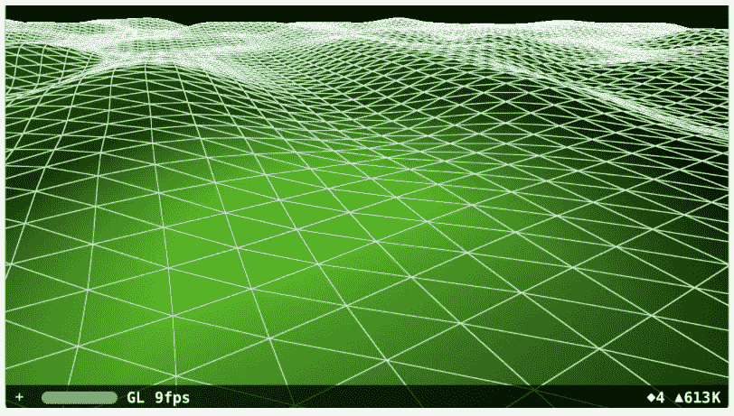

# 在 SwiftUI 下的 SceneKit 中使用自定义几何体构建网格

> 原文：<https://betterprogramming.pub/build-a-mesh-using-custom-geometry-in-scenekit-under-swiftui-44cadaa3727d>

使用外星人系列中的一个精彩场景


一张展示 1979 年外星人电影中 20 世纪 N *ostromo 宇宙飞船的图片*

1979 年的这个月，西格妮·韦弗主演了一部科幻恐怖电影，这部电影创造了一个跨越三十年的电影系列，即*外星人*系列。

在电影中，有一个片段，只有 30 秒，在当时，是尖端的图像。背后的故事被记录在[这里](https://thenostromofiles.com/2016/05/21/equatorial-orbit-nailed/)。里普利(韦弗的角色)看着电脑显示器显示飞船着陆的场景。这张图片将成为本文的灵感来源。

我们的目标集中在尝试使用 SwiftUI 下 SceneKit 中的自定义几何图形来再现景观序列。一个更新的版本，你可以飞来飞去，最好。



外星飞船 N *ostromo 上的电脑显示屏，显示着着陆序列*

请注意，我计划从这篇文章中我离开的地方开始:[自定义几何图形介绍](/custom-geometry-in-scenekit-under-swiftui-35a95520e6d9)，如果您不熟悉构建自定义几何图形，那么您应该阅读这篇文章，因为我将使用其中描述的例程。

我应该提醒你，这篇文章不仅是关于结果，也是关于我的旅程——如果你赶时间，可以跳到“匹配边和顶点”一节。

## 三角形

这是一个动画 GIF，展示了我的第一个原型，其中有一些虚构的山脉覆盖的风景:



具有复杂几何形状的单个节点

它是一个有很多顶点的单个节点。我使用了多种颜色使结构更加明显。在代码中，有两种类型的三角形:一种是前导对角线，另一种是尾随对角线。



让长边或斜边向两个不同方向倾斜的基本原理是为了确保魔山的形状起作用。

一个行不通的解决方案——因为每座山都由八个三角形组成，它们的位置是交替的。一个命令意味着我需要在代码中进行这种可怕的 if/else 舞蹈来获得我需要的结构，除此之外，在我建造之后改变高度看起来就像一场噩梦。

## 多边形

我决定尝试多边形，因为它们肯定更容易管理——尽管我刚画完地图，就意识到我会遇到几乎同样的问题。如果我想改变高度，我仍然有多个顶点要改变。

虽然这个解决方案真正的丧钟在我把它显示在屏幕上时很明显——当我改变不同的角落时，相同的代码会产生不同的结果。仔细看这张 GIF:



由 16 个多边形组成的四个节点

第一个正方形的角来自左下角，第二个中点。尽管两个多边形背后的代码是相同的。与之前由单个节点组成的构建不同，这是四个节点，这是另一个不同之处。代码如下:

## 三角形带

我几乎别无选择。我回头看了看我的笔记，决定尝试一些`triangleStrips`。使用条带，如果我仔细编码，我确信我可以通过改变单个顶点来改变节点的高度。



数百个三角形条纹，数百个节点的几何图形

我终于取得了进步。你看到的是数百个节点并排排列成一个矩阵，中心节点上升形成一座魔山。

这是它背后的代码:

一段相当短的代码，忽略了那可怕的 if/else 树，我确信如果再多考虑一点，我可以做得更好。

## 更多三角形

为了使它不那么尖，我用更高的瓷砖抬高了地板。它看起来更好，但是等等，所有的空白是什么？我在想什么？是的——老实说还是太尖了。我需要试着从不同的角度思考这个问题。



三角形，数百个节点

我又用三角形试了一次。由于代码几乎完全相同，我就不赘述了，尽管我想我在前面的部分错过了这个例程。它会检查我们是否到达了魔山坐标，并改变高度。

## 更多三角形

瓷砖之间的空白对我尖叫，破坏了整个效果。我可以想象一个客户看到这个会问，这些白线是什么？问题在于边缘。我试着拉近距离。它似乎更好，也许是一个岩石景观，一个非常参差不齐的。但是此时，我遇到了另一个问题:性能。


三角形紧密间隔，数百个节点

## 匹配边和顶点

我开始写这篇文章已经有几天了，我开始担心它会加入那些我从未发表过的论文。这些小项目看起来并不困难，但事实证明比我想象的要困难得多。

我回到我的研究中，再次查看了几周前我发现的“[英雄到零](http://www.rogerboesch.com/scenekit-zerotohero-I/)”的作品。有一章是关于构建网格的。我已经试图下载并运行它，但我找不到所有必要的部分。代码本身很难理解。抱歉罗杰。



《英雄到零》教程截图

我回到文章，盯着图像。突然，看着它，我意识到我一直做错了什么。我可以构建一个由`X`和`Y`值索引的字典，返回我制作每个顶点时所需的高度。每次查找发生多次并不重要；我只需要在构建地形之前设置高度，而不是之后。将交叉顶点的高度设置为相同的值。这次我设置了所有顶点高度。

我需要重新调整索引构建，但这是一个很好的练习。最终结果是这样的，非常完美。构建它的代码很简单，没有尖点、空白或性能问题，而且它很灵活，所以我可以轻松地创建我想要的许多山。


作为单个节点添加到场景中的单个非常复杂的几何图形

我很想包含一个更长的 GIF，但是它太大了，无法添加到页面中。下面是实现这一切的代码。在其中，我使用上一节中发布的例程生成了一个高度数组，以确定在哪里建造这座山。然后，我简单地在一个循环中创建所有顶点，并小心地在我的索引中将它们链接在一起。

这是一个复杂的几何体，我用它来创建一个节点，然后将它添加到我的场景中。代码如下:

# 结论

所有这些都让我想到了这篇关于为你的下一个 3D 游戏建立一个网格的文章的结尾。如你所见，这是一个挑战。

感谢阅读。

```
**Want to Connect?**Come back to [me](https://www.linkedin.com/in/mark-lucking-4631049/) on LinkedIn if you have questions.
```