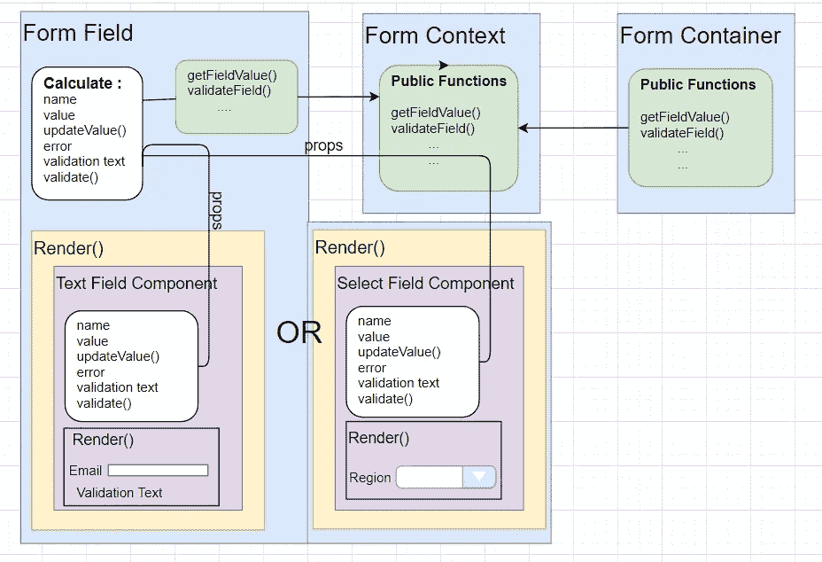

# 在 React 中构建自己的迷你表单框架

> 原文：<https://betterprogramming.pub/build-a-mini-framework-for-forms-in-react-59b462237e48>

## 通过构建自己的框架来简化表单的构建


马库斯·斯皮斯克在 [Unsplash](https://unsplash.com?utm_source=medium&utm_medium=referral) 上的照片

对于我们全栈开发人员来说，表单是最乏味的任务之一。它们有很多，通常会一遍又一遍地重复。

React 没有 Angular 那样的官方表单框架。你可以找到一些好的第三方库，比如 [React Final Form](https://final-form.org/react) 和 [Formik](https://jaredpalmer.com/formik) ，但是有时候，你只需要构建一个简单的表单，或者你可能需要一个独特的功能。

这就是为什么在本文中，我们将实现一个可以在项目中使用的迷你表单框架。

首先，让我们设定目标。该框架应该是:

*   [DRY](https://en.wikipedia.org/wiki/Don%27t_repeat_yourself) —封装表单代码所有重复部分的代码。
*   简单——它应该易于使用。
*   灵活——它应该一般地让我们能够在表单中呈现我们需要的任何类型的组件。

所以，这些是我们的目标，但是它应该做什么呢？

*   它应该管理我们的领域和价值。
*   它应该知道一个字段是否有效以及如何验证它。
*   它应该知道某个字段是否被触摸过。
*   它应该处理提交过程。

在这个实现中，我们将使用一种叫做“[渲染道具](https://reactjs.org/docs/render-props.html)的技术。如果你还不知道也不要担心，看完这篇文章就都清楚了。

我们的主要构件将是:

*   表单上下文
*   表单容器
*   表单字段

在文章的最后，也是在这个网站上[，你可以找到一个使用我们在本文中构建的框架的实时表单示例。](https://codesandbox.io/s/react-mini-forms-framework-blog-y1lbt)

我鼓励你在阅读这篇文章的同时探索它，它会让你更好地理解框架的所有不同部分是如何协同工作的。

让我们开始构建我们的框架吧！

# 表单上下文

“形式[背景](https://reactjs.org/docs/context.html)”将是把我们所有的形式成分粘在一起的胶水。

核心表单功能将保存在上下文中，并且可由“表单容器”和“表单字段”组件访问。

## 表单上下文. js

表单上下文. js

在`FormContext.js`文件中，我们声明了我们的上下文，因此它可以被其他文件访问(在我们的例子中是`FormContainer.js`和`FormField.js`)。

在表单容器组件中，我们将用表单的核心功能填充它，在表单字段组件中，我们将使用它。

# 表单容器组件

容器组件管理表单字段的值及其验证状态。

我们的容器将包含这些状态条目:

```
{
    "formValues": {},
    "validationState": {},
    "touchState": {},
    "submitOccurred": false
}
```

*   `formValues` —包含所有表单值的对象。当窗体挂载时，这个对象将是空的。只有当字段值*改变*时，新的字段条目才会添加到该对象。
*   `validationState` —包含表单中每个字段的验证状态的对象。这个对象中的每个条目代表一个特定的字段，并且有三个属性(我们将在验证策略一节中深入讨论它们)。
*   `touchState` —一个哈希表，包含表单中每个字段的触摸状态(脏不脏)。
*   `submitOccurred` —指示提交事件是否发生的布尔值。

状态将是*私有的* ，并且只能由容器组件访问。

容器组件将通过`[context.provider](https://reactjs.org/docs/context.html#contextprovider)`(公共方法)用表单的核心功能填充上下文:

*   获取/设置字段值。
*   获取/设置字段验证状态。
*   获取/设置字段触摸状态。
*   提交时功能。

这将是我们的表单容器组件的框架:

## 表单容器. js

表单容器

正如我们所讨论的，表单容器将保存一个私有状态，并通过上下文公开操作功能。我们的表单域将使用这个上下文与表单状态进行通信。

在上面的 render 函数中，您可以看到我们是如何呈现表单组件的。让我们仔细看看渲染函数。

## 呈现表单

首先，我们用[上下文提供者](https://reactjs.org/docs/context.html#contextprovider)包装表单。提供程序中的每个表单域组件都可以访问上下文。

其次，我们呈现表单本身:

我们的表单容器组件将接受渲染道具作为子组件。render prop 是一个匿名函数，它接受值和`submitOccurred`作为参数，并返回 JSX。

*   `values` —表格值。我们可以使用这个属性来获取表单字段的所有当前值。
*   `submitOccurred` —指示提交事件是否发生的布尔属性。这用于仅在提交后显示验证消息。

这是使用我们框架的“联系我们”表单的外观:

联系方式

“表单容器”组件也将接受 onSubmit 回调作为道具。我们的框架将在提交过程中触发 onSubmit 回调。

在我们的表单容器组件中，我们将有许多表单域组件。

# 表单域组件

我们系统中的每个表单都有不同类型的输入。它可以是一个简单的文本框，选择框，日期选择器，自动完成等…

这些输入可以以不同的方式实现(材料、引导、简单的 Html 等)，我们需要一种方法将它们连接到我们的表单框架。我们不想让他们直接访问我们的表单上下文和状态。这就是我们的“表单域”组件派上用场的地方(“表单域”组件将访问上下文，并只向输入公开某些功能)。

“表单域”组件将充当表单容器和表单输入之间的中介。

**我们表单中的每个输入都需要知道:**

*   价值——他目前的价值。
*   错误-指示输入中是否存在验证错误的布尔值。例如，只接受数字并将文本作为值的输入需要知道它有一个验证错误。
*   验证文本—如果出现验证错误，输入需要知道要显示的验证文本。

**我们表单中的每个输入都需要更新我们的表单框架:**

*   名称—表单中字段的名称。
*   值-新输入的值。例如，输入到文本框中的新文本。
*   验证器-输入的验证器。例如，此输入只接受数字或电子邮件。
*   Validate —验证函数存在于容器之外。每个输入都需要决定何时调用验证函数。例如，我们希望在 onBlur 事件中验证一个文本框值。当文本框模糊时，我们将调用框架验证函数。

“表单域”组件会处理这个问题。这是一个通用组件，它将不同的输入组件连接到我们的框架。和表单容器组件一样，它也会使用渲染道具来渲染不同的组件。



`FormField.js:`

简单文本字段

这是一个简单的文本字段的例子，我们的表单域组件将呈现。使用 render props，表单域可以呈现任何类型的组件。你也可以为你的组件使用像 material 或者 bootstrap 这样的库。

```
<FormField
   label="Last Name:"
   placeholder="Last Name"
   name="LastName"
   Component={SimpeTextField}
   validators={[this.requireValidator]}
   className="formTextField"
/>
```

在我们实现一个样本表单之前，我想谈一谈我们的验证策略。

# 验证策略

> 在我们的“表单容器”组件的状态(我们的主表单的状态)中，我们有一个 validationState 对象。这个对象是我们验证状态的唯一真实来源。

让我们再来看看“表单容器”组件的状态:

```
formFields:{
    FirstName:"Roi"
    Id:"02132154"
}
validationState: {
    Id: {
        valid: false,
        validationText: "this field is mandatory",
        validators: [required, onlyNumbers]
    }
}
touchedState: {
    Id: true
}
```

validationState 对象是一个哈希表，我们可以立即访问每个字段的验证状态和触摸状态。**如果一个字段没有任何验证器，那么它就不会出现在哈希表**中(默认情况下它是有效的)。该对象总是最新的。

当一个字段第一次挂载时，我们计算它的验证状态并更新 validationState 对象:每次字段中的值改变时,“表单字段”组件需要调用 validateField 函数(从上下文中),这个函数更新 validation state 对象。

这是我们的“表单容器”组件中的 validateField 函数实现:

validateField 函数:

*   接受一组验证器(验证规则)。
*   运行所有验证器。
*   计算字段验证状态和验证文本消息。
*   用“valid”和“validationText”新值更新 validationState 对象中的当前字段条目。

## 什么是验证器？

验证器是一个接受值并返回具有两个属性的对象的函数:

*   valid-指示字段是否有效的布尔值。
*   validationText —要在表单中显示的验证错误消息。

例如，该验证器检查值是否为数字:

## 提交事件

最后，在 onSubmit 事件(在 FormContainer.js 中)中，我们减少 validationState 对象(检查我们的所有字段是否都有效)，调用 onSubmit 回调并更新表单的验证和提交状态:

# 实施联系我们表单

最后，我们可以使用全新的迷你表单框架，构建一个简单的联系我们表单:

# 后续步骤

现在你有了自己的表单框架，你可以用你需要的任何功能来增强它，比如:

*   支持字段数组
*   支持动态验证器
*   添加将在字段更改时触发的回调