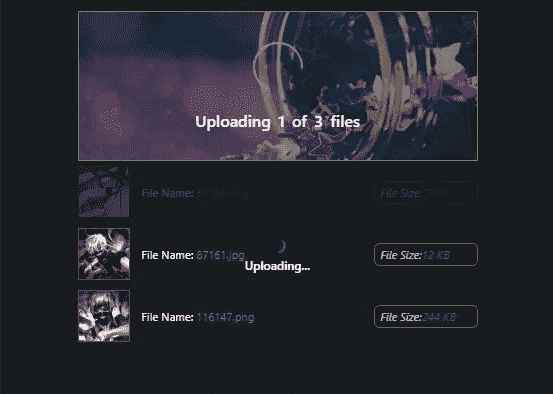
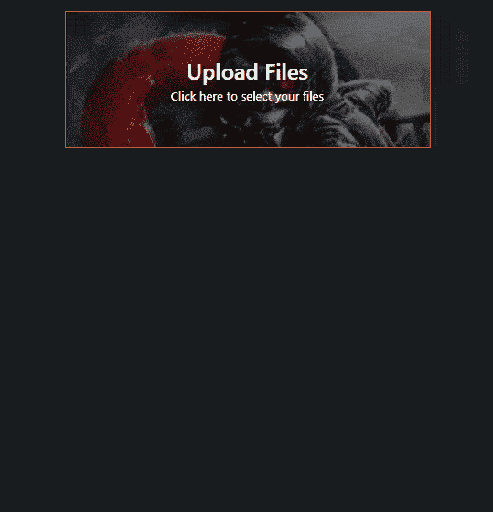
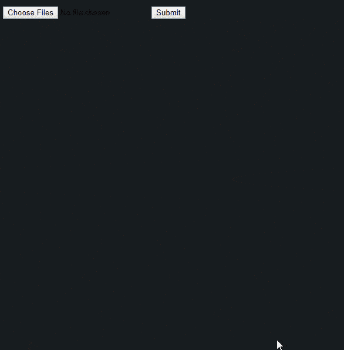
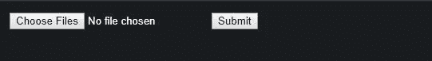
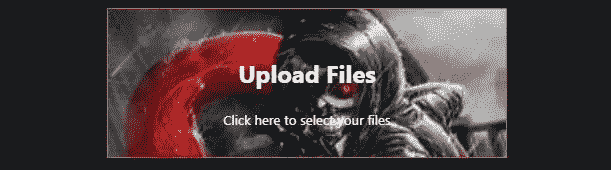
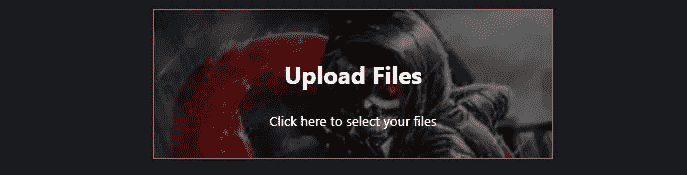

# 在 React 中用普通 CSS 构建一个现代化的、定制的文件上传用户界面

> 原文：<https://betterprogramming.pub/build-a-modern-customized-file-uploading-user-interface-in-react-with-plain-css-8a78bc92963a>

## 现在是让 React 做大事的时候了



围绕文件输入组件构建用户界面是一项非常方便的学习技能，因为你可以从 90 年代的外观转向更现代的外观，以补充依赖于它的网页——特别是当我们不能像普通 HTML 元素一样设计它的时候。当用户使用你的技术时，他们不仅仅是*在使用它——他们很可能也在评判你的应用和技术。*

事情是这样的:我们可以很容易地向他们显示一个文件输入，让他们使用默认的 HTML 元素选择文件，让他们提交文件，然后收工。但是*在*之间发生了什么？当事情发生时，用户喜欢看到什么？一个什么都不告诉他们的界面，还是一个告诉他们*一切*的界面？

用户的互联网断了怎么办？如果服务器没有任何响应怎么办？如果 14 个文件中的第 8 个对他们来说很大呢？如果用户等待上传过程完成 10 分钟，并想看看已经完成了多少，该怎么办？或者哪些文件已经上传了？

在之前的教程中(如果你搜索我的帖子就能找到)，我介绍了构建这个 API 的逻辑*和*。那篇文章的目的是教授逻辑。您可以就此打住，围绕它构建自己的定制用户界面。或者您可以自己构建逻辑部分，并阅读这篇文章，了解如何为任何文件上传组件实现 UX。创建这些帖子有两个不同的原因，但完全兼容。我将在这篇文章中提供逻辑，这样我们就可以专注于用户界面。决定权在你！

当我编写用户界面时，它变得越来越长，我在考虑是否应该减少组件的数量，展示一个基本的 UX 版本。然而，由于现在很多文章都没有深入到一个主题，所以我想借此机会更深入地研究一下实现，并找点乐子。

我本来想用我最喜欢的 CSS 库 *styled-components* 来制作这个教程，但是，为了演示如何在没有额外工具的情况下构建一个复杂的用户界面，我决定不这么做。这些工具只是一种便利。你只需要学习一点点 *CSS* ，*而不是*工具。

最后但同样重要的是，这是我们将在这篇文章中构建的预览:



事不宜迟，我们开始吧！

在本教程中，我们将使用 [create-react-app](https://github.com/facebook/create-react-app) 快速生成一个 React 项目。

继续使用下面的命令创建一个项目。对于本教程，我将调用我们的项目 *upload-app:*

```
npx create-react-app upload-app
```

完成后，进入它的目录:

```
cd upload-app
```

我承诺只提供文件上传实现的逻辑，所以我们可以立即开始构建用户界面。所以这里有一个我们将要使用的定制钩子，叫做`useApp.js`:

> *src/useApp.js*

## 说明

这里有一个这里发生的事情的快速总结。

当用户选择文件时，调用`onChange`处理程序。`e`参数包含我们想要的文件，可以通过`e.target.files`访问。这些将是在界面中一个接一个呈现的文件。然而，这个`files`对象不是一个数组——它实际上是一个`[FileList](https://developer.mozilla.org/en-US/docs/Web/API/FileList)`。这是一个问题，因为我们不能简单地映射它，否则会出错。所以我们将它转换为一个数组，并将其附加到 state.files，允许 UI 在 UI 中逐行呈现它们。当用户提交表单时，会调用`onSubmit`处理程序。它分派一个动作，该动作向一个或多个`useEffects`发送信号，表示该开始了。有几个`useEffects`，每个都被分配了不同的任务和条件。一个用于*开始流程*，一个用于*继续流程*，一个用于*结束流程*。

我们接下来要做的是打开`App.js`文件，用以下代码替换默认代码:

这是我们的起始 CSS 文件:`src/styles.css`

如果您运行该应用程序，它将如下所示:



这是非常基本的。真的没有关于这些图片的信息，用户界面看起来像 90 年代的网页。

当您单击“提交”时，您可以签入控制台消息，以确保它们被逐一处理:


一旦完成，你可以继续应用程序的流程，比如将用户重定向到成功页面，或者以模态显示狗的图片。

问题是用户不知道发生了什么——他们可能等了 10 分钟，页面仍然保持不变。

所以我们要稍微改变一下。我们希望我们的用户从实例化的时刻到上传过程的结束，对*正在发生的一切都是最新的。*

*让我们自定义* *文件输入*这样看起来更好。我们希望我们的用户认为我们是独一无二的和最好的，所以我们必须超越！

目前，我们的文件输入如下所示:



现在，我们不希望用户点击退出按钮后再也不回来，所以我们必须进一步设计。有几种方法可以自定义文件输入。

我们接下来要制作的这个文件输入组件实际上并不是真正的输入元素，但是它会通过允许用户点击它时打开文件浏览器来伪装成输入元素。

创建一个名为`FileUploader.js`的文件，并将以下代码放入其中:

`real` 文件输入的是这里的`root div element`的孩子。`triggerInput`是一个功能，允许我们接入附加到`file input`元素的`inputRef` ref。我们很快就会看到这一点。

现在，如果我们呈现这个组件并传入一个`children`，那么`hiddenInputStyle`将被应用到实际的文件输入中，这样它将强制显示我们的定制组件，而不是 UI。*这就是我们如何覆盖界面*中的默认文件输入。

在我们的钩子内部，我们定义了*触发输入*处理程序

```
const triggerInput = (e) => {
  e.persist()
  inputRef.current.click()
}
```

最后返回它，这样调用者就可以访问它:`src/useApp.js`

```
return {
  ...state,
  onSubmit,
  onChange,
  triggerInput,
}
```

太好了！现在我们要制作一个组件，它将把自己伪装成真正的文件输入。它可以是任何东西，但对于本教程来说，它将是用户的一个迷你“*屏幕*”——引导他们上传文件，并通过使用图形和文本更新将它们带到下一个屏幕。由于我们是在`FileUploader`的渲染方法中渲染`children`，我们可以将这个屏幕渲染为 `FileUploader`的*子屏幕。我们希望整个屏幕能够在我们需要的时候打开文件浏览器。*

该*屏幕*将显示带背景的文本。我将通过在`src`目录中创建一个名为`images`的文件夹来使用一个图像作为背景。我将把整个教程中使用的图像放在这里，这样我们就可以从中导入图像。

制作另一个名为`FileUploaderScreen.js`的文件:

以下是我为组件使用的样式:

因为我们被允许将导入的图像作为字符串传递给 *backgroundImage* style 属性，所以我将它用作背景图像的值。

我们提到过，我们希望这个屏幕在单击时打开一个文件浏览器，所以我们必须在 FileUploader 中渲染这个。

现在让我们把这个*文件上传器*和*文件上传器屏幕*放到我们的`App.js`文件中:

> *src/App.js*

现在，当您点击*文件上传屏幕*时，您应该能够选择文件:


让我们在用户选择文件时将背景图像切换到不同的图像。

我们如何做到这一点？

这就是我们必须使用之前在自定义钩子中定义的状态属性的地方:

```
const initialState = {
  files: [],
  pending: [],
  next: null,
  uploading: false,
  uploaded: {},
  status: IDLE,
}
```

如果你回头看看我们的 useEffects 和 reducer，你会发现我们是根据正在发生的事情来进行 useEffects 调度操作的:

> *src/useApp.js*

> *src/useApp.js*

此外，如果您回头看一下 *onChange* 处理程序，您会看到这些动作类型中的一个被分派:

因为我们知道调度*‘load’*会将*状态.状态*更新为*‘LOADED’*，所以每当*状态.状态*更新为*加载*时，我们可以在*文件上传器屏幕*中使用它来改变图像。

所以我们要做的是使用一个 switch case 根据 *state.status* 的值将 *src* 分配给 *backgroundImage* style 属性:

我们还可以定义一些其他图像，用于其他状态:

用户每做一件事，图像都会不一样。这样我们就不会让用户感到厌烦，所以他们总是很忙。尽你所能让他们留在你的网站上，而不是弹开。当然保持 G 级就行了:)。

无论如何，如果你现在试图选择文件，屏幕将不会更新。这是因为我们需要将*状态* prop 传递给 *FileUploaderScreen* :

> *src/App.js*


我不知道你怎么想，但我真的认为接下来需要解决那些丑陋、不成比例的缩略图。这已经不是 90 年代了，我们有反击！

所以我们要做的是缩小它们以适合*文件行*组件(行列表)。在每一行中，缩略图的宽度尺寸为 50px，高度尺寸为 50px。这将确保我们在右边有足够的空间，以干净和专业的方式向用户显示文件名和文件大小。

创建一个名为`FileRow.js`的新文件，并将其添加到:

我使用的样式:

事情是这样的:

1.  我们定义了一个 *FileRow* 组件，它将接收必要的道具来呈现其子组件。*文件*、 *src* 、 *id* 和*索引*来自于我们的`useApp`自定义钩子内 *onChange* 处理程序设置的 state.files 数组。
2.  *I Uploading*在这里的目的是在上传文件时呈现一个“上传…”文本和一个加载微调器。
3.  *isUploaded* 的目的是当行的文件对象处于*状态时，对行进行着色。uploaded* —通过 id 映射。(如果你想知道的话，这就是我们上传*州信息*的原因)
4.  由于我们不希望每次更新状态时都呈现每一行，所以我们必须用一个 [*React.memo*](https://reactjs.org/docs/react-api.html#reactmemo) 来包装它，以便记忆这些属性，这样它们只有在*索引*、*正在加载*或*正在加载*发生变化时才会更新。当这些文件正在上传时，这些道具将*永远不会*改变，除非发生了重要的事情，所以应用这些条件是安全的。
5.  getReadableSizeFromBytes 被提供，以便我们呈现人类可读的文件大小。否则，用户将会读到类似于 *83271328* 的数字。
6.  *旋转器*为装载旋转器。

出于本教程的目的，我使用了[反应-md-spinner](https://github.com/tsuyoshiwada/react-md-spinner) 。此外，我使用了 [classnames](https://github.com/JedWatson/classnames) 包来组合/有条件地呈现类名，以便进行条件样式化，从而更加易于控制。

注意:如果您决定继续使用 react-md-spinner/classnames 并得到这个错误:

```
Cannot find module babel-preset-react-app/node_modules/@babel/runtime
```

那么你可能需要安装`@babel/runtime.`

> *src/Spinner.js*

我使用的样式:

*现在*如果你尝试选择文件，界面看起来比以前流畅很多:


接下来我们需要做的是让屏幕显示文本更新，这样用户就不会对正在发生的事情感到困惑。否则，*文件上传屏幕*是没有用的，因为它现在只是旋转图像。

这里的技巧是使用强大的 *state.status* 属性，就像我们处理图像旋转一样。

知道了这一点，我们可以让它在每次状态更新时呈现定制组件。

转到`FileUploaderScreen.js`文件，通过有条件地渲染“ *init/idle* ”组件开始:



似乎我们现在的形象有点光明。因此，我们将定义几个类样式来根据渲染的图像更新亮度:

> *src/file uploaders screen . js*

现在应该更容易看出:



使用与我们之前处理 *Init* 组件相同的概念，我们可以用相同的方式实现其余的组件:

> *src/file uploader screen . js*

以下是他们使用的所有风格:

当 *state.status'* 值为' *LOADED* '时，呈现 *Loaded* 组件。奇怪的是,“上传更多”按钮被我们一开始创建的*文件上传器*所包装。"那在那里做什么呢？"你可能会问。

在文件上传屏幕通过初始步骤后，我们不再希望整个组件触发文件浏览器。我很快会再讲一遍。

*未决*组件用于显示上传正在进行中*，以便他们*在等待时知道*有事情发生。这部分对我们用户来说非常重要！*

*上传过程完成后，立即显示*成功*组件。*

*最后，当上传出错时，显示*错误*组件。这是为了帮助用户理解当前的情况，而不是让他们自己去发现。*

*我们要做的下一件事是更新`App.js`:*

> **src/App.js**

*我们给我们的 *useApp* 钩子添加了一个新函数 *getFileUploaderProps* :*

*我们将这一部分提取到一个单独的函数中的原因是，在最初的*文件上传器屏幕*中，我们将 *triggerInput* 和 *onChange* 处理程序直接应用于*文件上传器*中的根组件。在第一个屏幕改变后，我们不希望整个文件上传器屏幕组件再触发文件浏览器(因为我们*在*第二个*屏幕上*提供了一个*上传更多的*按钮)。*

*这就是为什么我们在*应用*组件中有这个:*

```
*const initialFileUploaderProps = getFileUploaderProps({
  triggerInput: status === 'IDLE' ? triggerInput : undefined,
  onChange: status === 'IDLE' ? onChange : undefined,
})*
```

*并使用它将其参数传播给*文件上传者*:*

```
*<FileUploader {...initialFileUploaderProps}>
  <FileUploaderScreen
    triggerInput={triggerInput}
    getFileUploaderProps={getFileUploaderProps}
    files={files}
    pending={pending}
    status={status}
  />
</FileUploader>*
```

*现在， *FileUploader* 将像平常一样传入所有 4 个参数，但对于其余屏幕，将具有来自 *props.triggerInput* 和 *props.onChange* 的*未定义的*值。在 react 中， *onClick* 处理程序*在*未定义*时*不会触发。这将禁用点击处理程序，因此我们可以将*上传更多*按钮指定为选择文件的新处理程序。*

*这是这个应用现在的样子:*

**

*到目前为止一切顺利。但是看起来好像文件行列表中的加载微调器在上传文件时笨拙地把东西推到了一边。*

*您是否注意到在*微调器*组件上应用了一个*柔性中心*属性？*

*是的，我们错过了 CSS。所以让我们把它直接放入 CSS 文件中:*

**

# *结论*

*本教程到此结束！如果你想看到奖励(绿色箭头指向*下一页*按钮)，你可以在 GitHub [这里](https://github.com/jsmanifest/upload-app)看到源代码中的实现。*

*我为在本教程快结束时的匆忙道歉。我不确定它是否变得太长或者太无聊:)让我知道这个教程对你来说怎么样！*

*感谢您的阅读，我希望您能期待更多来自我的优质帖子！*