# 使用 React 和 Java 构建一个电影跟踪系统

> 原文：<https://betterprogramming.pub/build-a-movie-tracking-system-using-react-and-java-522388965c55>

## 尽管普遍存在误解，React 和 Java 可以成为很好的搭档


Avel Chuklanov 在 [Unsplash](https://unsplash.com?utm_source=medium&utm_medium=referral) 上拍摄的照片

Java 已经出现有一段时间了。随着时间的推移，它不断适应和发展，Java 社区仍然推出令人兴奋和有趣的项目。其中一个项目是 Vert.x，这是一个用于在 JVM 上构建反应式应用程序的工具包。我从事企业 Java 系统的时间比我愿意承认的要长，我发现 Vert.x 是开发各种应用程序的一种有趣的方式。

然后是 JavaScript，它几乎和 Java 一样存在了很长时间。它也随着时间的推移而增长。

作为一名不久前不再喜欢 JavaScript 的 Java 工程师，我最近开始喜欢使用 Java 家族的新成员 React.js 构建基于 web 的 ui。

所以当我决定整合一个网站来跟踪我想看的电影时，我决定同时使用两个框架:前端的 React.js 和后端的 Vert.x。结果是一个既容易又令人愉快的项目。我会告诉你我是怎么做的。

## 项目的绘图摘要

首先，简单介绍一下这个项目。我和我的家人喜欢一起看电影，但是到了电影之夜，我们经常很难想出一个我们都同意的电影。这并不是说缺少这样的电影——只是我们总是在*其他*时间想起它们，而不记下它们。所以，这个项目的目的是记录我们没有看过的有趣的电影。

当然，在本文中，我将保持简单。我将省略许多可能构成一部电影的属性，只限于*名称*和*类型*。我还将省去后台数据存储—这里的示例将只在内存中存储电影。

在创建 React 应用程序时，也可以使用各种快捷方式。我将有意绕过这些快捷方式，以免它们有损初学者对 React 的理解。

此外，虽然我白天处理微服务架构，但这个项目不会那样。相反，它将是一个简单的、自包含的 web 应用程序。如果你自己是一个面向微服务的程序员，你可以把这个项目想象成代表一个顶级服务，它反过来可以与一个较低级别的数据服务对话。

下面是该应用程序的一个表示。我们将有一个 React 应用程序显示我们的用户界面。该应用程序与 Vert.x 应用程序进行对话，后者反过来将验证和保存我们的数据。这两个应用程序被捆绑到一个可执行文件中(技术上来说，是一个 *Java 归档*或 *JAR* 文件)。

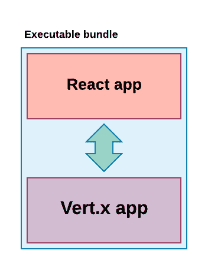

## 见见演员

大多数读者可能熟悉 Java 或 Node.js，以及它们的生态系统。尽管如此，我们还是在这里简单总结一下。

*   [**Node.js**](https://nodejs.org/en/) 是一个 Javascript 运行时环境，建立在 Chrome 的 V8 Javascript 引擎之上。它通常用于增强服务器端 JavaScript webapps，但这并不是它的全部功能。我们也可以在 Node.js 上运行与 web 无关的软件。在本教程中，我们将只使用 Node.js 来帮助我们打包和测试我们的 Web UI。
*   [**npm**](https://www.npmjs.com/) (表面上代表*节点包管理器*)是 Node 使用的主包管理器。npm 是一个安装在 Node.js 旁边的工具，它与 npm 软件包存储库进行通信。
*   [**Java**](https://www.java.com/en/) ，在这个上下文中，是两个东西。它是一种编程语言，但也是一个平台，主要由编译器和运行时环境(Java 虚拟机，或 JVM)组成。目前，Java 主要有两个发行版:Oracle Java 和 OpenJDK。由于 Oracle 发行版的潜在许可问题，大多数开发人员现在选择 OpenJDK。
*   [**Maven**](https://maven.apache.org/) 是 Java 生态系统中最常用的包管理器和构建系统。Maven 可以通过名为 mvn 的命令行工具来使用。它还可以与大多数常见的 Java IDEs 很好地集成。 [Maven Central](https://www.tutorialspoint.com/maven/maven_repositories.htm) 是存储 Maven 包的中央存储库。

同样，关于 React.js 和 Vert.x 的文章也很多，但我们将在这里简单总结一下:

*   [**React.js**](https://reactjs.org/) 是一个用于构建丰富的交互式用户界面的库。它通常被描述为 MVC(模型/视图/控制器)应用程序中的“V”。
*   [**Vert.x**](https://vertx.io/) 是一个在 JVM (Java 虚拟机)上构建反应式应用的工具包。和 Node.js 一样，它是基于事件循环的[,因此，它提供了一些工具来简化非阻塞代码的编写。它提供了额外的好处，比如它的](https://medium.com/@alexey.soshin/understanding-vert-x-event-loop-46373115fb3e)[角色模型](https://vertx.io/docs/vertx-core/java/#_verticles)和[事件总线](https://medium.com/@alexey.soshin/understanding-vert-x-event-bus-c31759757ce8)，以及多语言开发环境。

下表比较了每个生态系统的组成部分:

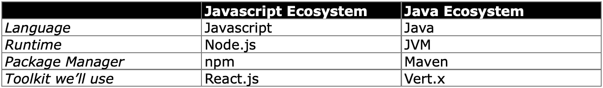

# 组装演员阵容

## Node.js 和 npm

我们首先需要安装 Node.js 和 npm。大多数 Javascript 开发人员已经安装了这些，可以跳到下一节。否则，要验证您是否安装了 Node.js 和 npm，请转到命令行并键入`node -v`。

如果那不起作用，让我们安装它们。只需转到 [Node.js 安装页面，](https://nodejs.org/en/download/)找到您的平台的最新安装程序，并运行它。再次尝试`node -v` 和`npm -v`。

这一次，每个人都应该打印出自己的版本。(版本号可能不同，这没关系)。

*注意:第三个二进制，*[*npx*](https://medium.com/@maybekatz/introducing-npx-an-npm-package-runner-55f7d4bd282b)*，也被安装。npx 的目的是使运行托管在 npm repo 上的命令行工具变得更加容易。*

## Java 和 Maven

我们还需要安装 Java 和 Maven。让我们首先验证是否安装了 Java。在命令行中输入`java -version`。如果成功了，恭喜你。如果没有，您需要安装它。

如前所述，如今 OpenJDK 比 Oracle 的 Java 发行版更受青睐。安装 OpenJDK 最简单的方法是转到 [AdoptOpenJDK](https://adoptopenjdk.net/index.html?variant=openjdk13&jvmVariant=hotspot) 。选择你想要的 Java 版本(一般是最新版本)和 JVM 口味(HotSpot 就可以)。然后点击蓝色的下载按钮下载安装程序。启动安装程序并按照说明进行操作。

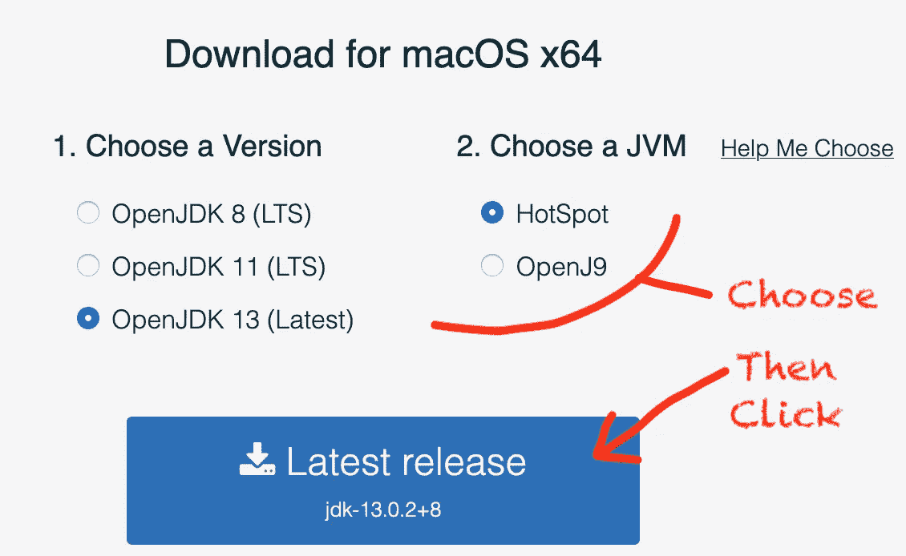

接下来，让我们检查一个 Maven 安装:`mvn -v`

如果这个命令不起作用，您需要安装 Maven。去 [Maven 下载网站](https://maven.apache.org/download.cgi)下载`.tar.gz`或者`.zip`二进制文件(注意:不同的操作系统没有不同的包)。然后按照 [Maven 安装页面](https://maven.apache.org/install.html)上的安装说明进行操作。

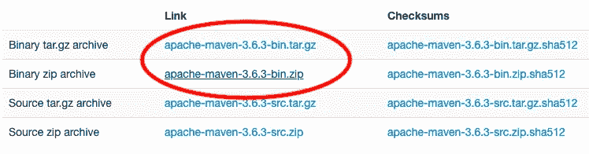

当你完成后，`mvn -v`应该打印版本号。

# 创建我们的 React 项目

让我们开始有趣的事情吧。首先，我们需要一个地方来放置 React 应用程序。我们的目录结构将如下所示:

```
movies/
      react-app/
      vertx/
```

所以从一个合适的位置开始(比如你的*目录下的*或*文件下的*目录)，创建一个`movies/`目录，然后光盘放入其中。例如，在 OS X:

```
$ cd ~/Documents
$ mkdir movies
$ cd movies
```

## 创建-反应-应用

现在来创建我们的 React 应用程序。为此，我们使用一个叫做[的工具来创建 React App](https://create-react-app.dev/) 。该工具由脸书创建，托管在国家预防机制上。我们将使用我前面提到的`npx`库来执行它:

```
npx create-react-app react-app
```

大约一分钟后，您应该会有一个新的`react-app/`子目录，其中包含一个 skeletal React 应用程序:

```
$ cd react-app
$ ls
README.md   node_modules   package.json   public   src   yarn.lock
```

最有趣的项目是`public/`目录，其中包含 HTML 页面和图标等静态资产，以及`src/`目录，其中包含应用程序的 JavaScript 和 CSS。我们很快会检查内容。现在，让我们启动为我们创建的应用程序。

在`react-app/`目录中，运行`$ npm start`。npm 将在其默认端口 3000 下运行我们的代码，并为我们打开一个浏览器。几秒钟后，我们应该会看到这样的内容:

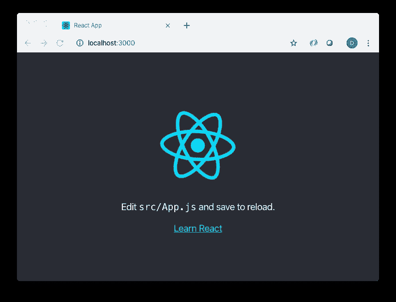

在我们继续之前，让我们对`src/App.js`文件做一个快速编辑(如渲染应用程序本身所建议的)。例如，将`<p>`内容修改如下:

```
<p>
 I have edited <code>src/App.js</code> and will save to reload.
</p>
```

保存文件，然后不做任何其他事情，返回浏览器。您应该会看到您的更改自动反映出来:

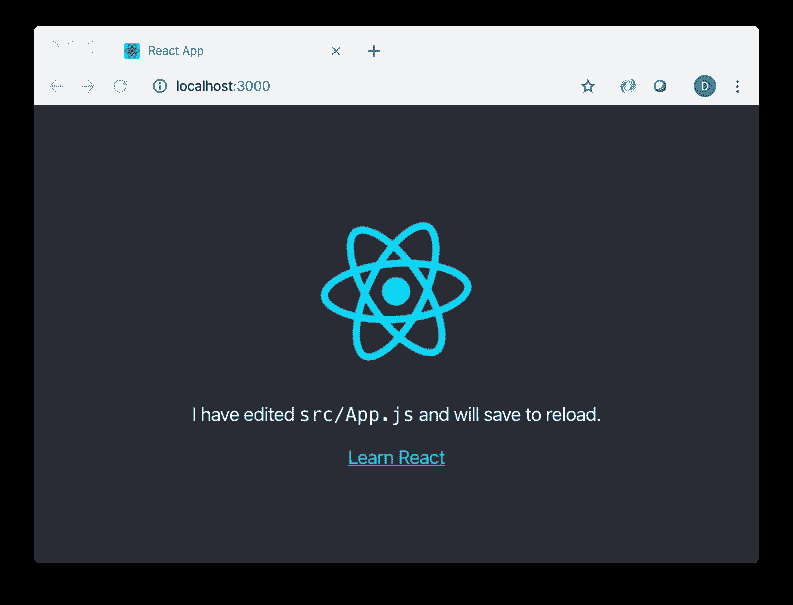

您可以使用 *control-C* 来停止您的 npm 进程。

## 创建我们的基本文件

我们将创建自己的文件，而不是浏览提供的样板文件。在这些目录中，我们必须做的第一件事是删除大部分文件。这是你在使用`create-react-app`时会遵循的一个常见模式:首先，创建你的应用程序；接下来，删除大部分结果样板文件。

让我们从`src/`目录开始。在那里，删除除了`index.css`和`index.js`之外的所有文件。接下来，`cd`进入`public/`目录，并删除除了`index.html`文件之外的所有文件。

现在我们将打开剩余的`public/index.html`文件。将其内容替换为以下内容:

```
<!DOCTYPE html>
<html lang="en">
  <head>
    <meta charset="utf-8" />
    <title>Movies</title>
  </head>
  <body>
    <div id="root"></div>
  </body>
</html>
```

接下来，我们将关注`src/`目录。从那里，打开`index.js`文件，并将其内容替换为

```
import React from 'react';
import ReactDOM from 'react-dom';
import './index.css';
import App from './App';ReactDOM.render(<App />, document.getElementById('root'));
```

让我们停下来看看这里发生了什么。当 npm 编译并运行一个像我们这样通过`create-react-app`的应用程序时，它会寻找两个文件:`index.html`和`index.js`——一切都从那里开始。我们的`index.html`文件非常简单——最有趣的部分是标识 React 应用程序的主要部分的那一行:

```
<div id="root"></div>
```

反过来，`index.js`是有效引导应用程序的文件。这发生在这一行:

```
ReactDOM.render(<App />, document.getElementById('root'));
```

在那里，我们调用`ReactDOM.render()`，首先告诉它*渲染什么*，然后*在哪里渲染*。 *what* 是一个`App`组件的实例，我们接下来将讨论它。*其中*是由所提供的选择器(`document.getElementById('root')`，我们已经在`index.html`中定义了)标识的 HTML 元素。

您还会注意到在`index.js`之上有一些导入。使用导入是我们的应用程序的剩余组件(或*模块*)被有效吸收的方式。前两个，`React`和`ReactDOM`，显然是从框架本身导入模块。`index.css`是下一个导入，所以让我们打开该文件，并用以下内容填充它:

```
body {
 margin: 0;
 font-family: 'Helvetica Neue', sans-serif;
 -webkit-font-smoothing: antialiased;
 -moz-osx-font-smoothing: grayscale;
}
```

最后，有这样一句台词:

```
import App from './App'’';
```

这告诉我们从同一个目录下的名为`App.js`的文件中导入一个名为 *App* 的模块(文件扩展名为`.js`)。记住——我们的`index.js`文件已经指定了一个 *App* 组件实例来代替 HTML 文件中的`document.getElementById(‘root’)`元素。

组件是任何 React 应用程序的主要构建块。您可以将组件视为 UI 元素，它可以在屏幕上显示自身，对底层模型的更改做出反应，并导致该模型的更改。组件也有可以利用的生命周期挂钩。如您所料，组件可以嵌入到其他组件中。

让我们通过打开`App.js`文件并用以下内容填充它来定义我们的`App`组件:

```
import React, { Component } from "react";
import './App.css';class App extends Component { render() {
    return (
      <div className="App">
          <h1>
            Movies
          </h1>
      </div>
      )
    }
  }export default App;
```

一些需要注意的事情。首先，这个文件导入一个`App.css`模块(它包含[级联样式表](https://www.w3.org/Style/CSS/Overview.en.html)，或者 CSS，样式)。组件逻辑和样式通常以这种方式与 React 应用程序配对。因此任何`Foo`组件都将在`Foo.js`文件中定义其行为，在`Foo.css`文件中定义其样式。

让我们在`App.css`中为我们的应用组件创建一个简单的样式:

```
.App {
  text-align: center;
  background-color: #fff;
  min-height: 100vh;
  display: flex;
  flex-direction: column;
  align-items: center;
  justify-content: center;
  font-size: calc(10px + 2vmin);
}h1 {
  color: #666666;
}.App-link {
  color: #61dafb;
}
```

除了导入之外，`App.js`的大部分都涉及声明一个扩展`react.Component`的`App`对象。通过扩展这个类，我们可以覆盖许多函数。也许其中最重要的是`render()`函数。这里，我们返回定义组件如何呈现到屏幕上的标记。我们的`App`组件返回以下标记:

```
<div className="App">
  <h1>
    Movies
  </h1>
</div>
```

具有前端经验的读者可能会认为他们将该标记识别为 HTML。他们可能错了。虽然它看起来像 HTML，但它实际上是另一种叫做 *JSX 的语言。* JSX 允许我们轻松地将标记与 JavaScript 混合起来创建 UI 元素。

虽然 JSX 在很大程度上看起来像 HTML，但还是有细微的差别。事实上，在上面的片段中有一个线索表明我们没有使用传统的 HTML——我们的`div`中的`className`标签。如果这是纯 HTML，我们会将`App`声明为`class`，但是因为`class`是一个 Javascript 关键字，所以我们使用`className`标签。

让我们再次启动我们的应用程序，看看我们在哪里:

```
$ npm start
```

我们应该看到一个简单的屏幕:

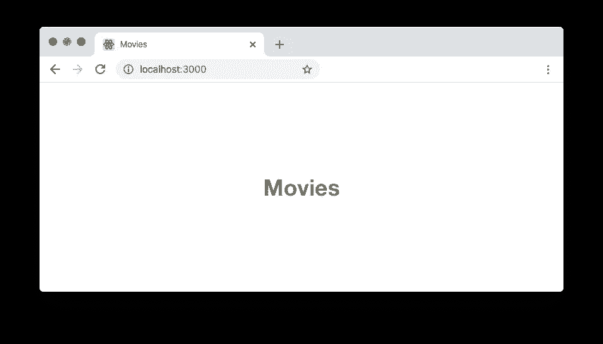

看起来不错。现在让我们展示一些电影吧！

# 显示电影

首先，让我们概述一下我们将要构建的组件。我们将有三个，每个都用各自的颜色描绘如下:

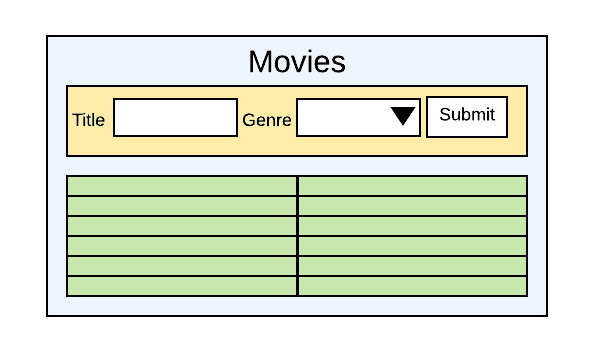

蓝色组件代表我们已经构建的`App`组件。在`App`中，我们将再添加两个组件:

*   `MovieForm`:橙色表示，这个组件允许我们在列表中加入新电影。
*   `MovieList`:绿色表示，该组件将显示我们列表中的电影。

## 添加电影列表显示

让我们首先在`src/`目录下创建两个文件:`MovieList.js`和`MovieList.css`。后者应包含以下内容:

`MovieList.js`应该包含这个:

## 构造器

您会注意到的第一件有趣的事情是`MovieList`覆盖了`Component`的默认构造函数。名为`props`的参数被传递给构造函数。我们一会儿将检查这个参数，但是注意它被传递给了超类的构造函数。这将设置一个`props`类级变量的值。

您还会看到一个绑定到当前`App`实例的函数——例如
`this.toMovie = this.toMovie.bind(this);`。这允许从任何上下文中调用`toMovie`函数(比如从 UI 事件中)。在开发 React 应用程序的过程中，你会经常这样使用你的函数。

## 呈现用户界面

和大多数组件一样，`render()`函数是有趣的事情发生的地方。每当 React 确定需要在 UI 中重新显示任何组件时，都会调用每个组件的`render()`函数。

在`MovieDisplay`的`render()`函数中，我们创建了一个表格。记住，虽然看起来我们在使用 HTML，但我们实际上是在写 JSX。这意味着需要注意一些差异(例如前面提到的`className`标签)。这也意味着我们可以很容易地混合 JavaScript。让我们看一个例子:

```
{this.props.movies.map(this.toMovie)}
```

我们已经创建了一个表，但是如何用数据行填充它呢？为此，我们可以使用 JavaScript。

前面，我们提到了传递给这个组件的构造函数的`props`对象。我们很快就会看到，作为道具对象的一部分，我们提供了一系列电影。所以我们使用`map()`迭代数组，并将`toMovie`作为映射函数传递给它。([这里](https://en.wikipedia.org/wiki/Map_(higher-order_function))和[这里](https://developer.mozilla.org/en-US/docs/Web/JavaScript/Reference/Global_Objects/Array/map)是一些解释映射函数的资源，如果你需要的话)。反过来，`toMovie`接受一个电影对象并返回显示表格行所需的 JSX 标记:

```
toMovie(m) {
  var g = "?";
  for (var i = 0; i < this.props.genres.length; i++) { 
      if (this.props.genres[i].value == m.genre) {
          g = this.props.genres[i].label;
          break;
      }
  } 
  return (<tbody key={m.guid}><tr><td>{m.title}</td><td>{g}</td></tr></tbody>)
 }
```

*注意:那个* `*key*` *标签是一个 React 需求。列表中每个唯一的 UI 项都必须有自己的键来唯一标识它。我们将为我们的电影分配 GUIDs，因此我们将使用它们作为唯一的键。*

让我们将这个组件添加到`App`组件中，看看我们得到了什么。在`App.js`内，我们首先导入`MovieList`:

```
import MovieList from "./MovieList"
```

就在导入语句下面，我们将创建一系列电影类型:

```
const genres = [ 
  {value: 'action', label: 'Action'}, 
  {value: 'comedy', label: 'Comedy'}, 
  {value: 'drama', label: 'Drama'}, 
  {value: 'thriller', label: 'Thriller'}, 
  {value: 'musical', label: 'Musical'} 
]
```

然后显示一组示例电影:

```
const movies = [ 
  {genre: 'action', title: 'Captain Marvel', guid: '6530b64b-0753-4629-a1bb-6716109b964b'}, 
  {genre: 'comedy', title: 'Groundhog Day', guid: 'ba5b9881-7128-485f-84d5-afc50f199b23'}, 
  {genre: 'action', title: 'Midway', guid: '2e93da48-d451-4df0-b77c-41dddde428ad'}, 
  {genre: 'drama', title: 'Dances With Wolves', guid: 'f207c1a0-3bef-48f1-a596-29b84887e94d'}, 
  {genre: 'thriller', title: 'Scream', guid: '3733f942-6a44-4eb9-af54-586d9d15eb67'} 
]
```

最后，在`render()`函数中，在“Movies”标题下，我们将添加一个`MovieList`的实例，将类型和电影传递给`props`参数，然后传递给`MovieList`的构造函数:

```
<h1>
  Movies
</h1>
<div>
  <MovieList movies={movies} genres={genres} />
</div>
```

然后，让我们返回浏览器，看看我们得到了什么:

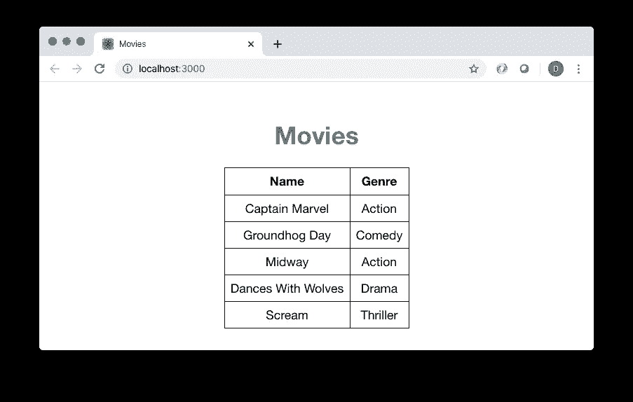

# 添加电影入口表单

现在让我们添加创建电影的能力。我们首先在`src/`目录中创建两个文件:`MovieForm.js`和`MovieForm.css`。后者应包含以下内容:

`MovieForm.js`应该包含这个:

## 保持状态

就像`MovieList`，`MovieForm`覆盖默认的构造函数并接受一个`props`参数。它还将许多函数绑定到当前的`MovieForm`实例——例如
`this.handleChangeTitle = this.handleChangeTitle.bind(this);`

但是，与`MovieList`不同，在`MovieForm`的构造函数中，我们为组件创建了一个`state`对象。在这里，`state`简单地表示我们当前正在创建的电影——当这个组件第一次加载时，它的状态将是一个对象，表示一部具有空白标题和空白类型的电影。

在任何成分中，`state`都是一种特殊的变量。它不仅维护组件的状态，而且在重新分配时，调用组件在 UI 中的重新呈现。

请记住，分配给`state`变量的对象是不可变的。也就是说，虽然我们在技术上可以称之为
`this.state.title = 'Dances With Wolves'`，但我们强烈反对这样做。这样做意味着 UI 不会更新以反映新的状态。

相反，我们应该这样称呼它:

`this.setState({ title: 'Dances With Wolves', genre: this.state.genre })`

因为我们调用了`setState`，UI 将重新呈现组件以反映新的标题。

您可能认为以这种方式重新创建`state`对象可能会很乏味。你是对的——尤其是对于更大的物体。这就是我们创建`changeState()`函数的原因:

```
changeState(keyVal) {
  this.setState( Object.assign({}, this.state, keyVal) ) 
}
```

该方法利用了`Object.assign()`函数，该函数本质上合并了传递给它的所有参数(一个空对象、组件的当前状态以及我们想要对状态进行的更改),并返回一个表示新状态的新对象。例如，如果我们当前的状态看起来像这样:

`{ title: 'Dances With Wolves', genre: 'Action' }`

而我们调用`changeState({ genre: 'Drama' })`，那么我们的新状态将会是这样的:

`{ title: 'Dances With Wolves', genre: 'Drama' }`

我们有两个利用`changeState()`功能的事件处理程序:`handleChangeGenre()`和`handleChangeTitle()`。

## UI 的连接状态

现在我们来看看`render()`函数。正如我们之前讨论的，使用 JSX 可以很容易地将 JavaScript 混合到你的布局中。让我们看一个例子:

```
<input type="text" value={this.state.title} onChange={this.handleChangeTitle} />
```

这里，我们创建了一个简单的文本字段。但是我们可以很容易地连接`MovieForm`组件的状态来提供文本字段的值。我们可以很容易地将一个事件处理程序(前面提到的`handleChangeTitle`)附加到文本字段。换句话说，每次这个文本域渲染时，它的值都会匹配`state.title`。每当值发生变化时(例如，用户在文本字段中键入一个字符)，就会调用`handleChangeTitle`事件处理程序，并更新状态。

我们还使用 JavaScript 创建一个`select`小部件，从中选择流派，在这个块中:

```
<select value={this.state.genre} onChange={this.handleChangeGenre}>
  {this.props.genres.map(this.toGenreOption)} 
</select>
```

这里，我们创建一个标准的 HTML select 小部件，并使用 Javascript 来提供选项。正如我们对 MovieList 所做的那样，我们将为传递给该组件的构造函数的 props 对象提供一个流派数组。所以我们使用`map()`迭代数组，然后将`toGenreOption`函数作为映射函数传递。反过来，`toGenreOption`接受一个流派对象并返回显示`select`项目所需的 JSX 标记:

```
return (<option key={g.value} value={g.value}>{g.label}</option>)
```

让我们将这个组件添加到`App`组件中，看看我们得到了什么。在`App.js`中，我们首先导入`MovieForm`:

```
import MovieForm from "./MovieForm"
```

然后，在`render()`函数中，在“Movies”标题下，我们将添加一个`MovieForm`的实例，将流派传递给`MovieForm`的构造函数的 props 参数:

```
<h1>
  Movies
</h1>
<div>
  <MovieForm genres={genres} />
</div>
```

让我们回到浏览器，看看我们得到了什么:

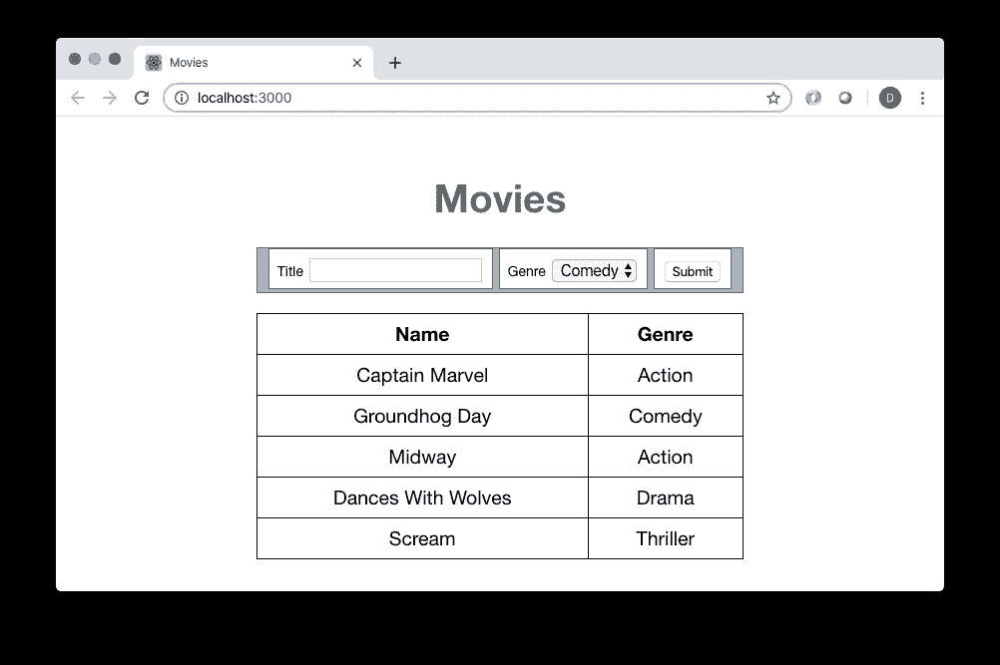

# 创建我们的后端电影服务

截至目前，我们的电影形式并没有真正服务于任何目的。这将会改变，但首先，让我们创建我们的 Vert.x 电影服务。

## 垂直 x 结构

是时候设置我们的 Vert.x 应用程序了。如果您使用 IntelliJ 或 Eclipse 之类的 IDE，您可以使用它来自动生成 Maven 项目。在这里，我们只是用手来做。在我们的顶级目录中，我们将在`react-app`目录旁边创建一个`vertx`目录。在其中，我们将创建以下结构:

```
├── pom.xml
├── src/
│   ├── main/
│   │   └── java/
│   │   └── resources/
```

这是最小 Maven 项目的默认目录结构。正如您所猜测的，包含了项目的 Java 源代码。`src/main/resources`包含要打包到 Java 应用程序中的资源(配置文件、图像等)。通常，我们也会有`src/test/java`和`src/test/resources`目录，但是为了简洁起见(并且*而不是*不喜欢测试！)我们在这里省略了那些。

`pom.xml`是告诉 Maven 项目是如何构建的文件。我们的大部分文件将用于配置 Vert.x。将以下文件的内容复制到您的`pom.xml`中:

如果您愿意，您可以更改`groupId`(例如，更改为您自己的反向域名)、`artifactId`和/或`version`。其余的应该基本保持不变。

## 垂直 x 垂直和控制器

现在让我们写一些代码。Vert.x 提供了一种 actor 模型，由称为[vertices](https://vertx.io/docs/vertx-core/java/#_verticles)的独立组件组成。这是一个强大的工具，我们可以根据自己的意愿选择使用多少。这里，我们将创建一个 verticle 作为应用程序的启动点。

在`src/main/java`目录中，我们将创建一个名为`com.me`的包(或者，如果您愿意，您可以使用自己的反向域名)。这意味着我们将创建子文件夹`com/me`。

让我们停下来检查一下我们的总体目录结构，它应该是这样的:

```
├── react-app
│   *(stuff)*
├── vertx
│   ├── pom.xml
│   ├── src/
│   │   ├── main/
│   │   │   ├── java/
│   │   │   │   ├── com/
│   │   │   │   │   └── me/
│   │   │   └── resources/
```

在新的`me/`目录中，我们将添加一个包含以下内容的`Main.java`文件:

在同一个目录中，我们将创建一个包含以下内容的`AppServer.java`文件:

我们做了什么？Vert.x 期望一个 verticle 实例作为应用程序的入口点，所以我们在`Main`类中创建了一个。这个类实际上只是用来实现`io.vertx.core.AbstractVerticle`并覆盖那个类的`start()`生命周期方法。在`start()`中，我们简单地创建了一个`AppServer`类的实例并运行它。注意，我们将一个`vertx`参数传递给了`AppServer`的`run()`方法。这是`io.vertx.core.Vertx`的一个实例，在`AbstractVerticle`中定义。

你可能想知道 Vert.x 如何知道使用`Main`作为程序的入口点。很简单——我们之前在`pom.xml`文件中将其定义为`properties : main.verticle`值。

`AppServer`类本质上是我们的 webapp 的控制器。从技术上来说，它只是一个普通的老类，从`java.lang.Object`直接延伸而来。我们已经创建了一个方法，`run()`，它完成了所有的工作。

在`run()`中，我们首先创建一个`io.vertx.core.http.HttpServer`的实例(如前所述，它利用了底层的 Jetty)。接下来，我们创建一个`io.vertx.ext.web.Router`实例，它将 HTTP 请求路由到处理程序。处理程序实际上是`io.vertx.coreHandler<RoutingContext>`类的实例(它定义了一个`void handle(RoutingContext ctx)`方法)，但是我们利用 Java 8 lambdas 来实现这些处理程序。例如，这个块定义了对`*/movies*`路径的 GET 请求的处理程序:

```
router.get("/movies").handler(…)
```

而`router.post("/movies").handler(…)`为相同路径的 POST 请求定义了一个处理程序。

## 经理人

处理程序本身很简单。它们只是向调用者返回一个纯文本响应。但是，请注意，我们并不是从一个方法中直接返回文本。因为 Vert.x 是一个反应式框架，运行在一个[事件循环](https://medium.com/@alexey.soshin/understanding-vert-x-event-loop-46373115fb3e)上，所以我们需要明确说明何时准备好将响应发送回调用者。

所以首先，`handler()`方法被传递了一个`RoutingContext`实例，从这个实例中它可以派生出要使用的`HttpServerResponse`。然后，我们简单地调用`HttpServerResponse`的`end()`方法将响应发送回调用者。

接下来，我们把所有东西粘在一起，告诉`HttpServer`使用`Router`作为它的请求处理器，然后启动并监听端口 80。我们提供了一个 lambda，在服务器尝试启动后调用，告诉我们启动是否成功。我们使用这种回调方法，因为我们不想在任何事情上阻塞 Vert.x 的线程——包括等待服务器启动。

让我们测试一下我们有什么。从我们项目的`vertx/`目录中的命令行，我们将通过运行`mvn clean install`来编译和构建应用程序。

一旦完成，在目录中运行一个`ls`来看看我们得到了什么。您应该注意到一个新的`target/`子目录。里面有我们刚刚生成的所有构建工件。最重要的是`movies-app-1.0.0-SNAPSHOT-fat.jar`。这是一个完整的、自包含的服务器端应用程序，包括一个基于 Netty 的嵌入式 web 服务器。

让我们现在运行它。在示例目录中，运行以下命令:

```
java -jar target/movies-app-1.0.0-SNAPSHOT-fat.jar
```

您应该会看到类似这样的内容:

```
Movie app starting…
Feb 27, 2020 7:23:37 AM io.vertx.core.impl.launcher.commands.VertxIsolatedDeployer
INFO: Succeeded in deploying verticle
Feb 27, 2020 7:23:37 AM com.me.AppServer
INFO: MovieApp HTTP server started on port 80
```

转到 web 浏览器，输入`http://localhost/movies`(这将向端口 80 发出 GET 请求)。您应该会看到类似这样的内容:

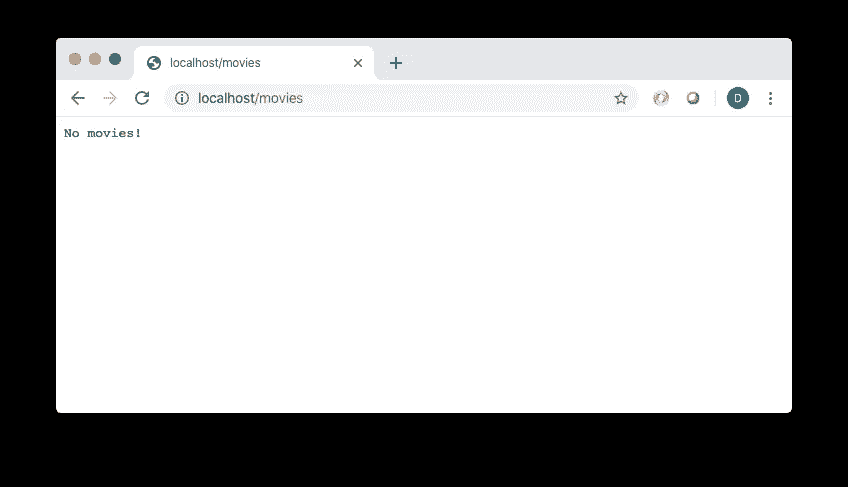

## 保存电影实例

为了简洁起见，我们实际上不会将我们的电影保存到数据库中(在本教程之后，你可以将它作为一个家庭作业项目。)相反，我们将简单地在内存中存储电影实例。这意味着当 Vert.x 服务器重新启动时，电影将会消失，但这对我们的目的来说很好。

我们需要一个模型来表示我们的电影，所以在那个`me/`目录中，添加一个`Movie.java`文件。我们的模型将包括以下字段:

```
private String genre;
private String title;
private UUID guid;
```

所以，有了所有的仪式，我们的类将看起来像这样:

现在让我们充实我们的`AppServer`类来保存电影。添加此方法:

该方法检索请求体(`ctx.getBodyAsString()`)，JSON 将其解码成电影。它执行一些基本的输入验证，在验证失败时返回 HTTP 状态 400 和简单的 JSON 错误消息。

假设验证通过，我们接下来将 Vert.x 的事件总线引入我们的应用程序。事件总线为 Vert.x 应用程序的组件提供了一种相互通信的方式，同时保持完全解耦。他们通过发布和消费消息来做到这一点。从概念上讲，您几乎可以将事件总线视为一个消息队列。

我们应用程序中的事件总线通信将如下所示:

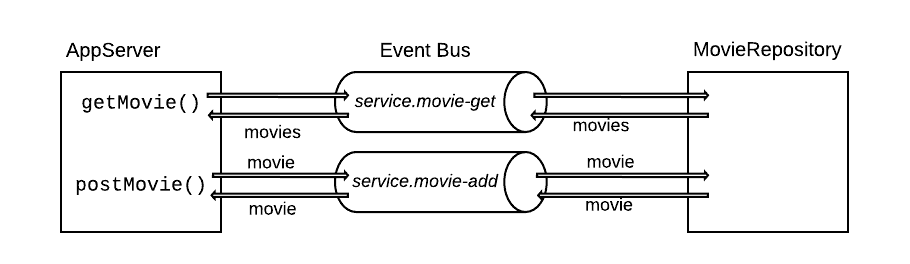

`AppServer`将向两个事件总线“通道”发布消息:`getMovie()`方法将发布到“service.movie-get”，而`postMovie()`方法将发布到“service.movie-add”。我们很快将创建一个名为`MovieRepository`的垂直平台，它将消费这些消息，处理它们，然后通过相同的通道发送消息作为响应。

我们通过 Vertx 实例获得对事件总线的引用。然后我们在`service.movie-add`频道上发布一条消息，连同我们的新电影实例作为有效载荷。因为我们应该期待来自`MovieRepository`消息消费者的消息响应，所以我们提供了一个消息响应处理程序。假设一切顺利，我们将把消息体作为 JSON 返回给最初的 HTTP 调用者。如果出现故障，我们将发送一个通用故障(500)响应。

为了使用`postHandler()`请求处理器方法，我们将修改我们的`post`请求处理器(在`run()`方法中),如下所示:

```
router.post("/movies").handler(ctx -> postMovie(ctx, vertx));
```

为了正确处理 POST 请求，我们还需要将下面一行添加到我们的`run()`方法中(就在我们创建`router`实例的那一行的下面):

```
router.route().handler(BodyHandler.create());
```

现在，我们将创建第二个 verticle 作为我们的数据存储库。如前所述，我们将只在内存中存储电影。但是可以把这个类想象成一个典型的存储库或与数据库通信的对象。

在`me/`目录下，创建一个包含以下内容的`MovieRepository.java`文件:

注意，像我们的`Main`类一样，这个类也扩展了`AbstractVerticle`并覆盖了`start()`方法。这里，`start()`使用 verticle 的 Vertx 实例来创建两个事件总线消费者。第一个监听`service.movie-add`通道，并提供一个处理程序，该处理程序将来自该通道的消息解码为`Movie`实例，给电影分配一个`UUID`，并将它们“持久化”到内存中的`List`。然后它向事件总线发布一条消息作为响应，包含电影(现在有了新的`UUID`)作为主体。

您大概可以猜到，这个消费者将处理由`AppServer.postMovie()`发布的消息。

第二个消费者订阅了`service.movie-get`频道。它的处理程序会立即发布一条消息作为响应，消息体包含完整的持久电影列表。

让我们回到我们的`AppServer`类来利用第二个消费者。添加此方法:

```
private void getMovie(RoutingContext ctx, Vertx vertx) {
  vertx.eventBus().request("service.movie-get", "", res -> {
    if ( res.succeeded() ) {
      ctx.response()
      .putHeader("content-type", "application/json")
      .end( res.result().body().toString() );
    } else {
      ctx.fail( res.cause() );
    }
  });
}
```

这将作为 GET 请求的 HTTP 请求处理程序。它立即向事件总线的`service.movie-get`通道发布消息(消息体无关紧要，所以我们提供一个空字符串)。它还为返回消息提供了一个处理程序，该处理程序将消息体作为 JSON 有效负载返回给原始的 HTTP 调用者(如果出现故障，则返回 500 错误响应)。

当然，在`MovieRepository`中，我们已经添加了一个`service.movie-get`通道消费者，它检索之前创建的电影列表。

为了使用`getMovie()`处理程序，我们将修改`get`请求处理程序(在`run()`方法中),如下所示:

```
router.get("/movies").handler(ctx -> getMovie(ctx, vertx));
```

我们的最终形式`AppServer.java`应该是这样的:

在我们可以考虑这些变化之前，我们将在我们的`Main`类中再添加一个。`MovieRepository`是一个 verticle，你会注意到它没有被实例化。这意味着，它的事件总线订阅者将永远不会被创建，因此电影将不会被保存或检索。需要部署 Vert.x verticles，所以我们将在`Main`进行部署。首先，添加这个方法:

```
protected void deployVerticle(String className) {
  vertx.deployVerticle(className, res -> {
    if (res.succeeded()) {
      System.out.printf("Deployed %s verticle \n", className);
    } else {
      System.out.printf("Error deploying %s verticle:%s \n", className, res.cause());
    }
  });
}
```

我们将此作为部署任何垂直市场的通用方法。我们使用`Main`的`Vertx`实例来部署 verticle，并提供一个记录结果的回调处理程序。需要一个回调处理程序，这样我们就不会在部署 verticle 时阻塞当前线程。

然后，我们简单地在`start()`方法中添加这一行:

```
deployVerticle(MovieRepository.class.getName());
```

编译并再次启动应用程序:

```
mvn clean install
java -jar target/movies-app-1.0.0-SNAPSHOT-fat.jar
```

从网络浏览器点击`localhost/movies`仍然会返回一个空列表，因为我们还没有添加电影。你需要使用一个类似于 [Postman](https://www.postman.com/) 的工具向`localhost/movies`发出一个 POST 请求，并提供如下请求体:

```
{
  "title": "Dances With Wolves",
  "genre": "drama"
}
```

如果一切顺利，您应该得到一个包含新保存的电影及其新 guid 值的响应:

```
{
  "genre": "drama",
  "title": "Dances With Wolves",
  "guid": "7254537a-82d2-4bee-96d3-f12c61bc2cd9"
}
```

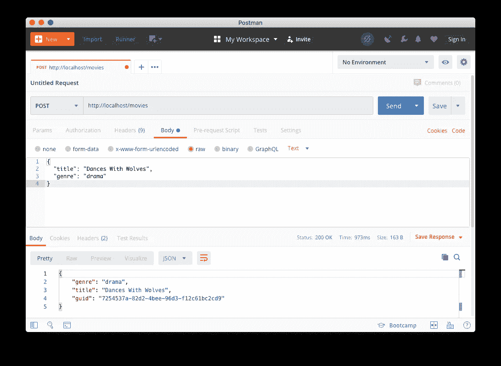

现在，回到您的 web 浏览器(或者继续使用 Postman)并发出另一个 GET 请求:

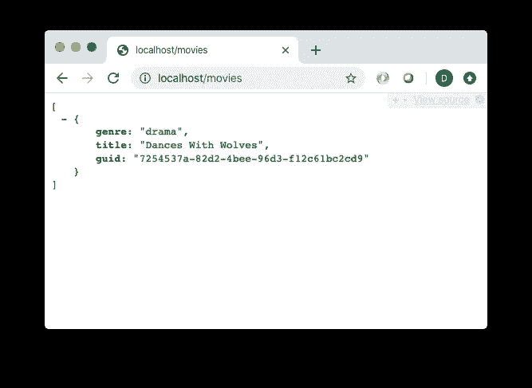

# 前端和后端布线

现在是最后一步——连接 React 和 Vert.x 应用程序。

## 获取和显示电影

让我们回到 React 代码并修改`MovieList.js`。我们需要:

*   将要显示的电影列表从 const in `App.js`移动到 MovieList 的`state`。
*   创建新电影时通知`MovieList`。
*   允许`MovieList`向 Vert.x 应用程序查询要显示的电影列表。

我们首先将它添加到文件的顶部，就在导入的下面:

```
var xhr;
```

然后我们将以下内容添加到`MovieList`的构造函数中:

```
this.state = {
 movies: []
}
this.sendRequest = this.sendRequest.bind(this);
this.processRequest = this.processRequest.bind(this);
this.props.eventDispatcher.subscribe(“addMovie”, this.sendRequest);
```

这里，我们创建一个`state`对象，由一个名为`movies`的空数组组成。在绑定了两个新函数(我们将在接下来创建)之后，我们订阅了一个事件调度程序(我们也将很快编写代码)。这将允许`MovieList`在新电影创建时得到通知。

让我们添加那个`sendRequest`函数:

```
sendRequest() {
  xhr = new XMLHttpRequest();
  xhr.open("GET", "http://localhost/movies")
  xhr.send();
  xhr.addEventListener("readystatechange", this.processRequest, false);
 }
```

这个函数将为我们的`xhr`变量分配一个新的 [XMLHttpRequest](https://developer.mozilla.org/en-US/docs/Web/API/XMLHttpRequest) 实例，并告诉它向`localhost/movies`发出一个 GET 请求(为了清楚起见，我们在这里对 URL 进行了硬编码，但我们不会在生产就绪的系统中这样做)。我们还将`processRequest`函数标识为对成功请求的回调。

接下来让我们创建`processRequest`函数:

```
processRequest() {
  if (xhr.readyState === 4 && xhr.status === 200) {
    var response = JSON.parse(xhr.responseText);
    this.setState({
      movies: response
    })
  }
}
```

这个方法只是解析对 GET 请求的成功响应的主体内容。回想一下，我们的 Vert.x *GET* 端点将返回一个电影对象列表。所以我们只需将`MovieList`的状态设置为内容。如果您还记得前面的内容，那么这样做会导致`MovieList`组件在 UI 中重新呈现。

我们希望确保在 UI 第一次加载时(例如，如果用户刷新了浏览器)检索电影列表。为此，我们使用了`componentDidMount()`生命周期挂钩。这是 React 组件对象中定义的方法，我们可以覆盖它。正如您可能猜到的那样，它是在组件完全加载后被调用的。

```
componentDidMount() {
  this.sendRequest()
}
```

最后，我们在`render()`方法中做了一个小改动。显示的电影现在需要来自`MovieList`的州，所以我们现在通过以下方式创建表格行:

```
{this.state.movies.map(this.toMovie)}
```

## 持续电影

现在我们将增强`MovieForm.js`来将新电影保存到 Vert.x 应用程序中。

与`MovieList.js`一样，我们将在顶部添加以下内容:

```
var xhr;
```

接下来，我们将在构造函数中绑定两个新函数:

```
 this.tryCreateMovie = this.tryCreateMovie.bind(this);
 this.processRequest = this.processRequest.bind(this);
```

让我们创建第一个函数，如下所示:

```
tryCreateMovie() {
  xhr = new XMLHttpRequest();
  xhr.open("POST", "http://localhost/movies")
  xhr.send(JSON.stringify({ “title”: this.state.title, "genre": this.state.genre }));
  xhr.addEventListener("readystatechange", this.processRequest, false);
 }
```

这个函数将一个新的`XMLHttpRequest`对象赋给`xhr`变量，然后将我们正在创建的电影的 JSONified 形式发布到*http://localhost/movies*。成功响应后，它调用`processRequest`回调函数，如下所示:

```
processRequest() {
  if (xhr.readyState === 4 && xhr.status === 200) {
    this.props.eventDispatcher.dispatch("addMovie", "")
    this.changeState( { title: ""} )
  }
}
```

该函数向事件调度程序发布一条`addMovie`消息(我们将很快创建它)。它还将`MovieForm`的状态更改为标题为空的电影，以便清除`Title`文本字段。

好了，是时候编写我们的事件调度程序了。我们将在`App.js`文件中这样做。首先，让我们去掉`movies`数组——我们不再需要它了。在这里，我们将创建一个简单的对象，如下所示:

当然，`listeners`字段被声明为一个空对象。最终，它将作为一种列表地图。键将是字符串，它将代表事件类型(例如，上面的`addMovie`)，而值将是一个回调函数的数组，每当发布事件时都会被调用。

`subscribe`函数接受一个事件名和一个回调函数。它只是将回调函数添加到侦听器对象中，放在与事件名称匹配的键下。`dispatch`函数接受一个事件名(一个字符串)和数据(可以是任意对象)。然后它检查`listeners`对象是否有匹配事件名称的键。如果找到了那个键，它就遍历存储在关联数组中的回调函数并调用它们，传递数据。

对于我们的小应用程序来说，这个事件调度器可能看起来有些多余，但是如果我们要扩展这个应用程序，它会使处理整个应用程序的状态变化变得简单。此外，它是完全通用的，因此可以复制到其他 React 应用程序中。对于在复杂得多的应用程序中处理状态，还有 [Redux](https://redux.js.org/) 。我们不会在本文中介绍 Redux，但您可以稍后作为家庭作业尝试将其改造到这个应用程序中。

最后，我们将修改`App()`函数中`MovieForm`和`MovieList`组件的创建。我们已经移除了`movies`数组，所以我们不再将它传递给`MovieList`。但是`MovieForm`和`MovieList`都需要引用事件调度程序。所以我们将组件声明改为:

```
 <MovieForm genres={genres} eventDispatcher={eventDispatcher} />
 <MovieList genres={genres} eventDispatcher={eventDispatcher} />
```

## 这是一个总结

现在，我们将创建一个小的 shell 脚本，将整个应用程序 React 部分和 Java/Vert.x 部分——打包成一个可执行文件。在`react-app/`目录下，创建一个包含以下内容的`deploy.sh`脚本:

```
npm run build
if [ -d "../vertx/src/main/resources/webroot/" ]; then rm -Rf ../vertx/src/main/resources/webroot/; fi
mkdir ../vertx/src/main/resources/webroot/
cp -R build/* ../vertx/src/main/resources/webroot/
```

在这个脚本中，我们使用 npm 来构建应用程序，并针对生产部署进行了优化。然后，我们确保在`vertx`目录中存在一个空的`src/main/resources/webroot`子目录(首先删除任何以前的此类目录)。最后，我们将构建的 React 应用程序复制到那个`src/main/resources/webroot`目录中，在那里它将作为 Vert.x 应用程序的静态内容提供。

确保脚本可执行(`chmod 777 deploy.sh`)，然后运行它(`./deploy.sh`)。然后进入`vertx`目录(`cd ../vertx`)，构建并启动 app:

```
mvn clean install
java -jar target/movies-app-1.0.0-SNAPSHOT-fat.jar
```

让我们用网络浏览器点击 [http://localhost](http://localhost) ，看看我们得到了什么:

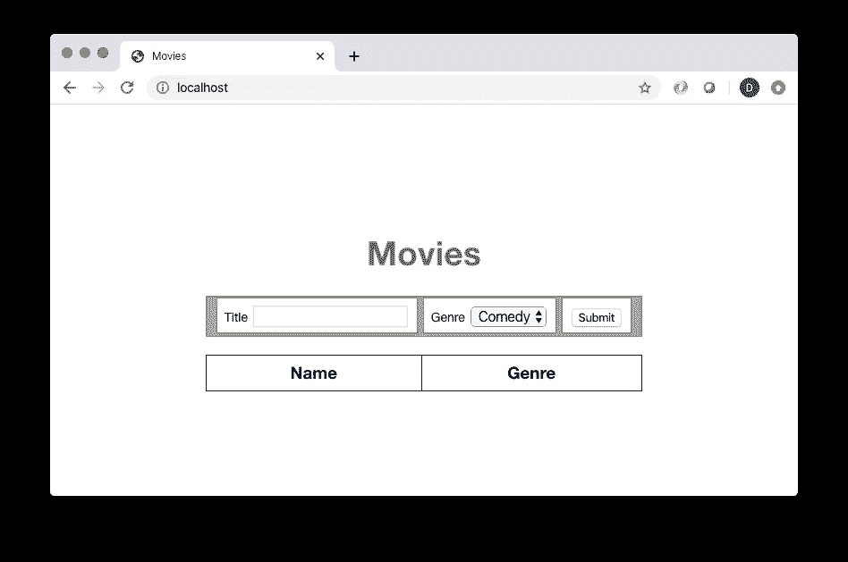

结果应该看起来很熟悉。现在，让我们添加几部电影:

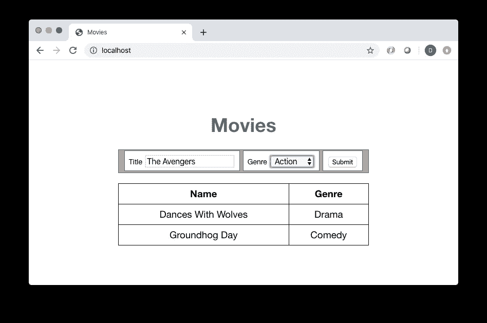

刷新浏览器，你的电影将被重新获取和渲染。

## 结束学分

如果您遇到了任何问题，您可以根据这个存储库检查您的代码:

[](https://github.com/taubler/movies-react-vertx) [## 陶布勒/电影-反应-vertx

### 示例电影数据库教程，包含 React.js 和 vert . x-taubler/movies-react-vertx

github.com](https://github.com/taubler/movies-react-vertx) 

这是一个用 React 和 Vert.x 构建 web 应用程序的简单演示。下面是一些让它更加充实的想法:

*   向电影模型中添加更多字段。
*   将电影保存在持久数据存储中，例如本地 MongoDB 或 MySQL 数据库，或者云数据存储。
*   使用 [redux](https://redux.js.org/) 来传播 React 应用程序的状态。

否则，抓一碗爆米花，尽情享受你的新 React 和 Vert.x 技能吧！

## 资源

*   https://vertx.io/
*   【https://nodejs.org/en/ 
*   [https://www . taniarascia . com/how-to-install-and-use-node-js-and-NPM-MAC-and-windows/](https://www.taniarascia.com/how-to-install-and-use-node-js-and-npm-mac-and-windows/)
*   [https://solarianprogrammer . com/2018/09/28/installing-open JDK-MAC OS/](https://solarianprogrammer.com/2018/09/28/installing-openjdk-macos/)
*   [https://medium . com/@ maybe Katz/introducing-npx-an-NPM-package-runner-55 f 7d 4 BD 282 b](https://medium.com/@maybekatz/introducing-npx-an-npm-package-runner-55f7d4bd282b)
*   [https://www . code mentor . io/@ niladrisekhardutta/how-to-call-apply-and-bind-in-JavaScript-8i 1 JCA 6 jp](https://www.codementor.io/@niladrisekhardutta/how-to-call-apply-and-bind-in-javascript-8i1jca6jp)
*   [https://reactjs.org/docs/forms.html](https://reactjs.org/docs/forms.html)

觉得这个故事有用？想多读点？只需[在这里订阅](https://dt-23597.medium.com/subscribe)就可以将我的最新故事直接发送到你的收件箱。

你也可以支持我和我的写作——并获得无限数量的故事——通过今天[成为媒体会员](https://dt-23597.medium.com/membership)。