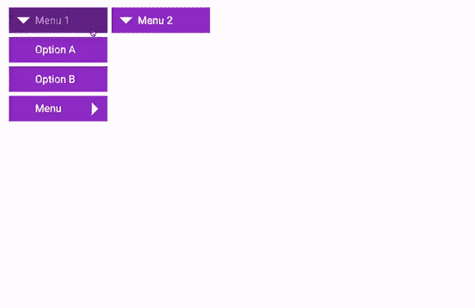
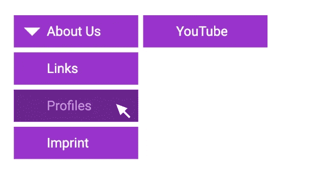
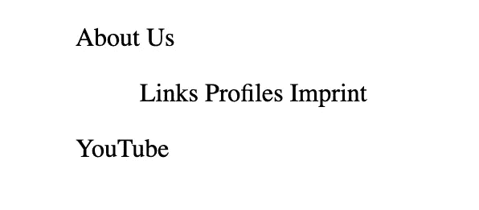
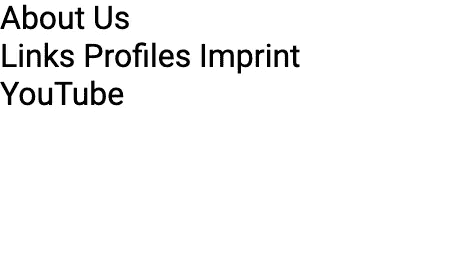
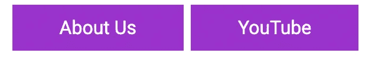
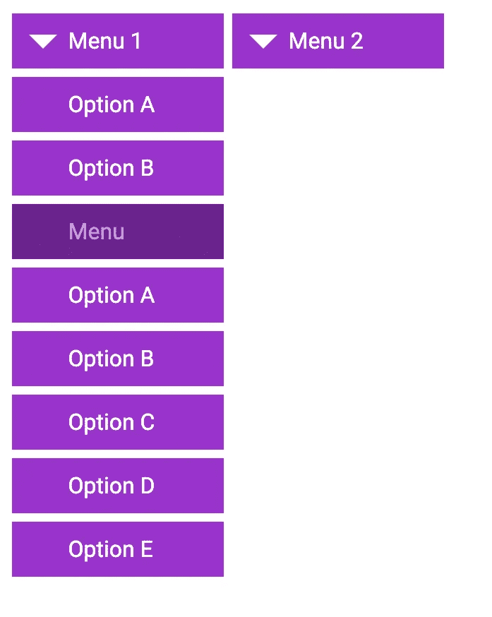
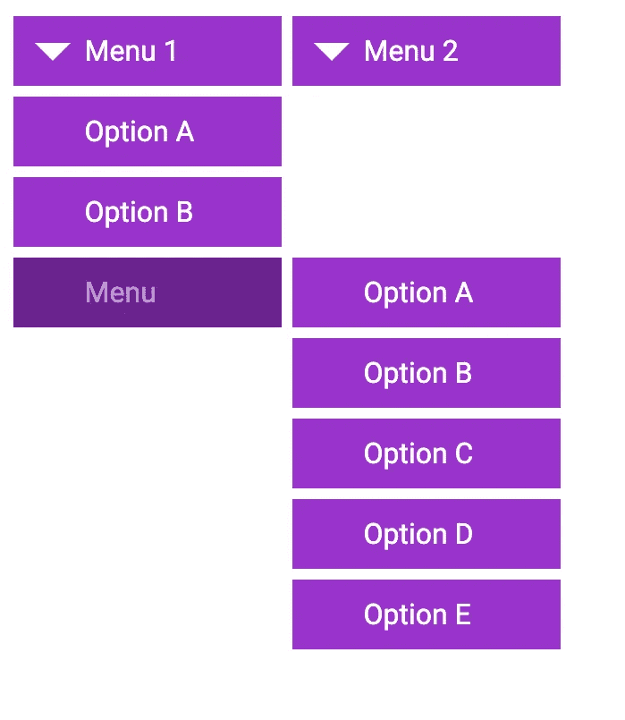
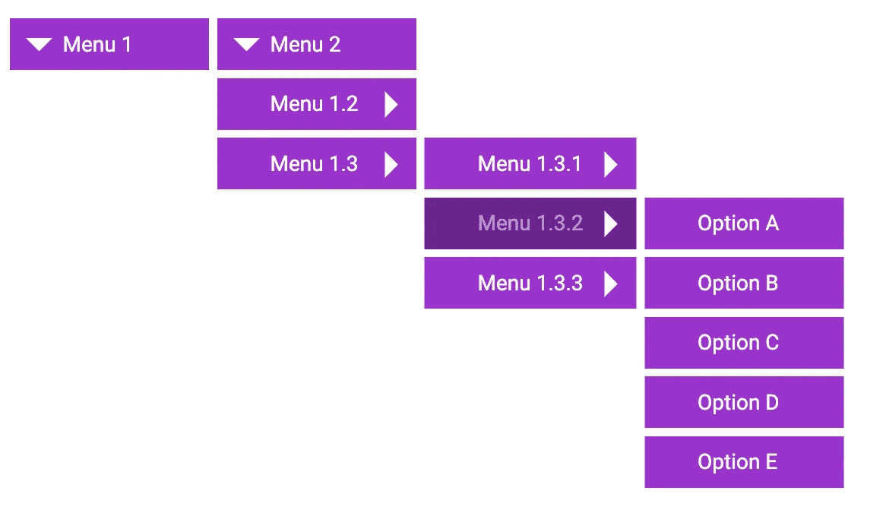

# 不用 JavaScript 构建多层嵌套菜单

> 原文：<https://betterprogramming.pub/build-a-multi-level-nested-menu-without-javascript-ea7629b33e75>

## 让我们使用普通的 HTML 和 CSS



本章的结果

由于平台和浏览器代的不同，当你制作自己的网站菜单时，你不想牺牲重要的功能。

我将向你展示如何用普通的 HTML 和 CSS 构建一个多层次的导航菜单。此外，还有非常方便的外观和感觉期待。

个人方法非常灵活。因此，你应该很容易根据自己的意愿调整菜单结构，并将它们整合到你的网站中。

```
[GitHub-Repo](https://github.com/ArnoldCodeAcademy/animated-html-css-menu)
```

# 序文

在这个例子中，我将使用`nav` HTML 标签作为我的[上一篇文章](https://arnoldcode.medium.com/how-to-build-a-neat-main-menu-for-your-website-without-javascript-8f11114b9989)的替代方法。在那里，您学习了如何提供带有导航链接的菜单，这些导航链接包含`anchor`、`ul`、&、`li`元素。

为了创建未排序列表的替代标签`ul`，我使用了:`menu`。对于单个的列表元素，我将用`menuitem`来代替它们。

这是通过使用[自定义 HTML 标签](https://matthewjamestaylor.com/custom-tags)来完成的。

# 使用导航元素的方法



图 1

HTML 页面将显示一个项目列表，子菜单在单独的行上(*图 1* )。

以下是 HTML body 标签的外观:

这些内容给人的第一印象相当糟糕:



图 3

您要做的第一件事是将 HTML 元素的基本格式设置为 100%，包括字体、间距和宽度。



图 3

然后隐藏所有菜单项，再次显示*关于我们*菜单。这适用于导航下的所有菜单项:

其他属性通过相对于菜单项的正常位置设置菜单项，为每个元素添加换行符，并使光标看起来像一只手，使事情看起来更好。

## 响应指针事件

应对所有指针事件做出反应，以使菜单项在第一级再次可见:

结果，显示了两个条目*关于我们*和 *YouTube* ，但是一个显示在另一个的下面(图 3)。


图 3

## 正确的宽度和高度

如果框大小设置为边框-框，则框的宽度和高度将包括这些距离。

然后给菜单项一个暗兰色背景和白色字体。它是用导航标签里面的锚标签完成的。

最小宽度为 150 像素，填充和边距确保其间距正确。

然而，这两个元素挂在浏览器窗口的左上角(图 4)。


图 4

图 5 显示了它们向上 2ww 和向下 2ww 的情况，以获得更好的光学表示:


图 5

尽管如此，这两个菜单项应该是相邻的。nav 标记中的所有菜单标记都应该将 flex 设置为显示属性:



图 6

因为不是所有的菜单都应该响应光标，我们首先停用它们，并将它们的位置设置为绝对。稍后展开子菜单时，您会需要它:

对于菜单项的锚标记，调整这两个属性以整齐地排列它们，一个在另一个下面

*   空白:nowrap 确保菜单项的文本不换行，
*   **显示:块；**确保每个菜单项各占一行:

通过将不透明度的值设定为 1，您将能够再次看到子菜单:

当您用鼠标指针触摸子菜单项时，它会立即折叠起来。

> 我想保存一个 gif，但是在写这篇文章的时候它已经让我很烦了。请自己尝试一下。

如果将指针事件的值重置为初始值，可以防止这种情况:

使用过滤器，您可以突出显示相应的单幅图块。您可以这样做:使用锚标记的悬停事件的 before 选择器:

基本上，它是原始元素的完整高度和宽度叠加。

通过使用 rgba，降低了颜色的渗透性，并且通过顶部、左侧和位置来控制定位(图 7)。


图 7

最后一步，你要做一个视觉上的改进。主菜单中应该有一个箭头来指示哪些菜单有子菜单。

下面是如何做的(图 8):相应地寻址对象，并使用 after 选择器进行显示:


图 8

# 多级菜单


本章的结果

偶尔需要两级以上的菜单。

我们的目标是用许多折叠菜单来扩展前面的例子。在这种情况下，只有第一级子菜单会垂直显示。其余的关卡将在右边。

在示例中，子菜单被添加到许多级别。和以前一样，这些也要用箭头直观标记。作为第一步，我们通过子菜单点来扩展我们的 HTML 结构:

您会看到子菜单没有出现在第一个子菜单的旁边，它们在第一个子菜单的下面(图 9)。



图 9

通过使用 transform: translateX(any%)沿 x 轴移动对象，可以很容易地重新定位相应的子菜单。然后将其准确定位在顶部和右侧:

现在所有的子菜单都被正确定位了(图 10)。



图 10

以前的菜单仍然缺少一些东西，比如指向子菜单的箭头。与前面的示例一样，选择子选择器并将其链接到 after 选择器:



图 11

# 非常漂亮的动画的最后接触

我们基本上完成了导航的设计。

尽管如此，您可以添加一些视觉效果，比如动画，使第一个子菜单级别从下面浮动进来:

transform 属性允许您控制效果的持续时间。

选择的持续时间越长，运动的效果就越平滑。

你不应该让它超过一秒。否则，会让人分心。我发现 0.7s 是最好的。

当您进入菜单时，您还可以使第二个子菜单级别的元素从右侧向左侧移动:

这份菜单到此为止。


结果

JavaScript 不一定要一直用。哪种菜单适合你取决于你自己。此外，您还可以决定是否要自定义菜单。

```
**Want to Connect?**[Save yourself a lot of time with the Web Developer Cheatcheats and concentrate on the essential subjects.](https://arnoldcodeacademy.ck.page/26-web-dev-cheat-sheets)
```