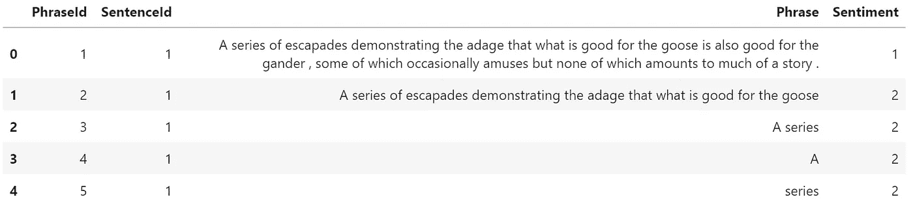
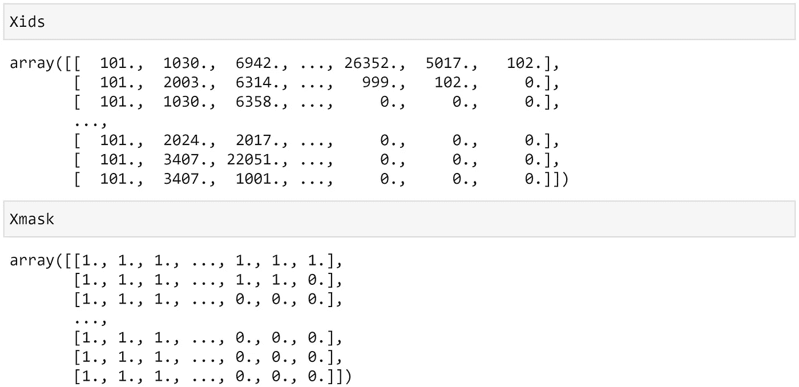
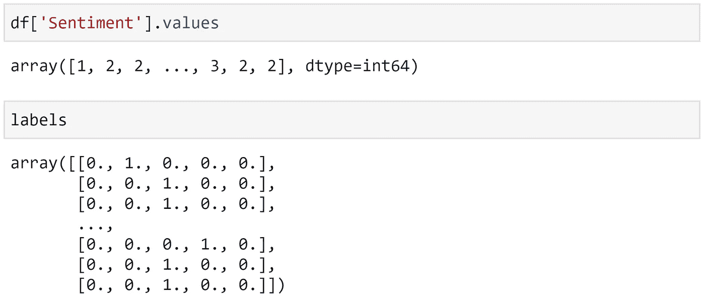
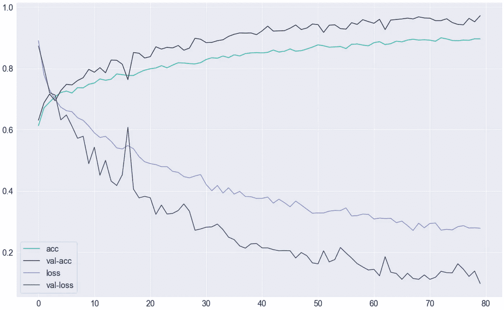

# 用 Bert 和 Tensorflow 构建自然语言分类器

> 原文：<https://betterprogramming.pub/build-a-natural-language-classifier-with-bert-and-tensorflow-4770d4442d41>

## 将先进的变压器模型应用于您的语言问题


乔尔·那仁在 [Unsplash](https://unsplash.com?utm_source=medium&utm_medium=referral) 上的照片

像伯特和 GPT-3 这样的高性能转换器模型正在将大量以前琐碎的基于语言的任务转换成点击的工作，节省了大量时间。

在大多数行业，语言优化的最新浪潮才刚刚开始——迈出他们的第一小步。但是这些幼苗分布很广，而且发芽很快。

这种采用在很大程度上得益于难以置信的低准入门槛。如果你知道 TensorFlow 或 PyTorch 的基础知识，并花一点时间来掌握这个`Transformers`库——你已经成功了一半。

有了`Transformers`库，只需要三行代码就可以初始化一个尖端的 ML 模型——一个由谷歌、脸书和 OpenAI 等公司花费数十亿美元研究构建的模型。

本文将带您了解使用 Google 的 BERT 构建一个利用 transformers 强大功能的分类模型的步骤。

```
**Transformers**
- Finding Models
- Initializing
- Bert Inputs and Outputs**Classification**
- The Data
- Tokenization
- Data Prep
- Train-Validation Split
- Model Definition
- Train**Results**
```

如果你更喜欢视频，我在这里介绍同样的过程:

# 变形金刚(电影名)

## 寻找模型

我们将使用 BERT，这可能是最著名的变压器架构。

为了弄清楚我们需要使用 BERT 做什么，我们前往 HuggingFace 模型页面(HuggingFace 构建了 Transformer 框架)。

一旦到了那里，我们会在头版上同时找到`bert-base-cased`和`bert-base-uncased`。`cased`意味着模型区分大写和小写字符，而`uncased`不区分。

## 初始化

如果我们点击模型，我们会发现更多具体的细节。在这个页面上，我们可以看到初始化模型的代码。因为我们使用 TensorFlow，所以我们的代码将使用`TFAutoTokenizer`和`TFAutoModel`分别代替`AutoTokenizer`和`AutoModel`:

```
from transformers import TFAutoTokenizer, TFAutoModel
tokenizer = TFAutoTokenizer.from_pretrained("bert-base-cased")
bert = TFAutoModel.from_pretrained("bert-base-cased")
```

## Bert 输入和输出

当将文本数据输入到我们的模型中时，需要注意一些事情。首先，我们必须使用`tokenizer.encode_plus(...)`将我们的文本转换成输入 id 和注意力屏蔽张量(稍后会详细介绍)。

BERT 希望这两个张量都作为输入。一个映射到`"input_ids"`，另一个映射到`"attention_mask"`。

另一端，BERT 默认输出两个张量(更多可用)。那些是`"last_hidden_state"`和`"pooler_output"`。

pooler 输出只是最后一个隐藏状态，由线性层和 Tanh 激活函数稍作进一步处理，这也将它的维度从 3D(最后一个隐藏状态)减少到 2D (pooler 输出)。

稍后，我们将消耗最后一个隐藏状态张量，并丢弃 pooler 输出。

# 分类

## 数据

[对电影评论的情感分析](https://www.kaggle.com/c/sentiment-analysis-on-movie-reviews)是一个有趣的数据集(不足为奇)，用于训练和测试情感分析模型。我们可以以编程方式下载并提取它，就像这样:

接下来，我们把它读成一首`Pandas DataFrame`:

让我们快速看一下数据:

```
df.head()
```



数据集充满了这些重复，或短语片段。我们可以通过键入以下命令来删除这些内容:

## 标记化

在`text`列中有我们的文本数据，我们现在需要对其进行标记。我们将使用 BERT 记号赋予器，因为我们稍后将使用 BERT 转换器。

这里我们首先导入 transformers 库，并为使用的`bert-base-cased`模型初始化一个标记器。型号列表可在[这里](https://huggingface.co/models)找到。然后我们定义一个处理标记化的函数`tokenize`。

我们使用 BERT 分词器的`encode_plus`方法将一个句子转换成`input_ids`和`attention_mask`张量。



**Xids** 和 **Xmask** 分别是我们完整的 **input_ids** 和 **attention_mask** 张量。

输入 id 是与特定单词唯一关联的整数列表。

注意掩码是与输入 id 数组中的 id 相对应的 1 和 0 的列表，BERT 读取该列表，并仅将注意应用于与注意掩码值 1 相对应的 id。这允许我们避免关注填充标记。

我们的`encode_plus`论点是:

*   我们的`sentence`。这只是一个代表一条 tweet 的字符串。
*   我们的编码输出的`max_length`。我们使用值`32`,这意味着每个输出张量的长度为 32。
*   我们用`truncation=True`剪切长度超过 32 个标记的序列。
*   对于短于 32 个标记的序列，我们使用`padding='max_length'`用零填充它们，长度达到 32。
*   BERT 使用几个特殊的标记来标记序列的开始/结束，用于填充、未知单词和屏蔽单词。我们添加那些使用`add_special_tokens=True`的。
*   伯特也接受两个输入，即`input_ids`和`attention_mask`。我们用`return_attention_mask=True`提取注意力面具。
*   默认情况下，记号赋予器将返回一个记号类型 IDs tensor——这是我们不需要的，所以我们使用`return_token_type_ids=False`。
*   最后，我们使用 TensorFlow，所以我们使用`return_tensors='tf'`返回 TensorFlow 张量。如果使用 PyTorch，使用`return_tensors='pt'`。

最后，我们返回两个张量。我们预先初始化我们的两个`Xids`和`Xmask`数组，然后使用一个简单的 for 循环用我们编码的张量填充它们——将`tokenizer`应用到我们数据集的每个句子。

## 数据准备

我们现在需要为训练准备数据。为此，我们将对我们的目标标签进行一次性编码，为每个样本创建一个简单的双输出向量，其中`[1, 0]`表示负面情绪，`[0, 1]`表示正面情绪。



一键编码。前(上)后(下)。

整个过程可能需要一些时间。我喜欢保存编码后的数组，这样如果有任何问题或者为了将来的测试，我们可以从这里开始。

现在我们有了所有编码的数组，我们将它们加载到一个 TensorFlow dataset 对象中。使用数据集，我们可以轻松地对数据进行重组、重排和批处理。

## 训练-验证分割

训练模型之前的最后一步是将数据集分成训练集、验证集和(可选的)测试集。在这里，我们将坚持简单的 90–10 训练验证分割。

## 模型定义

我们的数据现在已经准备好了，我们可以定义我们的模型架构了。我们将使用伯特，其次是 LSTM 层，和一些简单的神经网络层。伯特后面的最后几层是我们的分类器。

我们的分类器消耗来自 BERT 的输出隐藏状态张量——使用它们来预测我们看到的是积极情绪还是消极情绪。

## 培养

我们现在可以训练我们的模型了。首先，我们设置优化器(Adam)、损失函数和准确性度量。然后，我们编译模型，训练！

# 结果

第一，这种模式需要长时间的训练。我发现更方便的做法是对数据集进行子采样，找出哪些有效(但主要是哪些无效)，并从那里继续前进。



最终模型指标。

最终模型的训练集准确率为 89.6%，验证集准确率为 97.16%！对于难以阅读的推文，经过最少的预处理，这是一个令人印象深刻的结果。

在这篇文章中，我将解释保持在最低限度，目的是展示预处理数据和训练模型的完整过程——没有太多的膨胀。

如果你确实想了解更多关于变形金刚的一般知识，或者我们在这里采取的具体步骤，我已经在几篇文章中更深入地介绍了变形金刚:[这里](https://towardsdatascience.com/evolution-of-natural-language-processing-8e4532211cfe)，[这里](https://towardsdatascience.com/how-transformers-work-6cb4629506df)，以及[这里](https://towardsdatascience.com/tensorflow-and-transformers-df6fceaf57cc)。

我希望你喜欢这篇文章！如果你有任何问题，请通过 [Twitter](https://twitter.com/jamescalam) 或者在下面的评论中告诉我。如果你想要更多这样的内容，我也会在 YouTube 上发布。

感谢阅读！

# 来源

[🤖带变压器的 NLP 课程](https://bit.ly/nlp-transformers)