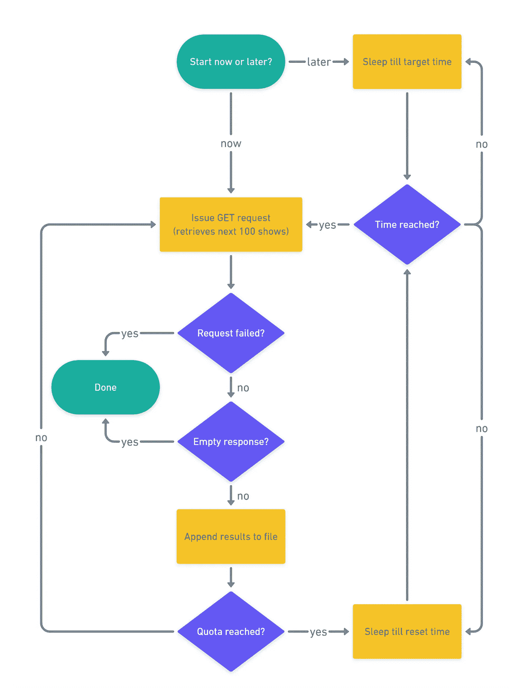

# 用 Python 构建网飞 API 挖掘器

> 原文：<https://betterprogramming.pub/build-a-netflix-api-miner-with-python-162f74d4b0df>

## 一个命令行应用程序检索网飞显示信息

使用来自 [Flaticon](/www.flaticon.com) 的 [Pixel perfect](https://www.flaticon.com/authors/pixel-perfect) 、 [Smashicons](https://smashicons.com/) 和 [Freepik](https://www.freepik.com) 的资产创建

我目前正在开发一个 Android 应用程序，它可以随机选择一个在网飞上观看的节目。为此，我需要获得最新的演出信息。虽然网飞本身没有提供官方的公共 API，但 unogsNG 提供了次好的东西，它同时提供了一个[网站](http://unogs.com/)和一个 [API 服务](https://rapidapi.com/unogs/api/unogsng/)。

最初的想法是，每当用户需要随机挑选节目时，就发出一个 API 请求。然而，当我了解到你每天只能收到 100 个免费请求，超过这个数量就要收费，我意识到我需要改变策略了。

我想到的是一个 Python 脚本，它在不超过每日配额的情况下连续查询 API 服务，然后休眠，直到配额被重置。重复这一过程，直到检索到所有的演出信息。然后，应用程序将使用本地存储的信息，而不是使用实时数据。

# 算法

为了编写脚本，我需要准确理解 API 服务是如何运行的。以下是要点:

*   每天 100 个免费请求
*   每个请求最多 100 个结果
*   订阅 API 服务时重置每日配额
*   每个响应都包含一个标头，显示剩余的空闲请求数

有了这些信息，算法可以如下所示:

显示矿工操作的流程图

# 组件和依赖关系

这个程序可以分成三个部分。首先是主入口点，它涉及负责 API 请求、数据存储、使用监控等的逻辑。这里，我们将依赖于[请求](https://github.com/psf/requests)，一个简单的 HTTP 库，用于与 API 服务通信。

第二个组成部分涉及调度上述逻辑的执行。这实质上意味着设置配额重置时间，并在发出新的一批请求之前等待，或者如果用户将初始一批请求设置为在某个时间触发，则等待。为此，我们将依赖于 [schedule](https://github.com/dbader/schedule) ，一个易于使用的作业调度库。

最后，最后一个组件涉及命令行界面(CLI)的逻辑，我们将通过它来执行程序。这里将使用 Python 的内置 [argparse](https://docs.python.org/3/library/argparse.html) 库，因为它具有强大而简单的特性。在定义命令行参数时，这将给我们带来很大的灵活性。

# Miner 实现

说完这些，让我们首先来看看主入口点的代码，并浏览一遍。为了清楚起见，我把它分成了几个部分，但是整个文件可以在这里找到。

导入、CLI 初始化和全局变量

首先，我们来看看进口。或许除了`_cli`之外，这些都很简单。`_cli`是包含命令行界面逻辑的模块。我们通过在第`9`行调用`init_cli()`来初始化它，它返回一个包含我们为参数传递的值的对象。命令行界面接受三个可选参数:`buffer`、`offset`和`exec_time`。

`buffer`允许我们从每日配额中指定未使用的请求数量。`offset`允许我们指定从哪个索引开始检索结果。例如，偏移量 100 表示从第 100 个节目开始。然而，在大多数情况下，人们会从偏移量 0 开始，因此，这是默认值。最后，`exec_time`是脚本应该实际开始运行的时间。命令行界面的代码将在后面的[中详细讨论。](#b056)

`remaining_quota`是我们跟踪剩余的空闲请求数量的地方。它被初始化为一个高于缓冲区的值，这样第一个请求就不会失败。在执行脚本之前，您需要确保至少还有一个自由请求。其原因将在[位](#8e2e)中变得清楚。

`done`向程序发出停止信号，如果满足终止条件，则设置为真。也就是说，如果请求失败或者没有更多数据可用。最后，`data`存储收集的演出信息以及收集的演出总数。

API 请求变量

然后，我们定义端点的 URL、特定的查询和一些头。注意，你需要提供你自己的 API 密匙，一旦你注册了就可以使用。这里使用的查询很简单:只检索带有英文字幕的节目，并按添加的日期对结果进行排序。

现在问题的实质来了。这是发出请求并存储其结果的地方，直到每日配额(考虑缓冲区)用尽。

主要执行任务

每次请求之前，我们都会检查我们是否仍在每日限额内。然后将当前偏移量附加到查询中，并发出请求。如果请求成功，我们用相应的响应头值更新剩余配额。

不包含`results`属性的响应是我们的线索，没有更多的结果要检索。因此，我们在第 12 行检查这一点，如果不是这样，我们在将偏移量增加 100 以准备下一个请求之前，将检索到的节目附加到`data`。最后，更新显示计数，并将结果写入 JSON 文件。

如果您对`global`关键字感到疑惑，例如第 3 行的`global offset`，它用来向解释器发出信号，当我们给它赋值时，我们并没有创建一个新的名为`offset`的局部变量，而是简单地给已经存在的同名全局变量赋值。

还记得我说过在执行脚本之前需要确保至少还有一个自由请求吗？这是因为，正如您在上面所看到的，至少有一个请求总是被发出——不管您实际上是否还有空闲的请求。这有点像先有鸡还是先有蛋的情况:你需要一个请求来知道还有多少自由请求。当然，最好的做法是在执行脚本之前通过在线平台检查您的使用情况。但是，如果您忘记了这样做，并且在重置时间之前错误地再次运行了脚本，那么设置缓冲区就派上了用场，因为缓冲区更有可能使未使用的空闲请求仍然存在。

最后但并非最不重要的一点，我们来看看日程安排。

任务计划程序

我们首先检查用户通过命令行指定的执行时间。`now`将触发立即执行，并将安排脚本每天在开始时定义的默认时间唤醒。如果指定了一个特定的时间，而不是`now`，任务将被安排在每天的那个时间，程序将一直休眠到那个时间。

第`3`行上的检查是为了确保在第一次调用`job()`期间，如果终止条件之一已经满足，则没有任务被调度。

while 循环一直运行，直到满足终止条件。在它里面，在第`12`行，直到下一个预定任务的时间被确定，程序一直休眠到那时。一旦达到该时间，剩余配额将被重置，任务将再次执行。

# CLI 实施

与所有这些相比，命令行界面的代码相对简单。同样，为了清楚起见，我把它分成了两个部分，但是整个文件可以在[这里](https://gist.github.com/osharaki/763b4c1b303b7d762c9fe6aff5bb56e7)找到。

我们首先定义三个类型检查函数，每个函数对应一个命令行参数(CLAs)。这些函数根据我们定义的一些规则验证我们提供的参数，并在参数不符合时引发异常。

CLI 类型函数

从上到下，`buffer_type`确保为缓冲区提供的值是一个介于 0(即用尽所有可用请求)和 100(即不发出任何请求)之间的整数。

`time_type`确保提供的执行时间是一个字符串，其值为`now`或 24 小时制的小时后跟分钟(即 HH:mm)

最后，`offset_type`确保偏移量是 100 的非负倍数。

为了创建参数，我们定义了`init_cli()`，其中我们为每个 CLA 调用`add_argument()`一次，每次传递适当的值。

CLI 参数

`add_argument()`将 CLA 的名称作为第一个参数。这里我们分别用`-b`、`-t`和`-o`表示缓冲区、执行时间和偏移量。

`[dest](https://docs.python.org/3/library/argparse.html#dest)`是代表`[Namespace](https://docs.python.org/3/library/argparse.html#argparse.Namespace)` [对象](https://docs.python.org/3/library/argparse.html#argparse.Namespace)中 CLA 的属性名，由`parser.[parse_args()](https://docs.python.org/3/library/argparse.html#argparse.ArgumentParser.parse_args)`返回。当我们访问这个类的时候，我们一开始就看到了这一点。比如`args.offset`。这里，`args`包含了`Namespace`对象，`offset`是通过`dest="offset"`赋予属性的名称。

继续，`[type](https://docs.python.org/3/library/argparse.html#type)`确定由指定类型指定的 CLA 的有效性。这种类型可以是内置类型或函数，也可以是用户定义的函数，就像我们程序中的情况一样。

由于我们的类是可选的，如名字中的前导`-`所示，例如`-t`，我们利用`[default](https://docs.python.org/3/library/argparse.html#default)`为它们设置默认值，以防它们被省略。

在`[help](https://docs.python.org/3/library/argparse.html#help)`中，我们提供了一个 CLA 的简要描述，该描述在程序使用`-h`选项运行时显示。

最后，`[metavar](https://docs.python.org/3/library/argparse.html#metavar)`允许我们为类指定简短的描述符或替代名称。这些然后被用来在帮助消息中引用单独的类。例如，如果没有为偏移量指定一个`metavar`值，那么在程序生成的帮助消息中，它将被简单地称为`[-t T]`。通过指定`metavar="now|HH:mm"`，它被描述为`[-t now|HH:mm]`。

综上所述，假设入口点被命名为 *unogs_miner.py* ，程序现在可以运行，例如，使用:

`python unogs_miner.py -t now -b 5 -o 500`

# 结束语

事实证明，目前数据库中有近 12，000 个节目，这意味着需要 120 次请求(或每天 100 次请求，两天)才能检索到所有节目。我最初设计这个程序是为了不停地运行我的 Raspberry Pi(它正在收集架子上的灰尘),直到检索到所有结果。可以理解的是，如果你没有树莓派，也不想让电脑连续运行两天，你可以这么做。

只需从代码中删除调度部分。现在，程序不是休眠，而是在达到每日限额时终止。重置配额后，您可以手动重新运行它。但是，您需要添加一条语句来跟踪最后到达的偏移量，并在下次运行脚本时将其作为参数传递，以便它从该点开始检索结果。

谢谢你留下来！一如既往，我很乐意听到你的想法，并回答你可能有的任何问题。

# 资源

*   [Python 的请求库(指南)|真正的 Python](https://realpython.com/python-requests/)
*   [在 Python | Real Python 中使用 JSON 数据](https://realpython.com/python-json/)
*   [argparse | Python 文档](https://docs.python.org/3/library/argparse.html)
*   [日程| GitHub](https://github.com/dbader/schedule)
*   [请求| GitHub](https://github.com/psf/requests)