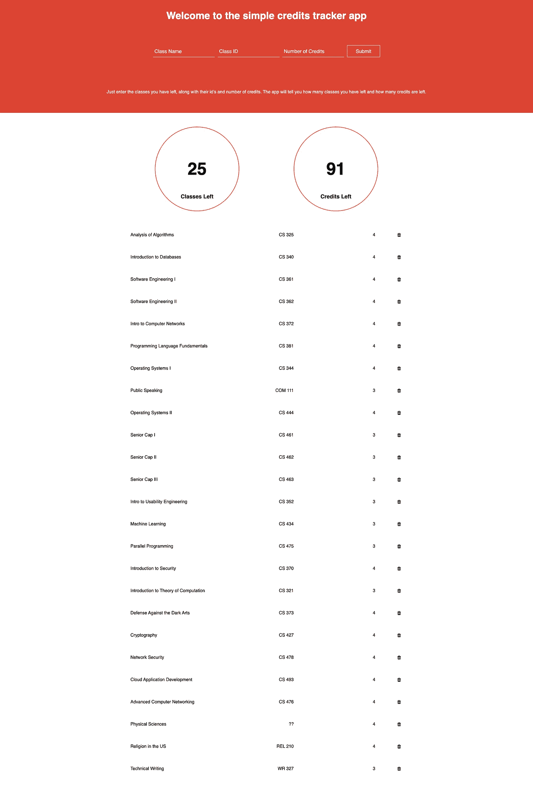

# 构建一个 Node.js 应用程序来记录你的大学学分

> 原文：<https://betterprogramming.pub/build-a-node-js-app-to-keep-track-of-your-university-credits-cd8ed16e5b89>

## 为你的作品集创建一个简单的网络应用


约书亚·阿拉贡在 [Unsplash](https://unsplash.com?utm_source=medium&utm_medium=referral) 上拍摄的照片

如果你正试图建立你的个人投资组合，或者只是想要一个简单的网络应用项目，这里有一个很好的项目想法给你。

在本教程中，我将带您了解如何构建一个简单的 Node.js 应用程序来跟踪您的大学学分。

本教程假设您至少具备 JavaScript 和命令行的工作知识。Node.js 生态系统的一些知识也是有帮助的，但是由于教程的目的是解释这些 Node.js 相关技术是如何协同工作的，所以我不会假定有什么先验知识，并且会尽我所能在我们进行的过程中解释底层概念。

# 高级概述

该项目将构建为 Node.js 应用程序。我们将使用 Express.js 作为我们的框架。对于我们的数据库组件，我们将使用 MongoDB 和 Mongoose 对象建模。最后，我们将使用 Pug.js 作为我们的前端模板引擎。

在直接进入代码之前，让我们暂停一下，解释一下我们为什么选择这些特定的技术，以及它们是如何协同工作的。

基本上，我们的 web 应用程序将由三个组件组成:客户端、服务器端和数据库。

客户端是我们应用程序的前端；用户与其交互并在浏览器中看到的一面。

服务器端是应用程序的后端；处理用户请求并为用户提供页面的一面。服务器端还与数据库来回通信，以确保信息指向正确的位置。

最后，数据库存储应用程序的所有数据。这使得数据变得永久或“持久”,甚至在我们关闭浏览器中的应用程序之后。

理解 web 应用程序的这三个组件如何协同工作远比理解我们将用来实现这些组件的特定技术重要得多。

需要明确的是，Node.js、Express.js 和我们将使用的其他花哨技术只是流行的、已经构建好的工具，我们可以利用它们来帮助我们构建 web 应用程序的组件。如果我们真的想的话，我们可以使用几十种其他技术来达到同样的目的。例如，如果我们愿意，我们可以使用 React 代替 Pug 作为我们的前端。或者，我们可以使用不同的框架，如 Vue.js，而不是 Express.js。

关键在于，每种技术都只是实现我们的 web 应用程序的三个主要组件的不同方面的一种特定方法。在阅读教程的过程中，更多地关注底层概念，而不是实现细节。如果你真的理解我们在做什么，在本教程结束时，你应该能够更容易地掌握其他框架和技术。

记住，任何人都可以复制代码，但是理解你为什么做你正在做的事情总是更重要。

记住这一点，下面是构建我们的 web 应用程序的步骤。如果你需要的话，可以随意在不同的步骤之间跳来跳去或者暂停一下，以便更详细地理解事情。在每一步，我都将包含更多资源的链接，这样您就可以在继续下一步之前完全理解这些内容。

# 目录

```
1\. Plan out the Project
2\. Initialize the Project and Install Dependencies
3\. Set Up Folder Structure
4\. Build the Server
5\. Connect the Database
6\. Build the Models
7\. Define the Routes
8\. Build the Controllers
9\. Build the UI
10\. Putting It All Together
```

# **规划项目**

我们的目标是建立一个简单的小 web 应用程序，跟踪我们还剩多少学分可以毕业。

这个应用程序会让我们一个接一个地进入课堂。然后，它会显示一个所有已报名课程的列表，以及还剩多少课程和多少学分的记录。

最后，该应用程序将让我们在完成课程后从列表中删除它们。删除功能将自动更新我们剩余的课程和学分。

真的是这样。没有花哨的功能或铃声和口哨。只是一个简单的添加功能，删除功能，以及更新类和学分的计数。

因为我们的应用程序非常小，所以我们计划将它构建为只有一个页面的服务器呈现的应用程序。

# 初始化项目并安装依赖项

第一步是确保您的计算机上安装了 Node.js。Node.js 的下载方式有很多种，参考一下 Node.js 网站的下载页面[这里](https://nodejs.org/en/download/)。

一旦下载了 Node.js 或者您的计算机上已经有了它，您可以在终端中使用以下命令来检查您的版本是否正确:

```
node -v
```

对于本教程，我使用的是 Node.js 版本 10.13.0，这是一个旧版本。

Node.js 自带名为 npm 的包管理器，帮助您向项目添加依赖项并保持更新。

您可以使用类似的命令检查您安装了哪个版本的 npm:

```
npm -v
```

我使用的是 7.16.0 版本，这也是一个旧版本。

在本教程中，我们将使用 npm 向项目添加依赖项，并初始化 Node.js 项目。如果你不明白如何使用 npm，查看他们的文档[这里](https://docs.npmjs.com/)。

同样，Node.js 是我们应用程序的运行时。如果您不熟悉 Node.js 或运行时的概念，可以在这里查看他们的文档。在这里[还发表了一篇很棒的文章](https://medium.com/free-code-camp/what-exactly-is-node-js-ae36e97449f5)，我发现这篇文章特别有帮助。

要启动我们的项目，请导航到您想要存放项目的文件夹并运行命令

```
npm init
```

这将为您的项目初始化一个`package.json`文件。本质上，package.json 文件告诉我们关于项目的所有重要信息，包括依赖项、版本号和作者信息。

如果你想了解更多关于`package.json`文件的信息，请看文档[这里](https://docs.npmjs.com/cli/v7/configuring-npm/package-json)。

接下来，我们需要安装我们的框架和依赖项。

要安装 Express.js，请使用以下命令:

```
npm install express --save
```

该命令提示节点包管理器在我们的项目文件夹中安装 Express.js，并将其保存在我们的 package.json 文件的依赖项列表中。

对于这个项目，我们将只使用另外五个依赖项。每个都以相同的方式安装。

要安装 MongoDB，我们将在数据库中使用它:

```
npm install mongodb --save
```

安装 Mongoose，我们将使用它来创建我们的对象模型:

```
npm install mongoose --save
```

安装 Pug，我们将使用它作为我们的前端:

```
npm install pug --save
```

安装 body-parser，这是一个中间件，我们将使用它来解析 HTTP 请求:

```
npm install body-parser --save
```

最后，安装`async`，它是一个帮助我们使用异步 JavaScript 的模块:

```
npm install async --save
```

仅此而已。我们的`package.json`文件现在已经设置好了，我们的依赖项也安装好了。

现在是时候开始构建项目了。

# 设置文件夹结构

我们将把我们的项目分成六个基本文件夹。当我们用`npm init`命令初始化我们的项目时，Node.js 会自动创建一个`/node_modules`文件夹和`package.json`文件，所以我们不必担心设置它们。

其他五个文件夹，我们将自己创建。我们将在整个教程中引用每个文件夹。现在，你的文件夹结构应该是这样的。

开始文件夹结构

# 构建服务器

我们的第一步将是设置我们的服务器。

为此，我们首先在项目的根目录下创建一个名为`app.js`的文件。`app.js`文件将存放我们所有的服务器端代码，并作为整个项目的主文件。

在`app.js`中，我们将使用`require()`函数将 Express.js 挂接到我们的应用程序中。然后，我们将创建一个名为`app`的 Express.js 实例。

接下来，我们将使用该应用程序启动我们的服务器，并在端口 3000 上监听连接:

此时，我们应该能够通过在终端中调用以下命令来设置我们的服务器运行:

```
node app.js
```

如果我们设置正确，您的终端应该会显示:

```
Running on localhost: 3000
```

# 连接数据库

下一步是将 MongoDB 数据库连接到项目。

在这样做之前，请确保您的计算机上安装了 MongoDB。

您可以使用以下命令检查您安装了哪个版本的 MongoDB:

```
mongod --v
```

对于本教程，我有 MongoDB 版本 4.4.0。如果您还没有安装 MongoDB，您可以使用 homebrew 通过命令来安装它

```
brew tap mongodb/brew
brew install mongodb-community@5.0
```

关于这两个命令的更详细的解释，或者如果你还没有安装 homebrew，请随意查看 MongoDB 的文档[这里](https://docs.mongodb.com/manual/tutorial/install-mongodb-on-os-x/)。

一旦安装了 MongoDB，我们可以用几种不同的方法来建立数据库连接。对于这个项目，我们将通过 Mongoose 进行本地连接。

为此，我们将在我们的`app.js`文件中添加以下代码:

在上面的代码片段中，我们正在导入 mongoose 包。然后，我们使用 mongoose 打开一个到 MongoDB 服务器的连接，该服务器运行在本地端口 27017，并使用一个名为`credits-tracker`的数据库。

当我们成功连接到我们的本地数据库时，控制台将输出一条消息说“使用 mongoose 成功连接到 MongoDB！”

关于这一切是如何工作的，我们可以在这里了解更多，但是现在，我们已经成功地连接到我们的数据库，并可以开始在那里存储持久数据。

# 建立模型

一旦我们连接了数据库，我们将需要建立一些模型。

我们只需要为我们的项目建立一个模型:信用模型。

对于不熟悉对象建模概念的人来说，Mongoose 是一个对象文档映射器(ODM ),它帮助我们将 JavaScript 代码中的类和对象映射到存储在 MongoDB 数据库中的文档。模型帮助我们定义什么类型的数据将存储在我们的数据中，以及我们计划如何组织它。

同样，我们还可以在这里了解更多内容，但是现在，我们就到此为止。如果你想了解更多关于 Mongoose 的内容，请点击这里查看他们的文档。

我们将在`/models`文件夹中创建一个名为`credit-model.js`的文件。文件中的代码如下所示:

这是一个模型能得到的最简单的东西。

使用命令`Mongoose.Schema`我们定义一个信用模型。我们的模型只有三个属性:`name`、`credits`和`classId`。对于每个属性，我们还指定每个属性必须存储什么类型的数据。Name 和`classId`都接受一个`String`数据类型，而`credits`接受一个`Number`数据类型。

这个猫鼬模型帮助我们组织和概念化我们的数据。

# 定义路线

接下来，连接数据库并定义模型后，让我们定义所需的路线。

如果您在学习本教程时对路由的概念不熟悉，那么我们在这里所做的基本上就是定义哪个函数将处理我们项目的哪个方面。当用户搜索或导航到一个特定的 URL 时，我们的路由器将决定哪个函数将处理对该特定 URL 的请求。

对于这个项目，我们只需要三个路径:对`/`的 GET 请求(显示我们的主页)，对`/submit`的 POST 请求(处理我们的添加新类表单)，对`/delete`的 POST 请求(处理我们的删除类功能)。

这三条路线将处理我们的 web 应用程序的所有用户交互。我们将在一个名为`routes.js`的文件中定义所有三条路线，该文件位于我们的`/routes`文件夹中。该文件将包含以下代码:

这就是我们所需要做的，以确保 HTTP 请求被正确的函数处理。该文件只是告诉服务器，当任何人向`/` 提交 GET 请求时，调用`display_credits`函数。同样，相同的模式处理对`/add`和`/delete`的 POST 请求

此时，如果您运行这段代码，您将会得到一个错误。这是因为我们实际上还没有定义这些函数来处理 HTTP 请求。

我们现在就来建造它们。

# 构建控制器

为了让我们的路径工作，我们现在将在名为`credit-controller.js`的控制器文件中构建我们的控制器函数，该文件位于`/controllers`文件夹中。

控制器本质上只是处理对特定 url 的 HTTP 请求的功能。就像我们之前讨论的，路由定义了哪个控制器应该处理哪个请求。然后，控制器自己完成剩下的工作。

对于这个项目，我们需要三个控制器。一个显示我们所有的学分，一个添加新的学分，一个删除学分。

首先，控制器显示所有的学分。这个控制器所要做的就是在数据库中查询所有现有的信用。使用`Model.find()`命令，Mongoose 可以非常容易地实现这一点。`Model.find()`是 Mongoose 提供的几个函数之一，它让我们根据各种参数在数据库中搜索特定的项目。

所有这些函数都返回一个查询对象，该对象应该包含我们以 iterable 形式请求的所有项目。你可以在这里找到 Mongoose 提供的查询方法[的完整列表。](https://mongoosejs.com/docs/queries.html)

但是现在，知道`Model.find()`方法返回数据库中匹配任何输入参数的所有文档就足够了。请注意，如果我们不输入任何参数，如下例所示，我们只是得到数据库中所有文档的列表。下面是我们项目的代码:

接下来，我们将构建控制器来添加新的信用。同样，Mongoose 也很容易做到这一点。我们需要做的就是创建一个新的信用对象，它有三个属性:名称、信用数量和`classId`。然后，我们将新创建的对象保存到数据库中。我们是这样做的:

最后，要删除一个信用，我们需要一个控制器，根据它的 id 查找指定的信用。为了寻找这一点，我们将使用猫鼬函数`Model.findById()`。该函数的操作类似于`Model.find()`函数，查找任何与提供的 id 匹配的文档。然后，一旦我们有了信用，我们简单地从数据库中删除它。这方面的代码如下所示:

我们应该注意，从数据库中删除文档实际上有几种不同的方法，包括方法`Model.findByIdAndDelete()`。这种方式在减少我们必须自己编写的代码量方面实际上会更有效一点，但是，最终，您应该只使用对您来说最有意义的方法。

# 构建用户界面

接下来，让我们构建向用户显示数据的 UI。这个项目的用户界面将非常简单。

它只会做几件事。它所能做的就是显示一个添加课程的表格，显示剩余课程和剩余学分的总数，并在底部显示输入课程的列表。

有很多方法可以扩展这个 UI，但是对于本教程，我们将尽可能保持简单。

我们的 UI 将只包含四个 pug 文件、一个简单的样式表和一个来自 font-awesome 的图标。正如我们提到的，`pug`是一个用于渲染我们 UI 的模板引擎。如果你不熟悉模板引擎或 pug 的概念，请随意查看 pug 的文档[这里](https://pugjs.org/api/getting-started.html)。

出于这里的目的，我们将注意到在我们的项目中使用模板引擎的主要优点是能够在包含 HTML 标记的同一个文件中直接进行一些 JavaScript 计算。虽然这对我们来说很方便，但是我们的项目非常简单，如果我们想的话，我们可以用普通的 HTML 编写我们的 UI。

重要的是要注意到这一点，只是为了指出，如果/当它对您的项目来说太大时，有时您不需要使用花哨的第三方库。遵循一般良好的编程实践，尽可能保持简单通常是个好主意。

说到这里，我们将继续使用`pug`，如果只是作为使用这个模板引擎的一个练习。

我们 UI 的主文件将是我们的`index.pug`文件，我们将把它放在`/views`文件夹中。我们还将创建一个名为`style.css`的样式表，放在`/public/css`文件夹中。整个`index.pug`文件将如下所示:

如果上面的代码没有完全显示在介质上，可以在这里找到整个`index.pug`文件。`index.pug`文件大多比较简单。该文件主要由标题、输入学分的表格、段落描述以及显示学分总计和学分列表的主要部分组成。HTML 文件的头还包含一个到我们的样式表`style.css`的链接和一个到字体很棒的文件的链接。

如果您熟悉 HTML 的基础知识，pug 文件很容易翻译。主要要注意的是以`include`开头的行。这些语句允许我们将其他 pug 文件的内容插入到代码中。

第一个包含的文件是`credit_totals.pug`文件。从代码中可以看出，这个文件和其他两个包含的文件将位于`/views/credits`文件夹中。整个文件如下所示:

接下来，`credit_display.pug` 文件:

最后是`delete_credit.pug`文件:

注意这里的`delete_credit.pug`文件包含一个带有隐藏输入和按钮的表单。表单所做的就是在每次点击按钮时向`/delete`端点发送一个删除 HTTP 请求。然后，删除请求将由我们前面讨论过的控制器来处理。

最后，连同我们的 pug 模板文件，我们将创建一个简单的`style.css`文件，如下所示:

因为本教程的主要焦点是构建 Node.js 应用程序，所以我们不会详细讨论样式表。如果你愿意，你可以简单地复制或粘贴。

除了样式表，我们还需要下载 font-awesome 库的本地副本，并将其插入到我们的`/fonts`文件夹中。要下载 font-awesome 的本地版本，只需进入他们的下载页面[这里](https://fontawesome.com/download)并选择一个桌面下载选项。同样，我们在这里不会涉及太多的细节。只要确保你在你的`index.pug` 文件中提供了一个到`font-awesome.min.css`文件的正确链接。

现在，有了这四个 pug 文件和几个 css 文件，我们的整个 UI 就应该构建好了。

# 把所有的放在一起

现在我们已经有了一个 UI 和所有正确的功能，我们的 web 应用程序就完成了！

我们现在有一个简单的应用程序，让我们进入我们的大学课堂，并吐出我们还剩多少课和学分的记录。

以下是最终的文件夹结构:

这是最终项目本身的样子:



感谢阅读。你可以在这里找到完整的源代码。如果你对更多像这样的教程感兴趣，可以看看我写的其他东西:

[](/build-an-article-reader-web-app-using-free-apis-and-javascript-ce1100d43a21) [## 使用免费的 API 和 JavaScript 构建一个文章阅读器 Web 应用程序

### 下面是我如何在一个下午构建一个 web 应用程序

better 编程. pub](/build-an-article-reader-web-app-using-free-apis-and-javascript-ce1100d43a21)