# 在 Next.js 中构建一个带 Google 认证的笔记应用

> 原文：<https://betterprogramming.pub/build-a-note-taking-app-with-google-authentication-in-next-js-f0835d14034e>

## 用 NextAuth.js 在你的 Next.js 应用中实现 Google OAuth

[雅各布·库尔普](https://unsplash.com/@jakeculp?utm_source=medium&utm_medium=referral)在 [Unsplash](https://unsplash.com?utm_source=medium&utm_medium=referral) 上的照片。

在本文中，我们将了解以下内容:

*   使用 [NextAuth.js](https://next-auth.js.org/) 和 Next.js。
*   使用 NextAuth.js 的第三方 Google 认证。
*   维护用户和 Notes 表之间的关系。
*   在我们的数据库上执行 CRUD 操作来读写注释。

# 介绍

所以你用 Next.js 建立了一个每天吸引数百万用户的牛逼博客。为了从你的写作中获得收入，你有了把文章锁在付费墙后面的想法。这样，读者才能支持你。要实现这样的想法，您需要执行以下步骤:

*   建立一个登录系统。
*   检查登录用户是否订阅了您的网站。
*   如果他们是付费会员，让他们继续享受你的内容。
*   另一方面，如果访问者没有登录，则提示他们创建帐户或登录。

然而，让我们面对它:认证是一种痛苦。它需要大量的代码，在某些情况下，维护是一件麻烦的事情。

这就是 Next-Auth.js 的用武之地。它不仅简化了构建用户身份验证的过程，还具有以下优势:

*   Cookies:在 Passport 中，如果你重启你的服务器，你会被自动注销。在 Next-Auth.js 中，这不是问题，因为它已经使用 cookies 来存储会话数据。
*   极其安全:Next-Auth.js 积极推广无密码登录选项。此外，它在代码中使用 CSRF 令牌来确保您的项目没有漏洞。

现在该编码了！

# 项目设置

## 储存库的初始化

这一步相当简单。要实例化 Next.js 项目，请运行以下终端命令:

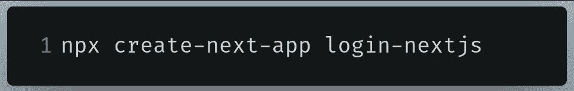

要运行的终端命令

接下来，在项目的根目录下创建一个`.env.local`文件，如下所示:

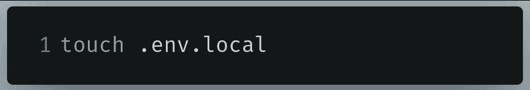

要运行的终端命令

在这里，我们将存储我们的环境变量。

现在让我们继续安装我们的依赖项。

## 模块安装

对于本项目，我们将使用以下模块:

*   `next-auth`:我们项目的要旨。这个库将处理我们所有的基于身份验证的过程。
*   `mongodb`:由于我们将使用 MongoDB 服务器，Next-Auth.js 将使用`mongodb`包作为其依赖项之一。
*   `mongoose`:与我们的数据库交互，对我们的集合执行 CRUD 操作。

要安装这些软件包，请运行以下终端命令:

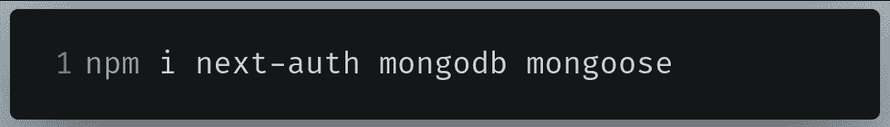

安装模块

现在让我们初始化我们的 MongoDB 服务器。

## MongoDB Atlas 设置

我推荐用 [MongoDB Atlas](https://www.mongodb.com/cloud/atlas) 。它在云中为您设置了一个数据库服务器，不需要任何额外的配置。

首先，登录到 Atlas 页面，然后[按照这些步骤](https://docs.atlas.mongodb.com/tutorial/create-new-cluster/)创建您的第一个集群。完成后，点击“连接”:

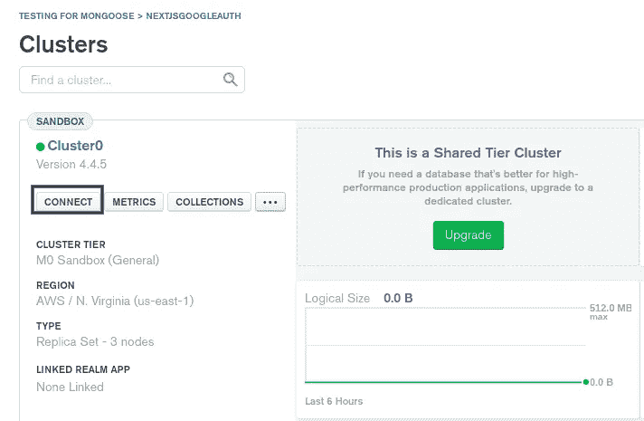

连接到我们的集群

接下来，选择“允许从任何地方访问”:

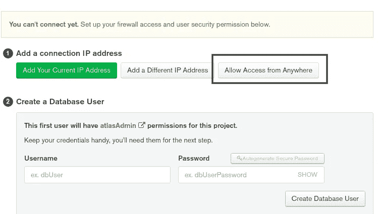

安全设置面板

现在，创建您的用户名和密码，并点击“创建数据库用户”注册为用户。完成后，点击“连接您的应用程序”:

将我们的服务器链接到我们的项目

然后，您将收到您的连接字符串。复制并粘贴到您的`.env.local`文件中:

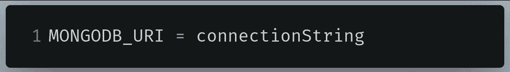

要写入. env.local 的代码

让我们现在开始创建我们的 Google OAuth 凭证。

## 与谷歌的 OAuth

去你的[谷歌开发者控制台](https://console.cloud.google.com/)点击“选择一个项目”接下来，点击“新项目”:

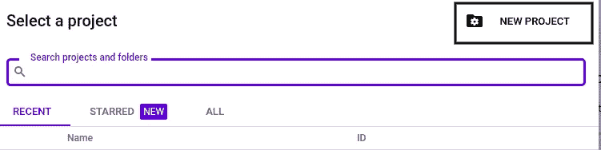

点击“新项目”

完成后，转到侧面板，点击“APIs & Services”接下来，点击“仪表板”:

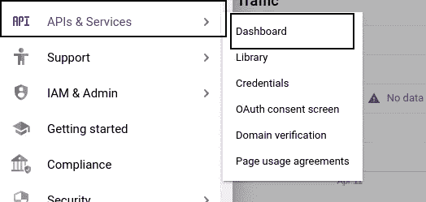

点击“仪表板”

在顶栏上，单击“启用 API 和服务”它将引导您进入 API 库页面。搜索“Google+”并启用它。

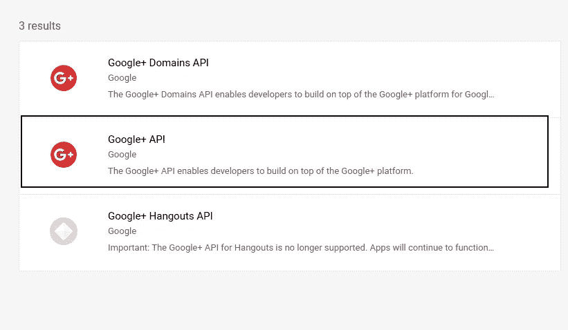

激活 Google+API

该网站现在将引导您进入“启用的 API”页面。首先，选择“凭据”，然后单击“API 和服务中的凭据”链接:

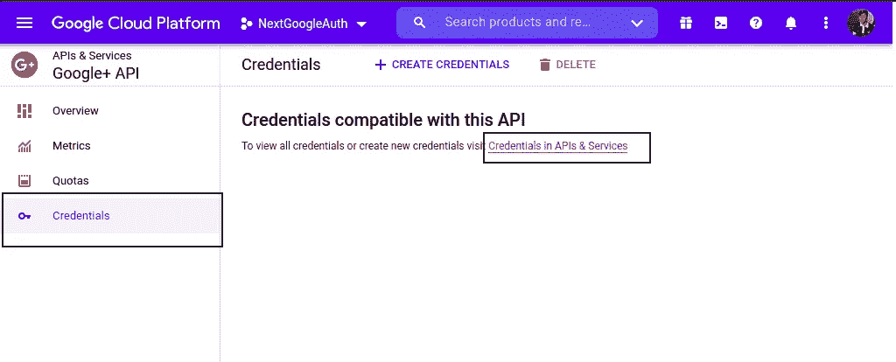

转到“API 和服务中的凭据”

这将把你重定向到主页。单击“创建凭据”，然后单击“OAuth 客户端 ID”:

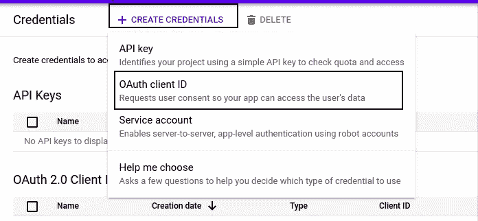

创建 OAuth ID

选择“Web 应用程序”:

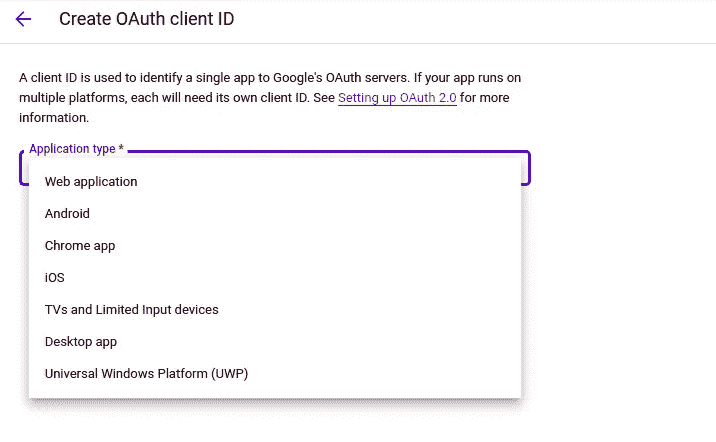

选择“网络应用程序”

现在给你的应用起个名字。完成后，向下滚动到“授权重定向 URIs”并进行如下配置:

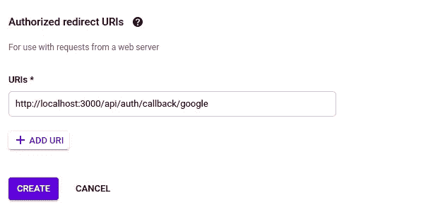

重定向 URIs 设置面板

现在点击“创建”来告诉 Google 构建我们的 OAuth 客户端。您将收到您的客户 ID 和密码:

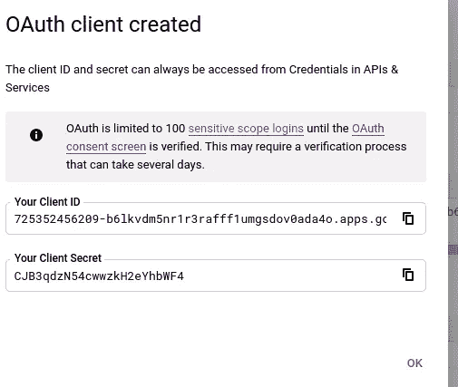

OAuth 密钥

将它们复制到您的`.env.local`文件中，如下所示:

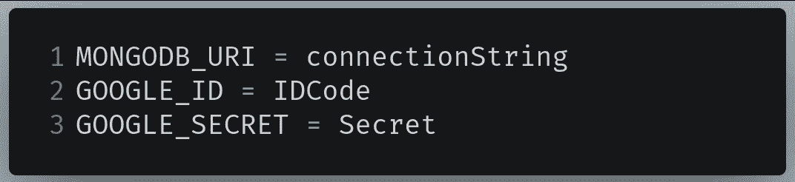

我们的环境变量

我们终于完成了！在下一节中，我们将讨论我们的文件结构。

## 项目文件结构

在项目的根目录中，创建以下文件夹:

*   `models`:将存放我们的猫鼬模型。
*   `helpers`:将持有我们所有的中间件功能。
*   `components`:存储我们的自定义组件，可以在其他文件中重用。

现在进入您的`pages`文件夹，创建这些文件夹:

*   `/api`目录中的`notes`:处理`/api/notes/`航线。
*   `/api`目录中的`auth`:保存用户认证逻辑。
*   `notes`:将处理`/notes`路线。

最后，您的项目结构应该如下所示:

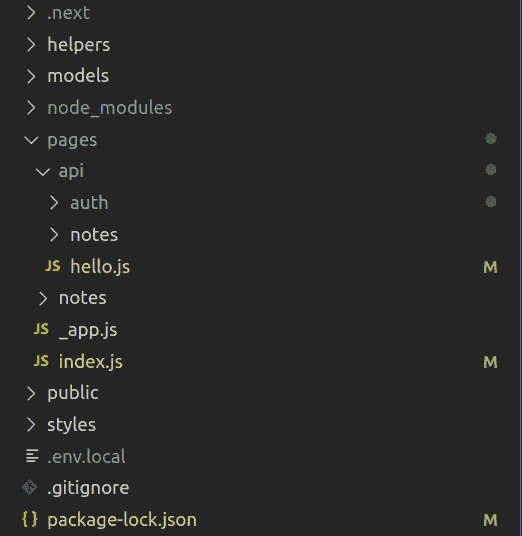

项目的文件结构

我们完了。现在让我们试着构建我们的登录系统。

# 创建我们的登录系统

## 配置后端

在您的项目中，转到您的`/pages/api/auth`目录并创建一个名为`[...nextauth.js]`的文件。这意味着所有以`/api/auth`开头的路径都将由`[...nextauth].js`文件处理。

在`/pages/api/[...nextauth].js`中，编写以下代码:

*   第 1-2 行:导入`NextAuth`模块实现认证。然后导入`Providers`包告诉 Next.js 我们会使用第三方认证。
*   第 6-11 行:告诉 Next.js 我们将只在这个项目中使用 Google OAuth。我们还通过环境变量传递我们的 Google ID 和密钥。
*   第 13 行:使用我们的 MongoDB 数据库实例。连接字符串通过我们的环境变量传递。
*   第 14 行:我们的`session`回调将在用户会话被检查时运行。
*   第 16 行:公开会话的`id`属性，这样我们就可以访问它。这在创建与每个用户相关的笔记时会很有用。

让我们现在建立我们的前端。

## 构建我们的前端

在`/pages/index.js`中，用以下代码替换您的所有代码:

*   第 3 行:使用`useSession`钩子获取登录用户的数据。
*   第 7 行:检查用户是否没有登录(如果`session`没有值)。如果是，提示用户登录。`signIn`方法处理登录功能。
*   第 19 行:如果用户已经登录(如果`session`有值)，那么显示一个退出的选项。`signOut`方法将为我们处理这个问题。
*   第 21 行:在主页上显示用户名。

最后一步是修改我们的`_app.js`文件。在`/pages/_app.js`中，首先导入`Provider`模块，如下所示:

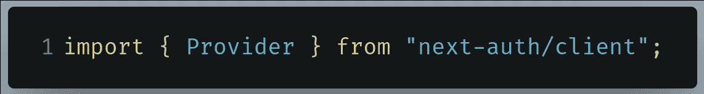

要写入 pages/_app.js 的代码

现在在`/pages/_app.js`中找到下面这段代码:

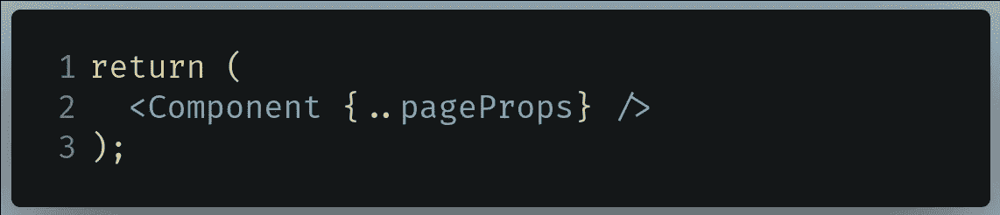

要在 pages/_app.js 中查找的代码

像这样改变它:

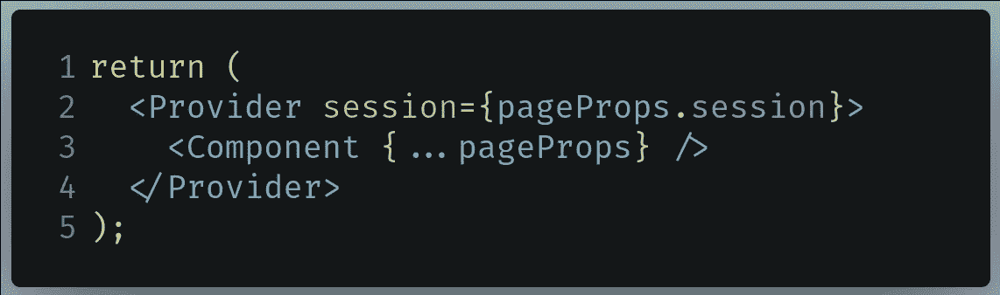

pages/_app.js 中要替换的代码

*   第 2-4 行:用`Provider`标签包装我们的`Component`。这将使我们的会话数据在所有路由中保持不变。

运行代码。这将是结果:

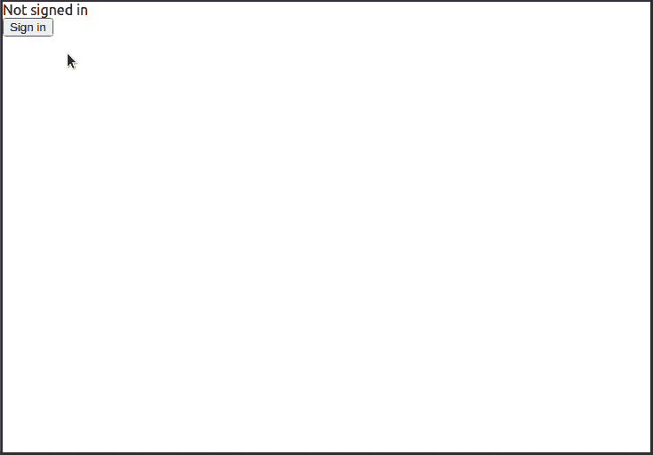

代码的输出

太好了！我们的代码按预期工作。现在让我们构建我们的`Note`组件。

最后，您的`/pages/_app.js`文件应该是这样的:

## 笔记组件

在你的`components`文件夹中，创建一个名为`Note.js`的文件。在该文件中，编写以下代码:

*   第 4 行:我们的`Note`组件将接受两个道具:`id`和`title`。
*   第 5 行:这个`useRouter`实例将帮助我们执行客户端重定向。
*   第 7 行:创建`sendDelete`函数。
*   第 8-10 行:对`api/notes/delete/{id}`路线执行`DELETE`请求。这将告诉服务器通过`id`识别我们的记录，然后删除它。
*   第 11 行:在`DELETE`请求之后，将用户重定向到`/dashboard`。
*   第 16-21 行:显示`title`道具。如果点击，则将用户重定向到`/notes/{id}`路线。这将显示注释的完整详细信息。
*   第 22-24 行:将用户重定向到`/notes/update/${id}`页面。这将允许客户端更新指定的文档。
*   第 25 行:如果点击，调用`sendDelete`函数。

在下一部分中，我们现在将创建我们的仪表板页面。

## 仪表板页面

在你的`/pages`文件夹中，创建一个名为`dashboard.js`的文件。该文件将显示用户所有保存的笔记。

在`pages/dashboard.js`中，编写以下代码:

*   第 6 行:`useSession`钩子会告诉我们用户是否已经登录。
*   第 11 行:如果用户已经登录，显示一条问候消息。
*   第 13-14 行:单击时，用户将被重定向到`notes/add`路线。
*   第 15 行:这个按钮将允许用户注销。如果成功，我们的应用程序会将他们重定向到`/`页面。

运行代码。结果应该是这样的:

代码的输出

然而，让用户手动导航到`/dashboard`页面并不是很好的用户体验。我们需要解决这个问题。

在`pages/index.js`中，找到下面这段代码:

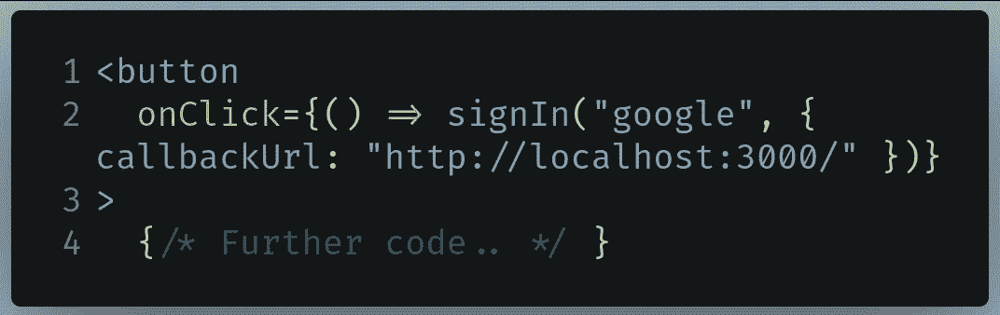

要在/pages/index.js 中查找的代码

像这样改变它:

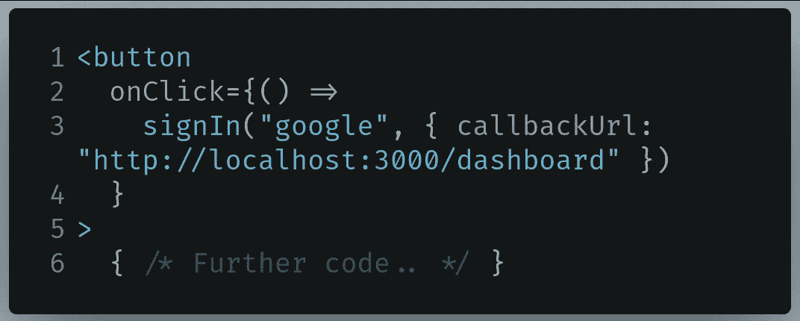

在/pages/index.js 中替换的代码

*   第 3 行:当用户登录时，将用户重定向到`dashboard`页面。

运行代码。结果应该是这样的:

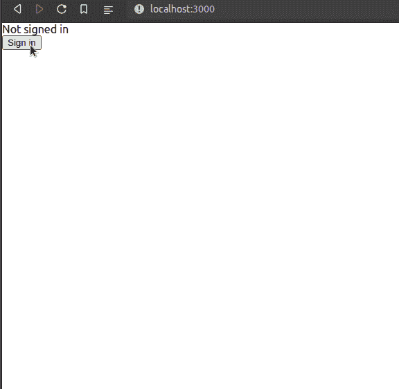

代码的输出

我们完事了。现在是时候围绕它构建我们的笔记应用程序了。

最后，`/pages/index.js`应该是这样的:

# 笔记应用程序

## Notes 模型

在你的`/models`文件夹中，创建一个名为`Note.js`的文件。在`/models/Note.js`中，编写以下代码:

*   第 3 行:定义我们的`noteSchema`。
*   第 4 行:我们的集合将有一个`user`字段，它将与登录的用户相链接。这使得我们可以制作一个关系数据库。
*   第 8-9 行:我们的模型将拥有保存字符串值的`title`和`body`字段。
*   第 13 行:导出我们的`Note`模型，它将从`noteSchema`派生而来。

现在让我们把数据库和这个项目连接起来。

## 连接到数据库

在您的`helpers`文件夹中，创建一个名为`dbConnect.js`的文件。顾名思义，这个文件包含我们的数据库配置。

在`helpers/dbConnect.js`中，编写以下代码:

*   第 3-9 行:从`.env.local`获取我们的 MongoDB 连接字符串。如果它不存在，那么抛出一个错误。
*   第 16 行:这里，我们使用全局变量来维护一个缓存的连接。这将防止连接在使用过程中增长。
*   第 28-34 行:指定我们的数据库配置。
*   第 37 行:连接到数据库。
*   第 45 行:最后，导出我们的`dbConnect`函数。我们现在可以在我们的项目中使用它。

我们完了！现在让我们用笔记来处理 CRUD 操作。

## 添加注释

转到您的`/pages/api/notes`文件夹，创建一个名为`add.js`的文件。这个文件将告诉我们的数据库插入一条记录。

在`/pages/api/notes/add.js`中，编写以下代码:

*   第 6 行:`getSession`方法将返回用户数据。
*   第 8 行:在执行任何数据库关键功能之前连接到数据库。
*   第 10 行:如果客户端没有登录，那么发送一个错误。
*   第 14 行:检查是否执行了一个`POST`请求。
*   第 15-16 行:如果为真，那么创建一个`Note`文档，其中的`user`字段指向登录用户的`id`。这使我们能够建立关系。
*   第 17-18 行:`title`和`body`字段将包含用户输入的数据。
*   第 21-24 行:保存文档并注销保存的记录。
*   第 26 行:结束响应。

现在让我们为这个功能编写前端代码。在`/pages/notes`中，创建一个名为`add.js`的文件。

在`pages/notes/add.js`中，编写以下代码:

*   第 7 行:创建我们的`addNote`函数。
*   第 10-19 行:向`/api/notes/add`发送一个`POST`请求。这将告诉我们的服务器向数据库添加数据。我们的`body`和`title`字段将来自`input`值。
*   第 20 行:当请求完成时，将用户重定向到`/dashboard`。
*   第 26 行:当表单提交后，调用`addNote`函数。

运行代码。结果应该是这样的:

代码的输出

看着控制台:

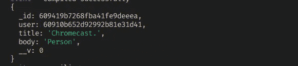

控制台输出

这证明我们的文档已经保存到数据库中。我们的代码按预期工作。

我们现在将显示我们所有的笔记。

## 显示我们的笔记

我们先来设计这一节的后端代码。在您的`/pages/api/notes`文件夹中，创建一个名为`list.js`的文件。在该文件中，编写以下代码:

*   第 11 行:找到用户的所有笔记。这通过过滤掉具有当前用户的`id`字段的`user`字段的笔记来完成。最后，使用`lean`方法返回 JSON 格式的文档。
*   第 12 行:用 JSON 将结果发送给客户机。
*   第 13 行:如果用户没有登录，那么返回一个错误。

让我们现在与我们的前端工作。在`/pages/dashboard.js`中，添加下面这段代码:

*   第 1 行:`getServerSideProps`函数将从服务器获取数据。
*   第 3 行:创建我们的头来告诉 NextAuth.js 我们被授权查看我们的文档。
*   第 4 行:对我们的服务器执行一个`FETCH`请求，并发送这些头。
*   第 6 行:如果返回的数据有错误，那么将用户重定向到`/`路线。
*   第 14 行:将返回的数据作为道具发送。

接下来，在`/pages/dashboard.js`中，找到下面这段代码:

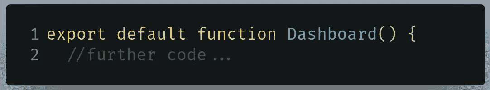

要在 pages/dashboard.js 中查找的代码

像这样改变它:

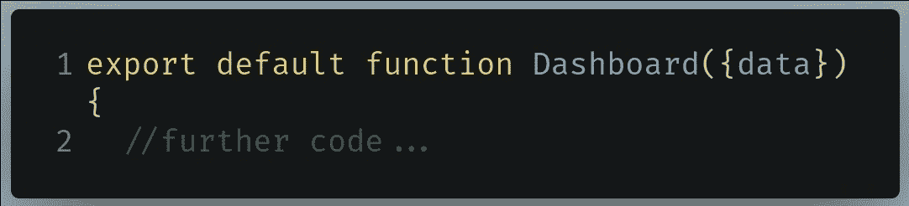

pages/dashboard.js 中要替换的代码

我们现在可以在组件中使用服务器返回的数据。

在同一个文件中，找到您的`return`块:

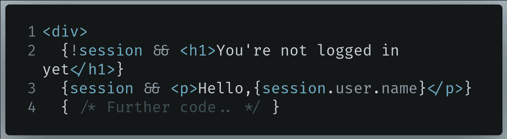

要在 pages/dashboard.js 中查找的代码

像这样替换它:

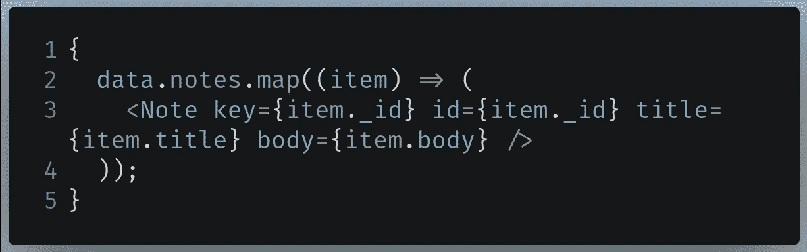

pages/dashboard.js 中要替换的代码

*   第 2 行:使用`map`函数显示我们的数据。
*   第 4 行:每个对象都将显示有`Note`组件。

运行代码。结果应该是这样的:

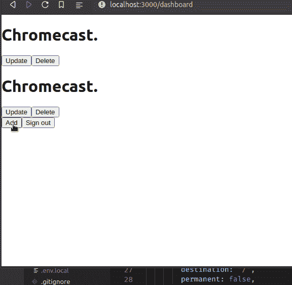

代码的输出

我们的代码有效！现在让我们开始阅读一个特定的文档。

最后，`/pages/dashboard.js`应该是这样的样子:

## 阅读笔记

作为第一步，我们需要编写后端代码。在您的`/pages/api/notes`目录中，创建一个名为`[id].js`的文件。在这里，编写以下代码:

*   第 10 行:用特定的`id`找到用户的笔记。
*   第 12 行:以 JSON 的形式返回文档。

我们现在需要建立我们的前端。在您的`/pages/notes`文件夹中，创建一个名为`[id].js`的文件。这意味着这个文件将处理`/pages/notes/{id}`路径。这里，`{id}`就是我们笔记的`id`。

在`/pages/notes/[id].js`中，编写以下代码:

*   第 1 行:`data`属性包含我们想要显示的数据。
*   第 6-7 行:显示我们对象的`title`和`body`字段。
*   第 14 行:创建一个`getServerSideProps`函数从服务器接收数据。
*   第 18-22 行:从数据库获取数据，然后返回它。
*   第 24-31 行:如果出现错误，那么将用户重定向到`/`。
*   第 33 行:将数据作为道具返回给`Specific`组件。

运行代码。结果应该是这样的:

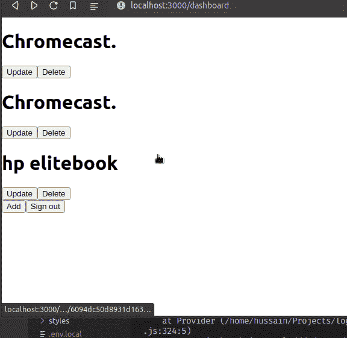

代码的输出

太好了！我们的代码按预期工作。

下一步，我们将学习如何更新我们的记录。

## 更新便笺

在你的`/pages/api/note`目录中，创建一个名为`update`的文件夹。在这个文件夹中，创建一个名为`[id].js`的文件。

在`/pages/api/note/update/[id].js`中，编写以下代码:

*   第 11 行:检查是否执行了`GET`请求。
*   第 12 行:如果是`true`，找到位于 URL 的参数中具有匹配`id`的注释。
*   第 13 行:最后，以 JSON 的形式返回数据。
*   第 16 行:检查是否执行了一个`PUT`请求。
*   第 17 行:找到匹配`id`的文档，然后更新它。
*   第 22 行:用用户输入值更新它的`title`和`body`字段。
*   第 26 行:结束响应。

现在让我们写我们的前端。在您的`/pages/notes`文件夹中，创建另一个名为`update`的目录。在这里，创建一个名为`[id].js`的文件。

在`/pages/notes/update/[id].js`中，编写以下代码:

*   第 3 行:在我们的组件中使用`data`道具。这将包含来自服务器的数据。
*   第 5 行:从 URL 中提取`id`参数。
*   第 7 行:创建`updateNote`函数。
*   第 10 行:对`api/notes/update`路由执行一个`PUT`请求，并将我们的输入`title`和`body`字段作为有效载荷发送出去。
*   第 20 行:当请求完成时，将用户重定向到`/dashboard`页面。

完成后，在同一个文件中添加以下代码:

*   第 6 行:当表单提交后，运行`updateNote`函数。
*   第 8-13 行:创建我们的`input`元素。它的初始值将是我们的注释的`title`字段。
*   第 15-20 行:创建我们的`input`元素，它将包含注释的`body`字段作为默认值。

作为最后一步，我们需要告诉 Next.js 获取数据。在该文件中追加以下代码:

该功能代码与`/pages/notes/[id].js`文件的功能代码相同。

运行代码。这将是结果:

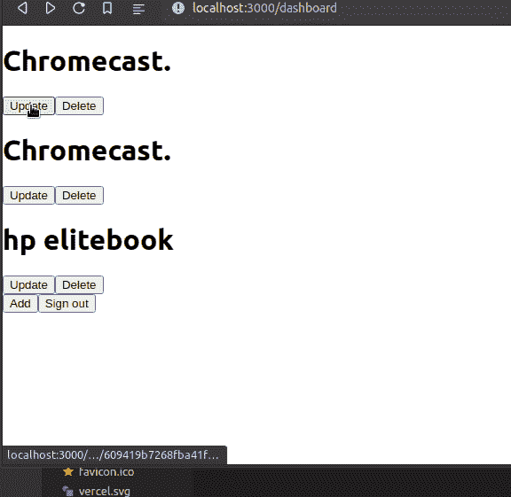

代码的输出

瞧啊。结果在意料之中。现在让我们删除我们的记录。

最后，`/pages/notes/update/[id].js`应该是这样的:

## 删除记录

在您的`/pages/api/notes`文件夹中，创建一个名为`delete`的目录。在这里，创建一个名为`[id].js`的文件。

在`/pages/api/notes/delete/[id].js`中，编写以下代码:

*   第 11 行:找到带有匹配的`id`和`user`字段的注释。如果找到，就删除。
*   第 20 行:结束响应。

运行代码。结果应该是这样的:

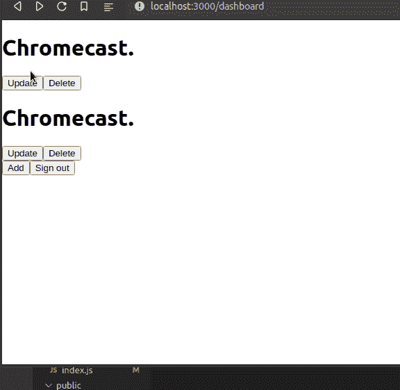

代码的输出

我们完事了。结果在意料之中。

# 额外资源

## GitHub 知识库

*   [这是项目的代码](https://github.com/HussainArif12/nextjs-login-tutorial)

## 其他学习材料

*   [使用 NextJS-LogRocket 认证](https://blog.logrocket.com/using-authentication-in-next-js/)
*   [使用 NextAuth 的 NextJS 认证—詹姆斯·珀金斯](https://www.youtube.com/watch?v=o_wZIVmWteQ)
*   [使用 Next 构建网飞克隆。Js 和下一位作者——李·罗宾逊](https://www.youtube.com/watch?v=iJ_MiYEgDiM)

# 结论

NextAuth.js 让开发者更容易在他们的应用中构建用户认证功能。因此，这改善了开发人员的体验。此外，我们不需要构建外部 Express 服务器来构建我们的登录系统。所有的工作都在 Next.js 中完成，从而保证了一个更快、更高性能的应用程序。

如果你遇到任何问题，我建议你解构这个程序，用代码来玩。非常感谢你坚持到最后！