# 在 Node.js 中构建一个带有 Google 身份验证的 Notes 应用程序

> 原文：<https://betterprogramming.pub/build-a-notes-app-with-google-authentication-in-node-js-e0c3dea761e1>

## 如何将 Google OAuth 添加到您的 web 应用程序中


[资料来源:Unsplash 上的 Daria](https://unsplash.com/photos/twE-bTk0BnM)

# 本文的学习目标

*   知道什么是第三方认证。
*   知道何时使用第三方认证。
*   为了能够使用内置的 Google OAuth 构建一个 notes 应用程序。

# 介绍

镇上的人都说你是一个了不起的 web 开发人员，对学习新技能有极大的热情，喜欢追赶前沿的框架和技术。因此，一位客户找到您，要求您开发一款满足以下要求的应用:

*   具有普通 CRUD 功能的基本 notes 应用程序。
*   一个登录和注销系统——这个 web 应用程序将有多个用户。

“当然，没问题”，你告诉自己。“我已经构建了一个[笔记应用](https://medium.com/better-programming/simple-notes-app-with-node-js-and-mongoosejs-6595cd5d15b)，我还学会了[如何构建一个登录系统](https://medium.com/better-programming/build-a-login-system-in-node-js-f1ba2abd19a)。这个*真的*容易”。

“但是，有一个问题，”客户告诉你。“很抱歉打断你的工作，但你必须让用户通过他的谷歌账户登录。”

你仍然接受提议。毕竟，事实上程序员最重要的工作之一就是应对出现的挑战。通过几次谷歌搜索，你会发现让用户通过另一个服务登录的过程被称为第三方认证。

## 什么是第三方认证？

注册一项新服务时，通常需要通过另一个社交媒体网站注册，例如 Google+、脸书、Twitter 或 LinkedIn。通过另一个第三方服务登录的过程叫做**第三方认证**。

我们先来讨论一下第三方认证的好处。

# 为什么使用第三方认证？

根据这篇[中的文章](https://medium.com/@sellarafaeli/no-more-username-passwords-just-use-a-3rd-party-for-authentication-59b12db092a4)，你的开发过程变得更简单。支持这一说法的一些理由包括:

*   **不需要处理密码安全**:想想看——作为一名开发者，你不再需要考虑彩虹表、`bcrypt`、散列和盐。处理身份验证的第三方服务已经为您处理了密码安全。这意味着开发者肩上卸下了一个巨大的负担。
*   **不再出现“忘记密码了？”困境**:如果你的网络应用程序包含用户名/密码条目，那么包含“忘记密码”也很重要。这意味着您必须编写额外的代码和逻辑，以便用户可以重置其密码。然而，如果有一个通过第三方认证登录的选项，那么用户只需记住一个密码(在这种情况下，他通过社交媒体网站登录)就可以使用你的应用程序。在这个场景中，我们可以看到用户不需要记住额外的密码，开发人员也不需要编写更多的代码来重置用户的密码。

我们已经谈了它的成果，现在让我们开始实践吧！

在本文中，我们将使用 Google 作为第三方认证服务来创建一个笔记应用程序。

# 入门指南

在您的项目目录中，我们需要初始化项目。像这样做:

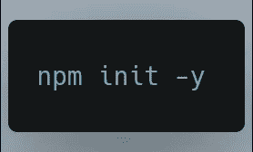

命令来初始化项目

## 库和依赖项的安装

我们需要安装以下库:

*   处理我们的路由和中间件功能。
*   `mongoose`:我们将把我们的笔记和用户存储在一个数据库中。为此，我们将使用`mongoose`。这里有一个关于 MongooseJS 的复习。
*   `connect-mongo`:这将允许我们在数据库中存储会话。所以当我们重置服务器时，我们不会被注销。
*   `express-handlebars`:我们将使用把手作为模板引擎。你也可以使用`pug`或者其他模板引擎。
*   `dotenv`:用于我们的配置和环境变量。
*   从我们的模板中发出上传和删除请求。通常，你不能从浏览器中执行上传和删除请求，但是这个包使它成为可能。
*   正确安排我们的日期。
*   `passport`:用于认证。
*   `passport-google-oauth20`:因为我们将使用 Google OAuth 2.0，所以我们也将使用这个包。
*   `nodemon`:这个包会持续监视我们的服务器，并在我们每次修改代码时自动重启。这将是一个开发依赖。

要安装这些依赖项，请在终端中运行以下命令:

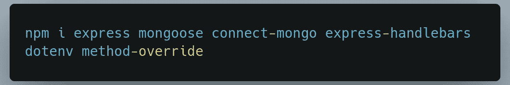

安装依赖项

接下来，我们将安装`nodemon`作为开发依赖项。像这样做:

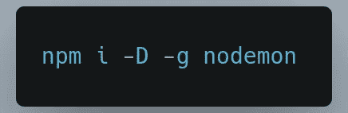

安装开发依赖项

## 环境变量

在项目的根目录中，在终端中运行以下命令。

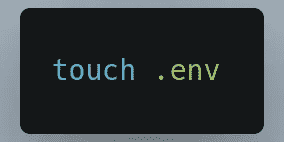

创造。环境文件

## 构建 MongoDB 集群

MongoDB 集群将允许我们在云服务器上托管数据，而不是在本地机器上托管数据。

为此，首先登录 [MongoDB 网站](https://www.mongodb.com/)。然后按照这些步骤[创建一个组织。使用该组织，您可以通过遵循这些步骤](https://docs.atlas.mongodb.com/tutorial/manage-organizations/#create-an-organization)成功地创建一个集群。

创建集群后，您将看到一个如下所示的控制面板:

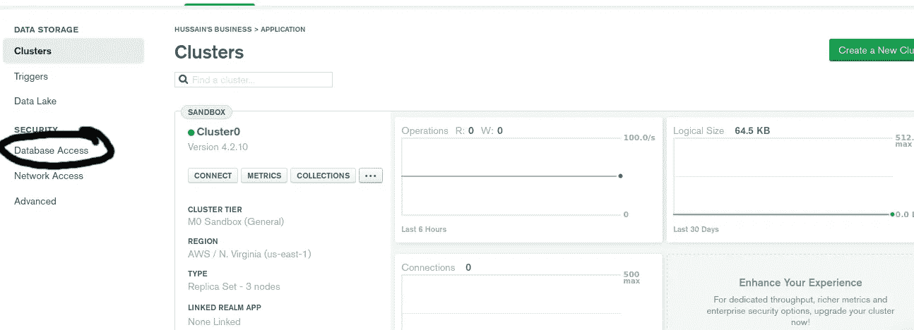

MongoDB 仪表板的屏幕截图

点击`Database`按钮(黑色圆圈)，然后点击`Add new Database user`。在那里，创建您的凭证。

现在点击侧边栏上的`Clusters`,回到你的仪表板，然后点击`Connect`

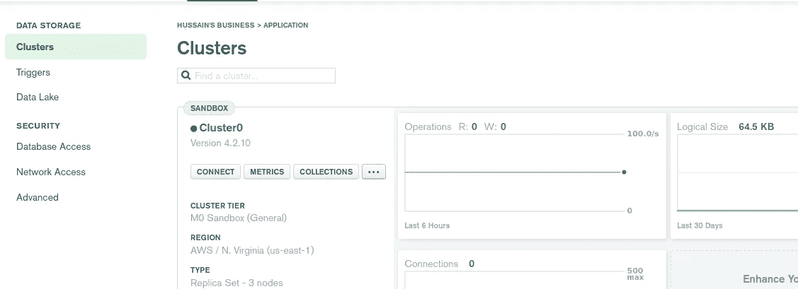

MongoDB 仪表盘截图。点击连接

在那里，您将看到以下对话框:

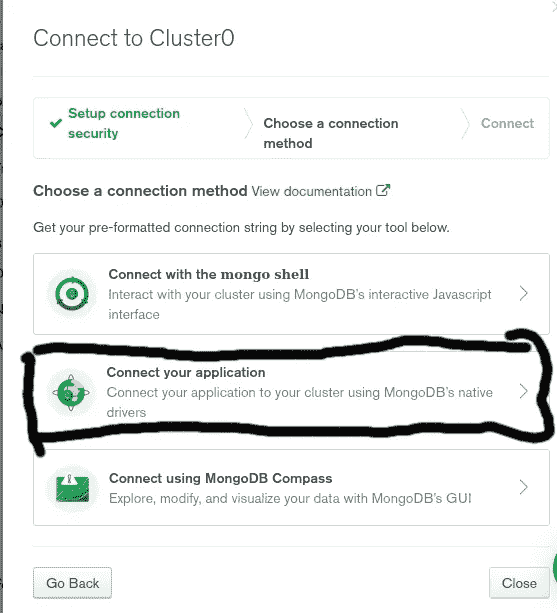

点击“连接”后的结果

现在按下`Connect to Application`(黑色圆圈)，您将收到您的连接字符串。

将连接字符串复制到您的`.env`文件中，如下所示:

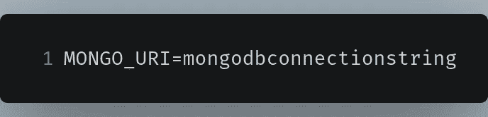

更改为。环境文件

在这种情况下,`mongodbconnectionstring`将是您实际的 MongoDB 连接字符串。

最后一步是允许从任何地方访问网络。为此，请转到您的仪表板并点击`Network Access`。在那里，点击`Actions`栏下的`EDIT`按钮。确保访问列表条目为`0.0.0.0/0`:

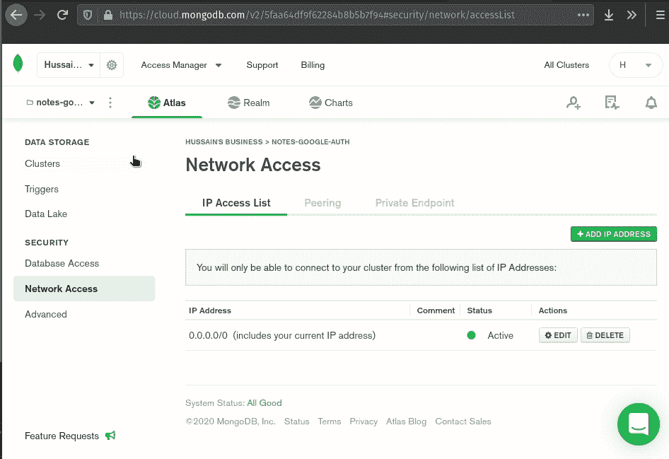

这一步现在完成了！现在让我们继续获取我们的 Google API 密钥。

## 使用 Google APIs

在我们的应用程序中实现 Google OAuth 之前，我们需要首先获得我们的 API 密钥。要获得它，进入谷歌开发者控制台页面，然后[按照这些步骤](https://cloud.google.com/resource-manager/docs/creating-managing-projects)创建一个项目。

你会看到一个仪表盘。点击`ENABLE APIS AND SERVICES`。


Google OAuth 仪表板

现在向下滚动到`Socials`部分下的`Google+ API`。

您将看到一个如下所示的页面:

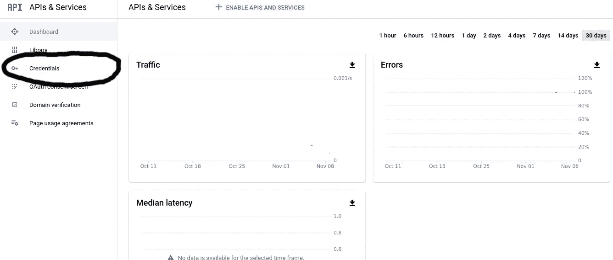

创建新项目后的页面

现在点击`Credentials`，你会看到一个如下所示的页面:


“凭据”页面

之后，点击`Create Credentials`，然后点击`OAuth Client ID`。在`Application Type`栏上，选择`Web Application`。除此之外，请使用以下设置:

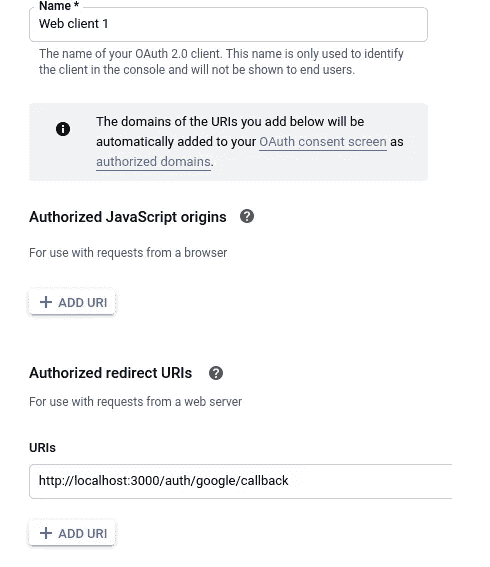

web 应用程序的设置

当您点击`Create`时，您将收到您的客户 ID 密钥和客户密钥。

将 API 密钥和秘密复制到您的`.env` 文件中的`MongoURI`变量之后，如下所示:

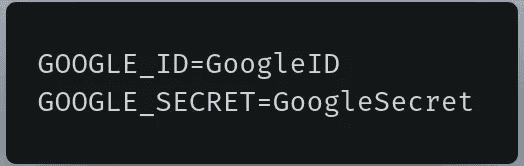

更改为。环境文件

在这种情况下，`GoogleID`将是您的客户 ID，GoogleSecret 将是您的客户机密。

现在是编码的时候了！让我们创建`app.js`文件。

## 我们的主文件— app.js

这将是我们的主要项目文件。现在，我们将只编写一些样板代码。我们还将配置模板引擎和静态文件夹。在项目的根目录下，创建一个名为`app.js`的文件，其中包含以下代码:

*   `Lines 1–2`:将`express`和`dotenv`模块导入到我们的项目中。
*   `Line 7`:将环境变量加载到我们的项目中，以便它们可以在开发中使用。
*   `Line 9`:在`port 3000`启动我们的 NodeJS 服务器。

运行应用程序:

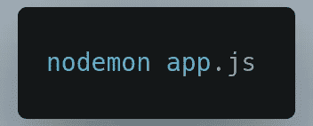

这是输出:

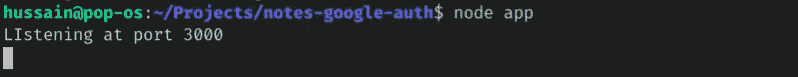

代码的输出

这意味着我们的服务器已经成功启动。

我们终于完成了初始阶段！让我们继续建立我们的数据库。

# Mongoose 用户数据库设置

因为我们将使用 MongoDB 来存储用户注释，所以我们将使用 Mongoose API 来获得 web 应用程序中的数据库设施。

在项目的根目录下，创建两个新文件夹:`config`和`models`。

在`models`文件夹中，创建一个名为`User.js`的文件。该模块将包括用户模式的定义。该文件将导出一个从用户模式派生的模型。

在`models/User.js`中，编写以下代码:

*   `Lines 1–3`:将`mongoose`库导入到我们的项目中，然后创建一个`Schema`变量。
*   `Lines 4-30`:定义`UserSchema`。这将告诉我们，当我们创建一个模型时，下面给出的所有字段都将被存储。Google OAuth API 为我们提供了所需的数据，这些数据稍后将存储在这些字段中。我们还将存储一个`createdAt`字段，用于存储账户创建日期。默认情况下，这将是用户注册的日期。
*   `Line 32`:导出一个名为`User`的模型，该模型将从我们刚刚在上面定义的`UserSchema`派生而来。

现在转到`config`目录，创建一个名为`db.js`的模块。这个模块导出一个函数，让我们连接到我们的数据库。

在`config/db.js`、**、**中编写以下代码:

*   当你使用 Mongoose 时，你是在使用承诺，这就是为什么你声明了一个`async`函数。
*   `Lines 4–9`:使用我们之前获得的连接字符串连接到我们的 MongoDB 数据库。由于我们的连接字符串位于我们的`.env`文件中(它是一个环境变量)，我们可以通过`process.env.MONGO_URI`变量来访问它。我们还配置了选项`UseNewUrlParser`、`useUnifiedTopology`和`useFindAndModify`，这样每当我们连接到数据库时，Mongoose 就不会抛出错误和警告。
*   `Lines 11–15` :如果 Mongoose 在连接过程中遇到问题，抛出错误。
*   `Line 16` :导出`connectDB`函数。

我们现在需要连接到数据库。

在`/app.js`、**、**中执行以下步骤:

*   首先将`connectDB`功能导入`app.js`:

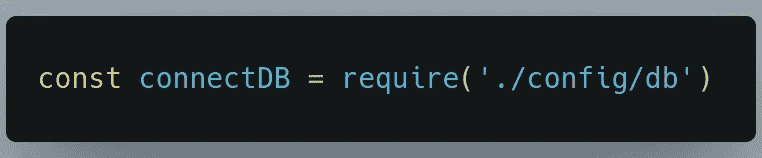

*   就在`dotenv.config()`方法调用之后，调用`connectDB`函数:

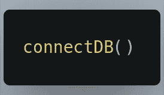

再次运行该应用程序，您将看到以下输出:

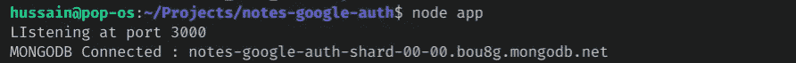

代码的输出

这意味着与数据库的连接是成功的！下一步，我们将配置模板引擎和布局

最后，`app.js`应该是这样的:

# 模板引擎和布局

对于我们的模板引擎，我们将使用手柄。在`app.js`中，导入`express-handlebars`库:

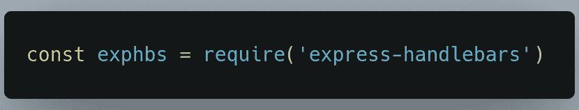

现在让我们告诉 Express，我们将使用把手作为我们的模板引擎。在`/app.js` **，**中编写以下代码:

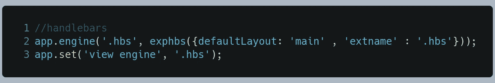

*   `Line 1`:指定我司车把文件的扩展名(`extname`)为`hbs`。我们还告诉 Express 我们的默认布局(`defaultLayout`)将是`main.hbs`。布局是 HTML 页面包装，可以在应用程序的不同视图中重复使用。
*   `Line 2`:在这里，我们通知 Express 我们的视图引擎将会是 Handlebars，或者简称为`hbs`。

完成后，转到根目录，创建一个名为`views`的文件夹。在这个文件夹中，创建另一个名为`layouts`的文件夹。在`layouts`目录中，创建两个文件:`main.hbs`，我们的默认布局，和`login.hbs`，当用户登录时使用。

在`views/layouts/main.hbs`中，编写以下代码:

这些都是标准的 HTML，但是要注意`Line 6`。`{{{body}}}`是一个占位符，用于显示主要内容。换句话说，所有将使用`main.hbs`作为默认布局的文件将具有相同的标题(这一点从`title`元素内容中可以明显看出)，但是将具有不同的主体(`{{{body}}}`)。这个概念到后期你就清楚了。

现在在`views/layouts/login.hbs`中，编写以下代码:

注意，它类似于`main.hbs`文件，但是标题不同。

既然我们已经对布局进行了编码，现在我们希望用户能够看到页面。现在是时候创建我们的路线，将渲染我们的观点。

最后`/app.js` **，**应该是这样的:

# 索引路线和视图

在这一部分，我们将对路线进行编码。这些路径将呈现我们刚刚创建的车把文件。

首先，在根目录下，创建一个名为`routes`的新文件夹。

在`routes`目录下，创建一个名为`index.js`T31 的文件。该文件将处理没有跟随的路径，例如`/dashboard`或根目录`/`。

在`routes/index.js`中，编写以下代码:

在这段代码中，我们只是导出一个处理`/`和`/dashboard`路线的`Router`。出于测试目的，我们向客户端发送基本文本。这段代码将在本教程的后面部分进一步编辑。

现在我们需要将`index.js`路由文件与`app.js`链接起来。

在`/app.js`中，编写以下代码:

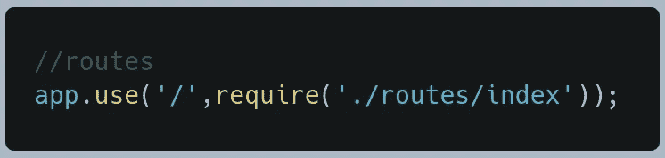

要在 app.js 中输入的代码

这意味着`/`(根目录)和`/dashboard`目录现在将由`index.js`文件处理。

运行程序，将网络浏览器指向`localhost:3000`，然后指向`localhost:3000/dashboard`。这将是结果:

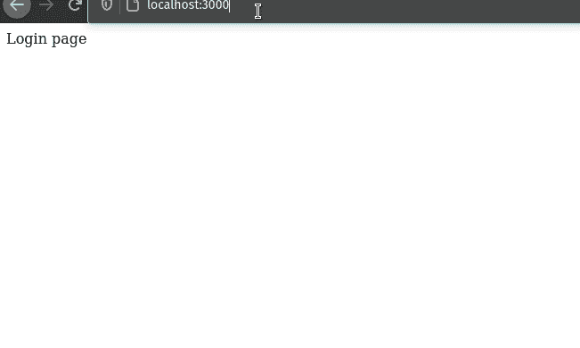

先去 localhost:3000/再去 localhost:3000/dashboard 后的结果。

我们的代码有效！现在让我们创建当用户访问`/`或`/dashboard`时将呈现的视图。

在您的`views`目录中，创建两个名为`dashboard.hbs`和`login.hbs`的文件。

在`views/login.hbs`中，编写以下代码:

*   `Lines 3–5`:创建一个按钮，将用户重定向到`/auth/google`路线。这条路线将让用户使用他的谷歌帐户登录到我们的应用程序。我们将在本教程的后面处理这条路线。

现在转到`views/dashboard.hbs`并编写以下代码:

当我们使用 Passport 启用第三方身份验证时，我们将为仪表板页面编写更多的代码。目前，我们只是在测试代码是否有效。

现在转到`routes/index.js`，并执行以下步骤。

*   找到以下代码:

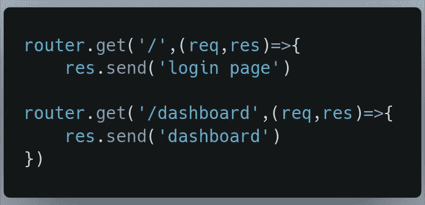

要在 index.js 中查找的代码

*   现在用以下代码替换这些代码行:

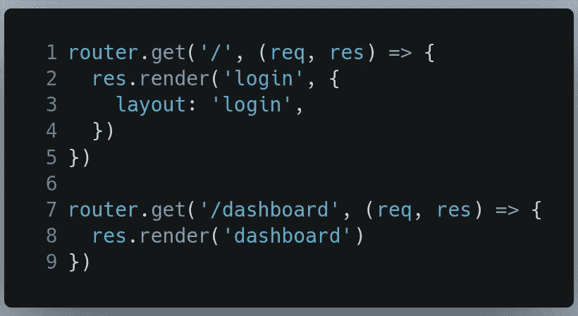

index.js 中要替换的代码

*   `Lines 2 & 3`:渲染`login.hbs`文件，告诉 Express 使用`login.hbs`作为默认布局(我们通过设置`layout`选项来实现)。确保`login`默认布局文件位于`views/layouts`目录中。

运行程序，这应该是你的结果:

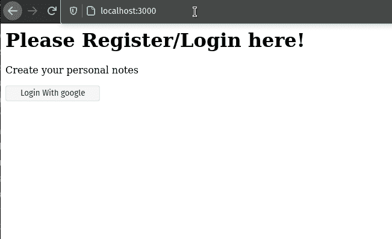

我们代码的结果

这个结果表明我们的代码是有效的！在下一部分，我们将使用 Passport。这个库将帮助我们在 web 应用程序中实现 Google 身份验证。

最后， `app.js`应该是这样的:

这是`routes/index.js`应该有的样子:

# 用护照认证

[Passport.js](http://www.passportjs.org/) 是一个非常有用的库，它将帮助我们在 Notes 应用程序中启用第三方认证。或者，如果我们愿意，我们甚至可以[实现我们自己的登录系统](https://medium.com/better-programming/build-a-login-system-in-node-js-f1ba2abd19a)。对于本教程，由于我们使用 Google OAuth，我们将使用 [Passport 的 Google Auth 2.0 策略](http://www.passportjs.org/packages/passport-google-oauth20/)。

在开始使用 Passport 之前，让我们先配置 Passport 及其会话。

## Passport 配置和会话

转到根目录下的`config`文件夹，创建一个名为`passport.js`的模块。这就是我们谷歌战略的定位。

在`config/passport.js`中，编写以下代码:

*   `Lines 1-3`:将 Google 认证护照策略、Mongoose API 和我们的`User`模型导入到模块中。
*   Passport 需要我们的 Google Client ID 和 Google Client Secret，以便我们可以继续 OAuth。这些数据将由我们在本教程前面编写的环境变量提供。关于环境变量的更多信息，[点击此处](https://holycoders.com/node-js-environment-variable/)。
*   `Lines 14`:在控制台记录用户的档案数据。稍后，我们将编辑这段代码，将用户数据保存到我们的数据库中。
*   `Lines 17–26`:序列化和反序列化`user`实例以支持登录会话。

接下来，我们需要在您的项目中使用该模块。为此，转至`/app.js`并采取以下步骤。

*   从导入`passport`库开始:

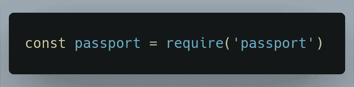

app.js 中的代码

*   我们需要告诉 Passport 我们将使用谷歌认证。为此，我们将导入我们的 Passport 配置:

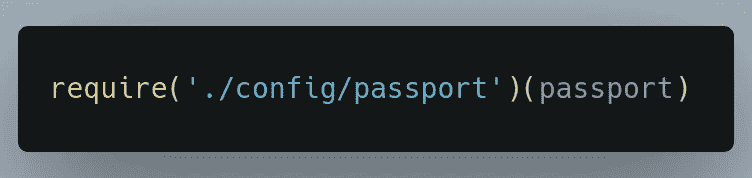

app.js 中的代码

*   现在我们需要添加 Passport 中间件:

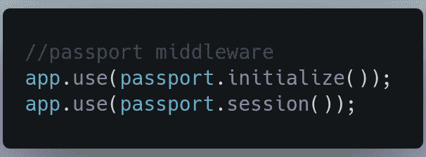

app.js 中的中间件

*   为了让 Passport 与会话一起工作，我们需要实现`express-sessions`。回到`/app.js`的顶部，导入`express-sessions`:

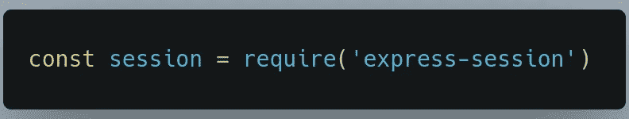

导入快速会话

*   `express-session`有自己的中间件。在`passport`中间件之前输入这段代码:

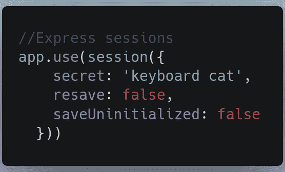

app.js 中的快速会话

我们将`resave`属性保留为`false`。这意味着如果没有修改任何内容，我们就不想保存会话。我们还将`saveUnitialized`属性设置为`false`，这指示 Express 在存储内容之前不要创建会话。有关更多信息，您可以参考[快速会话文档](https://www.npmjs.com/package/express-session)。

最后，`app.js`应该是这样的:

## 认证路线

我们现在需要配置 Google OAuth 所需的身份验证路由。

转到您的`routes`目录，创建一个名为`auth.js`的新文件。在那里，编写以下代码:

*   `Line 5`:这里我们处理的是`/google`路线。我们告诉 Express，当用户被引导到这条路线时，就会调用`passport.authenticate`函数。我们也在指导 Passport 使用谷歌策略。`{scope : [‘profile’]}` 片段意味着我们需要用户的个人资料数据。
*   `Lines 7–13`:处理`/google/callback`路径，再次调用`passport.authenticate`功能。这次我们告诉 Passport，如果认证过程失败，那么我们应该将他重定向回`/`(登录)页面。否则，如果该过程成功，将用户重定向到仪表板。
*   导出这个路由器，这样它就可以用在我们的项目中了。

现在转到`/app.js`，添加下面一行:

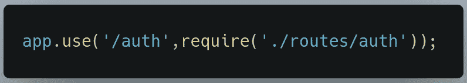

app.js 中的代码

这意味着所有以`/auth`开始的路线现在将由`auth.js`处理。

现在运行代码，并在您的网络浏览器中进入`localhost:3000`。这将是结果:

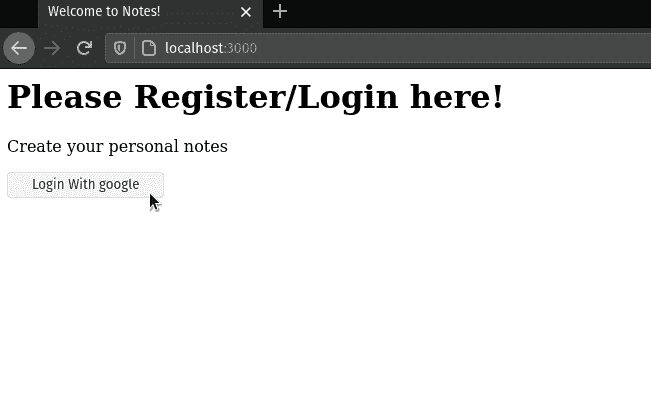

代码的结果

控制台中的输出如下:

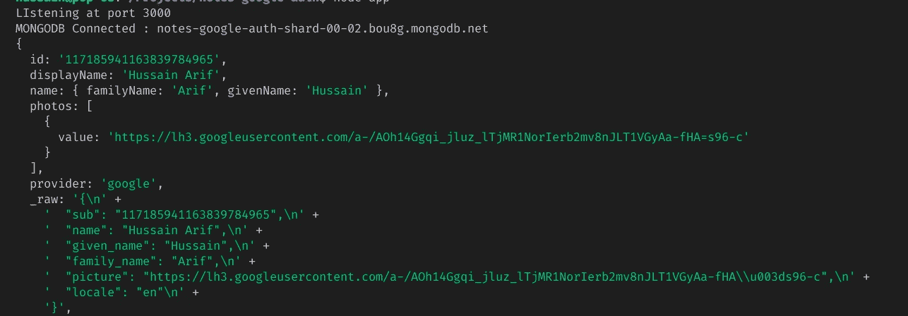

控制台中的输出

这是因为我们选择在控制台中记录用户数据。这在`config/passport.js`中的以下代码片段中显而易见:

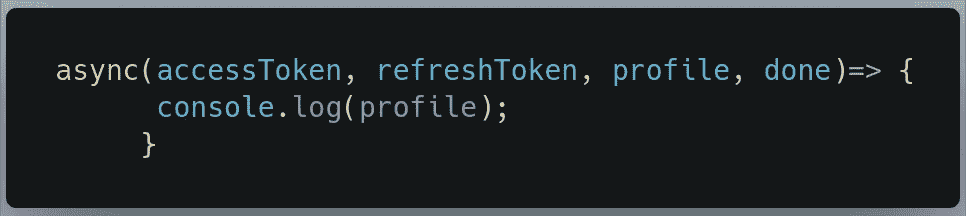

passport.js 中的代码

我们的代码有效！但是有一个问题——不是登录，而是应用程序挂起。这是因为我们没有处理谷歌战略中的回调。

在下一节中，我们将继续将用户的档案数据保存到我们的数据库中。

最后，`/app.js`应该是这样的:

## 保存 Google 个人资料数据

为了防止我们的应用程序冻结，让我们保存用户数据，而不是将其记录到控制台。

在`/config/passport.js`中，找到下面这段代码:

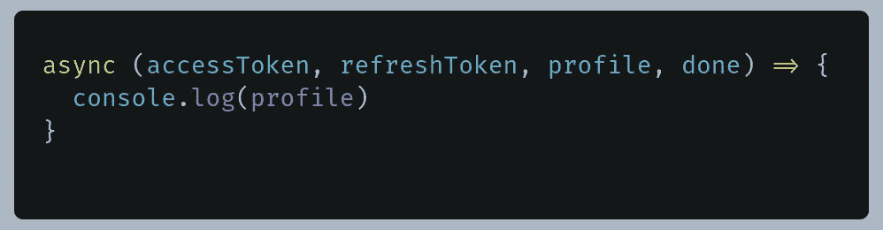

passport.js 中要替换的代码

现在将其替换为以下内容:

*   `Lines 3–9`:将谷歌返回给我们的数据保存在一个名为`newUser`的对象中。
*   `Line 10–11`:验证用户是否存在于我们的数据库中。我们通过用户 ID 找到用户，这个 ID 对每个用户来说都是唯一的。
*   `Line 13–15`:如果用户存在，调用我们的回调函数，告诉 Passport 没有产生错误。
*   `Line 16–19`:如果用户不存在，将他的数据保存到我们的数据库中，并告诉 Passport 在此过程中没有出现错误。

完成后，运行代码。这是结果:


代码的输出

成功！用户进入了仪表板。然而，在通常情况下，用户也想注销。就这么办吧。

最后，`config/passport.js`，应该是这样的:

## 注销功能

在`routes/auth.js`、内编写以下代码:

*   `Line 2`:当用户点击注销按钮时，他们将被导向`/logout`路线。在这里，我们处理的是`/logout`路线。
*   `Line 3`:调用`req.logout()`功能，可以启动注销过程。这个方法是 Passport 提供的。
*   `Line 5`:注销过程成功后，将用户重定向到登录(`/`)页面。

我们已经实施了`/logout`路线。下一步是在仪表板上创建一个注销按钮。

这里，我们需要创建一个分部。什么是部分？分部允许模板重用。您可能认为它们是模板中的模板。

在您的`views`文件夹中，创建一个名为`partials`的新文件夹。在这里，创建一个文件名为`_header.hbs`的文件。

在`views/partials/_header.hbs`中，编写以下代码:

这里，我们刚刚创建了一个简单的列表元素，为用户指出不同的路线。

现在在`views/layouts/main.hbs`中，执行以下步骤。

*   找到这段代码:

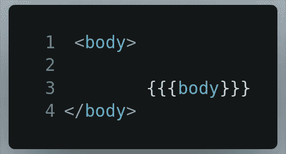

要在 views/layout/main.hbs 中查找的代码

*   在`{{{body}}}`正上方的`line 2`，写下以下内容:

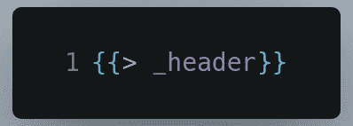

在 views/layout/main.hbs 中编写的代码

这为`main.hbs`增加了`_header.hbs`部分。

运行代码。这将是结果:

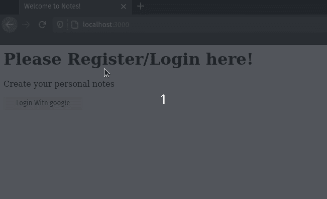

代码的结果

这意味着我们的代码按预期运行。然而，在我们的程序中有一个主要的安全缺陷:即使我们注销，我们仍然可以访问仪表板。这里有一个例子:


我们程序中的问题

在下一节中，我们将通过使用认证中间件来缓解这个问题。

最后，`routes/auth.js`应该是这样的:

## 认证中间件

在您的项目中，创建一个名为`middleware`的新文件夹。在这里，创建一个名为`auth.js`的新文件。

在`middleware/auth.js`中，编写以下代码:

*   `Line 2–5`:这里，我们检查用户是否已经登录。如果有，请求可以正常进行。否则，他们将被重定向到登录页面。`req.isAuthenticated()`方法告诉我们用户是否已经登录。当用户在`/dashboard`中但选择进入登录页面时，将使用`ensureAuth`方法。
*   `Line 9–15`:在这里，我们也要确保用户的认证。如果用户没有登录，他们将被引导回登录页面。当用户没有登录但选择进入仪表板时，将使用`ensureGuest`方法。

现在转到`routes/index.js`，执行以下步骤。

*   找到下面这段代码:

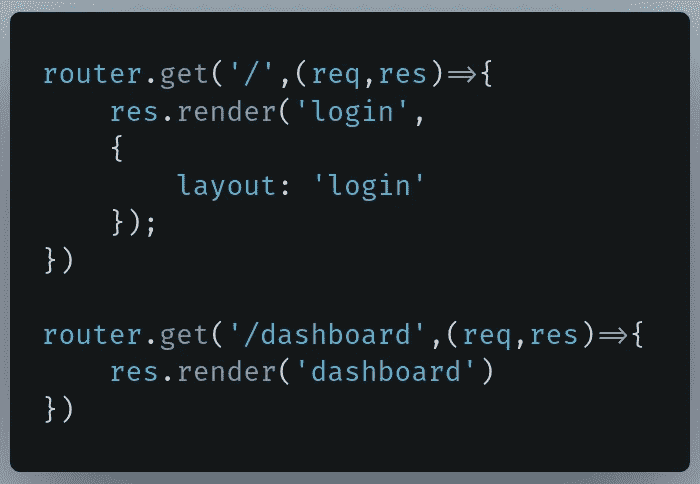

要在 routes/index.js 中查找的代码

*   用下面的代码片段替换它:

*   `Line 3` : `ensureGuest`现在每当用户转到`/`目录时，中间件就会运行。
*   `Line 8`:同样，每当用户进入`/dashboard`目录时，`ensureAuth`中间件就会运行。

这将是代码的输出:

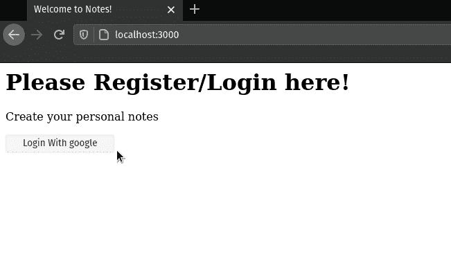

代码的输出

最后，`routes/index.js`应该是这样的:

## 将登录会话存储在数据库中

到目前为止，我们的网络应用运行良好。但是有一个关键问题:如果 NodeJS 服务器重启，那么用户将再次被注销。

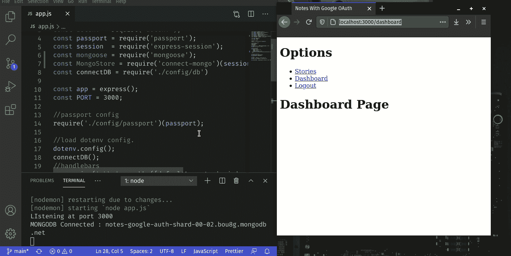

重启服务器会使我们注销

这个问题的一个解决方案是将用户的登录会话存储到数据库中。

转到`/app.js` **、**并执行以下步骤。

*   进口`mongoose`和`connect-mongo`。

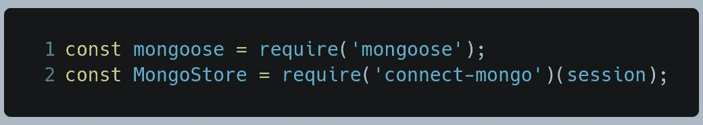

在 app.js 中导入库

在`line 2`中，我们将传递一个`express-session`作为参数。这是因为`connect-mongo`需要`express-session`中间件才能正常工作。

*   现在，向下滚动并找到下面这段代码:

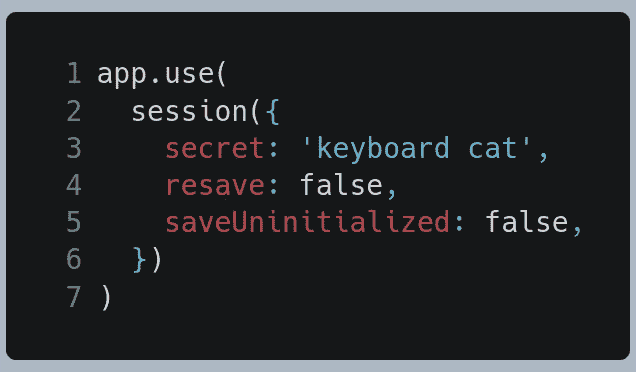

要在 app.js 中查找的代码

*   将它替换为以下代码片段:

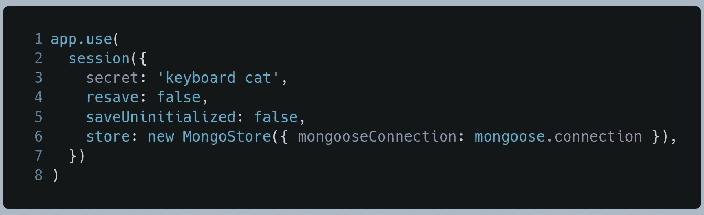

app.js 中要替换的代码

我们刚刚添加了`store`属性，并告诉它使用当前正在使用的 Mongoose 连接。

再次运行该程序。瞧啊。问题已经消失了。

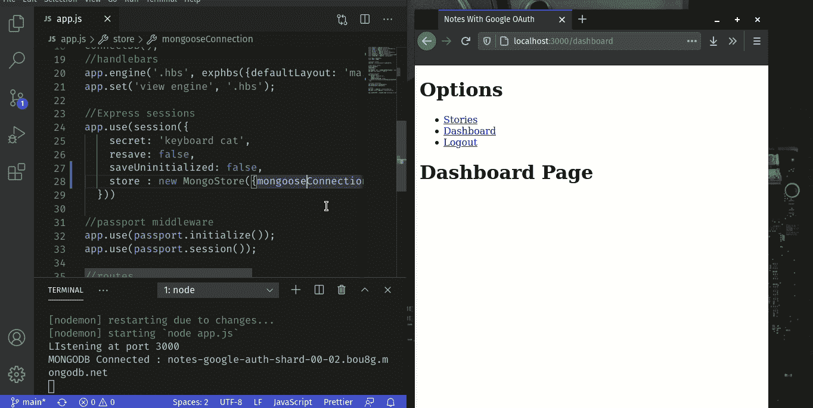

代码的输出

最后，`app.js`应该是这样的:

## 问候用户

为了让我们的用户体验更好，让我们在用户进入仪表板时用他们的名字问候他们。

为此，转到`views/partials`并创建一个名为`_dashboard.hbs`的新文件。在`views/partials/_dashboard.hbs`中，编写以下代码行:

这里，我们只是使用将通过 Express 发送给我们的`name`数据。

现在转到`views/dashboard.hbs` 并在末尾添加以下代码行:

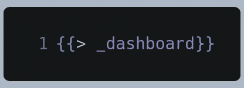

要添加到 views/dashboard.hbs 中的代码

这一行表示我们现在将在`dashboard.hbs`文件中使用`_dashboard.hbs`部分。

现在转到`routes/index.js`并执行以下步骤。

*   找到下面这段代码:

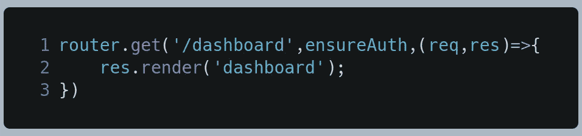

routes/index.js 中要替换的代码

并替换为以下内容:

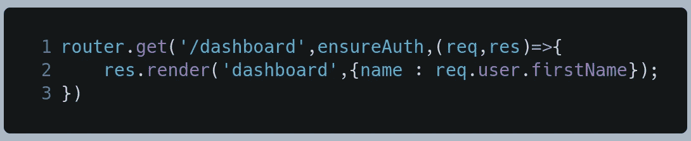

routes/index.js 中要替换的代码

在这里，我们渲染`dashboard.hbs`并将`name`变量作为数据发送，以便它可以被显示。

这将是代码的输出:

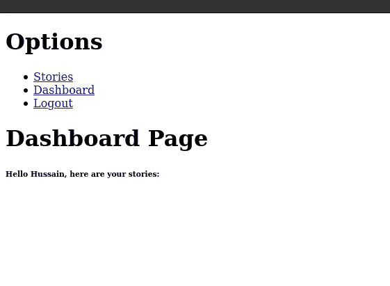

最终，`routes/index.js`应该是这样的:

恭喜，我们终于完成了使用 Passport 的 Google OAuth！最难的部分已经完成了。

当你准备好了，在下一节我们将创建我们的 Notes 应用程序，这是本教程的要点。

# 笔记应用程序:开始使用

## 主体解析器中间件

我们将使用这个中间件来解析来自客户端的输入。

转到`/app.js`并编写以下代码:

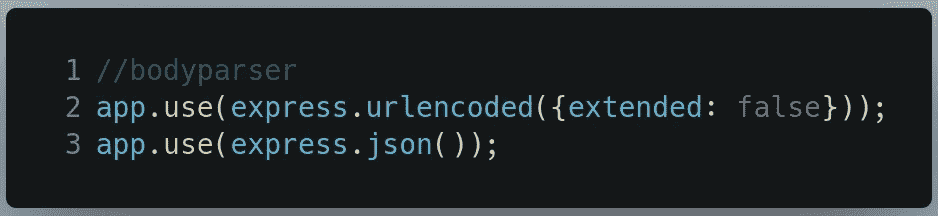

要在 app.js 中编写的代码

完成后，让我们继续创建`notes.js`文件。

## notes.js 文件

在开始之前，去你的`routes`目录。在那里，创建一个名为`notes.js`的文件。这个文件将是一个路由器实例，它将处理从`/notes`开始的所有路由。随着本教程的深入，我们将向该文件添加更多的代码。

现在转到根目录下的`app.js`。在这里，我们将告诉 Express 所有以`/notes`开头的路线。

在`/app.js`、**、**中编写以下代码:

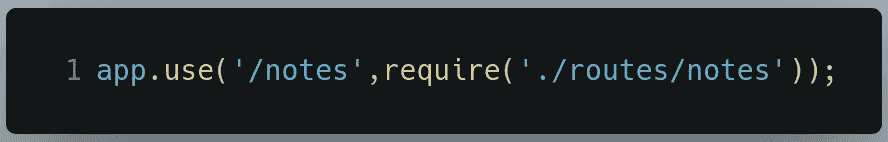

要写入 notes.js 的代码

我们现在已经完成了初始阶段。让我们在 Mongoose 中为我们的 Note 文档创建一个模型。

最后，`/app.js`应该是这样的:

# Mongoose Notes 数据库设置

## 笔记模型

我们首先需要在 Mongoose 中创建一个 notes 模型，这样就可以将它们保存到数据库中。

在您的`models`文件夹中，创建一个名为`Note.js`的新文件。

在`models/Note.js`中，编写以下代码:

*   `Lines 5–16`:保存注释的标题和正文。此外，我们还保存了笔记的创建日期。
*   `Line 17`:保存对`User`模型的引用。我们这样做是为了让用户看不到其他用户的个人笔记。我们将在本教程的后面详细讨论这一点。
*   `Line 20`:以`Note`的名称导出模型，以便在我们的应用程序中使用。

我们现在已经创建了笔记模型。现在让我们来看看这个应用程序的 CRUD 功能。

# Notes 中的 CRUD 功能

## 导入库

在开始本节之前，让我们先在`routes/notes.js`中导入所需的库。

转到`routes/notes.js`并编写以下代码:

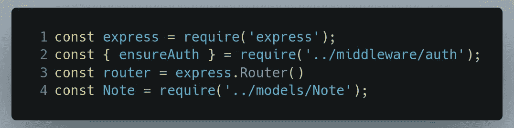

要在 routes/notes.js 中编写的代码

*   `Line 1 & 3`:因为我们正在处理路线，我们已经导入了`express`库和一个`express.Router`实例。
*   `Line 2`:我们希望确保客户端在执行 CRUD 相关操作时保持登录状态。为此，还导入了`ensureAuth`功能。
*   `Line 4`:因为我们在 Mongoose 中对我们的`Note`模型执行 CRUD 操作，我们也将在我们的模块中导入`Note`模型。

当这个阶段完成后，让我们继续创建一个注释。

## 编写或创建便笺

在您的`views`目录中，创建一个名为`notes`的新文件夹。在`notes`文件夹中，创建一个名为`add.hbs`的文件。

在`views/notes/add.hbs`中，编写以下代码:

在这里，我们构建了一个包含两个`textarea`元素的简单网页，其中一个名为`title`，另一个名为`body`。提交后，表单将向`notes/add`目录发出`POST`请求。

首先，我们需要在仪表板上为这个页面创建一个链接。为此，转到`views/dashboard.hbs`，添加以下代码行:

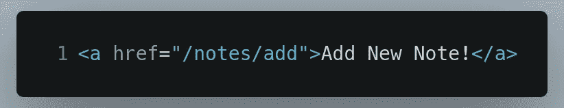

要在 views/dashboard.hbs 中编写的代码

这将在仪表板页面上创建一个链接，以便用户可以被重定向到`/notes/add`路线。

现在我们处理这个路由的`GET`和`POST`请求。转到`/routes/notes.js`，编写以下代码:

*   `Lines 1–3`:处理对`/notes/add`目录的`GET`请求。当用户去`/notes/add`时，就会呈现出`add.hbs`文件。中间件确保用户始终保持登录状态。
*   `Lines 5`:处理`POST`对`/notes/add`的请求。
*   `Line 7`:因为 Passport，我们已经有了登录用户的 ID。我们现在将这些数据传递到`req.body`对象中，以便 MongoDB 可以将用户的 ID 存储到 Note 文档中。
*   `Line 8-9`:将我们的注释存储到 MongoDB 中，然后将用户重定向到仪表板。
*   `Line 11`:如果我们在保存文档时遇到错误，则注销该错误。

最后，这应该是代码的结果:


这意味着我们的代码有效！现在我们需要列出所有保存的笔记。

## 列出我们所有的笔记

首先，转到`routes/index.js`并执行以下步骤。

*   导入我们刚刚创建的`Note`模型:

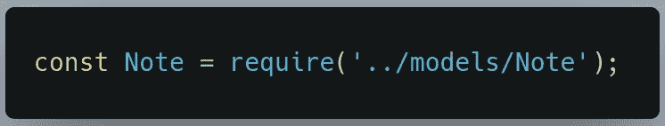

*   现在找到处理`/dashboard`路线的那段代码:

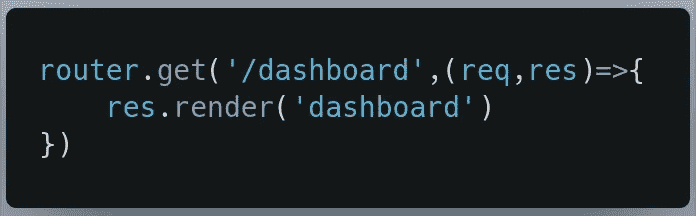

*   在这里，我们将获取我们所有的笔记，然后将它们发送到`dashboard.hbs`页面。编写以下代码:

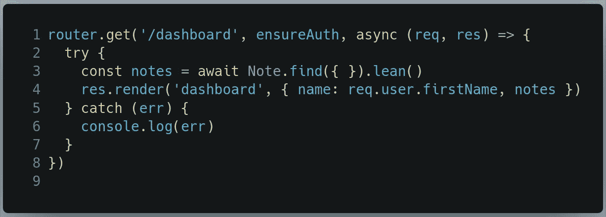

*   `Line 3`:在数据库中找到我们所有的`Note`文档，然后转换成 JavaScript 对象数组(因此有了`lean`函数)，然后保存到一个名为`notes`的变量中。
*   `Line 4`:呈现`dashboard.hbs`页面，发送登录用户名(`req.user.firstName`)和`notes`数据。

现在我们需要呈现一个显示数据的表格。

在`partials/_dashboard.hbs` **、**中追加以下代码:

这里，我们刚刚构建了一个带有两个标题的表格:标题和创建日期。但是，我们需要注意这几行:

*   `Line 11–15`:对于出现在`notes`数组中的每个票据文档，创建一个单独的行。在`Title`标题下，应该有我们笔记的标题，而`Date`标题应该有笔记的创建日期。请记住，我们已经在`Note`模型中保存了这些数据。我们只是展示一下。
*   `Line 16–24`:我们还创建了单独的`td`元素，这样每个笔记都可以有自己的删除和编辑选项。在`line 18`，我们试图发送一个删除请求。由于这不可能通过浏览器实现，我们将使用`method-override`包来执行这个请求。我们将在本教程的后面处理这些路线。

运行代码。这将是结果:

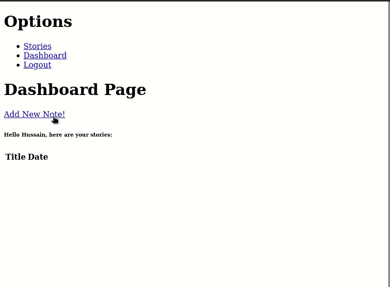

然而，有一个致命的问题:如果另一个用户使用他自己的谷歌账户创建一个笔记，平台上的其他用户也有可能看到那个用户的笔记。这是一个关键的隐私问题，因为我们不希望用户看到彼此的个人笔记。这可以这样证明:

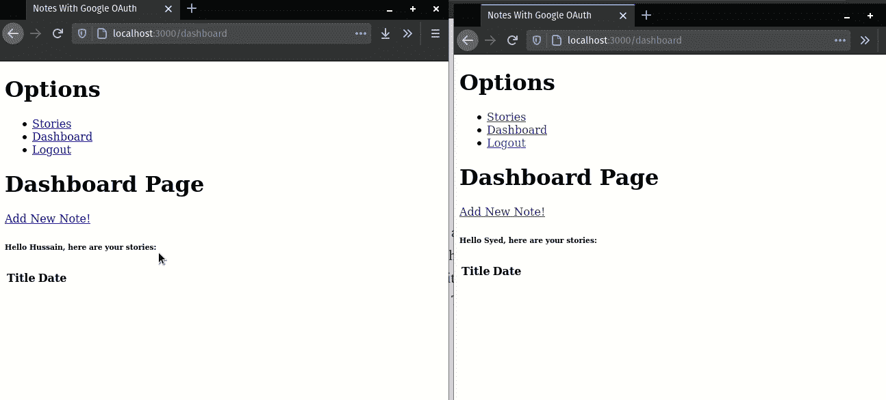

用一个账户做一个笔记，用另一个账户做另一个笔记。

这个问题的解决方案非常简单。在仪表板上，我们只需要显示登录用户写的笔记，而不是其他任何人。

转到`routes/index.js`，执行以下步骤:

*   找到下面这段代码:

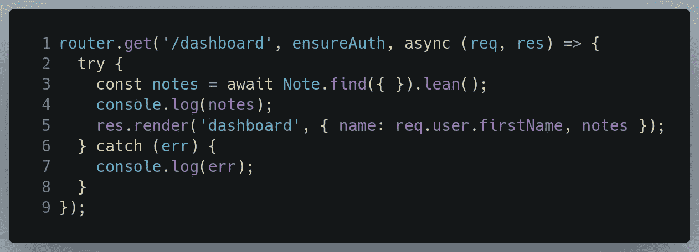

并用下面的代码片段替换它:

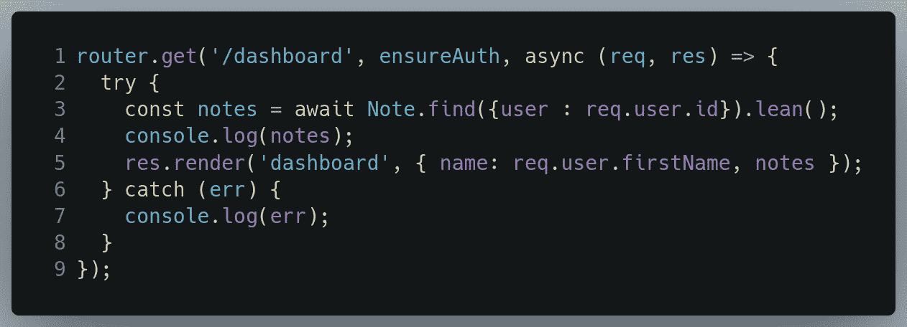

唯一的变化是在`Line 3`上，我们告诉 Mongoose 只查找登录用户写的笔记。

这将是代码的输出:

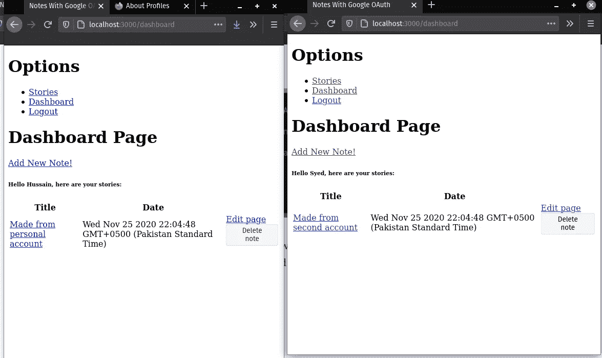

现在两个用户都看不到对方的笔记了！我们现在已经完成了这一部分。

最终，`routes/index.js`应该是这样的:

当用户点击他的一个笔记时，他希望看到一个页面，在那里他可以看到笔记的完整标题和正文。让我们在下一节做这件事。

## 读一张纸条

为此，请转到您的`routes/notes.js`模块。在这里，编写以下代码:

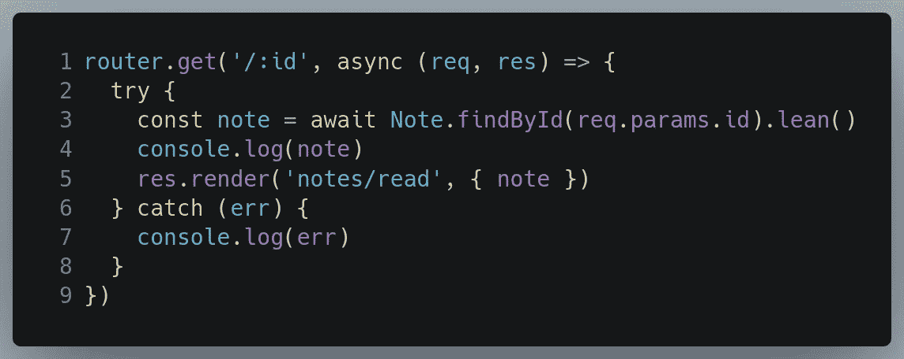

要在 routes/notes.js 中编写的代码

*   `Line 1`:用`id`参数处理`/notes`目录。
*   `Line 3`:使用其 ID 查找笔记文档。我们可以通过用`req.params.id`获取`id`参数来获取注释的 ID。
*   `Line 5`:渲染`read.hbs`文件，将`note`对象发送到文件中。

现在我们需要对`read.hbs`文件进行编码。

在您的`views/notes`目录中，创建一个名为`read.hbs`的文件。

在`views/notes/read.hbs`、**、**中编写以下代码:

*   `Line 1-5`:呈现便笺的标题、正文和创建日期。
*   `Line 8–11`:这里，我们正在执行一个`DELETE`请求。创建删除按钮。在本教程的后面，我们将使用`method-override`模块发送`DELETE`请求。
*   `Line 13`:呈现编辑页面来编辑我们的注释。我们将在本教程的后面处理这条路线。

运行您的代码。这将是结果:


代码的输出

这表明我们的代码起作用了！在下一部分，我们将学习如何更新或编辑我们的笔记。

最终，`routes/notes.js`应该是这样的:

## 更新或编辑注释

在开始之前，我们需要使用`method-override`模块。该模块将允许我们通过浏览器执行`PUT`和`DELETE`请求。

转到`/app.js`并执行以下步骤:

*   像这样导入`method-override`模块:

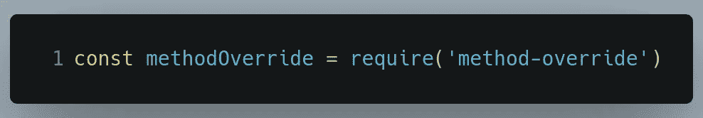

在 app.js 中导入库

*   现在我们需要使用这个模块作为中间件。编写以下代码:

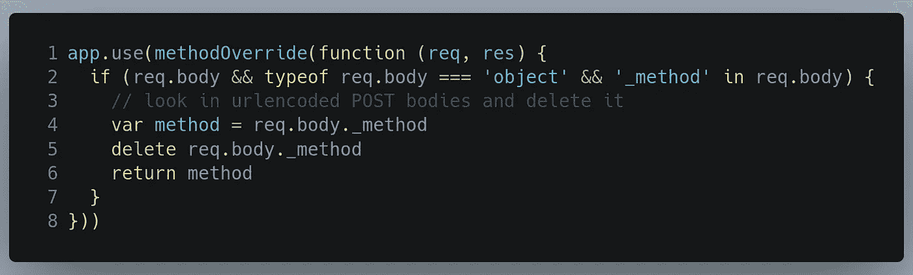

要在 app.js 中编写的代码

更多信息，建议您参考`[method-override](https://www.npmjs.com/package/method-override)` [文档](https://www.npmjs.com/package/method-override)。

在我们的 Handlebar 文件中，我们已经用`ID`参数指定用户将被重定向到`/notes/edit`目录。这条路线将呈现编辑页面。让我们首先创建编辑页面。

转到您的`views/notes`目录，创建一个名为`edit.hbs`的新文件。

在`views/notes/edit.hbs`中，编写以下代码行:

*   `Line 1–2`:这实际上告诉`method-override`我们将创建一个`PUT`请求，而不是发送一个`POST`请求(如`line 2`所示)。
*   `Line 4`:创建一个`textarea`元素，它已经包含了注释的标题。
*   `Line 8`:创建一个`textarea`元素，它已经包含了注释的主体。
*   `Line 12`:呈现提交按钮，该按钮将文本区域的值发送到数据库，以便可以编辑注释。

现在在`routes/notes.js`中，我们需要首先渲染`edit.hbs`文件。

在`routes/notes.js`中，编写以下代码:

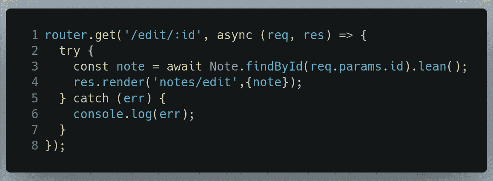

要在 routes/notes.js 中编写的代码

*   `Line 1`:处理 URL 中包含`ID`参数的`notes/edit`目录。
*   `Line 3`:通过其 ID 查找相关笔记。我们可以用`req.params.id`值获得这个 ID。接下来，我们使用`lean()`方法将文档转换成普通的 JavaScript 对象。
*   `Line 4`:渲染`edit.hbs`文件，将`note`对象作为数据发送。

接下来，我们需要处理`PUT`请求，这将允许我们编辑数据库中的数据。

在`routes/note.js`中，编写以下代码:

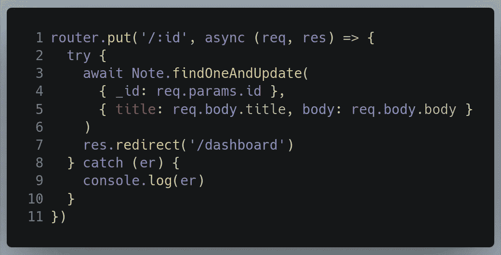

要在 routes/note.js 中编写的代码

*   `Line 1`:在`/notes/`目录下处理`PUT`请求，该目录包含 URL 中的参数`ID`。
*   `Lines 3–4`:通过笔记文档的 ID 找到笔记文档。我们可以通过`req.params.ID`值获得 ID。
*   `Line 5`:用`textarea`元素的值更新文档的`title`和`body`值。
*   `Line 7`:完成后，将用户重定向到`/dashboard`目录。

现在运行代码。这将是代码的输出。在这里，我们正在从仪表板进行编辑。

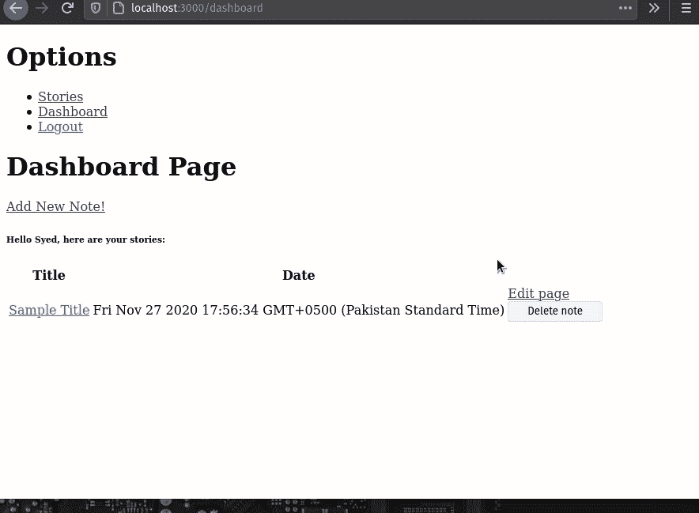

代码的输出

太好了！这个代码有效！现在让我们继续删除我们的笔记文档。

最终，`routes/notes.js`应该是这样的:

而这就是`**/app.js**`应该有的样子:

## 删除注释

让我们回溯一下。请注意，无论我们在车把文件中的什么地方实现了删除按钮，我们都编写了以下代码:

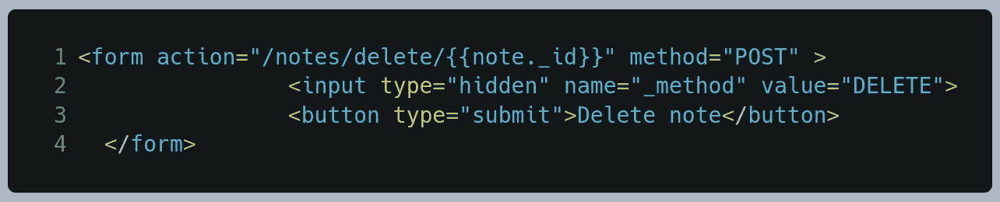

执行删除请求的代码

您可以在`views/partials/_dashboard.hbs`和`views/notes/read.hbs`文件中找到这个片段。这段代码告诉`method-override`我们将创建一个`DELETE`请求(如`line 2`所示)，而不是发送一个`POST`请求。

现在剩下的就是处理这个`DELETE`请求了。

为此，转到`routes/notes.js`，并编写以下代码:

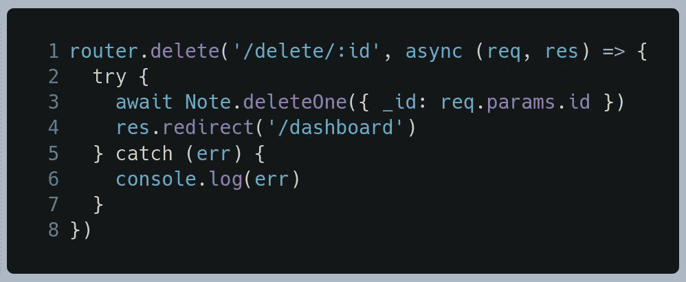

要在 routes/notes.js 中编写的代码

*   `Line 1`:处理 URL 中包含`ID`参数的`/notes/delete`目录。
*   `Line 3`:运行`deleteOne`mongose 方法，该方法将查询 Note 文档及其 ID。我们可以通过`req.params.id`的值来获取该纸币的 ID。
*   `Line 4`:现在将用户重定向到`/dashboard`路线。

运行代码。在这里，我们将从控制面板页面中删除。这将是结果:

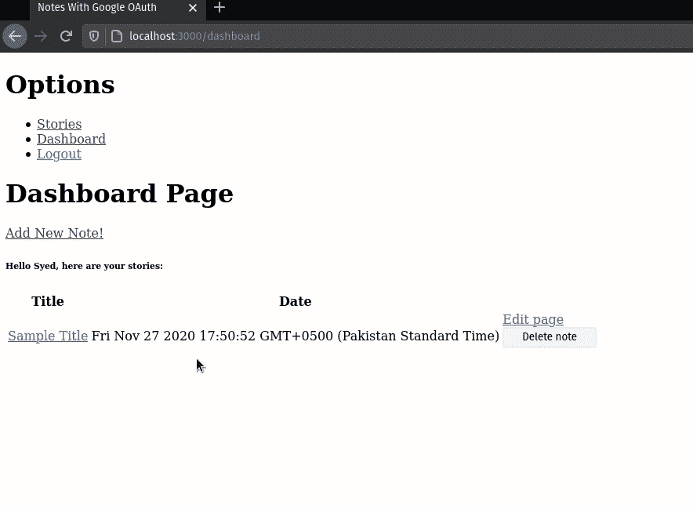

代码的输出

瞧啊。我们成功了！我们终于用 Google OAuth 创建了 Notes 应用程序。

但是，如果您愿意，还可以做一些收尾工作来增强用户体验。这是完全可选的。

最后，`routes/notes.js`看起来是这样的:

# 改善用户体验

## 显示用户的个人资料照片

在设计我们的`UserSchema`时，我们还包含了一个`image`属性，它指向用户个人资料图片的 URL。

让我们从将用户的图像发送到`dashboard.hbs`文件开始。

为此，转到`**routes/index.js**` 文件并执行以下步骤。

*   找到处理`/dashboard`路线的那段代码:

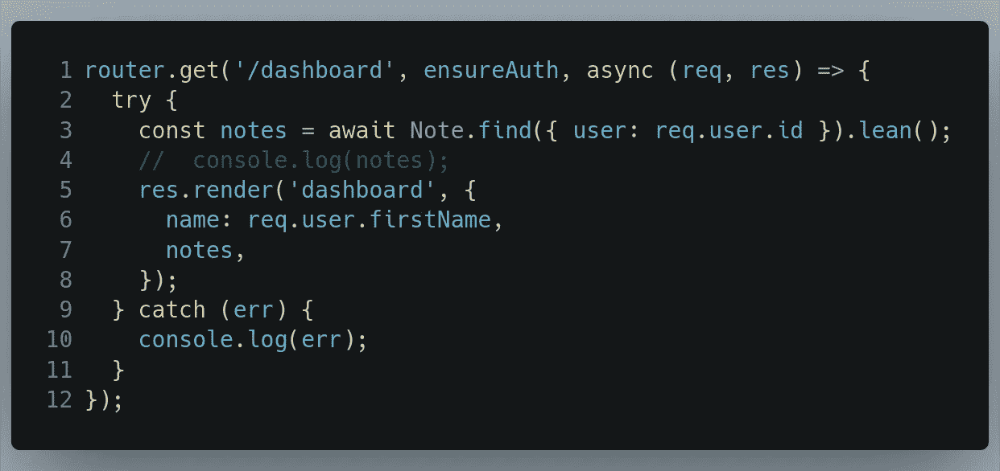

routes/index.js 中要替换的代码

*   用以下内容替换:

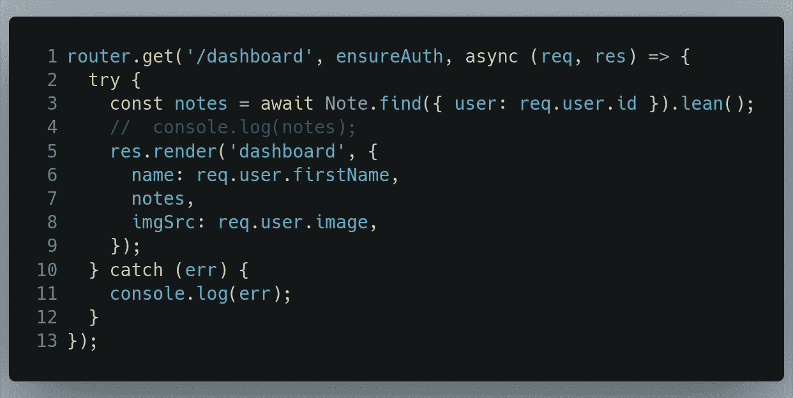

routes/index.js 中要替换的代码

唯一的变化是在`Line 8`上，我们也将用户的`image`数据发送到`dashboard.hbs`。

剩下的就是渲染`dashboard.hbs`中的图像了。

转到`views/dashboard.hbs` ，在开头写下下面一行代码:

```
{{!-- Code to write in views/dashboard.hbs --}}

```

现在运行代码。以下是仪表板页面上的结果:

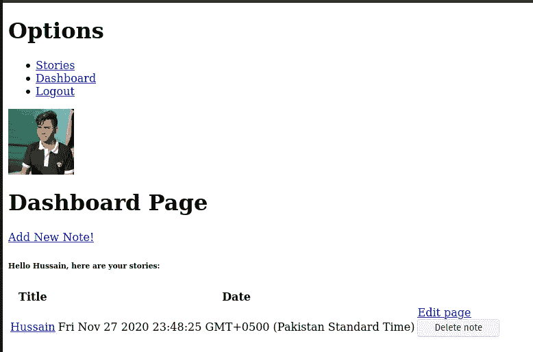

代码的输出

太好了！我们终于可以看到用户的个人资料图像了。

在下一节中，我们将格式化日期以使其更短。

## 格式化日期

我们将使用`moment`包来格式化日期。

首先，在根目录下创建一个名为`helpers`的新文件夹。在`helpers`中，创建一个名为`formatDate.js`的新模块。

在`helpers/formatDate.js`中，编写以下代码:

*   `Line 1`:导入`moment`库。
*   `Line 3–5`:导出一个以 date 为参数的函数，返回一个格式为`Month Date Year H:M:S`的日期。

现在我们需要告诉寄存器`formateDate`作为一个辅助函数。

转到`/app.js`并执行以下步骤。

*   导入`formatDate`功能:

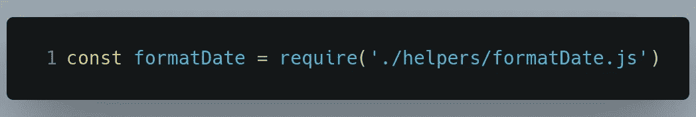

在 app.js 中导入库

现在我们需要告诉`express-handlebars`使用`formatDate`作为辅助函数。

*   找到下面这段代码:

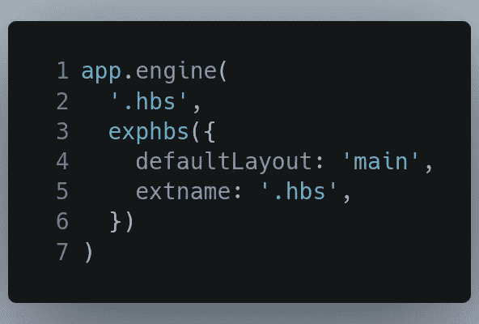

要在 app.js 中替换的代码

并替换为以下内容:

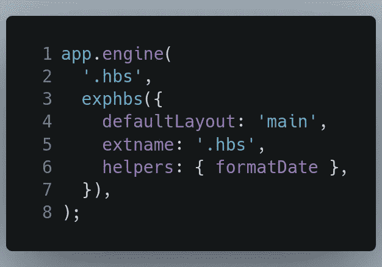

app.js 中要替换的代码

唯一的变化是在`Line 6`上。我们现在已经告诉`express-handlebars`我们可以使用`formatDate`函数作为辅助方法。剩下的就是用这个了。

为此，我们首先从仪表板页面开始。转到`views/partials/_dashboard.hbs` **、**并执行以下步骤。

*   找到显示时间的代码行:

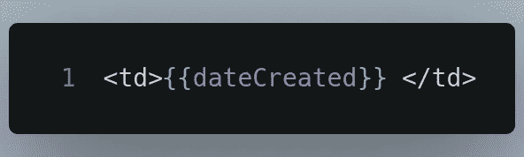

要在 views/partials/_dashboard.hbs 中替换的代码

*   现在，将其替换为以下内容:

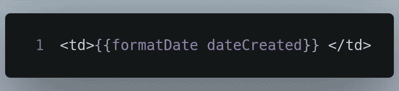

要替换为 in views/partials/_ dashboard . HBS 的代码

现在让我们对`read.hbs`做同样的事情。

转到`views/notes/read.hbs` **、**并执行以下步骤:

*   找到显示创建日期的代码行:

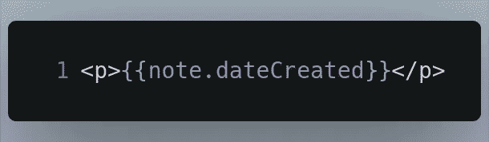

要在 views/notes/read.hbs 中替换的代码

*   现在将其替换为以下内容:

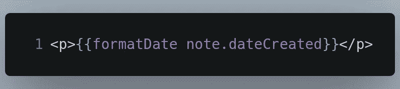

在 views/notes/read.hbs 中替换为的代码

太好了！我们都做完了。让我们运行代码。以下是仪表板页面上的结果:

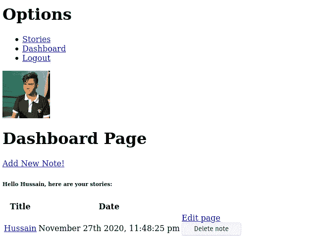

代码的输出

瞧啊。代码起作用了！

最后，`/app.js` 应该是这样的:

我们都做完了！有一些建议可以让这个应用程序看起来更好。

## 改进应用程序

*   **更好的用户界面**:为了在不损失任何功能的情况下让教程尽可能的简单，我没有把重点放在让 web 应用看起来更好上。可以使用 [Materialize、](https://materializecss.com/)这样的组件，让它看起来很醒目。
*   在将笔记保存到数据库之前对其进行加密:一些用户可能希望对他们的数据保密，不希望任何人窥探他们。你可以通过使用`[crypto](https://nodejs.org/api/crypto.html)`或`[mongoose-encryption](https://www.npmjs.com/package/mongoose-encryption)` 来加密用户的笔记，这样如果有人查看了应用程序的数据库，就没有人可以读取其他人的数据。

# 结论

如果您有任何困难，那么建议您使用代码并广泛研究，以完全掌握 Passport 身份验证和 Notes 应用程序的内部工作原理。不要放弃！

这篇教程绝不是一篇短文。恭喜你坚持到了最后！我希望你从这篇文章中学到了很多。感谢阅读！

# GitHub 链接和其他学习资源

## Github 知识库

这是这个项目的 [Github 回购](https://github.com/HussainArif12/notes-google-auth)。

## 额外学习

*   [故事书应用程序——在 YouTube 上浏览媒体](https://www.youtube.com/watch?v=SBvmnHTQIPY)
*   [快递(NodeJS)——谷歌 oauth 2.0——Youtube 上的武卡](https://www.youtube.com/watch?v=o9e3ex-axzA)
*   [谷歌 OAuth 初学者指南。](https://dev.to/phyllis_yym/beginner-s-guide-to-google-oauth-with-passport-js-2gh4)
*   用 Mongoose 在 NodeJS 上创建一个 Notes 应用程序

下一篇:[用 TailwindCSS 和 Material-UI](https://medium.com/javascript-in-plain-english/build-a-react-pomodoro-app-with-material-ui-and-tailwindcss-e4bab98e30ae) 构建 React Pomodoro App
上一篇:[用 Node.js 构建简单的网页抓取项目](https://codeburst.io/simple-web-scraping-project-with-node-js-b2a1710b4b37)