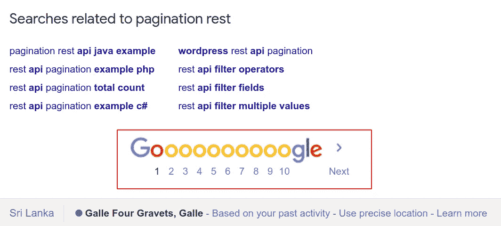

# 使用 Node.js、Express 和 MongoDB 构建分页 API

> 原文：<https://betterprogramming.pub/build-a-paginated-api-using-node-js-express-and-mongodb-227ed5dc2b4b>

## 为您的应用快速创建 REST APIs

[本·怀特](https://unsplash.com/@benwhitephotography?utm_source=unsplash&utm_medium=referral&utm_content=creditCopyText)在 [Unsplash](https://unsplash.com/?utm_source=unsplash&utm_medium=referral&utm_content=creditCopyText) 上的照片(作者用 Adobe Photoshop 修改)。

假设您试图显示成百上千的数据(比如一堆用户记录列表、帖子、教程等等)。)在前端应用程序中。在提高应用程序性能的同时，你有什么策略来呈现它们？

我想到的最明显的答案是分页！对于那些不熟悉分页概念的人，我将简单介绍一下。

# 分页概念

> "分页，也称为分页，是将文档分成独立页面的过程."— [维基百科](https://en.wikipedia.org/wiki/Pagination)

当您调用 REST API 时，有时会返回很多结果。出于这个原因，我们对结果进行分页，以确保响应更容易处理。

当有大量数据无法合理地显示在一个页面上时，它可以提供更好的用户体验和更容易的导航。

像 Google 这样的搜索引擎是在搜索引擎结果中使用分页的一个很好的例子。这使得用户在第 1 页找不到的情况下，可以更容易地在其他页面找到他们想要的内容。

Google 搜索结果中的分页示例

有许多技术可以实现分页，但是我将向您展示实现分页的最简单的方法。让我们看看有哪些方法，然后选择一个合适的方法:

1.  客户端—服务器在一个请求中将所有可用的记录作为一个大块传输到客户端，这些结果被划分(例如，使用 JavaScript 的`list slice`方法)到页面中并在客户端呈现。
2.  服务器端—服务器接受来自客户端的许多参数(当前页面、排序等。)，执行获取相关记录所需的搜索，并发送一个分页的结果对象，该对象包含标识页面的详细信息(如总元素数和窗口大小)。

客户端分页更适合数据集较小的应用程序。如果您的数据简单且易于管理，那么我建议您走客户端分页的快捷方式。

> “客户端处理的最大缺点是，当用户第一次访问包含表的页面时，所有数据都会被加载。提取大型数据集可能意味着等待页面加载的时间更长。随着数据结果的增长和数据变得更加复杂，加载时间会显著增加。
> 
> …
> 
> 服务器端处理更适合处理更复杂的数据集，因为服务器只给客户端提供它需要的那部分数据，这意味着初始加载会非常快。“— [建立这个](https://buildthis.com/client-side-vs-server-side-pagination/)

因此，如果您有一个更大的数据集，我建议使用服务器端分页。

在本文中，我们将探讨服务器端分页，因为它在快速增长的应用程序中伸缩性更好，并且也是行业标准。

# 实施

我将在我最喜欢的服务器环境之一上实现它:Node.js with Express。我还使用 MongoDB 作为我的数据库和 Mongoose 对象数据建模库。但是，如果您理解了这个概念，您可以将它应用于任何数据库。

*先决条件:关于如何用 Express 和 Mongoose 设置 Node.js 应用程序的一些知识。*

首先，我创建了一个用户模式来为我的 MongoDB 添加一些虚拟值。这是一个带有 ID 和名称的简单模式:

用户模式

然后，我创建了一个函数，在数据库连接建立后插入虚拟数据。我为这个演示添加了 12 个用户:

向数据库添加虚拟数据

现在是最重要的部分:处理分页。为此，我用`/users` Get API 创建了一个名为`paginatedResults`的函数:

分页功能

这里，我取两个查询参数:`page`和`limit`。`page`是指您正在请求的当前页面，`limit`是您希望检索的文档数量。

一旦客户端通过查询参数发送了页面和限制，我就将它们作为常量来使用和存储。然后我定义一个`skipIndex`来从结果列表中跳过相关的数字。

因此，MongoDB 查询将如下所示:

*   首先，它按照 ID 以升序对列表进行排序。
*   然后，它根据用户需求限制列表，并根据页面请求跳过数据。

如你所见，这真的是简单的逻辑。

`exec()`函数将执行这个查询作为承诺。我用一个`try-catch`把它包起来，因为数据库异常应该在那里处理。

一切都设置好了，现在您可以通过调用`/users` REST 端点来测试这个分页应用程序。

# 测试解决方案

您可以从 Postman 客户端或浏览器对此进行测试。这里，我将 REST 客户端用于 Visual Studio 代码插件。

这是 REST API 端点:[http://localhost:3000/users？page=1 & limit=3](http://localhost:3000/users?page=1&limit=3) 。

下面的演示视频展示了分页 API 测试是如何完成的:

演示视频

# 资源

完整的项目可以在下面的 GitHub 资源库中看到:

 [## Yasas4D/PaginationNodejs

### 用 Node.js、Express 和 MongoDB-yasas 4d/pagination nodejs 创建一个分页 API

github.com](https://github.com/Yasas4D/PaginationNodejs) 

# 结论

在本文中，您了解了如何使用 Node.js 和 MongoDB 创建分页的 REST API。但是，您可以用任何其他数据库替换该数据库，因为该概念对于所有数据库都是相同的。我强烈推荐执行服务器端分页，因为它易于扩展和修复。

我希望这篇文章对你有所帮助，并且你能够在你正在做的任何项目中实现它。如果你有什么建议，请告诉我。

感谢您的阅读和快乐编码！