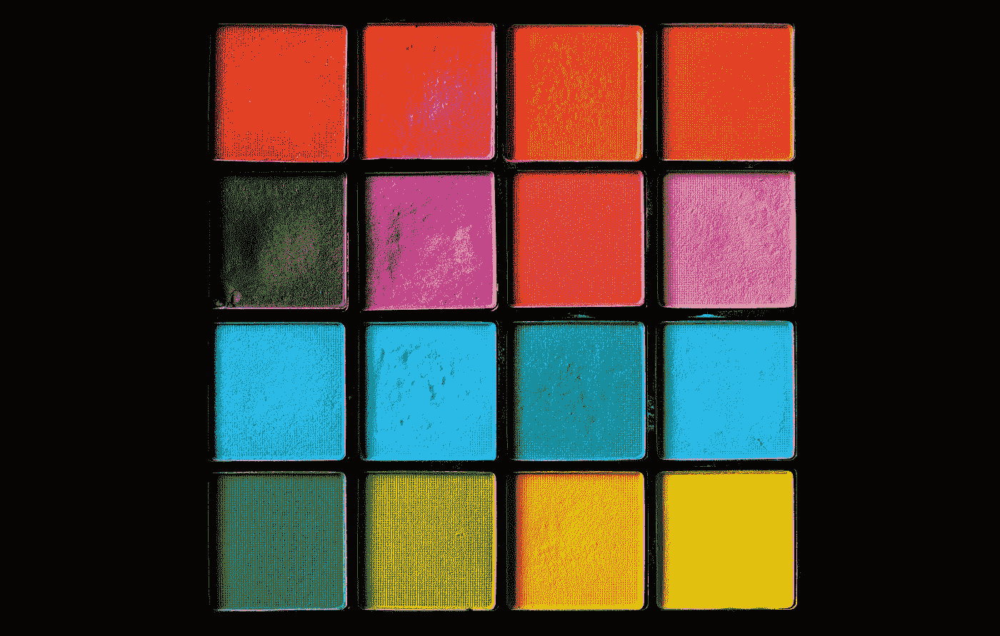
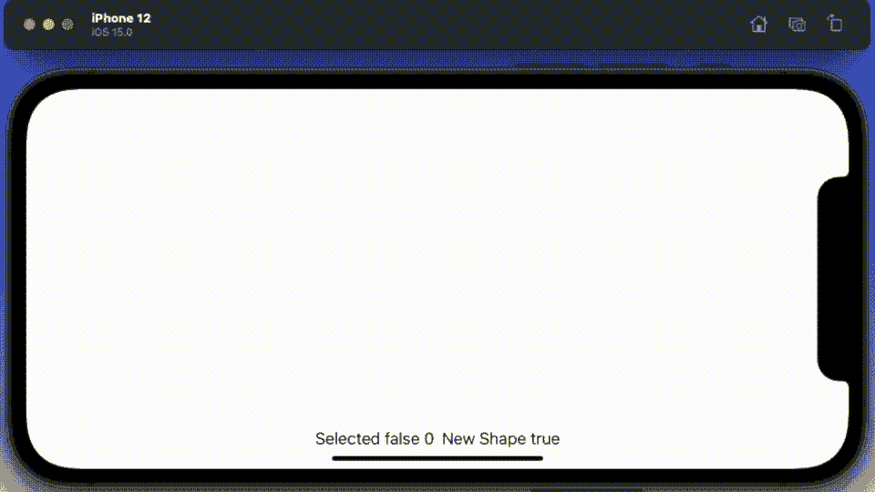

# 用 SwiftUI 在 iOS 15 中搭建绘画 App

> 原文：<https://betterprogramming.pub/build-a-painting-app-in-ios-15-with-swiftui-bb757a925f6a>

## 使用新的画布视图构建一个简单的绘画应用程序

照片由[莎伦·麦卡琴](https://unsplash.com/@sharonmccutcheon?utm_source=unsplash&utm_medium=referral&utm_content=creditCopyText)在 [Unsplash](https://unsplash.com/s/photos/shapes?utm_source=unsplash&utm_medium=referral&utm_content=creditCopyText) 拍摄

开发应用程序时，你肯定会发现自己需要做的事情之一就是一些简单的图形。可以用画图或预览绘制的那种图形。它们是很棒的应用程序，但并不总是理想的，因为当你经常需要一个形状作为位图时，你希望它是一个特定的 iOS 颜色或大小。这两者在画图/预览中都是可能的，但有时不那么容易达到像素完美。

当我完成这个系列的时候，请加入我的旅程，学习如何构建一个简单的绘画应用程序来解决这个问题，并下载最终的应用程序。

# 案情摘要

我想要一个可以在 iOS 下运行的应用程序来构建一些简单的图形。我希望它像绘画或预览应用程序一样合理直观地工作。您应该能够以多种颜色创建、删除、调整大小、复制和粘贴以及重新定位多个形状。特定大小的形状。线条或立体形状——至少是三角形、正方形或圆形。显然，您需要能够保存所述绘图，并容易地将它们导出到开发平台。不像预览或绘画，我也想有层的概念。好有将是能够添加文本到所说的形状和画线。

# 编码

现在，我最初确实考虑过作为一个混合的 UIKit/SwiftUI 应用程序来做这件事，其中一个明显的挑战是 SwiftUI 中缺少触摸手势。令人欣慰的是，我发现使用最小距离为零的拖动手势与 UIKit 上的触摸手势工作方式相同——所以我使用了它，并使用了 pure SwiftUI。

我在这里展示的版本 1 最复杂的方面是创建和选择形状背后的逻辑，这需要一点点的尝试和错误。我从`ObservableObject`开始，我可以用它在画布视图和`ContentView`之间共享数据。

我意识到作为一个单一的结构比三个数组更好，但是我在构建原型时添加了每个元素——我肯定会及时重新构建它。

接下来，我有了`CanvasView` ——一个在画布中自己的层内创建每个形状的视图。最后的演示卷轴使用了椭圆，奇怪的是它似乎比`rect`更好，这是我需要改进的一个特性。

中期计划是使用我在[这篇文章中概述的技术，用 X 边的路径](https://medium.com/analytics-vidhya/shapes-with-paths-using-swiftui-part1-fb7250d3dce8)构建一个形状。

接下来，在`ContentView`中，你得到了一个巧妙的逻辑来计算图像的选择/取消选择应该如何工作。

这里也是在基础上有两个变量，以帮助跟踪一些关键变量，因为我是调试应用程序。读者可能会注意到的另一点，即在几个地方使用了`DispatchQueue`——这是一种绕过紫色警告并确保 UI 只在主线程上更新的“修复”。

最后，我需要构建两个助手例程来帮助选择和取消选择屏幕上的对象:

关键时刻当你把所有这些放在一起，在模拟器上运行时，看起来是什么样的。

在这个动画 GIF 中，你可以看到我画了一个圆，通过点击它的边框选择它，并将其移动到直线上。然后我点击离开，取消选择它，然后创建另一个。

我还没有发现它对定制形状的效果如何。我们将在后续文章中深入探讨这一点。感谢阅读。