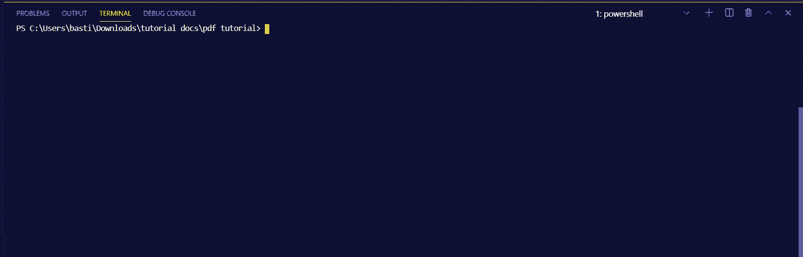
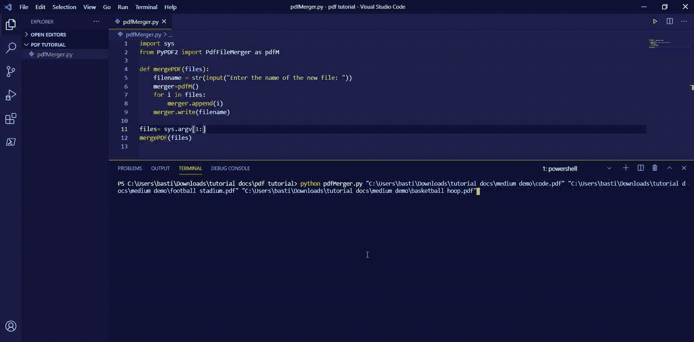
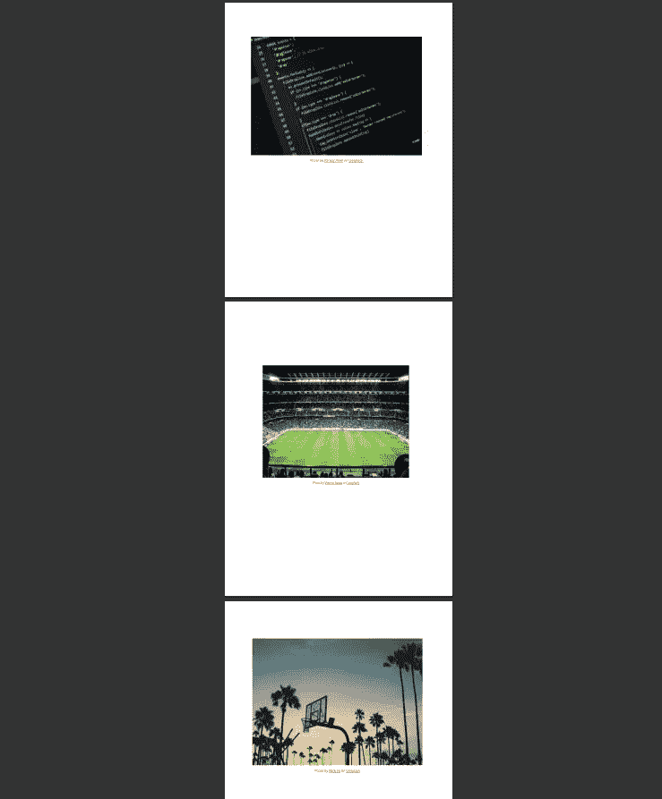

# 用 Python 构建 PDF 合并

> 原文：<https://betterprogramming.pub/build-a-pdf-merger-in-python-c582607a9d29>

## 用一个简单的脚本合并多个 PDF 文件

由 [Christopher Gower](https://unsplash.com/@cgower?utm_source=medium&utm_medium=referral) 在 [Unsplash](https://unsplash.com/?utm_source=medium&utm_medium=referral) 上拍摄的照片。

只是我吗？我喜欢尝试用 Python 写的又酷又有趣的东西。我写过的最有用的程序之一是 PDF 合并。灵感来自于需要同时将几个 PDF 组合在一起，而不覆盖任何现有的 PDF 资源。

# 我们自己做吧！

为了让我们的生活更容易，我将使用 PyPDF2 库。下面的 GIF 展示了使用`pip install PyPDF2`命令安装库的过程。PyPDF2 库处理合并 PDF 文件的所有复杂工作。当然，我们会给我们的小程序增加一些技巧和华丽。

作者分享的屏幕。

该库附带了几个有用的工具，如 PDF 文件阅读器、编写器和合并器。首要任务是弄清楚我们将如何定位不同的 PDF 资源，并将它们作为参数传递给库。

为了简单起见，我将使用命令行向程序提供输入。从今以后，我将使用 sys 模块来接受资源的绝对文件路径。绝对文件路径，通常称为完整文件路径，本质上是文件在根目录中的精确位置。`sys.argv`函数将获取并返回命令行(终端)中输入的所有文件路径的列表。这是一个累积要合并的每个资源的位置的过程。

注意:在下面的代码中，我们将从索引`1`而不是`0`开始获取`sys.argv`的内容。为什么？`Sys.argv[0]`包含脚本的名称(如`pdfMerger.py`)。

随后，我们必须从 PyPDF2 库中导入 PDF 文件合并。例如，从 PyPDF2 中，将`PdfFileMerger`导入为`pdfM`。

另外，我们必须在导入后实例化`pdfFileMerger`。比如`merger= pdfM()` 既然我们把`pdfFileMerger`导入为`pdfM` ***。***

上面的代码片段是我们创建小型 DIY PDF 合并应用程序所需的全部内容。

# 测试

我们将按照命令行中输入的顺序合并三个 PDF 文件。以下三幅图像将被放入单独的 PDF 文件中，然后合并成一个 PDF 文件:

在 [Unsplash](https://unsplash.com/?utm_source=medium&utm_medium=referral) 上由 [Vienna Reyes](https://unsplash.com/@viennachanges?utm_source=medium&utm_medium=referral) 拍摄。

照片由[尼克·吉奥](https://unsplash.com/@nicholasjio?utm_source=medium&utm_medium=referral)在 [Unsplash](https://unsplash.com/?utm_source=medium&utm_medium=referral) 上拍摄。

由 [Pankaj Patel](https://unsplash.com/@pankajpatel?utm_source=medium&utm_medium=referral) 在 [Unsplash](https://unsplash.com/?utm_source=medium&utm_medium=referral) 上拍摄的照片。

下面的 GIF 演示了使用三个参数执行的应用程序——要合并的 PDF 文件的绝对文件路径。因此，系统会提示我们为新创建的文件提供一个名称。它将位于当前工作目录(即包含应用程序的文件夹)中。现在我们有了它:一个包含其他文件内容的文件。

演示应用程序

描述创建的 PDF 内容的屏幕截图。

# 结论

哇！那是一个非常有用的应用，不是吗？

软件开发可能很有趣——当我们构建并欣赏自己的应用程序时更是如此。今天，我们构建了这个应用程序的一个极简版本，但是为什么要止步于此呢？我们总是可以创建自己的应用程序来满足我们个人的需求。

正如上一节所演示的，我们成功地将多个 PDF 文件合并成一个文件。通过这样做，我们不仅创建了一个有用的工具，而且满足了从本地机器合并多个 PDF 资源的需求。