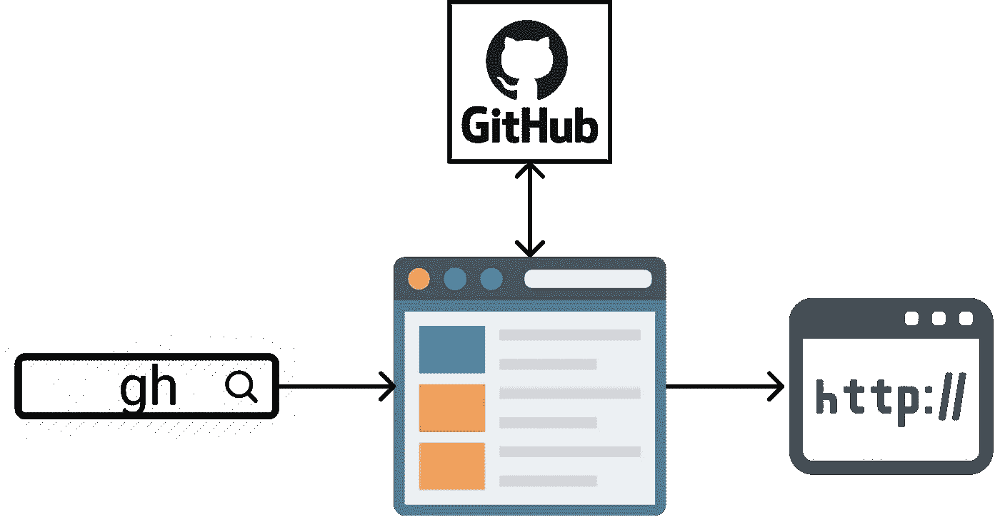
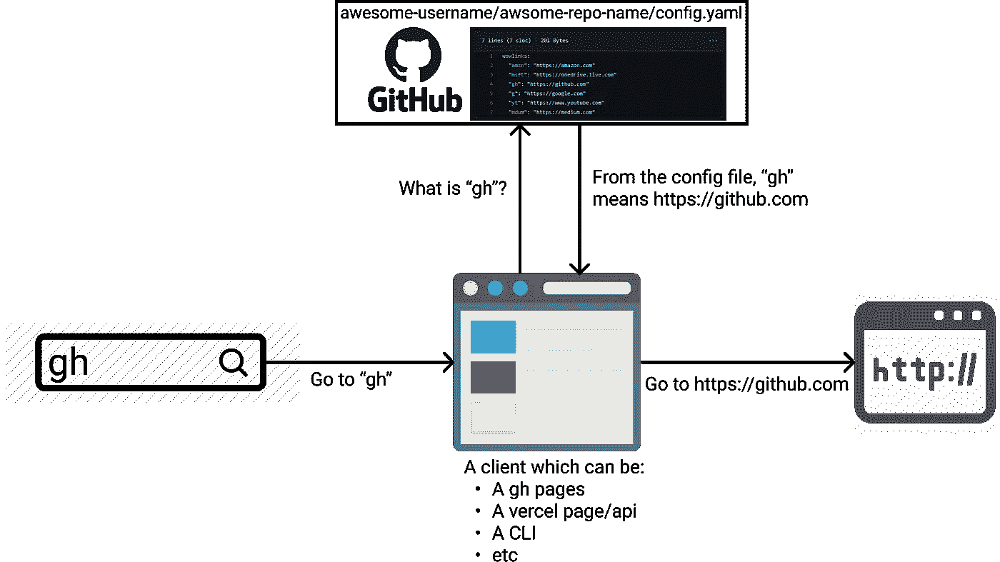
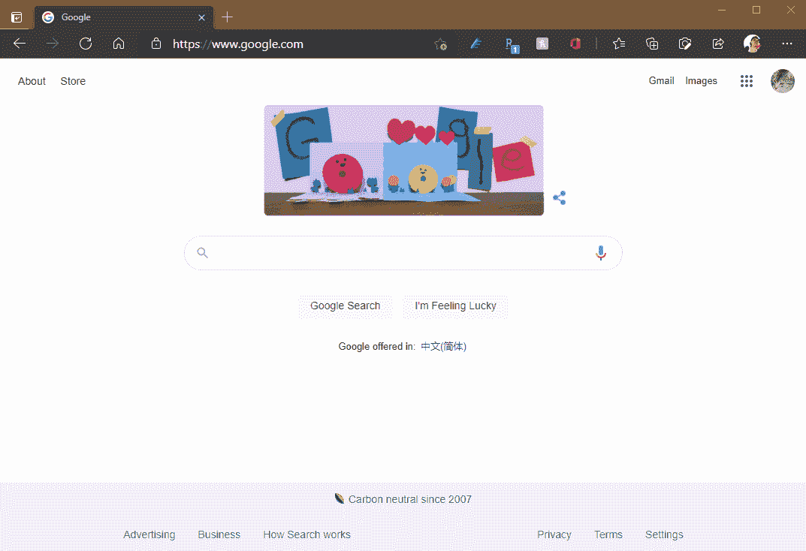
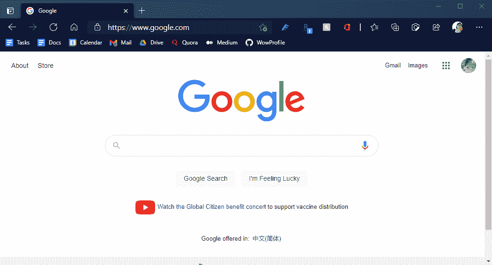

# 用 TypeScript 和 GitHub 构建一个个人“前往”链接服务

> 原文：<https://betterprogramming.pub/build-a-personal-go-to-link-service-with-typescript-and-github-35d4cbc2c0d7>

## 只需`gh`就能更快地查找 GitHub

作者照片。

作为一名开发人员，我花了很多时间在 GitHub 库、开源项目和堆栈溢出问题之间跳跃。

通过在谷歌上搜索、浏览书签或键入完整的网址来开始每个新标签页令人沮丧。

在公司中，开发人员通常在内部使用某种形式的“转到”链接服务来轻松导航。例如，开发人员将定义`gh`来表示 GitHub，或者定义`q`来表示堆栈溢出。

类似的服务在工作之外也很方便。

有几个解决方案，但是它们对于我的用例来说足够灵活。

例如， [golink](https://www.golinks.io/) 只面向企业，而 [trotto](https://github.com/trotto/go-links) 需要托管服务器。最重要的是，它们都将链接映射存储在不可移植或不可定制的专有服务器中。

作为一个开发人员，如果当前的解决方案不够用，是时候构建一个了。

# “转到”链接服务=客户端+映射+翻译器

“前往”链接服务并不复杂。这就是我们所需要的:

*   易于访问的网关客户端(例如，保存为书签的网站或自定义搜索引擎)。
*   用于 URL 翻译和提取的存储(例如，从`gh`到[https://github.com](https://github.com))。它可以像存储在 GitHub 上的 YAML 文件一样简单，甚至可以是一个[要点](https://gist.github.com/discover)片段。
*   翻译逻辑。

下面是上面提到的组件如何组成“前往”链接系统:

“前往”链接系统概述

# 用 GitHub Goodies 构建=简单+开放

在过去的几年里，GitHub 通过添加工具使其成为一体化解决方案，取得了巨大的进步。

用 GitHub 技术构建项目减少了开发人员的维护工作，并为创造性的扩展提供了可能性。

这个项目用 GitHub 实现了上面提到的组件:

*   网关客户端—用 React 构建的 GitHub 页面(用 TypeScript)
*   URL 查找存储— GitHub 存储库
*   翻译逻辑 GitHub 注册表中的包

# URL 查找提取器和转换器的接口

对于 URL 查找提取器，我们需要的只是识别特定 GitHub 存储库的信息:

URL 转换查找提取器的高级接口

对于 URL 翻译器，它将配置一个翻译查找表，并且它有一个`convert`方法，可以将一个短 URL 转换为完整的 URL:

URL 转换器的高级接口

# 实现接口

GitHub 版本的 URL 翻译查找提取器的高级思想是，它将从 GitHub 存储库中下载字典文件并解析它，因此我们将使用 GitHub JS REST API 库和 JS YAML 解析库:

URL 转换器的实现包括一个基本的字典查找和几个条件验证:

# 构建一个 GitHub 页面作为网关

在获取查询和翻译 URL 的底层逻辑完成之后，我们可以使用它来构建一个门户网站，将短链接重定向到预定义的完整链接。

我们将首先从`create-react-app`开始，然后用下面的代码替换主页:

用 React 简单实现一个门户网站

上面的代码:

1.  解析 URL 查询参数中的短链接。
2.  从由 URL 查询参数定义的 GitHub 存储库中获取 URL 翻译查找。
3.  使用步骤 2 中获取的翻译查找将短链接翻译为完整的 URL。
4.  重定向到完整的 URL。

# 将服务配置为搜索引擎

现在我们有了一个可以根据配置重定向我们的 URL 的网站，我们需要一种方法来在新标签打开时轻松访问这个网站。

一种方法是将其保存为书签，但这仍然需要一次点击，所以我建议将其作为自定义搜索引擎。

在 Edge、Firefox、Chrome 或 Safari 中的自定义搜索引擎设置中，添加一个新的搜索引擎，它指向我们刚刚以地址栏输入作为搜索查询推送到 GitHub 页面的网关网站。

比如我们可以用[【https://wowlink.github.io/wow-page?wow=%s】*并给它一个关键字。在这个演示中，我们将使用“哇”*](https://wowlink.github.io/wow-page?wow=%s.)

*这样配置后，当我们在搜索栏中输入*“wow”+space+GH*时，它将被重定向到配置文件中设置的[https://github.com](https://github.com)。*

*下面是它的工作原理:*

**

**注意:由于我们仅在搜索引擎配置中添加了 wow 选项，因此将使用*[*https://github.com/wowlink/default-profile*](https://github.com/wowlink/default-profile)*的默认配置。要使用自定义翻译查找，请在搜索引擎配置中添加* `*gh_user*` *和* `*gh_repo*` *参数。此外，对于更多定制，请查看文档**[*。*](https://wowlink.github.io/wow-docs/)**

**尝试一下:**

****

**尝试一下其他一些日常网站**

# **更有创意的用例**

*   **对于有几个活动项目的开发人员来说，将项目名称映射到项目存储库是很方便的。例如，我将 *wow* 映射到【https://github.com/wowlink/wow-page】T2。**
*   **对于那些在谷歌文档或 OneDrive 文档中保留日常待办事项列表的人来说，将*待办事项*映射到文档会很有用。**
*   **此外，一个团队可以让所有成员都指向同一个翻译查找库，这样所有成员都有相同的链接来交换信息。**
*   **对于经常访问来自多个领域或一个团队的网站的人来说，拥有多个用于链接映射的存储库并为每个存储库设置不同的搜索引擎关键字是很方便的。**

**这是从头开始建立个人“去”链接服务的完整指南。如果你想玩这个项目，可以在 GitHub 上查看一下[。如果你只是想配置一个现成的“转到”链接服务，请查看](https://github.com/wowlink) [WOW 链接](https://wowlink.github.io/wow-docs/)。如果你有什么好主意，请不要忘记在 GitHub 上公开问题。**