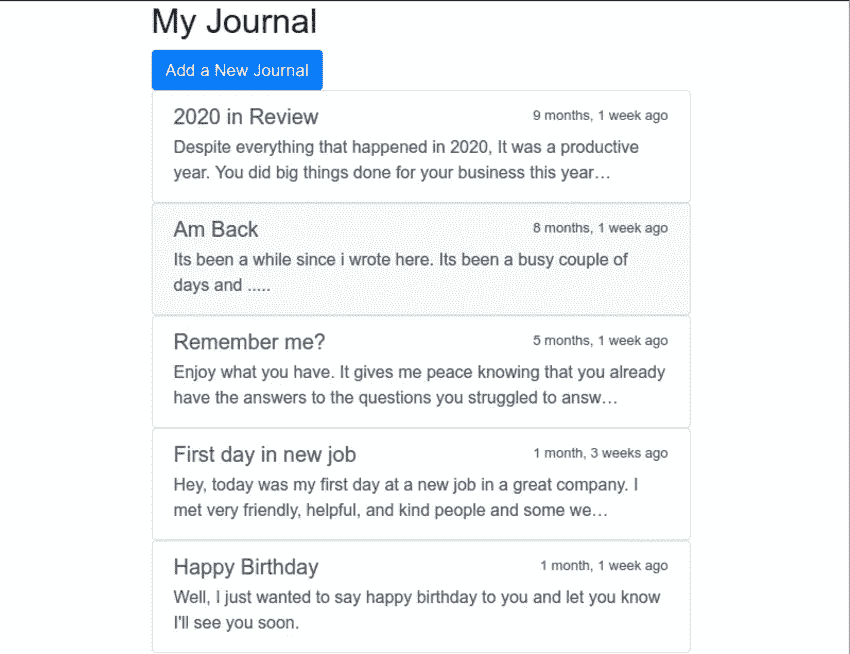
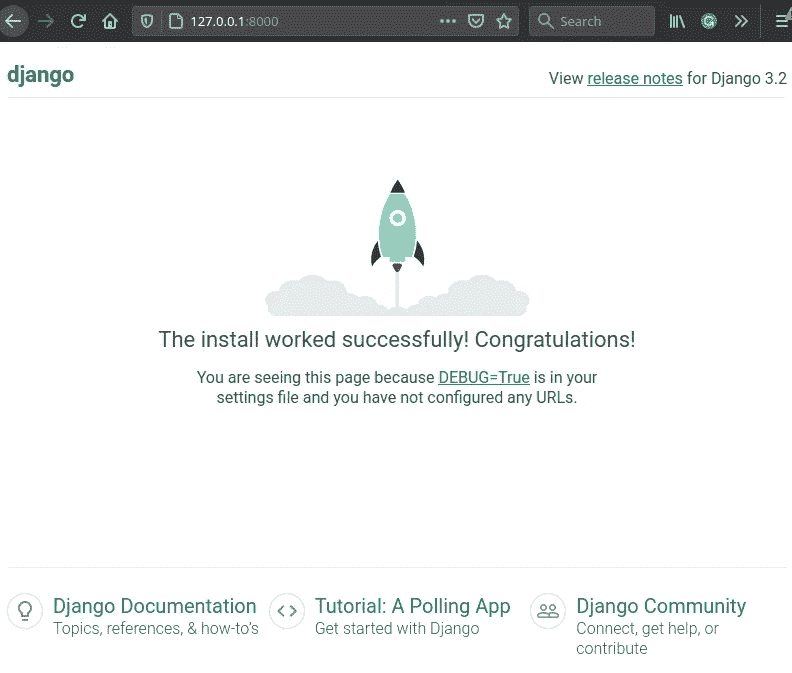
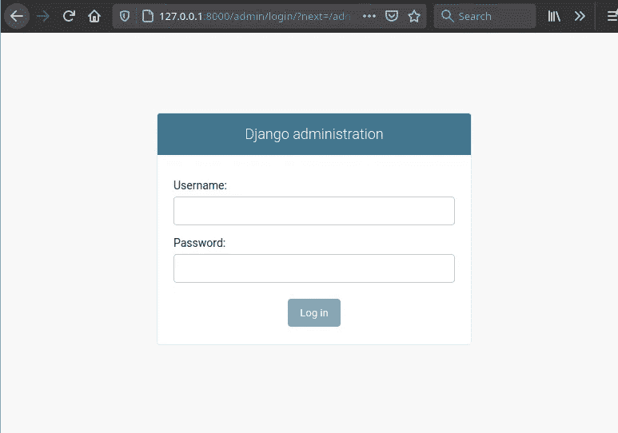
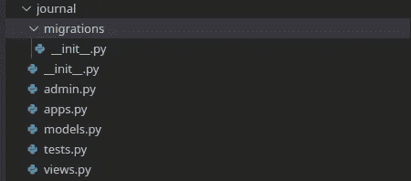
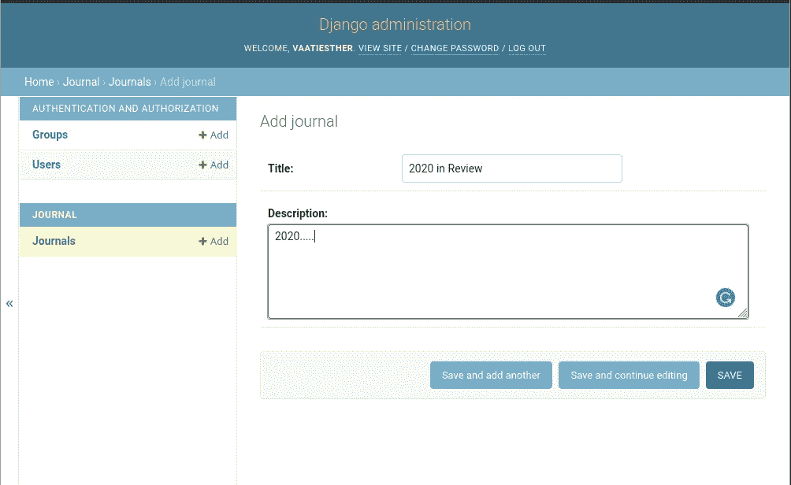
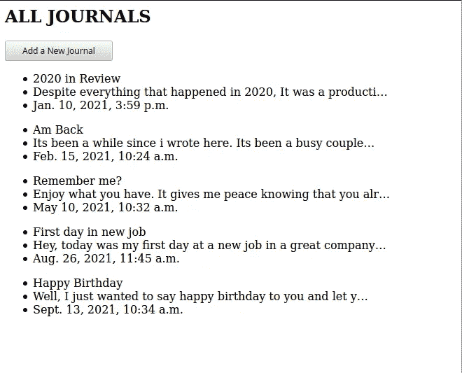
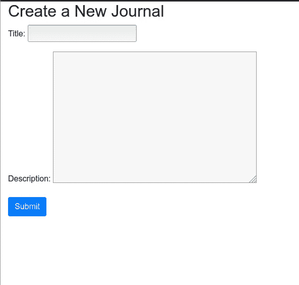
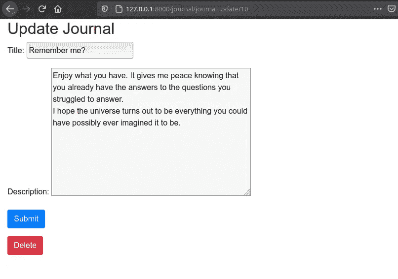
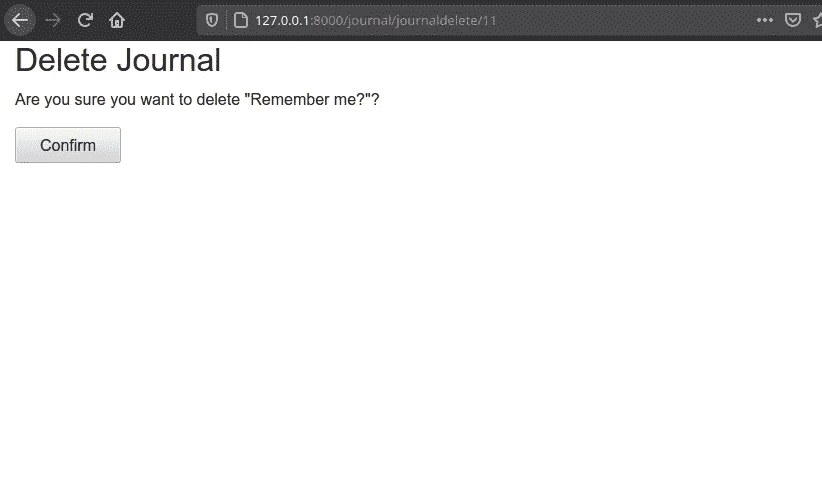

# 用 Django 和 Python 创建个人日志

> 原文：<https://betterprogramming.pub/build-a-personal-journal-with-django-and-python-f4835d27368c>

## 构建 Django web 应用程序


[真诚媒体](https://unsplash.com/@sincerelymedia?utm_source=medium&utm_medium=referral)在 [Unsplash](https://unsplash.com?utm_source=medium&utm_medium=referral) 上拍摄的照片

在本教程中，我们将设计并构建一个简单的个人日志，用户可以在其中执行以下操作:

*   添加新的日记条目
*   查看所有日记条目
*   编辑和删除特定的日记条目

**用户界面和 UX**

在构建任何应用程序之前，您应该考虑 UI(用户界面)和 UX(用户体验)。想想用户将如何浏览应用程序，以及它应该是什么样子。用户界面不必很复杂；一个简单的草图可以给你一个你想要实现的想法，使建筑过程更快更容易。对于我们的个人日志应用程序，我们应该有这样的东西:



当用户第一次打开应用程序时，他们会在主页上看到他们所有的日志条目，就像你在上面看到的一样。他们还可以选择点击按钮添加新的日志。

# 先决条件

你应该对 Python 和 Django 有一个基本的了解。您还应该熟悉命令行工具。

# **与 Django 一起创建个人日志**

我们将从创建一个虚拟环境开始。虚拟环境用于安装项目依赖项。如果您不熟悉虚拟环境，请参阅 python [文档](https://www.google.com/url?sa=t&rct=j&q=&esrc=s&source=web&cd=&cad=rja&uact=8&ved=2ahUKEwiAtqe5-djzAhWoDWMBHdV0AC0QFnoECBwQAQ&url=https%3A%2F%2Fdocs.python.org%2F3%2Ftutorial%2Fvenv.html&usg=AOvVaw0UAep4lL9Ei_BmqDlZ7DMd)以获得更详细的解释。

```
mkdir JOURNALcd journal/python3 -m venv myenv
```

激活虚拟环境:

```
source myenv/bin/activate
```

创建 Django 项目:

```
django-admin startproject journalapp
```

安装 Django:

```
python3 -m pip install Django
```

## **数据库**

Django 附带了一个轻量级的 SQLite 数据库，非常适合简单的项目。如果您打开`settings.py`文件，您应该会看到 sqlite 的数据库配置。

```
DATABASES = { 'default': { 'ENGINE': 'django.db.backends.sqlite3', 'NAME': BASE_DIR / 'db.sqlite3', }
}
```

## 创建超级用户

cd 到`journalapp` 并创建一个超级用户。

```
cd journalapp
python3 manage.py createsuperuser
```

运行服务器

要查看您的应用程序启动并运行，请运行开发服务器。

```
python3 manage.py runserver
```

导航到 [localhost:8000](http://127.0.0.1:8000/) ，您应该看到应用程序正在运行。



要以管理员身份登录，请导航到 localhost: admin 并使用超级用户凭据登录。



Django 管理

**创建日志应用**

在 Django 中，应用程序用于区分应用程序的不同组件。随着应用程序的增长，通过为每个组件创建一个应用程序来区分应用程序的各个部分至关重要。例如，如果你正在建立一个医院管理系统，你会有一个医生、病人等等的应用程序。在这个项目中，我们将只创建一个名为 journal 的应用程序。

在终端中，通过按 ctrl+C 关闭服务器，并使用以下命令创建一个日志应用程序。

```
python3 manage.py startapp journal
```

上述命令将创建一个名为 journal 的文件夹，其中包含以下文件。



日志应用程序

转到`settings.py`，在`INSTALLED_APPS`的列表下添加日志 app，如下图。

这让 Django 意识到了 app 的存在。正如你在上面看到的，Django 已经有了一些内置的应用程序，比如:

*   作家（author 的简写）
*   管理
*   内容类型
*   会话，欧洲电信委员会

**创建模型**

Django 使用模型来表示 Django 应用程序中的对象。对象指的是我们希望存储在我们的应用程序中的东西，即书籍、电影、人物、e.t.c .模型，反过来也有属性；例如，一个人可以有一个名字，年龄等等。

在我们的日志应用程序中，由于我们知道日志必须有标题、描述和日期，因此我们将创建一个名为`Journal`的`Model`,具有以下属性:

*   标题
*   描述
*   日期 _ 创建时间

打开`journal/models.py`并添加日志模型。

models.py

## 迁移—进行迁移

我们已经有一个数据库，但我们还没有让它知道我们的模型。这是通过迁移完成的。迁移用于实现对模型的更改。每当您对模型进行更改时，您都必须运行迁移。让我们通过运行迁移来实现这一点。

```
python3 manage.py makemigrations
```

您应该会看到下面的结果。

```
Migrations for ‘journal’:journal/migrations/0001_initial.py
```

`makemigrations`命令创建一个迁移文件，其中包含如何创建数据库模式的指令。下一步是在我们的数据库中创建实际的表；我们使用 migrate 命令来实现这一点。

```
python3 manage.py migrate
```

您应该在终端中看到以下内容。

# **实施 CRUD 功能**

现在我们已经完成了数据库的设置和模型的定义，是时候实现日志条目的创建、读取、更新和删除了。

## 登记日记帐模型

向数据库添加日志条目最简单的方法是向 django `admin`注册`Journal`模型。为此，打开`journal/admin.py`文件添加以下代码。

```
from django.contrib import adminfrom .models import Journal# Register your models here.admin.site.register(Journal)
```

运行开发服务器并导航到 localhost:8000/admin，添加一些日志条目，这样您就可以处理一些数据了。



添加新的日记条目

## **基于类的通用视图**

在设计大多数 web 应用程序时，不得不一次又一次地重复某些模式是很单调的。Django 提供了抽象这些模式的通用视图来减轻这种痛苦，允许开发人员快速编写通用视图。

通用的基于类的视图允许开发人员快速实现创建、检索、更新和删除操作。

Django 中的视图用于向浏览器呈现模板。在许多项目中，最常用的视图是:

*   列表视图
*   详细视图
*   创建视图
*   更新视图
*   删除视图

让我们从显示日记账表中所有日记账条目的列表开始。打开`journal/views.py`，从`model.py`文件导入`Journal`模型，从文件顶部的`django.views.generic`导入`ListView`。

```
# views.pyfrom .models import Journalfrom django.views.generic import ListView
```

创建`JournalListView`，它将获取数据库中的所有日志条目，并将信息传递给模板进行显示。

journal/view . py

这里我们在`Journal`模型上定义了一个`JournalListView` ，并明确地告诉视图使用哪个模板。如果没有在视图中定义模板，Django 将从对象的名称中推断出一个模板。

创建模板`templates/journal/journal_list.html.` Django 会自动在模板目录中寻找模板。您的模板目录结构应该如下所示:

```
journal templates journal journal_list.html
```

打开`templates/journal/journal_list.html`并添加以下代码。

journal_list.html

这里我们根据一个包含变量`journal_list`的上下文进行渲染，这个变量包含所有的`Journal`对象。Django 使用模型类名的小写版本自动填充上下文。为了让其他人更容易理解您的代码，您还可以在定义视图时设置上下文变量的名称。按如下方式更新`JournalListView`类。

```
class JournalListView(ListView): model = Journal template_name = "journal/journal_list.html" context_object_name = "journal_list"
```

将视图与您的 URL 挂钩。

urls.py

除非您将以上 URL 连接到个人日志项目的`urlpatterns`上，否则它们将不起作用。打开`journalapp/urls.py`并将它们包含在`urlpatterns`列表中。

journalapp/urls.py

导航到[http://127 . 0 . 0 . 1:8000/journal/list](http://127.0.0.1:8000/journal/list)，您现在可以看到页面已经被您拥有的几个条目填充。



所有日志

## 姜戈.贡献.人性化

是一组 Django 模板过滤器，用于为数据添加“人情味”。例如，上面的第一个日志条目将显示 7 个月 3 周前，而不是 2021 年 3 月 1 日上午 10:16。首先，将`django.contrib.humanize` 添加到您的`INSTALLED_APPS`设置中以激活这些过滤器。

settings.py

完成之后，在 journal_list 模板中使用``。

journal_list.html

## 创建基础模板

Django 允许您拥有一个包含站点所有公共元素的基础模板，并定义子模板可以覆盖的块。

让我们定义模板。创建一个模板`/templates/journal /base.html`，并添加以下代码。

base.html

在我们的例子中，日志列表页面将填充基本模板中定义的内容块。

如下图所示更新`templates/journal/journal_list.html`文件。

`journal_list.html`

刷新日志列表页面。


日记列表页面

正如您所看到的，页面看起来更漂亮了，因为我们使用了 bootstrap 进行样式设计，并且日期是人类可读的格式。

# **创建新的日志条目**

创建新日记条目的语法与显示日记条目几乎相似，只是有几个关键区别。这里我们使用了`CreateView`类，并提供了一个 fields 属性。

让我们从顶部的`django.views.generic.edit`导入`CreateView`开始。

```
from django.views.generic import ListView,CreateView
```

接下来，创建类视图并追加必要的属性，它们是:

*   模型
*   模板名称
*   田地（复数）；场；域；字段

```
class JournalCreateView(CreateView): model = Journal
    template_name = 'journal/create_journal_form.html'
    fields = ['title', 'description']
    success_url = reverse_lazy('journallist')
```

创建模板`journal/create_journal_form.html`并添加以下代码。

create _ journal _ 表单. html

打开`journal/urls.py`并更新创建新日志条目的路径。

让我们看看创建新日志的表单是否有效；导航到[http://127 . 0 . 0 . 1:8000/journal/journal create](http://127.0.0.1:8000/journal/journalcreate)



创建新日志

添加一个新的日志条目并点击提交按钮；你应该被重定向到记者页面。由于我们在视图中定义的`success_url`,重定向是可能的。

**更新和删除日记帐分录**

要更新或删除日志条目，我们将分别使用`UpdateView`和`DeleteView`。打开`journal/views.py`和必要的功能及其属性。`journal/views.py`文件现在应该是这样的。

views.py

## 更新 URL

如果我们想要删除或更新上面代码中的一个实例，一个主键将被附加到路径上。

在我们的 URL 文件中，我们将路径写成如下。

urls.py

Django 将寻找主键并呈现特定的日志条目。

# 创建更新和删除日记帐模板。

## update_journal_form.html

update_journal_form.html

## 删除 _ 日志 _ 表单. html

删除 _ 日志 _ 表单. html

正如您在上面看到的，object 变量用于访问特定的日志细节。

当您单击特定的日志条目时，您将被重定向到更新页面。您可以编辑或删除所有条目。页面现在看起来像这样。



更新日志

如果您选择删除条目，您将被定向到下面的页面。



按作者输出

# **结论**

本教程涵盖了您需要了解的关于 Django 中 CRUD 功能的所有内容。希望你喜欢。Django 在功能方面提供了很多。你还可以在这篇[文章](/design-your-own-login-and-registration-system-in-django-b34a2fa8334d)中学习如何实现登录和注册功能。