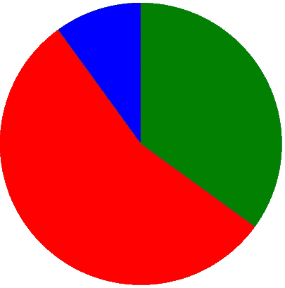
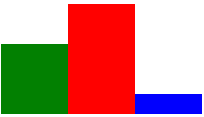
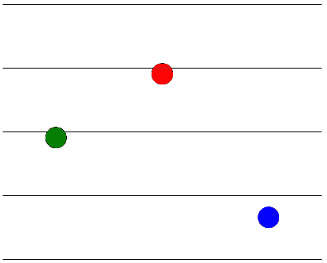
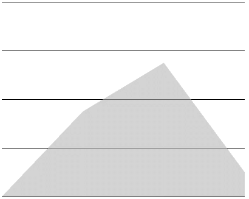
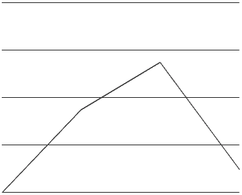
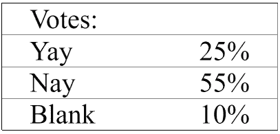

# 使用 CSS 构建饼图、条形图、折线图和点图

> 原文：<https://betterprogramming.pub/build-a-pie-bar-line-and-point-chart-using-css-799983a6ab3d>

## 有时候你只需要一个简单的图表。


只是一个简单的仪表板和一些图表

不要担心！通常你需要做的只是一个简单的列表或表格，然后添加一点 CSS 将其转换成图表。

让我们说，我们做了一个投票，是否要做一个新演员的萤火虫重启。这可能是我们的数据集:

```
Yay:   35%
Nay:   55%
Blank: 10%;
```

闪亮！现在，并不是所有的图表类型都适合这些数据。例如，折线图应该显示一个系列，而不是类别——但我们无论如何都要这样做，只是为了演示如何做。

我不会在 CSS 上做太多的细节，解释一个特定的属性是如何工作的。照原样使用它，或者对它进行调整，在这个过程中也许会学到一个你以前不知道的 CSS 属性。还要注意，这些是简单的 T2 图表；如果您需要工具提示、动画或高级功能，那么图表库可能更适合。

你也可以在 [GitHub](https://github.com/tmj-code/simple-css-charts) 找到代码。

# 加价

让我们假设我们已经加载了数据，但是我们还没有决定如何显示它。我们没有延迟这个过程，而是简单地将它呈现在一个 HTML 列表中，用一些描述数据的 **CSS 变量**来修饰它，然后将它交给设计师。

我们将设置这些 CSS 变量:

*   **标签**:投票的类型(是，否，空白)
*   **值**:每次投票的百分比。
*   **值-文本**:文本形式的值。
*   **前一值**:前一数据项的值。
*   **上一次总和**:所有上一次数值的总和。
*   **计数**:数据项的个数。
*   **颜色**:想要的颜色。

这些变量的值很容易从数据中得到。我们使用`var(--my-variable)`在 CSS 中访问它们

如果你已经知道你要制作哪个图表，你可能不需要变量的完整列表。

使用我们最喜欢的框架或普通的 JS，我们为每个数据项创建一个列表项，并将变量设置为内联样式，产生以下标记:

```
 <ul id="votes" style="--count: 3;">
  <li style="
    --label: 'Yay'; --value: 35%; --value-text: '25%'; 
    --previous-value: 0%; --previous-sum: 0%;
    --color: green;"></li>
  <li style="
    --label: 'Nay'; --value: 55%; --value-text: '55%'; 
    --previous-value: 35%; --previous-sum: 35%;
    --color: red;"></li>
  <li style="
    --label: 'Blank'; --value: 10%; --value-text: '10%'; 
    --previous-value: 55%; --previous-sum: 90%;
    --color: blue;"></li>
</ul>
```

我们现在有了可以设计的东西，这让我们变得强大！

# 整体造型

让我们从添加一个基本样式来移除“列表外观”开始，并设置图表的整体大小:

```
#votes {
  padding: 0;
  list-style-type: none;
  height: 10em;
  width: 10em;
}
```

这里没什么有趣的事，真的。

# 圆形分格统计图表

我们制作的第一个图表是饼状图。这是恰当的，因为我们的数据代表了总数的一小部分。每个列表项将被绘制为一个圆圈，一个在另一个之上，彩色部分代表值，透明部分代表其余部分。

```
#votes {
  position: relative;
}
#votes > li {
  position: absolute;
  left: 0;
  top: 0;
  height: 100%;
  width: 100%;
  border-radius: 50%;
  background: conic-gradient(transparent var(--previous-sum), var(--color) var(--previous-sum));
}
```

圆锥形背景表明，在`previous-sum`之前，一切都应该是透明的；之后，一切都应该有我们选择的颜色。因为圆圈在彼此之上，所以它们隐藏了多余的彩色部分。我们也可以让多余的部分变得透明，但是我们真的不需要这样做。记住，我们的目标是一个简单的图表。



HTML 列表中的饼图

# 条形图

对于条形图，我们需要竖线。条形图应该从底部开始，其高度应该与投票值相匹配。

```
#votes {
  display: flex;
  align-items: end;
}
#votes > li {
  background-color: var(--color);
  height: var(--value);
  width: calc(100% / var(--count));
}
```

我们使用`display: flex`和`align-items: end`在图表区域的底部放置东西。高度设置为每个元素的值，宽度设置为“全宽除以数据项的数量”。



HTML 列表中的条形图

# 点图

对于点图，我们希望显示区间中间的点。我们希望他们是圆的，我们希望他们有一个体面的大小。

```
#votes {
  display: flex;
}
#votes > li {
  border-radius: 100%;
  background-color: lightgray;
  width: calc(20% / var(--count));
  height: calc(20% / var(--count));
  margin: auto auto var(--value) auto;
}
```

使用`margin`定位这些点，因为在这种情况下，这是最简单的解决方案。点的大小是由某个宽度除以数据项的数量计算出来的。通过反复试验找到一个合适的宽度；我发现 20%看起来很适合我的数据集。

为了使点数图更加清晰，我们将添加一些水平线。为此，我们添加了以下内容:

```
#votes {
  ... other styling ...
  position: relative;
}
#votes::after {
  content: '';
  height: 100%;
  width: 100%;
  position: absolute;
  background-size: 100% 20%;
  background-image:
    linear-gradient(transparent, transparent),
    linear-gradient(to top, black 1px, transparent 1px);
}
```



HTML 列表中的点图表

# 填充折线图

接下来是填充折线图。它是条形图和折线图的混合(后者我们还没有制作)。这在某种程度上比折线图更简单，我们一会儿会看到。

背景中的不同颜色对于这种类型的图表很少有意义，所以我们只是给它一个统一的浅灰色。

```
#votes {
  display: flex;
}
#votes > li {
  background-color: lightgray;
  height: 100%;
  width: calc(100% / var(--count));
  clip-path: polygon(
    0 100%, 
    0 calc(100% - var(--previous-value)), 
    100% calc(100% - var(--value)), 
    100% 100%);
}
```

此图表将每个列表项绘制为多边形:上边缘由数据的先前值和当前值定义，并且将是对角线(当然，除非先前值和当前值相同)。多边形的其余部分将是矩形。

多边形是由成对的(x，y)坐标创建的。因为 goram 的 y 坐标在顶部是 0，在底部是 100%，我们必须做`j100% — <our value>`来获得正确的 y 值。

在这里添加我们在点图中使用的水平线可能是合适的。



HTML 列表中的填充折线图

# 折线图

折线图类似于填充折线图，除了一点:我们没有一直绘制到图表的底部。相反，我们画了一些非常细的多边形，所以最终看起来像线。

```
#votes {
  display: flex;
}
#votes > li {
  background-color: black;
  height: 100%;
  width: calc(100% / var(--count));
  clip-path: polygon(
    0 calc(100% - var(--previous-value)), 
    100% calc(100% - var(--value)), 
    100% calc(100% - var(--value) + 2px), 
    0 calc(100% - var(--previous-value) + 2px));  
}
```



HTML 列表中的折线图

# 文本表格

使用 CSS 方法将数据显示为表格实际上需要最多的 CSS。而且，因为 CSS 不允许将非文本(比如 35%)更改为文本，所以我们需要使用`value-text`变量来显示值。

```
#votes {
  border: solid 1px black;
  height: auto;
}
#votes:before {
  content: 'Votes:';
  display: inline-block;
  width: 9em;
  padding-left: 1em;
}
#votes > li::before, #votes > li::after {
  border-top: solid 1px black;
  display: inline-block;
}
#votes > li::before {
  border-right: none;
  content: var(--label);
  width: 5em;
  padding-left: 1em;
}
#votes > li::after {
  border-left: none;
  content: var(--value-text);
  width: 3em;
  padding-right: 1em;
  text-align: right;
}
```



HTML 列表中的文本表格

# 结论

这里有一个简单的图表列表，只用几行 HTML 和 CSS 就可以实现。

还有许多其他图表可以用同样的方法制作。圆环图、堆积折线图或面积图怎么样？如果我们希望标签显示数值，或者 x 轴和 y 轴，该怎么办？有了本文中的例子作为灵感，你应该会发现让你的图表完全属于你自己并不困难。

如果你喜欢这篇文章，考虑关注我。那么你将成为我的一员。