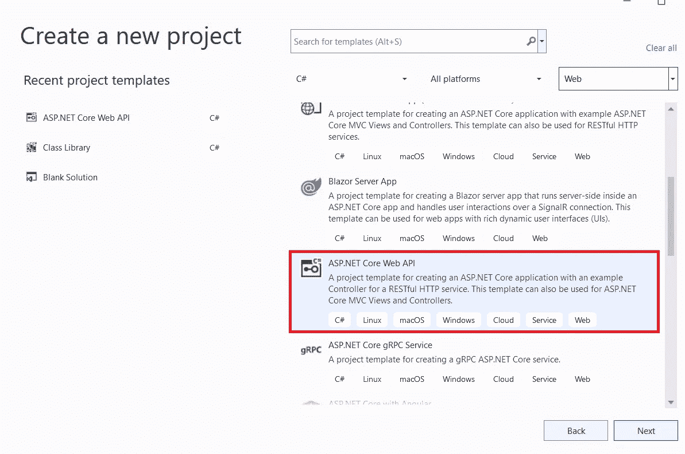
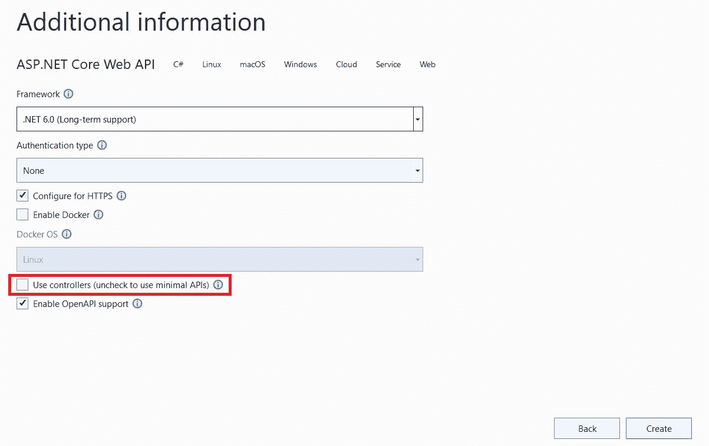

# 使用新的 ASP.NET 核心最小 API 构建占位符 API

> 原文：<https://betterprogramming.pub/build-a-placeholder-api-with-the-new-asp-net-core-minimal-api-4f27d2388589>

## 并将其部署到 Azure

由[凯利·西克玛](https://unsplash.com/@kellysikkema?utm_source=medium&utm_medium=referral)在 [Unsplash](https://unsplash.com?utm_source=medium&utm_medium=referral) 上拍摄的照片

你正在开始一个新项目，在互联网上建造下一个大东西。首先，构建客户机——一个全新的单页面应用程序。但是…你需要它与 API 交互来获取数据。并且您还没有准备好构建一个完整的 API。

有许多占位符 API，但它们通常有两个问题:

*   数据与您的数据模型不匹配。
*   CRUD 操作不是真实的(数据不是真的*CRUD*)。

我将向您展示如何构建您自己的占位符 API，大约只需要花同样的时间来搜索合适的东西。API 将使用您自己的数据模型，并且它将允许您执行真正的 CRUD 操作，其中的更改是持久化的——至少在您重新启动 API 之前是这样。它是可扩展的，因此数据模型可以随着应用程序的增长而增长。

为此，您需要安装 [Visual Studio 2022](https://visualstudio.microsoft.com/vs/community/) 。它将使用*ASP.NET 核心最小 API。这需要 10 分钟或更少的时间(至少在你读完这篇文章后)。完成的代码可以在 [GitHub](https://github.com/tmj-code/placeholder-api) 上找到。*

# 准备好了吗？开始了。

打开 Visual Studio 2022，并创建一个新项目。选择**ASP.NET 核心 Web API** 。我们可以给我们的新 API 起任何名字，但是这个名字很傻，所以我们把它命名为 PostAPI。

选择 ASP.NET 核心 Web API 模板

确保您**取消选中***使用控制器(取消选中以使用最小 API)* 复选框。

确保取消选中使用控制器(…)选项以生成最小 API

创建项目后，打开 *Program.cs* 文件，删除 WeatherForecast 示例 api，但保留常规设置(包括 Swagger)。

我们还需要启用 *CORS* ，因为我们可能要从浏览器客户端访问它。我们的程序文件应该是这样的:

现在我们向项目添加一个 json 文件来保存我们的初始占位符数据；姑且称之为`posts.json`。确保它将被复制到输出文件夹。然后在其中添加以下数据:

无耻的自我推销，我知道。

复制 JSON 内容，然后将光标放在*程序*文件的底部。我们将让 Visual Studio 生成我们的数据类:转到编辑>选择性粘贴>将 JSON 粘贴为类。这将为我们生成一些类。

我们不需要`RootObject`，所以删除它。然后将`Class1` 改名为`Post`。

我们将来自`posts.json`的数据加载到一个局部变量中，然后我们可以在我们的端点中使用它(马上)。所以添加下面几行:

最后，我们实现端点。在本例中，我们添加了五个标准 CRUD 端点:

*   获取所有帖子(获取/帖子)
*   按 ID 获取(GET /posts/{id})
*   创建一个新帖子
*   更新帖子(上传/帖子/{id})
*   删除帖子(删除/帖子/{id})

如果提供了未知 ID，我们希望 *Get by ID* 和 *Update* 返回 *NotFound* ，否则一切都应该是 *OK* 。其他 API 可能有不同的需求。总之，在`posts` 和`app.Run()`的初始化之间添加以下代码:

搞定了。现在，您可以运行应用程序了，您的 API 会打开一个大页面。尝试不同的端点。

# 好处:部署到 Azure

你可以在 Azure 中创建一个免费的网站/应用服务。然后你可以在 Visual Studio 中右击你的 API 项目，选择 *Publish…* 。现在团队的其他成员可以访问您令人惊叹的占位符 API 了。

请注意，一个免费的 Azure 应用程序服务在 20 分钟不活动后就会关闭。这将重置数据，数据在初始加载后仅保存在内存中。如果您不想等待 20 分钟——或者您是一个不断使用 API 的大型团队，因此需要保持其活力——您可能需要实现一个 */reset* 端点来重新加载数据。我将把它作为一个练习。

或者，您可以将其添加到(非免费)标准层应用服务计划中，打开 *Keepalive* ，然后您可以在更长的时间内使用相同的数据。

# 总之

用新的*ASP.NET 核心最小 API* 构建一个占位符 API 相当容易。您可以在几分钟内完成，并且可以根据应用程序的特定需求进行调整。

在接下来的一篇文章中，我将展示如何使用*ASP.NET 核心最小 API* 作为各种规模的应用程序的精简而灵活的接口。