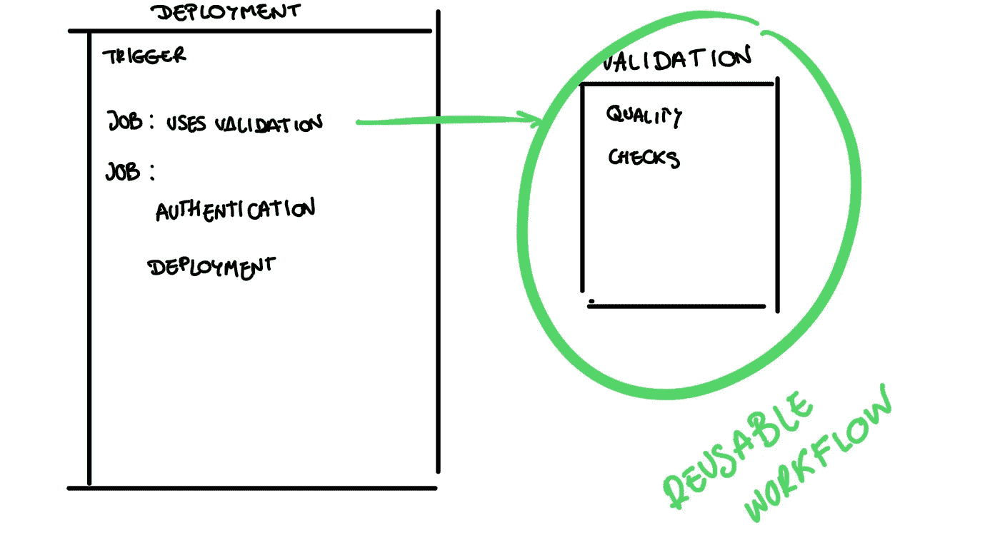

# 使用可重用的 GitHub 工作流构建即插即用的 CI/CD

> 原文：<https://betterprogramming.pub/build-a-plug-and-play-ci-cd-with-reusable-github-workflows-dc45b768a1ce>

## 我是如何停止将每个工作流程复制粘贴到无限的


管道中所有重复的工作流看起来完全一样。

在 GitHub 网站上浏览“*初学者友好”*和*“非恐吓”*文档时，我发现了可重用工作流。我不打算撒谎，我非常兴奋地想到我可以节省多少复制和粘贴时间，我开始思考如何像乐高积木一样建造管道。事实证明，它需要一些规划才能工作，尽管对您想要运行的工作流和作业的高层次想法应该足以奠定基础。毕竟，你很可能在敏捷方法中工作，而且需求会不断发展。

如果你是 GitHub 平台的新手，[我推荐我以前的文章](/understand-your-release-manager-learn-the-basics-of-ci-cd-in-github-652b3fe7e0e0)，在那里我回顾了一些我将在这里提到的概念。现在，您已经熟悉了基础知识，让我们后退一步，介绍一下何时以及如何使用这些可重用的工作流。

当在大型甚至中型项目上工作时，为了保持交付的节奏，一个好的 CI/CD 的实施是必须的。这意味着使用几个环境、流程和工作流，但它可能会很快升级为难以管理的大量脚本来维护和跟踪。因此，解决这个问题的最好方法之一是从软件工程概念中获得一些灵感，比如迪夫·托马斯和安迪·亨特的 *DRY3 原则*(不要重复自己)，或者肯特·贝克的极限编程核心原则之一*“一次，而且只有一次。”。*

# 我们如何重复使用同样的砖块来建造管道？

在编写任何脚本之前，尝试识别管道中的重复流程。一旦你有了它们，你就必须决定你想要运行的工作流程链以及安排它们的最佳方式。

一个常见的例子是有两个工作流，一个执行一些质量检查和验证可部署性，另一个在一些环境中实际部署您的代码。



CI/CD 设置中的通用部署和验证工作流。

以这两个工作流为例，您可以假设我们将从执行一些检查开始，然后我们将转移到实际部署。在这种情况下，我们希望在我们的整个组织中执行相同的检查，以使我们的可交付成果每次都具有相同的质量，因此我们可以假设我们将重用验证工作流。

因此，调用者将是执行部署的脚本，它将调用我们的可信验证脚本来进行一些验证。但是在调用脚本之前，您需要首先检查以下条件之一:

*   被调用的工作流位于公共存储库中。
*   两个工作流位于同一个存储库中。

如果你在一个组织中工作，如果还没有的话，记得让被称为的*工作流可访问。您可以转到存储库的设置，选择操作并启用可访问性。*

既然我们已经验证了对文件的访问，我们将把我们的工作流定义为可重用的。它就像任何其他工作流一样，但是我们添加了`workflow_call`作为触发器。

```
name: Validationon:
  workflow_dispatch: #enables manual execution
  workflow_call: #enables reusability#add here some checks or jobs
```

然后，通过添加以下语法，您可以在另一个工作流中引用这个*验证*工作流:

```
Uses:   USER_OR_ORG_NAME/REPO_NAME/.github/workflows/REUSABLE_WORKFLOW_FILE.yml@TAG_OR_BRANCH
```

这是整个工作流程的一个例子。

```
name: Deploymenton:
  pull_request:
    branches:
    - masterjobs:   
  validation:     
    uses: USER_OR_ORG_NAME/REPO_NAME/.github/workflows/validation.yml@maindeployment:
     #add here deployment steps
```

正如您所看到的，实现可重用的工作流并不需要太多时间。您不仅可以避免重复，还可以更轻松地跨环境实施一致性！你还需要其他理由来开始使用它们吗？

> 每当你在代码中看到重复，就意味着错过了抽象的机会。
> 
> ——罗伯特·c·马丁在《干净的代码》中