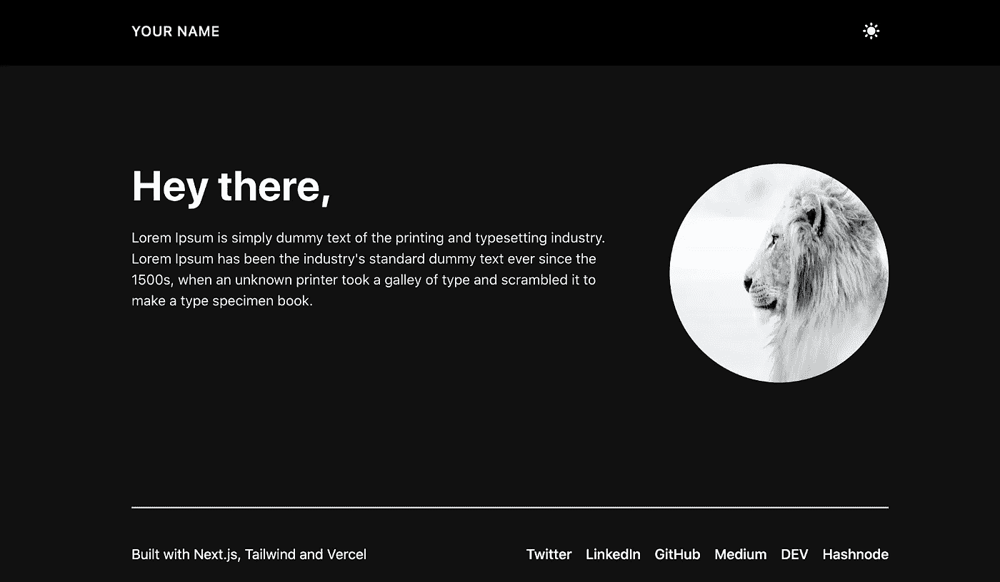
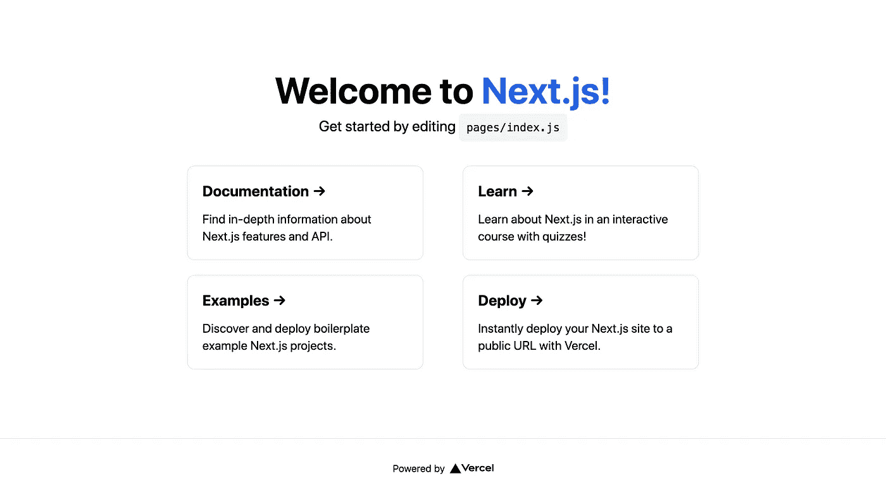
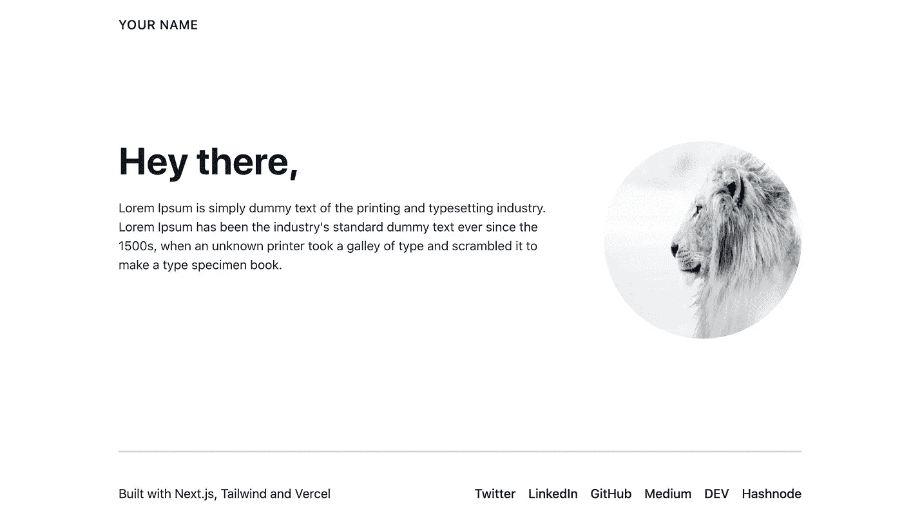
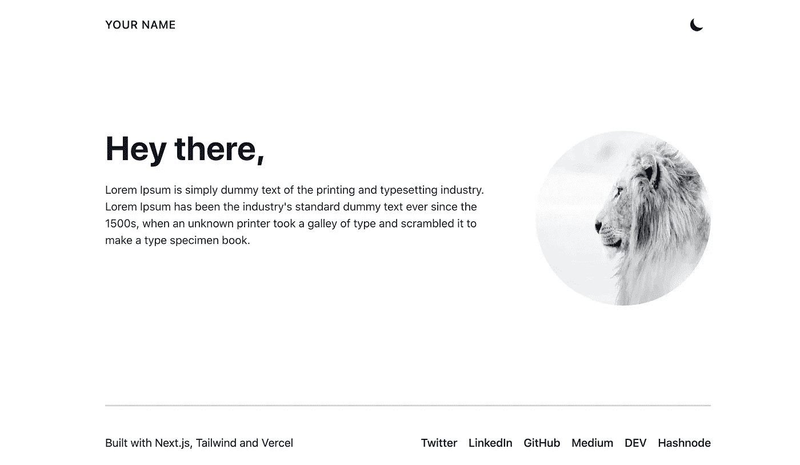
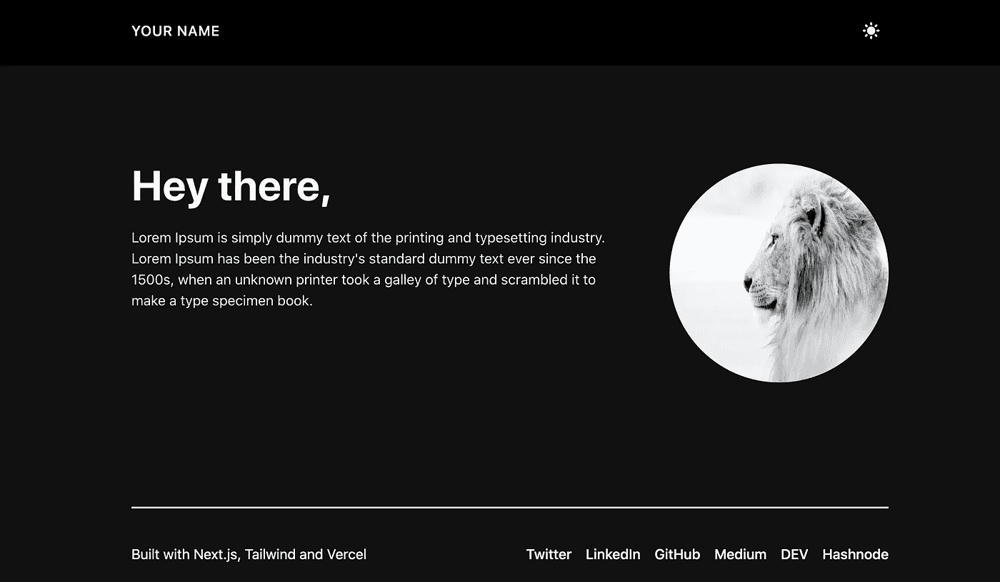

# 使用 Next.js、Tailwind 和 Vercel 构建投资组合

> 原文：<https://betterprogramming.pub/build-a-portfolio-using-next-js-tailwind-and-vercel-48c645d007ba>

## 使用 Next.js 和支持黑暗模式的 Tailwind 构建作品集网站的步骤



图片由 Nilanth 提供

使用 [Next.js](https://nextjs.org/) 和 [Tailwind](https://tailwindcss.com/) 构建组合网站的步骤，支持黑暗模式。

作品集是一个你可以向世界展示你所有技能的地方。作为一名开发人员，你真的需要一个作品集来展示你的项目、博客等等。

但是我们为什么需要用 Next.js 建立作品集呢？我们都知道 next.js 是具有开箱即用性能的 react 框架。所以你不需要担心你的投资组合表现。一切都由 Next.js 和 Vercel 打理。让我们开始行动吧。

# Next.js 和顺风配置

我们可以用一个命令用 next.js 配置 tailwind，如下所示:

```
npx create-next-app -e with-tailwindcss your-portfolio-name
```

上面的命令基于官方的 Next.js 示例自动配置您的顺风设置。

安装完成后，使用`cd your-portfolio-name`导航到您的项目文件夹，并使用`yarn dev`命令启动开发服务器。如果你在浏览器中点击`http://localhost:3000`，你会看到下面的页面。



# 创建导航部分

在根目录中创建一个`components`文件夹来添加您的投资组合组件。创建一个名为`Navigation.js`的文件，并添加以下代码:

导航组件是你的文件夹的标题部分。在上面的代码中，可以看到`dark: class`支持黑暗模式。将`Navigation`组件添加到`_app.js`文件，如下所示。MyApp 组件用于初始化页面。

# 创建页脚部分

要添加带有社交链接的页脚，请在 components 文件夹中创建一个 Footer.js 文件，并添加以下代码:

将`Footer.js`组件添加到`_app.js`文件中，如下图所示:

# 关于组件

在组件文件夹中创建`About.js`文件，并添加以下代码:

我只是在上面为演示添加了一些虚拟文本。如上所述，包括您在公共文件夹中的个人资料图像。图像组件中的占位符`blur`道具用于添加加载效果。将`About`组件导入到`index.js`文件，如下所示:

我已经删除了旧的模板代码，并添加了上面的代码。现在，您的投资组合如下图所示:



# 黑暗模式支持

现在，让我们将黑暗模式添加到我们的投资组合中。添加黑暗模式非常简单。创建`ThemeSwitch`组件，添加一个切换开关，在黑暗模式和明亮模式之间切换。

为了在 Next.js 中支持黑暗模式，我们需要将`next-themes`包添加到我们的依赖项中。现在使用下面的代码将`useTheme`从 next-theme 导入到 ThemeSwitch 组件中:

将`ThemeSwitch`组件添加到`Navigation`组件中，并将`next-themes`主题提供者包含在`_app.js`中，如下图所示:

`attribute=class`是手动启用明暗模式。我已经通过`enableSystem=false`禁用了系统偏好设置

将`tailwind.config.js`文件中的`darkMode`选项更改为`class`以手动切换黑暗模式，而不是依赖于操作系统偏好。

经过上述更改后，我们的投资组合如下所示:



灯光模式



深色模式

# 在韦尔塞尔部署

您可以通过以下两步在 Vercel 中部署您的投资组合:

1.  创建一个 [Vercel 账户](https://vercel.com/signup)
2.  连接您的存储库，然后单击部署。

# **结论**

您可以通过在 pages 文件夹中创建新文件来添加多个页面，如项目和博客。我希望你已经发现这是有用的。

感谢您的阅读。