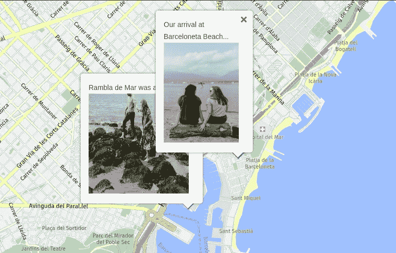
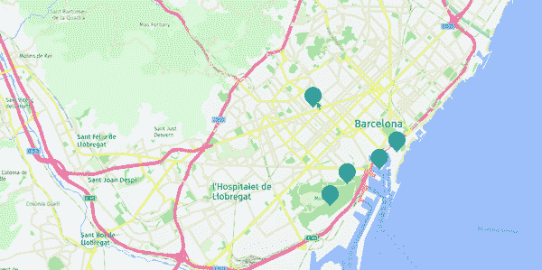

# 构建一个 Python Flask 应用程序来查看您去过的地方

> 原文：<https://betterprogramming.pub/build-a-python-flask-app-to-see-the-places-youve-travelled-fee71e54ec0c>

## 使用 Python 将您的旅行记忆钉在“这里”地图上


由[元素 5 数码](https://unsplash.com/@element5digital?utm_source=medium&utm_medium=referral)在 [Unsplash](https://unsplash.com?utm_source=medium&utm_medium=referral) 上拍摄

我希望你有一个愉快的暑假。难道你和你的朋友不会很高兴回忆起你们一起去过的地方吗？

在这篇文章中，我将向您展示如何创建一个自定义地图，您可以在其中钉上您去过的所有地方的度假照片。您可以选择添加文字来更好地描述您的旅行记忆。

我已经写了一篇[教程](/plan-your-holiday-with-python-and-here-maps-aaeeaf9580c3)关于如何用[这里](https://developer.here.com/)的地图来计划你的假期。这个教程是独立的，所以你可以从这里开始，如果你感兴趣的话，可以稍后查看另一个。我们将重用一些技术，并应用更多的增强功能。最后，您将学习如何将您的应用程序部署到 [Heroku](https://heroku.com) ，这样您的朋友也可以看到它。

我们开始吧！

# 创建项目

## 要求

你需要什么:

*   一些你假期拍的很棒的照片。
*   你去过的地方的坐标。我们将使用 [geopy](https://pypi.org/project/geopy/) Python 库来完成这项任务:

```
pip install geopy
```

*   [Flask](https://pypi.org/project/Flask/) —轻量级 web 应用框架:

```
pip install Flask
```

*   这里是开发者账户。点击[此处](https://developer.here.com/tutorials/getting-here-credentials/)获取如何创建 API 密钥的说明。我们将需要这个来从我们的应用程序调用 HERE 地图。
*   Heroku account —该工具用于在云上构建和运行应用程序。目前，如果你不想要付费账户，你可以免费托管一个应用。

## 编码部分

1.  创建一个新的 Python 文件，例如`app_runner.py`，并粘贴以下代码:

2.在项目的文件夹中创建一个名为`templates`的新目录。在那个文件夹中创建`map.html`文件。

3.粘贴以下内容:

这段代码最重要的部分是:

*   我们已经导入了渲染地图所需的脚本。
*   确保用你的替换这里的`apikey`。
*   我为这个项目选择了巴塞罗那市。这是地图上的默认位置。
*   `addMarkerToGroup()`功能向地图添加位置。在本例中，我创建了一个标记— Barceloneta Beach。我们将很快看到如何从一个位置获得坐标。使用此功能添加任意数量的位置。
*   点击该位置时会调用`addEventListener('tap')`功能。
*   `addInfoBubble()`功能在用户点击标记时显示我们的自定义文本和照片。

4.要提取位置的纬度和经度，请使用以下代码创建一个单独的 Python 文件:

我们刚刚使用了`geopy`库来获取坐标:

```
la Barceloneta, Ciutat Vella, Barcelona, Barcelonès, Barcelona, Catalunya, 08001, España
(**41.3806533, 2.1899274**)
```

请注意，您也可以传递位置的地址，而不是名称。

5.对你去过的所有地方重复这一步。

6.将标记添加到自定义地图。基本上，你需要做的就是使用`addMarkerToGroup`方法在地图上添加更多的地方。

*   添加纬度和经度。
*   根据需要调整图像的宽度和高度。
*   将照片网址替换为您的网址。

为了简洁起见，我不打算在这里粘贴我的整个代码，因为我添加了很多地方。

# 测试项目

现在让我们在本地运行 Flask 应用程序:

```
python3 app_runner.py
```

在 [**打开浏览器 http://127 . 0 . 0 . 1:5000/**](http://127.0.0.1:5000/)并点击标记:



自定义地图上带有照片的信息气泡。照片来自 Unsplash。

厉害！图片如预期所示。

请随意试验标记的 HTML 代码，使信息气泡更令人兴奋。

*声明:为了这个教程，我从*[*Unsplash*](https://unsplash.com/collections/74V2qxuNhzE/community-by-priscila-du-preez)*收集了一些好看的图片。如果你想知道——这些地方不是来自巴塞罗那。*

# 将应用程序部署到 Heroku

现在让我们将应用程序公开。我们将把它部署到 Heroku 并与其他人共享链接。

1.  在您的项目目录中创建一个`requirements.txt`文件:

```
Flask==1.1.1
gunicorn==19.9.0
Jinja2==2.10.1
```

这个文件让 Heroku 知道要安装哪些库。请随意更改版本。

2.在项目的文件夹中创建一个`Procfile`:

```
web: gunicorn app_runner:app
```

这个文件定义了 Heroku 应该运行哪些命令来启动我们的应用程序。`web`命令启动一个 web 服务器，使用`gunicorn` 作为我们的 Python WSGI HTTP 服务器。基于`app_runner.py`文件，应用程序名称被称为`app_runner`。

3.登录 Heroku 并创建一个新应用程序:


在 Heroku 创建新应用程序

4.将应用程序部署到 Heroku 有多种策略。在本例中，我们将使用 [Heroku CLI](https://devcenter.heroku.com/articles/heroku-cli) 。你需要下载它。

5.在项目文件夹中初始化一个新的 Git 存储库:

```
git init
```

6.将应用程序添加到远程:

```
heroku git:remote -a here-maps-demo
```

7.推动变革:

```
git add .
git commit -m "added app files"
git push heroku master
```

就是这样！

您应该看到 Heroku 正在部署您的应用程序。如果一切正常，您应该会在命令输出的末尾看到应用程序的 URL:

```
remote: [https://here-maps-demo.herokuapp.com/](https://here-maps-demo.herokuapp.com/) deployed to Heroku
```

最后，打开应用的网址。最终结果将如下所示:



在这里地图与信息泡沫演示

太好了！现在，您的朋友可以回放美好的回忆，甚至从您的应用程序下载图片。

# 结论

在本教程中，您学习了如何使用 HERE maps API 创建自定义地图。我们使用 Flask 创建了一个简单的 web 应用程序，并将其部署在 Heroku 上，以便其他人可以访问它。

注意，在 Git 存储库中公开 API 键不是一个好的做法。我在本文中没有涉及这个主题。但是如果你想完善这个应用，可以考虑使用 Heroku 中的[配置变量](https://devcenter.heroku.com/articles/config-vars)。

我希望你喜欢这篇文章，它给了你创造自己美好回忆地图的灵感。

你可能也会喜欢我的其他 HERE 地图相关教程:

[](/plan-your-holiday-with-python-and-here-maps-aaeeaf9580c3) [## 使用 Python 和此处的地图规划您的假期

### 如何创建自己的地图来可视化您想去的地方

better 编程. pub](/plan-your-holiday-with-python-and-here-maps-aaeeaf9580c3) 

感谢您的阅读，祝您编码愉快！