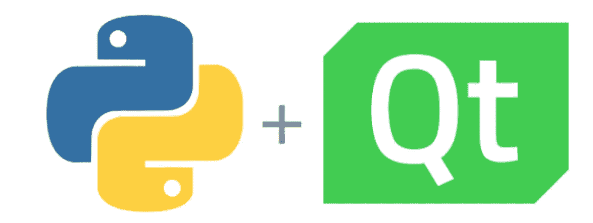
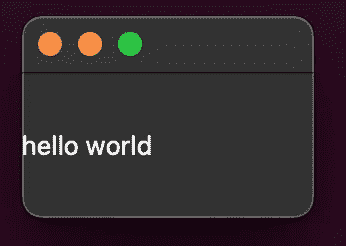
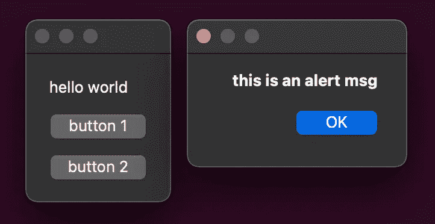

# 在苹果 M1 建立一个 Python GUI 应用程序

> 原文：<https://betterprogramming.pub/build-a-python-gui-app-in-apple-m1-e16098112e61>

## 使用最新的 PyQT6 或 PySide6 在苹果硅片上构建跨平台桌面应用



我在我心爱的 M1 Macbook Air 上使用 Python。在想，能不能用 Python 在小功率机里面搭建一个 GUI 桌面应用？经过一些错误和尝试，我找到了一条出路，它也将为你工作。

# 安装 Python

确保您的 M1 机器上安装了运行 Python 3.9 的 M1 本地版本。如果还没有，运行这个命令行命令来准备好您的环境。

```
brew install python@3.9
```

是的，只有[一行](https://formulae.brew.sh/formula/python@3.9)命令。

# PyQt6 或 PySide6

PyQt6 和 py side 6 99.99%[相同](https://www.pythonguis.com/faq/pyqt5-vs-pyside2/)。PySide6 的存在是因为授权。PyQt 是在 GPL 或商业许可下使用的。这意味着你需要开源你的代码或者为你的应用程序购买一个商业许可，从用户那里收取费用。虽然 PySide 在 LGPL 许可证下可用，但无需为您的应用程序购买许可证。

在下面的代码示例中，PyQt6 和 PySide6 是可替换的。我将在所有示例代码中使用 PySide6。

# 安装 PyQt6 或 PySide6

从 6.2 版本开始， [PyQt 全面支持苹果硅片](https://www.qt.io/blog/qt-on-apple-silicon)。只需运行这个命令来安装 PyQt6。

```
pip install PyQt6
```

或者

```
pip install PySide6
```

完成了。有关 PyQt6 安装的更多信息，请查看此[链接](https://pypi.org/project/PyQt6/)。

顺便说一下，如果您希望查看您正在使用的 PySide 的版本，请使用以下代码:

```
import PySide6.QtCore
# Prints PySide6 version
print(PySide6.__version__)
# Prints the Qt version used to compile PySide6
print(PySide6.QtCore.__version__)
```

# HelloWorld

创建一个新文件`helloworld.py`并写下下面的 Python 代码。

```
from PySide6.QtWidgets import QApplication,QLabel
app   = QApplication([])
label = QLabel('hello world')
label.show()
app.exec()
```

现在，在您的终端中用`python helloworld.py`运行它。您将看到一个新的应用程序弹出，如下所示:



# 窗口、布局和按钮

让我们在 hello world 桌面应用程序中再添加一些元素。

在上面的代码中，我添加了一个保存垂直布局对象的`**Window**`，布局对象保存所有像`**Label**`和`**Button**`这样的小部件元素。

第一个按钮(btn1)被绑定到一个事件处理程序— `on_btn1_clicked()` ，因此每当单击该按钮时都会触发事件处理函数。

运行它，你会看到。



# 编译 PyQt 应用程序

要求您的应用程序用户在安装应用程序之前安装所有必备的软件包是不现实的。因此，您需要以可分发的形式编译和打包所有代码。人们通常称这个过程为`**Freeze**`。

编译 PyQt 应用程序有许多解决方案。我发现`[cx_Freeze](https://cx-freeze.readthedocs.io/en/latest/index.html)`最适合苹果硅片。

安装`cx_Freeze`:

```
pip install --upgrade cx_Freeze
```

要编译您的 PyQt 应用程序，在您的终端中运行:

```
cxfreeze -c helloworld.py --target-dir dist
```

现在，导航到 dist 文件夹，您可以启动您的应用程序

```
./helloworld
```

完成了。

# 参考链接

1.  苹果硅片上的 Qt:[https://www.qt.io/blog/qt-on-apple-silicon](https://www.qt.io/blog/qt-on-apple-silicon)
2.  PyQt5 教程:[https://build-system.fman.io/pyqt5-tutorial](https://build-system.fman.io/pyqt5-tutorial)
3.  pyqt 6 6 . 2 . 2:[https://pypi.org/project/PyQt6/](https://pypi.org/project/PyQt6/)
4.  CX _ Freeze:[https://cx-freeze.readthedocs.io/en/latest/index.html](https://cx-freeze.readthedocs.io/en/latest/index.html)
5.  pyqt 5 vs py side 2:[https://www.pythonguis.com/faq/pyqt5-vs-pyside2/](https://www.pythonguis.com/faq/pyqt5-vs-pyside2/)
6.  PySide6 官方文件:[https://doc.qt.io/qtforpython-6/index.html#](https://doc.qt.io/qtforpython-6/index.html#)