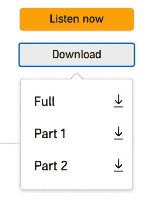

# 构建一个 Python 包来转换有声读物”。aax "文件转换成" mp3 "

> 原文：<https://betterprogramming.pub/build-a-python-package-to-convert-aax-files-into-mp3-f72201aba6b0>

## 在 Garmin 设备上播放声音


亚瑟·辛顿在 [Unsplash](https://unsplash.com?utm_source=medium&utm_medium=referral) 上的照片

# 问题

你做好长距离跑的准备，打开你的训练计划，离开房间，然后意识到没有手机你无法听那本伟大的有声读物。

这篇文章是写给你的，如果你和我一样，购买了一个 Garmin 来减少你在训练时必须携带的东西的数量(卡片、音乐、追踪器)，但发现自己在整个训练过程中都带着一个稍微更便于携带的平板电脑。更令人恼火的是，Spotify 有一个功能完善的界面，可以流畅地处理 DDRM 的内容——那么，最近怎么样，Audible？

# 解决办法

在尝试了所有其他方法后，似乎最好的解决方案是下载每本书，将其转换为 mp3 格式，然后拖放到您的设备/手表上。

在本文中，我将讨论这一过程。如果您有兴趣直接使用该脚本，请滚动到页面末尾。

# 1.下载您的有声读物

我们从获得一份有声读物开始。这是通过导航到[https://www.audible.co.uk/library](https://www.audible.co.uk/library)，登录，并选择我们想要保存的书籍。

**注意:**您只能下载用您的点数购买的图书。

一旦我们找到我们的书籍，我们将选择下载按钮，然后是“完整”选项。然后，我们将下载移动到一个组文件夹中，并记下它的位置。



# 2.获取激活字节

要解码我们的有声读物，我们需要一个激活密钥。这是一组 20 长的二进制字符，由有声读物文件校验和的 653 个元素编码而成。

虽然我们可以手动完成，但最简单的方法是使用在[https://audible-converter.ml/](https://audible-converter.ml/)举办的精彩脚本来帮助我们。

# 3.安装我们的依赖项

现在我们有了校验和值，我们安装“FFmpeg”，它将转换我们的音频文件。如果您打算在最后使用脚本，我们可以安装可选的依赖项。

```
conda install -c conda-forge js2py selenium webdriver_manager
```

**注意**:我们不想用 anaconda 安装`FFmpeg`，因为它会引起问题。如果您已经这样做了，您必须手动将其从 conda `bin`文件夹中删除。

相反，我们可以使用`brew`在 Mac 上安装我们的视频处理脚本，命令如下:

```
brew install ffmpeg
```

在 Linux 上，您可以选择以下选项:

```
sudo apt install ffmpeg
```

# 4.列出我们有声读物的章节

现在我们已经安装了所有的东西，我们可以通过列出不同的章节来测试`FFmpeg`。

```
ffprobe -i <your file path here> -print_format json -show_chapters -loglevel error
```

这将返回一个 JSON 对象，其中包含“chapters”键的值。

# 5.另存为 MP3

最后，我们可以将 FFmpeg、我们的激活字节和有声读物结合起来得到一个输出。

```
ffmpeg -activation_bytes <our-activation-bytes> -i <input/file/path> -codec copy <output file>.m4b -y -loglevel quiet -stats
```

在大型有声读物的情况下，我们可能想把它们分成更容易管理的部分。为此，我们可以使用以下标志指定开始和结束时间:

```
-ss <start-time> -to <end-time>
```

其中时间以`HHMMSS`格式给出。

# 把所有的放在一起

最后，为了把它放在一起，我已经编译了一个 Python 脚本来处理这个过程。该脚本的主要格式如下:

*   从给定的目录中读取所有的`.aax`文件
*   从第一个文件中提取激活字节。如果所有文件都来自同一个帐户，激活字节应该保持不变。否则，请使用单独的目录
*   对于每个文件，获取章节信息，包括开始和结束时间。
*   我们在默认位置`~/Music`创建一个有声读物名称的文件。这是你的`$HOME`目录，如果你没有“音乐”文件夹，请创建一个。
*   对于每一章，我们创建一个新的(带标签的)MP3 文件。
*   这些都是并行完成的，以节省计算时间。

这个脚本可以在这里的[中找到](https://github.com/wolfiex/AudiableConvert)，并通过运行这个命令来启动

```
python -m AudiableConvert '/abspath/to/audiablebookdirectory/'
```

在您选择的终端模拟器中。这将在存储库中完成。

现在，一边跑一边享受你的有声读物吧！