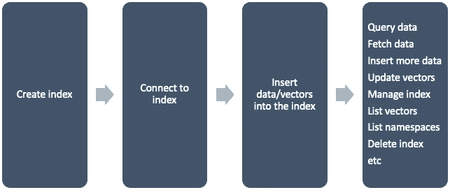
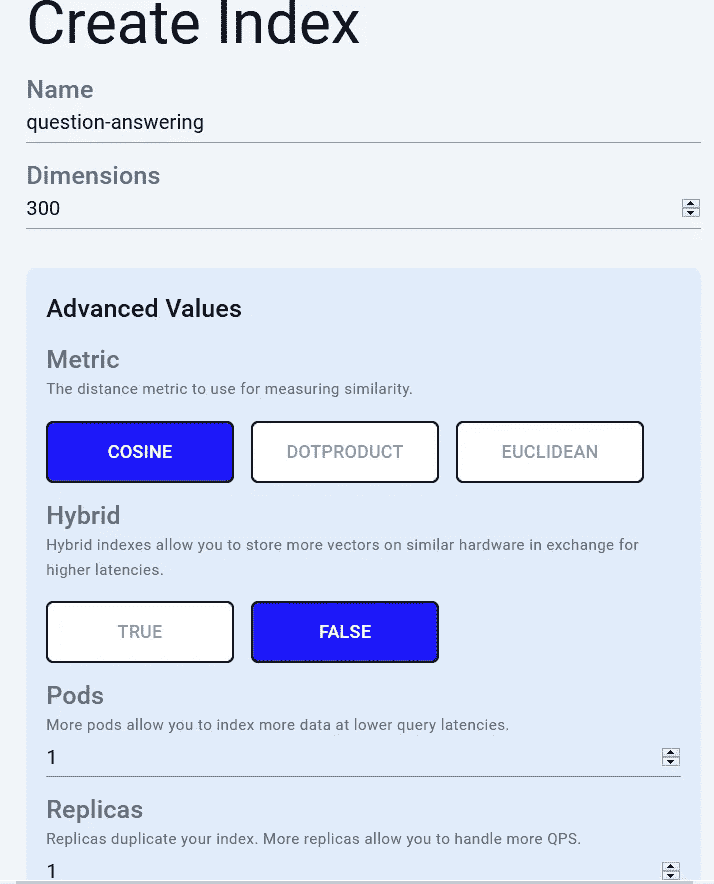
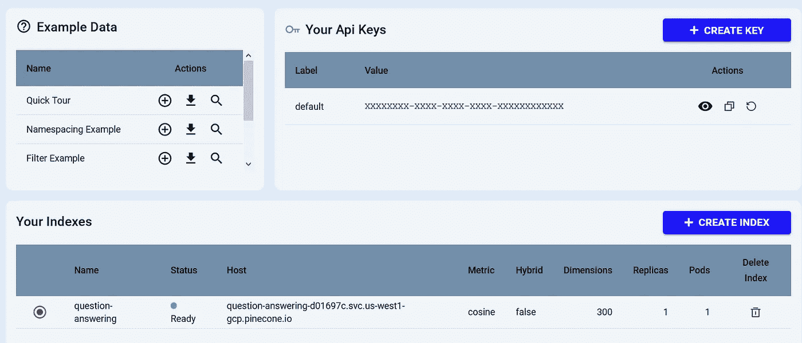
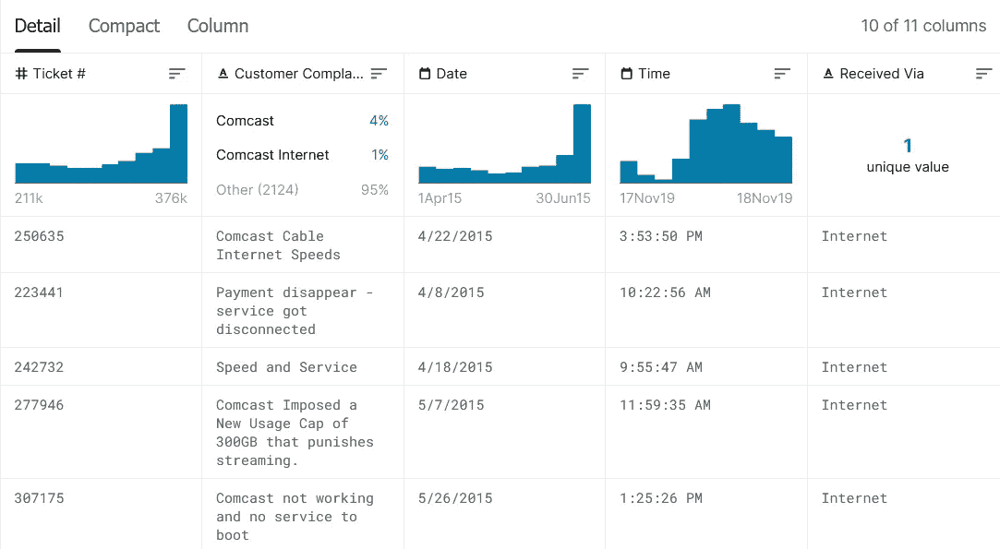
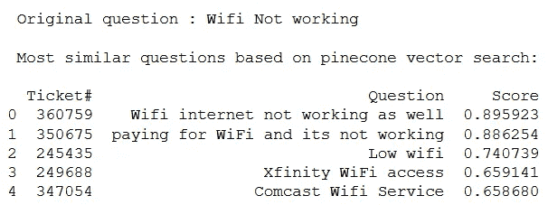

# 使用松果和 Python 构建一个问答应用程序

> 原文：<https://betterprogramming.pub/build-a-question-answering-app-using-pinecone-and-python-1d624c5818bf>

## 如何使用松果为你的应用添加语义搜索


Antonio Janeski 在 [Unsplash](https://unsplash.com?utm_source=medium&utm_medium=referral) 上拍摄的照片

# 项目动机

假设你有一个网站，客户可以在那里找到常见问题的答案。你选择创建一个强大的智能搜索引擎，而不是维护一个客户支持服务。人们只需在搜索栏中输入他们的问题，就可以看到类似的问题。通过这种方式，您可以减少重复的主题，并且客户可以轻松找到他们想要的内容。
如何保证搜索足够智能，向用户展示最佳匹配结果？这就是语义搜索发挥作用的时候了。它试图理解搜索查询的意图和上下文，以提供更准确的结果。

在本文中，我们将创建一个相似性搜索引擎。我们将使用 Python 和完全托管的矢量数据库[松果](https://www.pinecone.io/docs/overview/)来实现这个目标。

我们开始吧！

# 松果关键概念

## 物体的矢量表示

在机器学习(ML)中，[向量嵌入](https://www.pinecone.io/learn/vector-embeddings)表示一组连续数字，以确定各种对象之间的相似性。我们计算物体的向量在向量空间中有多接近。

## 距离度量

距离度量取决于用例。例如，Pinecone 支持一些最常用的度量:[欧几里德](https://en.wikipedia.org/wiki/Euclidean_distance)、[余弦](https://en.wikipedia.org/wiki/Cosine_similarity)和[点积](https://nlp.stanford.edu/IR-book/html/htmledition/dot-products-1.html)。

在我们的演示应用中，我们将使用余弦度量。它用于查找不同文档之间的相似之处。结果分数范围在[0，1]之间。

# 松果快速概览

松果是一个免费增值工具。您可以免费注册，并在一个单独的 pod 中使用较小项目的服务。对于[1M 左右的矢量，100ms 的延迟](https://www.pinecone.io/pricing/#performance)应该足够了。对于高级计划，请查看[定价页面](https://www.pinecone.io/pricing/)。

**你能用松果做什么？**

*   语义文本搜索
*   图像相似性搜索
*   视频/音频/文本推荐
*   时间序列相似性搜索
*   文档去重检测

…以及更多。

**使用松果的主要优势是什么？**

*   完全托管的服务—无需担心基础架构
*   高性能和可扩展性
*   用户友好的界面，详细的文档，大量的示例原型，实验项目免费

**工作流程是怎样的？**

工作流程非常简单:



图片来源于 Pipecone 在 https://www.pinecone.io/docs/overview/[的官方文件](https://www.pinecone.io/docs/overview/)

# 准备应用程序

1.  注册一个免费账户。
2.  创建索引。

请注意，您可以以编程方式执行这些步骤。我想给你一个松果的 UI 控制台的概述，所以我将手动执行步骤。



通过控制台创建新索引

您应该最终拥有这样一个仪表板:



*注意，您可以创建一个新的 API 密钥。我保留默认的。*

当您的索引被创建时，**状态**字段应该变成绿色。

3.为索引收集数据。

我们将索引一组用向量表示的问题。然后，我们将检索最相似的问题以及任何新问题的答案。

我从 kaggle.com*下载了一个公开的[数据集](https://www.kaggle.com/archaeocharlie/comcastcomplaints)，其中包含了客户对一家名为*康卡斯特*的公司的投诉。下面是一些快速浏览的数据:*



康卡斯特 kaggle.com 客户投诉摘录

我们将很快通过 Python 代码将其插入到松果索引中。

4.安装松果依赖项:

```
pip install -qU matplotlib pinecone-client ipywidgets
pip install -qU sentence-transformers --no-cache-dir
```

5.创建包含以下内容的 Python 文件:

问答 app

代码解释:

*   `pandas` 库用于读取和操作数据。
*   `pinecone` 库提供了像索引和查询这样的松果操作。
*   `itertools` 用于产生更复杂的迭代器。
*   我们需要`sentence_transformers` 来定义我们的模型——“T4”。这是一种无监督学习算法，用于检索单词的矢量表示。
*   `api_key` 应该是你从松果的控制台拿的私人钥匙。
*   `index_name` 应该与您之前通过控制台创建的相匹配。
*   确保相应地重命名您的`.csv` 文件以匹配`DATA_FILE`。
*   `query_questions`数组包含要检查的用户查询。
*   `query_vectors`为向量提取嵌入。
*   `query_results`包含具有最相似索引问题的结果。
*   最后，我们遍历问题和结果，并根据索引相似性显示最相似的问题。为了更好地理解，我们显示了问题的票证 id、问题本身和分数，以表明结果的确定性。

# 测试应用程序

让我们运行应用程序，看看结果:



松果矢量搜索的查询结果

太好了！结果看起来相当准确。

*提示:票号可以是找到的问题的链接。它会带用户找到答案。*

# 结论

在本文中，您了解了如何使用 Pinecone 向 Python 应用程序添加语义搜索。

为了增强项目，您可以创建一个前端。用户可以在搜索栏中键入他们的问题，并根据松果矢量搜索检索最相似的问题。或者你可以创建一个聊天机器人来为用户提供信息。我会把这个场景留给你去想象。

我希望你喜欢这篇文章。感谢您的阅读，祝您编码愉快！