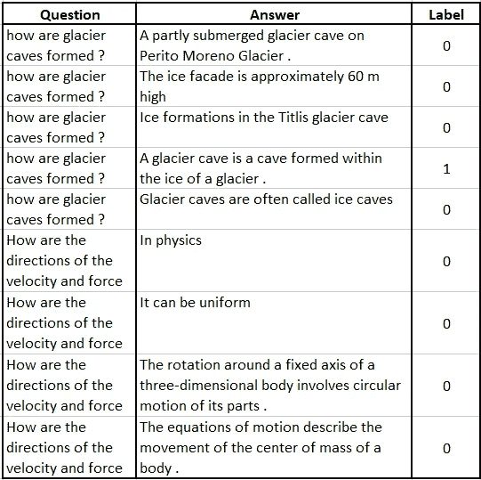
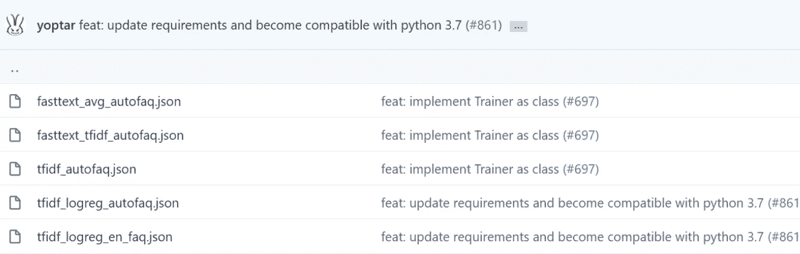
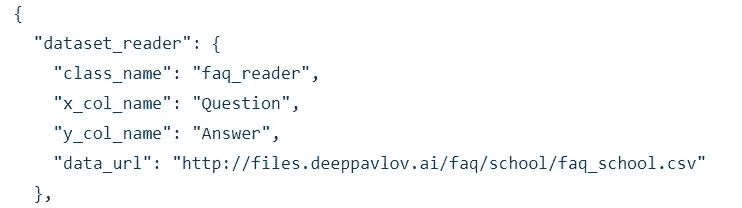
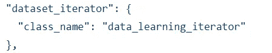
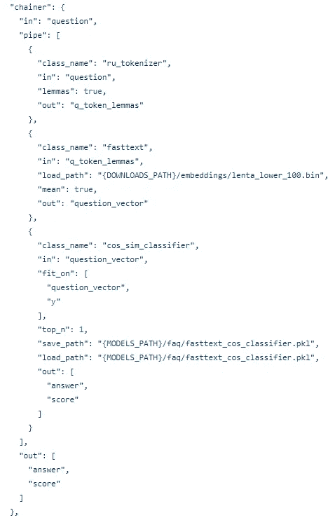
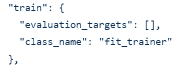

# 使用 DeepPavlov 构建一个快速定制的 FAQ Bot

> 原文：<https://betterprogramming.pub/build-a-quick-and-customised-faq-bot-d41d502711ce>

## 用一个有用的机器人减轻你的客户服务团队的压力


作者图片

几乎每个公司现在都有一个机器人来处理基本的常见问题。可能有许多模型可以帮助回答常见的问题，但 DeepPavlov 试图使这一过程更容易。

DeepPavlov 模型处理 *Q* 和 *A* 类型的数据，其中*问题*和*答案*被清楚地标注(例如，一个表格，其中一列称为“问题”，另一列称为“答案”，自然分别包含问题和答案)。

# 但是首先，数据

对于这个演示，我将使用来自微软研究网站的 [WikiQA](https://www.microsoft.com/en-us/download/details.aspx?id=52419) 数据集。它有相同数据的三个版本，具有不同的清理级别。原始数据集如下所示:



维基卡数据

在数据集中，`Label` 列是一个二元映射，表示一个答案是否是问题的正确答案。为了让我的机器人生活更轻松，我删除了错误答案的记录`(label=0)`。我使用的数据集的快照如下所示:


最终数据集

# DeepPavlov 构型

DeepPavlov 为每个 NLP 任务提供了一些预构建的配置。特别针对常见问题任务，它提供了以下配置:



DeepPavlov 提供的常见问题配置

每个 JSON 文件对应不同的配置，但是每个配置都有相同的模式。该配置有四个部分:

1.  `Dataset_Reader`:本节包含关于训练数据集的详细信息。它包含数据路径或 URL、`question`列和`answer`列。



数据集 _ 阅读器

**定制:**为了使用你自己的训练集，你需要提供数据文件的路径或者数据集合的 URL。还要指定问题(`x_col_name`)和答案(`y_col_name`)的列名。

2.`Dataset_Iterator`:本节指定如何分割数据集用于训练和测试。



数据集迭代器

**定制:**您可以添加以下全部或部分参数来指定要分割的数据集以及分割的百分比:

```
“field_to_split”: “train”,
 “split_fields”: [“train”,”test”],
 “split_proportions”: [0.8,0.2]}
```

3.这个区域是你的机器人的发电站。它由三部分组成:`in`用于输入，`out`用于输出，`pipe`用于将输入转换为输出的转换和处理步骤的管道。一个典型的管道由一个记号化器、词汇化器、单词嵌入和一个位于其上的预测模型组成(对于 FAQ bot，我们使用一个分类器)。



链条机

**定制:**流水线中的每一步都可以定制。可以使用不同类型的记号赋予器来代替 TF-IDF 矢量器——可以使用不同的记号赋予器，例如 GloVe 或任何其他矢量器。分类器也是如此。

4.`Train`:这是配置的最后一步。它指定了培训时要遵循的指标。



火车

**定制:**您可以基于任务、数据不平衡等定制您的指标。您还可以指定您是想要追求评估集准确性还是测试集准确性。

```
"train": {
    "metrics": ["accuracy"],
    "validate_best": false,
    "test_best": true
}
```

# 我的聊天机器人

在我的聊天机器人中，作为第一步，我只使用了一个自定义数据集，保持配置的各个部分不变。

```
from deeppavlov import configsfrom deeppavlov.core.common.file import read_jsonfrom deeppavlov.core.commands.infer import build_modelfrom deeppavlov import configs, train_model
```

在所有的 FAQ 配置中，我使用了`tfidf_logreg_en_faq` JSON 文件。

```
model_config = read_json(configs.faq.tfidf_logreg_en_faq)
```

我修改了 JSON 文件以指向我的 WikiQA 数据集(我将其保存为`data.csv`)。

```
model_config[“dataset_reader”][“data_path”] = “/content/data.csv”model_config[“dataset_reader”][“data_url”] = None
```

让我们看看`model_config`是什么样子的。

```
model_configOutput:
OrderedDict([(‘dataset_reader’, OrderedDict([(‘class_name’, ‘faq_reader’), (‘x_col_name’, ‘Question’), (‘y_col_name’, ‘Answer’), (‘data_url’, None), (‘data_path’, ‘/content/data.csv’)])), (‘dataset_iterator’, OrderedDict([(‘class_name’, ‘data_learning_iterator’)])), (‘chainer’, OrderedDict([(‘in’, ‘q’), (‘in_y’, ‘y’), (‘pipe’, [OrderedDict([(‘class_name’, ‘stream_spacy_tokenizer’), (‘in’, ‘q’), (‘id’, ‘my_tokenizer’), (‘lemmas’, True), (‘out’, ‘q_token_lemmas’)]), OrderedDict([(‘ref’, ‘my_tokenizer’), (‘in’, ‘q_token_lemmas’), (‘out’, ‘q_lem’)]), OrderedDict([(‘in’, [‘q_lem’]), (‘out’, [‘q_vect’]), (‘fit_on’, [‘q_lem’]), (‘id’, ‘tfidf_vec’), (‘class_name’, ‘sklearn_component’), (‘save_path’, ‘{MODELS_PATH}/faq/mipt/en_mipt_faq_v4/tfidf.pkl’), (‘load_path’, ‘{MODELS_PATH}/faq/mipt/en_mipt_faq_v4/tfidf.pkl’), (‘model_class’, ‘sklearn.feature_extraction.text:TfidfVectorizer’), (‘infer_method’, ‘transform’)]), OrderedDict([(‘id’, ‘answers_vocab’), (‘class_name’, ‘simple_vocab’), (‘fit_on’, [‘y’]), (‘save_path’, ‘{MODELS_PATH}/faq/mipt/en_mipt_faq_v4/en_mipt_answers.dict’), (‘load_path’, ‘{MODELS_PATH}/faq/mipt/en_mipt_faq_v4/en_mipt_answers.dict’), (‘in’, ‘y’), (‘out’, ‘y_ids’)]), OrderedDict([(‘in’, ‘q_vect’), (‘fit_on’, [‘q_vect’, ‘y_ids’]), (‘out’, [‘y_pred_proba’]), (‘class_name’, ‘sklearn_component’), (‘main’, True), (‘save_path’, ‘{MODELS_PATH}/faq/mipt/en_mipt_faq_v4/logreg.pkl’), (‘load_path’, ‘{MODELS_PATH}/faq/mipt/en_mipt_faq_v4/logreg.pkl’), (‘model_class’, ‘sklearn.linear_model:LogisticRegression’), (‘infer_method’, ‘predict_proba’), (‘C’, 1000), (‘penalty’, ‘l2’)]), OrderedDict([(‘in’, ‘y_pred_proba’), (‘out’, ‘y_pred_ids’), (‘class_name’, ‘proba2labels’), (‘max_proba’, True)]), OrderedDict([(‘in’, ‘y_pred_ids’), (‘out’, ‘y_pred_answers’), (‘ref’, ‘answers_vocab’)])]), (‘out’, [‘y_pred_answers’, ‘y_pred_proba’])])), (‘train’, OrderedDict([(‘evaluation_targets’, []), (‘class_name’, ‘fit_trainer’)])), (‘metadata’, OrderedDict([(‘variables’, OrderedDict([(‘ROOT_PATH’, ‘~/.deeppavlov’), (‘DOWNLOADS_PATH’, ‘{ROOT_PATH}/downloads’), (‘MODELS_PATH’, ‘{ROOT_PATH}/models’)])), (‘requirements’, [‘{DEEPPAVLOV_PATH}/requirements/spacy.txt’, ‘{DEEPPAVLOV_PATH}/requirements/en_core_web_sm.txt’]), (‘download’, [OrderedDict([(‘url’, ‘[http://files.deeppavlov.ai/faq/mipt/en_mipt_faq_v4.tar.gz](http://files.deeppavlov.ai/faq/mipt/en_mipt_faq_v4.tar.gz)’), (‘subdir’, ‘{MODELS_PATH}/faq/mipt’)])])]))])
```

我当前的配置返回两个输出:答案和数据集中每个答案的分数。因此，机器人返回的答案对应于从分类器获得最高分的答案。

# 测试聊天机器人

既然我们已经构建了我们的机器人，我们需要开始测试它！我选了一个关于我最喜欢的话题的问题。

```
answer=faq([‘how much are the harry potter movies worth’])
answer
```

答案看起来是这样的:

```
[[‘The series also originated much tie-in merchandise , making the Harry Potter brand worth in excess of $ 15 billion .’], [[2.8795176258939618e-05, 3.455291900665732e-05, 2.3293008062435097e-05, 1.8698734833734615e-05, 2.9047658733640157e-05, 1.3114898657693846e-05, 2.0041260380642056e-05, 1.013473237893427e-05, 2.3093856606655472e-05, …]]
```

所以请记住，在生产环境中，返回`answer[0]`而不是`answer`本身。

# 估价

这些天来，我已经不仅仅是打印一个模型的指标来评估它的性能。我因为试图破坏模型而弄脏了我的手。我也试图打破机器人。所以我问了它多个问题，每个问题都有不同的方式。很快，机器人失败了。

```
from deeppavlov.metrics.accuracy import sets_accuracysets_accuracy(testd[‘Answer’],answers[0])Output:0.8375
```

我更感兴趣的是找出机器人失败的原因和原因。所以我开始检查失败的例子。

## **上下文中的歧义**

我们来看下面这个问题:

```
Where is rough and ready, CA
```

维基卡对这个问题的回答是:

```
Rough and Ready is a census-designated place in Nevada County , California , United States .
```

当我提出这个问题时，我从机器人那里得到的答案是:

```
It is located west of Grass Valley , California , approximately 62 miles ( 100 km ) from Sacramento .
```

令人惊讶？

现在，当我从问题中删除`CA`时，我从机器人那里得到的答案与基本事实答案相匹配:

```
Where is rough and readyAnswer:
Rough and Ready is a census-designated place in Nevada County , California , United States .
```

我相信这个模型能够将`CA`映射到`California`，但是因为两个答案中都有`California`，所以很难选择正确的答案。

# 结论

DeepPavlov 是一个很好的地方，对于那些希望有一个防失败的管道和按照他们的需求灵活地制作模型的从业者来说。

由于机器人的输出只和它的数据(以及分类器)一样好，更好的数据处理可以帮助处理机器人的一些问题。

作为一个直接的步骤，机器人可以通过两种方式进行改进:使用一个更好的分类器来提高准确性，并引入歧义解决方案，这从实践的角度来看是不可避免的。

然而，这些方法将在另一篇文章中讨论。