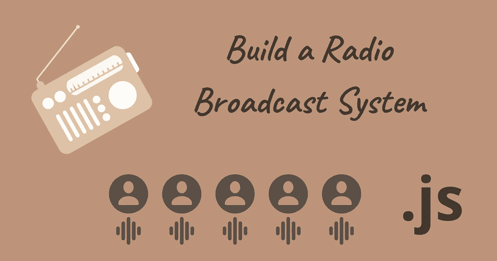
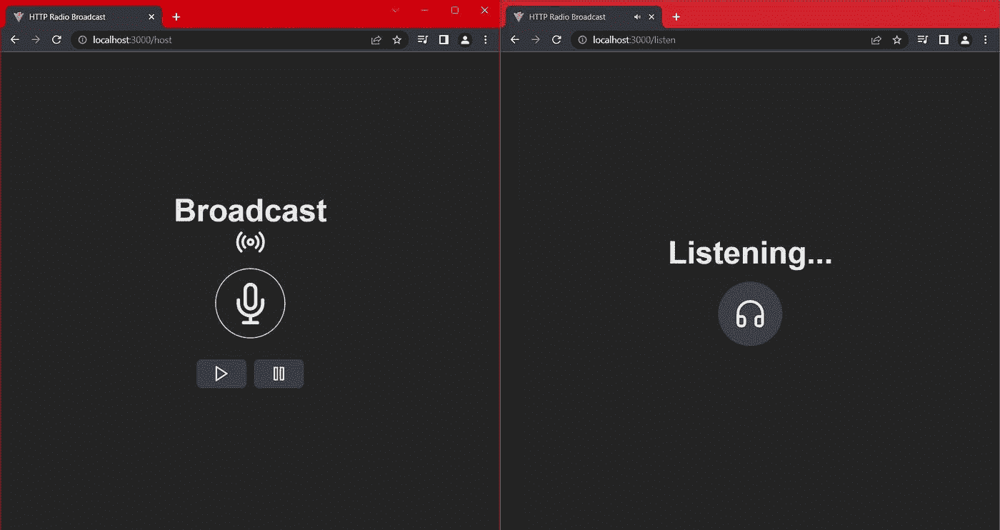

# 用 Node.js，React，Socket 搭建一个电台广播系统。超正析象管(Image Orthicon)

> 原文：<https://betterprogramming.pub/build-a-radio-broadcast-system-with-node-js-react-and-socket-io-1ae107a53639>

## 从主麦克风流式传输音频，并将其广播给所有连接的听众



作者的封面图片

在本文中，我将向您展示如何使用 Express 和 React 构建一个无线电广播系统。

我们的电台将由一名主持人和多名听众组成。主持人将他们的麦克风流式传输到服务器，服务器向每个听众广播。我们可以用`socket.io`通过 WebSockets 来做这件事。此外，服务器从本地文件夹加载音乐，通过 HTTP 传输给听众。



作者展示最终应用程序的图片

# 构建后端

要开始，我们需要从 NPM 安装以下软件包。

```
npm i express react-feather jnaudiostream react-router-dom socket.io socket.io-client throttle uuid
```

让我们在名为`server`的新文件夹中创建一个`index.js`文件。在这里，我们将设置一个 Express 应用程序，并在它周围包装一个`socket.io`服务器。然后我们监听一个套接字连接，并定义一个客户端可以访问 HTTP 音乐流的路由。

# 实时音频流

我们将创建一个`Queue`类来处理音乐文件的打开，并以相同的速率将它们传输到每个客户端。为此，我们可以在同一个`server`文件夹中创建一个名为`queue.js`的文件。

下面是我们将实现的以 TypeScript 风格声明的所有方法。

现在让我们来分解一下。

# 处理客户

我们可以为每个客户端创建一个`PassThrough`流，我们可以在其中写入音频数据，而客户端仍然可以读取它。

我们还将定义一个方法，向每个连接的客户端写入一个数据块。

# 加载文件

我们需要一种方法来获取目录中所有 MP3 文件的名称，并获取它们的比特率。有了比特率，我们就可以控制音频流的速率。我们将使用`Throttle`包，而不是自己处理计时。

为了获得比特率，我们将通过`@dropb/ffprobe`包装器使用`ffprobe`。我们必须将它与`ffprobe-static`一起安装，后者将下载`ffprobe`二进制文件并返回它们的位置。

```
npm i ffprobe-static @dropb/ffprobe
```

使用以下代码实现`getTrackBitrate`方法:

# 获取下一首曲目

我们使用一个索引来知道我们下一步应该播放哪个曲目。默认情况下，索引为 0。

# 创建文件流

我们现在使用`fs`从磁道的文件路径创建读取流。

# 壮观的流媒体

现在我们将实例化一个新的`Throttle`,我们将通过管道传输文件流。`Throttle`的构造函数接受 bps(每秒字节数),所以我们将比特率除以 8。

然后我们监听`data`事件，并在收到每个数据块时调用`this.broadcast`。我们使用`data`事件将数据发送到多个流，因为只有一个可写事件可以消耗典型的`.pipe`。

一旦没有更多的数据留下，我们再次开始加载下一个轨道，获得流，最后流。

# 控制回放

要暂停播放，我们要做的就是结束油门。但是我们还必须删除`end`监听器，以避免`this.play(true)`被执行。

我们还需要一个 guard 子句来检查一个 throttle 是否存在，以及我们是否加载了一个 track。

```
started() {
    return this.stream && this.throttle && this.currentTrack;
}
```

现在，为了恢复回放，我们可以使用之前定义的调用`start`方法。

# 收尾

我们现在可以定义`play`方法，它要么继续回放，要么开始播放下一首曲目。

并且在文件中，我们可以导出`Queue`的单例实例。

# 服务器

回到我们的主服务器文件，我们可以导入我们的队列，加载轨道并实现`/stream`路由，它通过管道将队列创建的`PassThrough`发送到 HTTP 响应。

# 前端路由

在`main.jsx`文件中(如果您使用 Vite)，我们使用`react-router-dom`定义了三条路线。

# 根组件

我们的根组件很简单。我们放置一个标题，并创建按钮将用户带到其他页面。注意，我们使用`react-feather`作为图标，使用 TailwindCSS 作为样式。

# 流式麦克风

要将音频数据实时发送到服务器，我们可以使用`jnaudiostream`，这是我在 NPM 上发布的一个包。

我们可以创建一个使用`socket.io-client`与服务器通信的组件(`MicrophoneButton`)。在效果内部，我们可以在收到缓冲区头和后续数据包时发送它们。

现在我们可以向 record 按钮添加一个`onClick`处理程序，它将切换记录器的状态。这里是`MicrophoneButton`组件的最终代码。

# [插座。IO](http://socket.io/) 服务器

在服务器端，我们可以监听`bufferHeader`和`stream`事件，并将数据广播给其他客户端。我们还监听了一个稍后会用到的`control`事件。

# 音乐控制

除了记录麦克风，我们还需要按钮向`socket.io`服务器发送命令。

# 主机路由

在路由的主要组件中，我们可以为`socket.io`实例化一个客户端。我们连接到服务器的基本 URL。

顺便说一下，如果你的前端 app 和后端在不同的端口上(比如 Vite 在 5173 端口，Express app 在 3000 端口)，你就需要在`socket.io`服务器上设置一个 CORS 属性。

# 收听

为了完整地收听广播，用户需要从`socket.io` *和*的 HTTP 流获得主持人的麦克风音频用于音乐。

为了调谐到主麦克风，我们可以使用来自`jnaudiostream`的`AudioStreamer`类。然后我们监听`bufferHeader`和`stream`事件传递给 streamer 对象，类似于[存储库](https://github.com/WoolDoughnut310/jnaudiostream)中的一个例子。

请注意，一旦我们设置了标题缓冲区，就可以使用`streamer.mediaBuffer`。

而现在，在听 HTTP 音乐流的时候，我们只用了一个`audio`元素。

添加以下代码以创建最终的路由组件。

# 最终注释

概括来说，我们从主机麦克风流式传输音频，并将其广播给所有连接的听众。然后我们创建了一个队列引擎来处理流向 HTTP 客户端的流媒体音乐。最后，我们构建了一个接口来将所有东西联系在一起。

以下是一些需要考虑的额外要点:

*   对主机的授权
*   在队列中添加或移除曲目
*   显示当前曲目
*   允许一个以上的队列(站)

在你离开之前，你可以在这里找到这个项目的全部代码。下次见。

# 参考

*   [github.com/WoolDoughnut310/jnaudiostream](https://github.com/WoolDoughnut310/jnaudiostream)
*   [socket.io/docs/v4/handling-cors](https://socket.io/docs/v4/handling-cors)
*   [blog.logrocket.com/online-radio-server-pure](https://blog.logrocket.com/online-radio-server-pure-node-js)
*   [github.com/michael-gillett/node-stream-player](https://github.com/michael-gillett/node-stream-player)
*   [tailwindcss.com/docs/guides/vite](https://tailwindcss.com/docs/guides/vite)
*   [github.com/TooTallNate/node-throttle](https://github.com/TooTallNate/node-throttle)

*原载于*[*https://cs 310 . hash node . dev*](https://cs310.hashnode.dev/build-a-radio-broadcast-system-with-nodejs-react-and-socketio)*。*