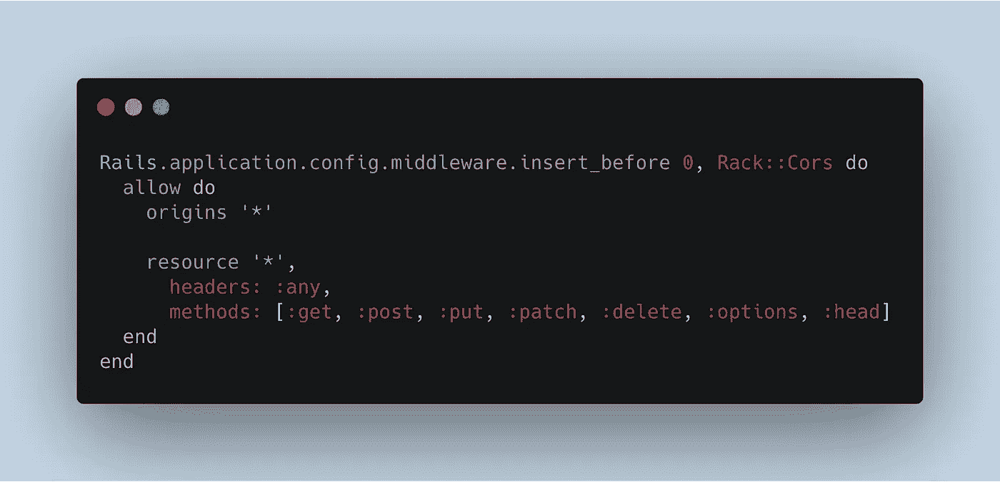
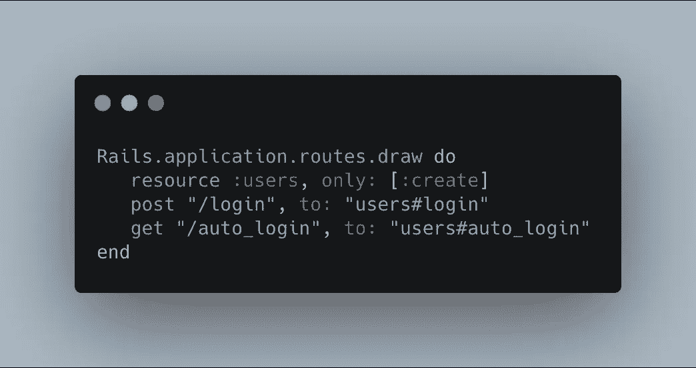

# 用 JWT 构建一个 Rails API

> 原文：<https://betterprogramming.pub/build-a-rails-api-with-jwt-61fb8a52d833>

## 使用 JavaScript Web 令牌设置您的用户身份验证，以提高安全性


照片由约书亚·富勒(Unsplash)拍摄

这是从头开始创建和设置 Rails API 应用程序的指南。

重点将是用户登录和注册，并通过 JWT 对他们进行授权/认证。请记住，这种方法只是众多方法中的一种。让我们从设置开始。

# 设置

让我们生成一个 Rails API。从终端运行以下命令:

```
rails new jwt-rails-api-app --database=postgresql --api
```

包含标志`--database=postgresql`以指示 [PostgreSQL](https://www.postgresql.org/) 将被用作数据库，而不是 [SQLite](https://www.sqlite.org/) ，并且包含标志`--api`以指示该应用将被设置为 API，并且避免生成视图和视图助手，因为它们对于 API 不是必需的。

打开新生成的文件夹，打开`Gemfile`。我们需要包括一些宝石作为设置的一部分。

首先是取消注释/包含:

```
gem 'bcrypt'
```

Bcrypt 将为用户管理密码散列。

第二是取消注释/包含:

```
gem 'rack-cors'
```

这允许 API 中的跨源资源共享(CORS)。CORS 阻止来自未知来源的 API 调用。

最后，包括:

```
gem 'jwt'
```

从终端运行`bundle install`在应用程序中安装这三个 gem。

接下来，导航到`config/initializers/cors.rb`，取消对以下内容的注释，并用星号替换“example.com”。



克-奥二氏分级量表

现在，导航到`config/routes.rb`。我们将为此应用程序定义可访问的路由。

对于本指南，我们将只关注处理登录、注册用户和自动登录的路由。我们将定义几个自定义路由来处理登录和自动登录。



路线

对于本指南，我们将只关注为`User`生成控制器和模型。理想情况下，对其他人也可以采取同样的方法。

让我们从生成`User`的模型开始。我们需要一个`User`实例的以下属性:`:username`、`:password`和`:age`。

```
rails g model User username:string password_digest:string age:integer
```

只是需要注意一些事情。在`:password`中，如果 bcrypt 被实现，它将期望一个属性`password_digest`来散列密码。

**重要** : 为了确保该功能的实现，在`User`模型中定义用户宏`has_secure_password`。最后，用以下代码生成`User`控制器:

```
rails g controller Users
```

`User`的型号、控制器和路线现已设定。现在，让我们运行:

```
rails db:create && rails db:migrate
```

出于测试目的，我们可以在`db/seeds.rb`文件中创建一个`User`实例。

```
user = User.create(username: "reizl", password: "sample", age: 27)
```

要播种数据库，运行`rails db:seed`。既然设置已经完成，我们有了要处理的数据，现在我们可以把注意力放在控制器的方法上了。

# 应用控制器方法

让我们关注一下应用程序控制器。该控制器中定义的方法可以在其他控制器中访问，如`User`。这里定义了许多方法，对用户进行身份验证和授权至关重要。

## 编码 _ 令牌

先从`encode_token`说起吧。当稍后调用此方法时，对象将作为参数发送。

将利用 JWT gem 提供的方法`encode`来生成令牌。`JWT.encode`有两个参数，`payload`对象和一个表示“秘密”的字符串。方法`encode_token`将返回由 JWT 生成的令牌。

现在，对于其余的方法，从`authorized`开始解释并逐步向上会更有好处，考虑到这是它所需要的一连串事件。方法之间会有一些来回的跳跃。

在探索这些方法之前，宏`before_action :authorized`本质上是说，如果对这个 API 有任何请求，那么将总是首先调用方法`authorized`。

## 经授权的

顾名思义，这个方法检查用户是否被授权。但是它依赖于一系列的方法。

如果用户没有登录或者请求没有发送必要的凭证，这个方法将发回一个 JSON 响应，要求他们登录。为了确定该信息，调用方法`logged_in?`。

同样，顾名思义，它检查用户是否登录。`logged_in?`方法返回 true 或 false，这取决于在它内部调用的另一个方法的返回值。

## 登录用户

方法`logged_in_user`调用了另一个方法`decoded_token`。从`decoded_token`调用`auth_header`方法，该方法查看请求的信息。

该方法只涉及报头，特别是“授权”的密钥。理想情况下，这将包含一个由 JWT 生成的令牌，并且将采用`Bearer <token>`的格式，这就是`auth_header`将返回的内容。

为了获得令牌，我们将在`Bearer <token>`上使用`.split(" ")[1]`方法。一旦令牌被获取并分配给令牌变量，JWT 提供的`decode`方法将被使用。

`JWT.decode`接受四个参数，要解码的令牌、编码时分配的秘密字符串、真值和算法(这里是‘hs 256’)。否则，如果有错误，它将返回 nil。

`decoded_token`的返回值将代表来自`JWT.decode`的数组。我们只关心第一个索引，它将是一个键为“`user_id`”的对象(这将来自`User`的控制器)。

从“`user_id`”中，我们可以确定数据库中是否存在具有该特定 ID 的`User`实例。如果有，用户是“授权的”，如果没有，他们不是。

(由于涉及一系列方法，请随意再读一遍。)

# 用户控制器

现在，让我们把焦点转移到用户的控制器上。我们将关注用户登录、用户注册(创建用户)和用户的自动登录。许多方法依赖于应用程序控制器中定义的方法。

让我们从宏`before_action :authorized, only: [:auto_login]`开始。

与前面类似，我们声明如果在应用程序中访问任何路由，应用程序控制器中的`authorized`方法将首先运行。但只是具体到路线，`auto_login`。这意味着可以直接访问`create`或`login`。

## 创造

当用户注册时，会在后端创建一个新的用户实例。将向`/users`发出一个 POST 请求，该请求将被重定向到用户控制器`create`方法。

让我们检查一下在`create`方法中发生了什么。

创建一个用户实例。如果有效，就用用户实例的 id 创建一个有效负载对象，并将其传递给在应用程序控制器中定义的`encode_token`方法。如果需要，有效负载对象可以包含多个键。

如前所述，`encode_token`将返回一个由 JWT 生成的令牌字符串。JSON 对象使用用户和令牌的键值对作为响应来呈现。

## 注册

当现有用户登录时，会实现类似的方法。但是，一个 POST 请求将被发送到`/login`，该请求将被重定向到用户控制器`login`方法。

不同之处在于，我们使用`find_by`方法从传递的参数中检查现有的用户实例，特别是用户名。然后，`bcrypt`提供的`authenticate`方法比较从 params 传递的密码和存储在数据库中的密码是否匹配。

如果用户实例和 authenticate 方法都通过了，那么 JWT 将生成一个令牌，并使用用户和令牌的键值对呈现一个 JSON 对象，然后作为响应发送出去。

## 自动登录

让我们检查位于用户控制器中的`auto_login`方法。

这里真的没什么事情。最大的问题是变量`@user`从何而来？

由于方法`authorized`将在`auto_login`之前运行，应用控制器中的方法链也将运行。方法之一`logged_in_user`将返回一个可访问的全局`@user`变量。

# 结束语

定义好路线和方法后，我们的 Rails API 就设置好了！我们可以使用`rails s`或`rails s -p 4000`来运行我们的服务器(如果你想在不同的端口上运行的话)。

为了测试路由和功能，我们可以利用 [Postman](https://www.postman.com/) 或者从客户端应用程序(比如 React)进行连接。本指南不包括测试路由和功能。

本指南主要介绍如何设置一个 rails API，该 API 集成了 bcrypt 散列和 JWT 来处理用户认证/授权。

它还涵盖了实现方法背后的逻辑过程。希望本指南已经为使用 JWT 构建 Rails API 提供了指导。感谢您的阅读！

有关详细信息，请参考我的存储库:

*   [GitHub 回购](https://github.com/reireynoso/jwt-rails-api-template)