# 通过简单的步骤使用 AWS Amplify 构建一个 React 应用程序(第 2 部分)

> 原文：<https://betterprogramming.pub/build-a-react-app-using-aws-amplify-in-simple-steps-part-2-59812ea29192>

## 将 AWS AppSync GraphQL API 添加到 React 应用程序中

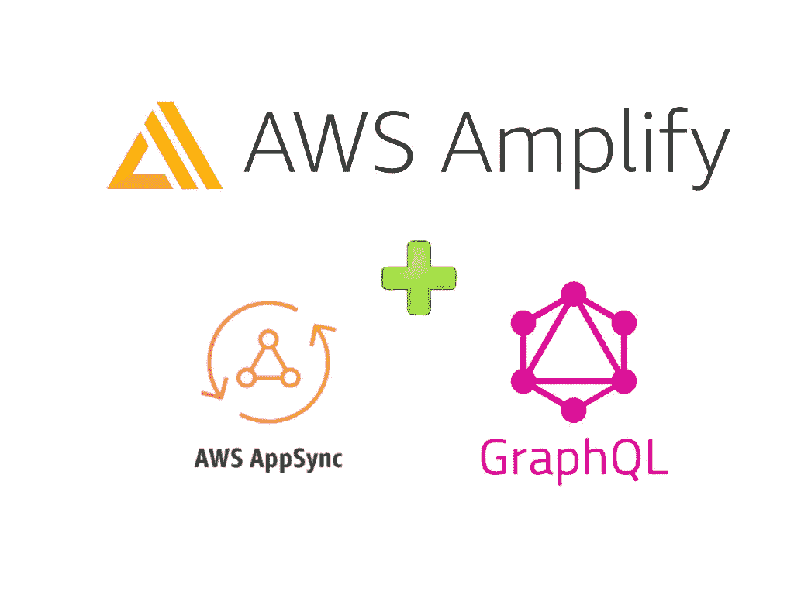

AWS Amplify + AWS AppSync + GraphQL

# **简介**

在之前的[帖](https://medium.com/better-programming/build-a-react-app-with-authentication-using-aws-amplify-49db1dfdc290)中，我们从零开始安装配置了 [AWS Amplify](https://aws.amazon.com/amplify/) 。然后，创建了一个 React 应用程序，并通过简单的步骤添加了一个完整的身份验证流程。

在第二部分中，我将向应用程序添加 AWS AppSync GraphQL API。

# GraphQL

GraphQL 是 API 的一种查询语言，也是一种服务器端运行时，通过使用您为数据定义的类型系统来执行查询。

GraphQL 不依赖于任何特定的数据库或存储引擎，而是由您现有的代码和数据提供支持。

您可以在此了解有关 GraphQL 的更多信息:

[](https://graphql.org/learn/) [## GraphQL:一种 API 查询语言。

### 在本系列文章中了解 GraphQL，它是如何工作的，以及如何使用它。寻找关于如何…

graphql.org](https://graphql.org/learn/) 

# AWS AppSync

为 GraphQL API 构建后端可能涉及大量的编码工作。

[AWS AppSync](https://aws.amazon.com/appsync/) 允许开发人员卸载构建 GraphQL 后端所涉及的复杂性和时间，只需担心构建他们的应用程序，并且它通过实时和离线功能做到了这一点。

借助 AppSync，您可以在一系列数据源(如 NoSQL 数据存储、关系数据库、HTTP APIs 和带有 [AWS Lambda](https://aws.amazon.com/lambda/) 的自定义数据源)上构建可扩展的应用程序，包括需要实时更新的应用程序。

对于移动和 web 应用程序，AppSync 还在设备离线时提供本地数据访问，并在设备恢复在线时通过可定制的冲突解决方案提供数据同步。

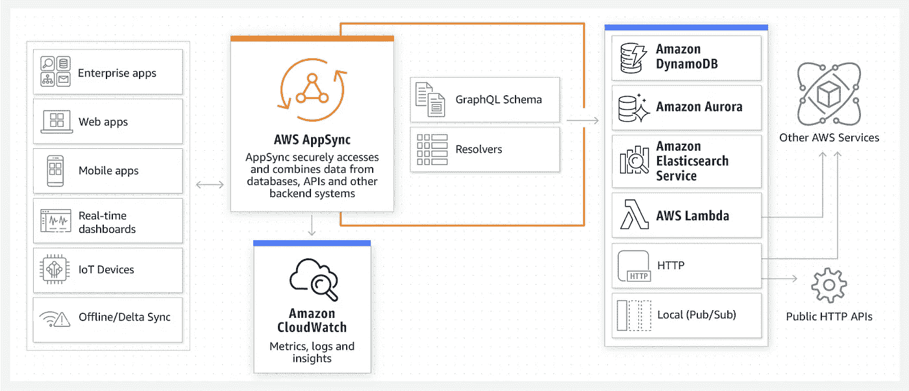

来自 AWS AppSync

通过访问 [AWS AppSync 开发者指南](https://docs.aws.amazon.com/appsync/latest/devguide/welcome.html)了解更多关于 [AWS AppSync](https://aws.amazon.com/appsync/) 的信息。

# 我们开始吧

起点是第一部分的完整代码。

克隆回购:

```
$ git clone [git@github.com](mailto:git@github.com):mlomboglia/react-amplify.git
cd react-amplify
cd part1-authentication
npm install
```

测试您的应用程序并确保它正在运行:

```
npm start
```

您应该会看到用户登录屏幕:

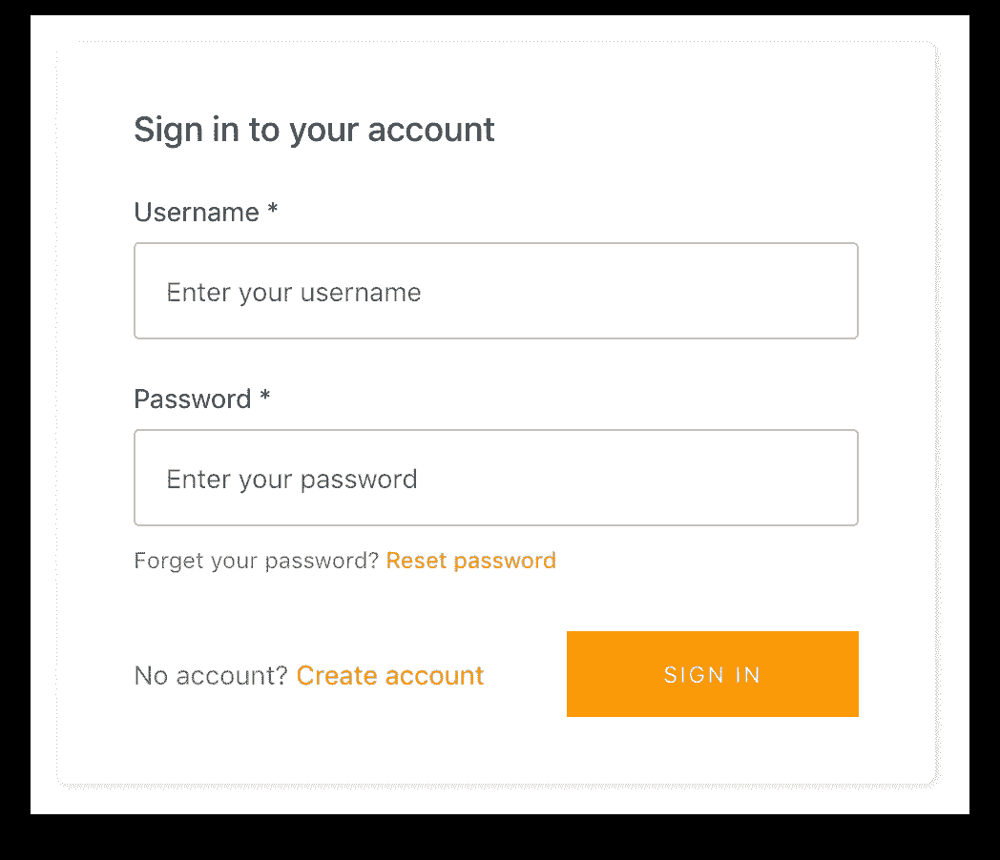

登录或创建一个新用户来访问您的主屏幕仪表板。

# 向应用程序添加 API 支持

为了创建 API，我们将使用 [AWS AppSync](https://aws.amazon.com/appsync/) 。

AWS AppSync 允许您创建灵活的 API 来安全地访问、操作和组合来自一个或多个数据源的数据，从而简化了应用程序开发。

AppSync 是一个托管服务，它使用 GraphQL 使应用程序可以轻松地准确获得它们需要的数据。

让我们使用 Amplify CLI 从以下命令开始:

```
$ amplify add api
```

这将启动一系列步骤来帮助我们创建第一个 AWS AppSync GraphQL API。

进行以下选择，并按*回车*完成 API 创建。我推荐使用第一部分中设置的 *Cognito 用户池* 进行认证。您可以使用一个 *API 键*进行测试，但是不建议在生产环境中使用。

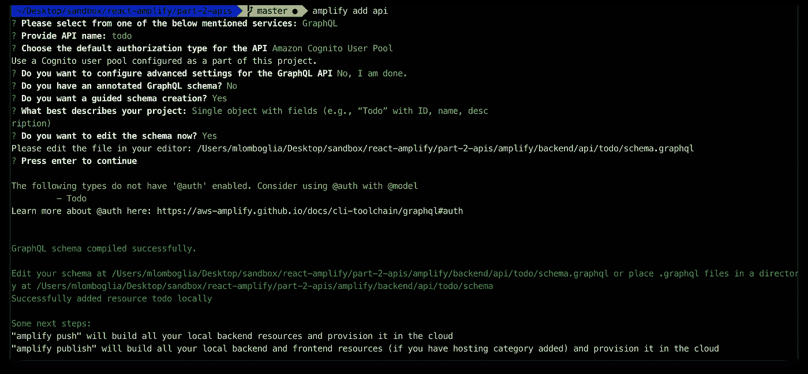

对于本教程，我将使用 AWS Amplify 建议的带有字段的单个对象(例如，带有 ID、名称、描述的“Todo”)。将在以下路径自动创建`graphql.schema`文件:`/amplify/backend/api/todo`。

```
type Todo [@model](http://twitter.com/model) {
  id: ID!
  name: String!
  description: String
}
```

Amplify CLI 附带了一个 GraphQL 转换器，可以根据您的数据需求将带注释的 GraphQL 模式文件转换为适当的 AWS CloudFormation 模板。

这包括如下选项:

*   `@model`用于在 Amazon DynamoDB 中存储类型。
*   `@auth`定义不同的授权策略。
*   `@connection`用于指定`@model`对象类型之间的关系。
*   `@searchable`用于将`@model`对象类型的数据流式传输到 Amazon [Elasticsearch](https://aws.amazon.com/elasticsearch-service/) 服务。

您可以在此了解有关 GraphQL 转换的更多信息:

[](https://aws-amplify.github.io/docs/cli-toolchain/graphql) [## GraphQL 变换

### GraphQL 转换提供了一个简单易用的抽象，可以帮助您快速地为您的 web 和……

aws-amplify.github.io](https://aws-amplify.github.io/docs/cli-toolchain/graphql) 

现在，将模式推送到 AWS。

```
$ amplify push 
```

保留生成 GraphQL 操作的所有默认选项——查询、变异和订阅

AWS AppSync 将根据您的文件夹结构创建 AWS CloudFormation。这个过程需要一些时间。在以后的文章中，我们将着眼于本地调用来加速开发。

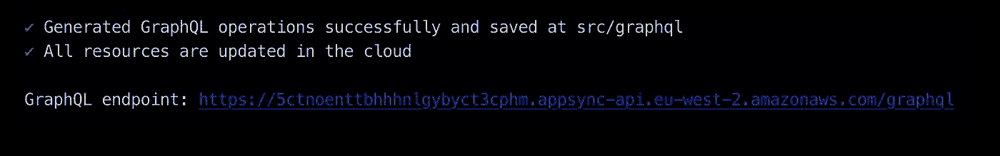

GraphQL 端点

完成该过程后，它将显示您新创建的端点。您可以随时编辑您的模式并推送新的更改。

您的新 amplify 文件夹结构现在包含您的后端文件夹，其中包含 *todo api 和 auth* ，您的`schema.graphql`，以及 AWS CloudFormation 信息。在`src`文件夹中，您将找到`graphql`文件夹，其中包含所有可以使用的生成代码。

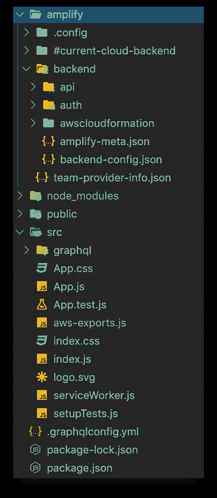

项目结构

转到 AWS 控制台→ AWS AppSync 以查看部署的模式。您也可以从*查询*部分运行查询。

在*数据源*部分，您还可以在 DynamoDB 中看到您新创建的 TodoTable。是的，它是自动创建来存储您的数据的。

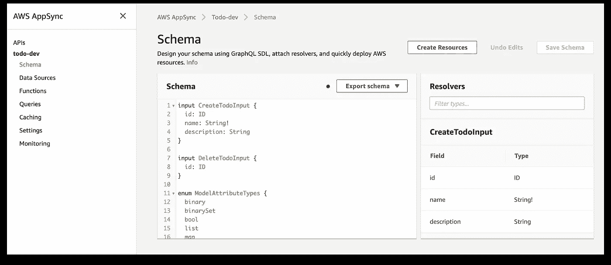

AWS AppSync 控制台

如果您想要更新您的 API，请打开您项目的`backend/api/todo/schema.graphql`文件(*而不是`backend/api/blog/build`文件夹中的*)并编辑它。

您可以通过运行以下命令来编译`backend/api/todo/schema.graphql`:

```
$ amplify api gql-compile
$ amplify push
```

别忘了推新变化。

# 将 Todo GraphQL 添加到 React 应用程序中

现在，让我们将 Todo GraphQL 添加到 React 应用程序中。Amplify CLI 已经在`src/aws-exports.js`中包含 AppSync API 所需的配置。

# 添加 GraphQL 后端

打开`App.js`,添加导入以包含`API`类别和`graphqlOperation`方法，如下所示:

```
import { API, graphqlOperation } from 'aws-amplify';
```

将应用程序更改为类组件。别忘了在顶部加上进口。

在您的代码中添加下面的查询和突变，*在*之前，`class App extends Component {...}`定义如下:

现在，在`App`组件中，在`render()`方法之前添加以下两个方法:

现在可以从应用程序中调用 GraphQL 了。更新`render()`方法，使其具有以下按钮来调用变异和查询:

这是您完成的`App.js`文件:

App.js

运行应用程序:

```
$ npm run start
```

登录或创建新用户。

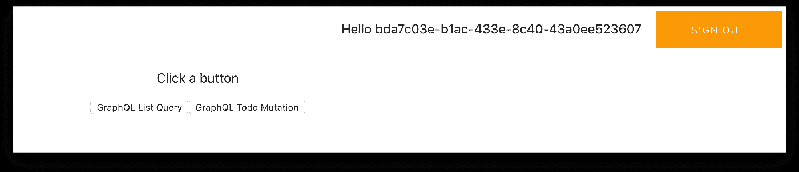

现在，单击 *GraphQL Todo 变异*来添加一个虚拟项目:

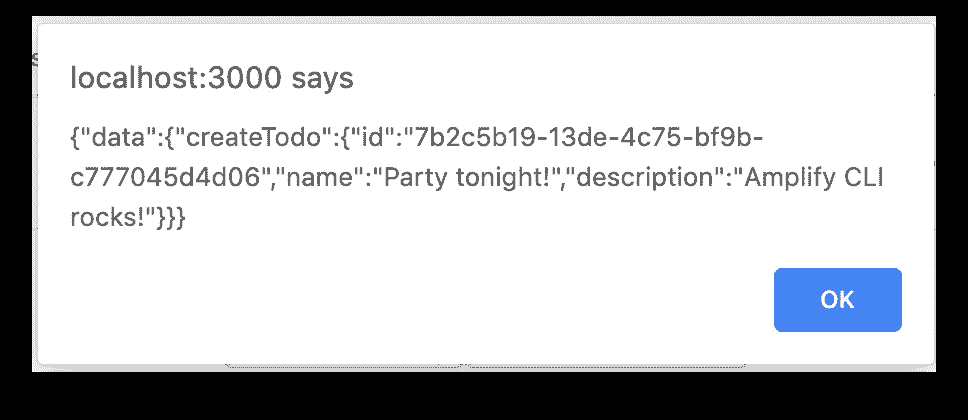

GraphQL Todo 突变

点击 *GraphQL 列表查询*来列出你的物品:

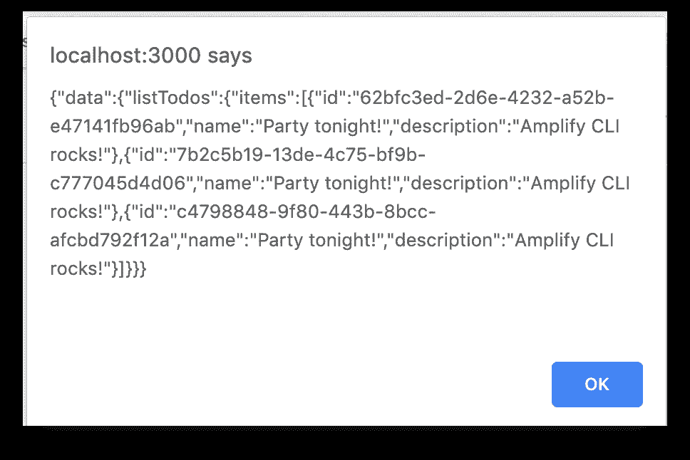

GraphQL 列表查询

您可以检查您的项目存储在 AWS 控制台→ DynamoDB 中

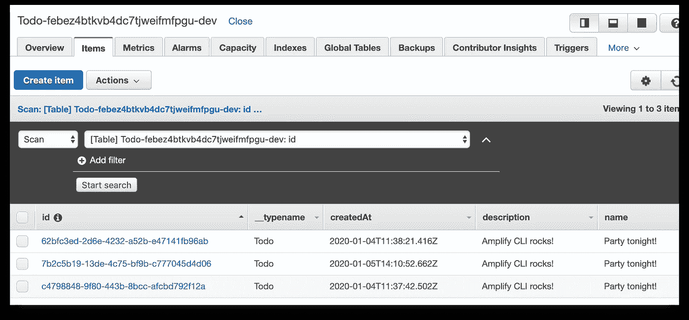

AWS 控制台→ DynamoDB

# 后续步骤

这只是使用 Amplify with React 的开始。在接下来的文章中，我将扩展应用程序，添加:

*   用 [Material-UI:一个流行的 React UI 框架](https://material-ui.com/)让应用看起来更好。
*   分析:跟踪用户会话、属性和应用内指标的嵌入式分析。
*   存储:在云中或设备上安全地管理用户内容。

所有的源代码都在我的 [GitHub](https://github.com/mlomboglia/react-amplify) 里。

*   第一部分。认证
*   第二部分。GraphQL API

# 更新

现在可以使用 AWS Amplify 通过简单的步骤([第 3 部分](https://medium.com/better-programming/build-a-react-app-using-aws-amplify-in-simple-steps-part-3-12c1b7746450))构建一个 React 应用程序。向 React 应用添加分析和存储。

2020 年 5 月 21 日:更新为使用 Amplify 版本 3

编码快乐！