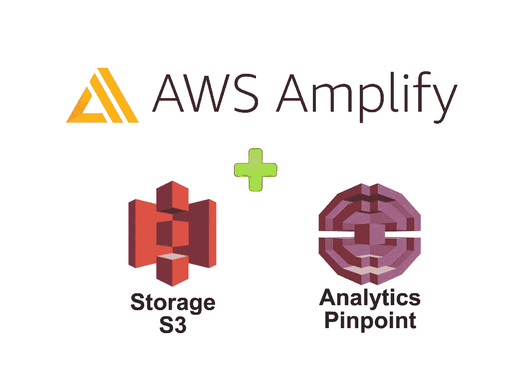
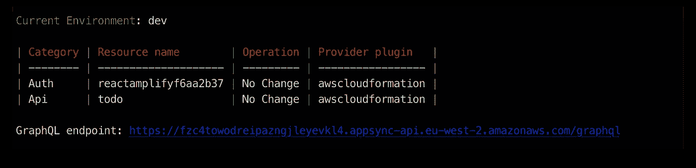
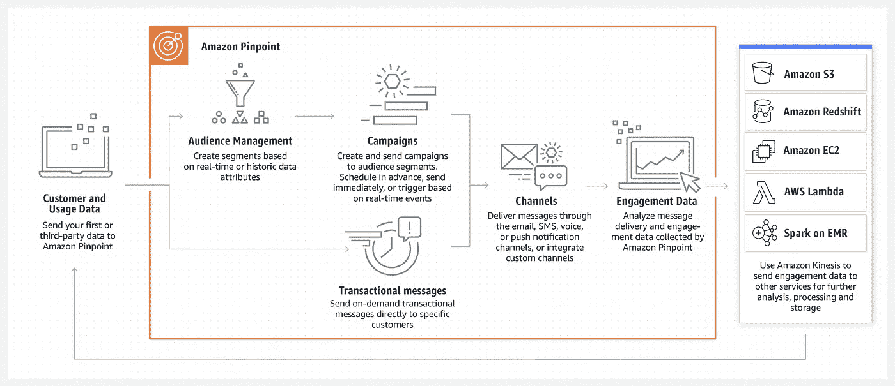
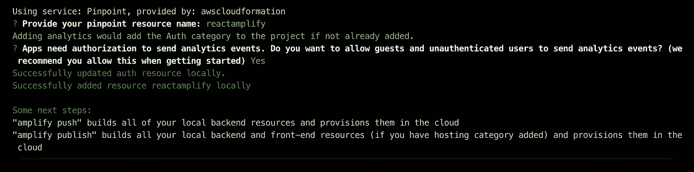
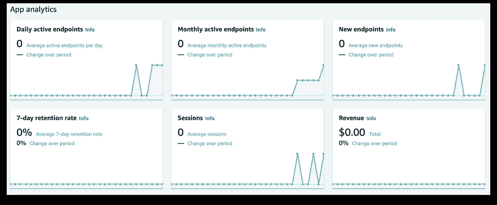
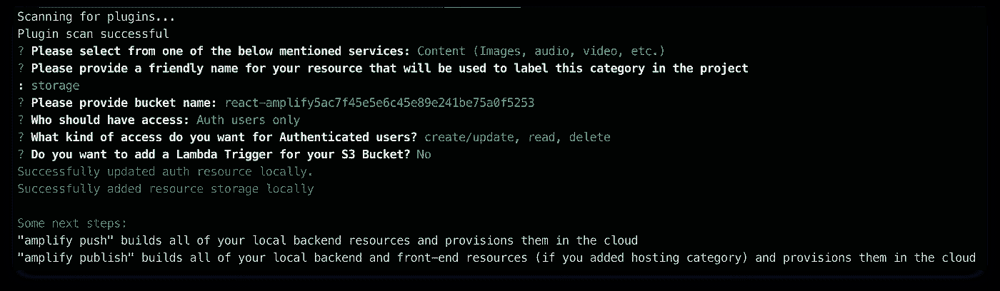
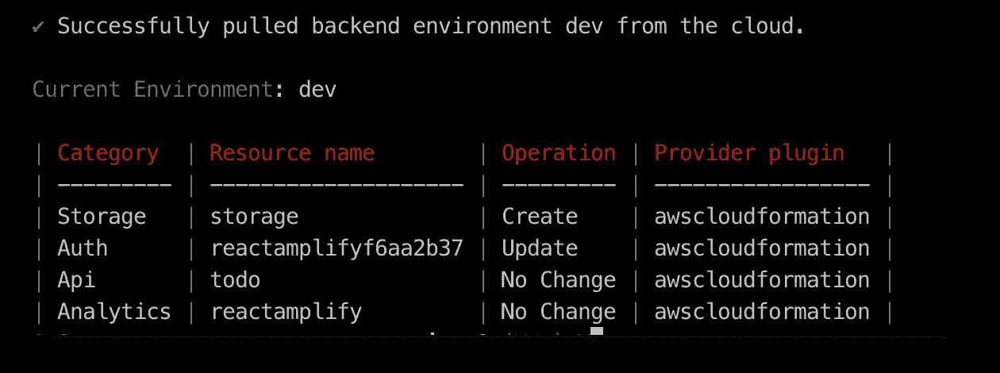
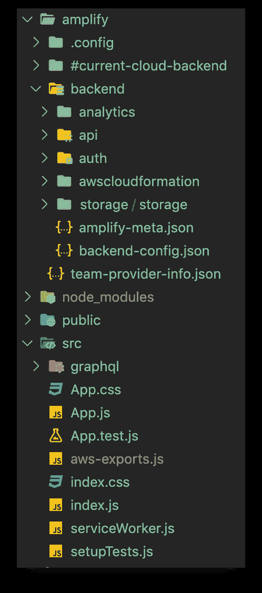
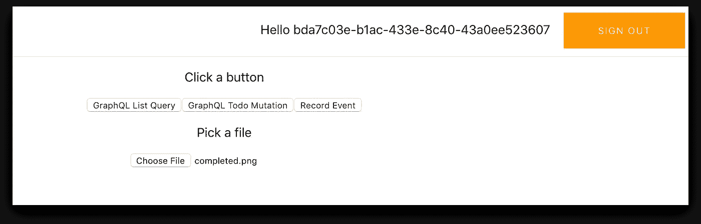
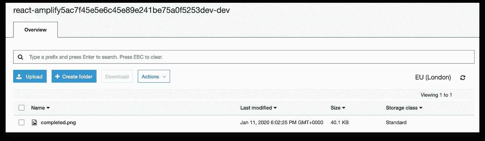

# 通过简单的步骤使用 AWS Amplify 构建一个 React 应用程序(第 3 部分)

> 原文：<https://betterprogramming.pub/build-a-react-app-using-aws-amplify-in-simple-steps-part-3-12c1b7746450>

## 向您的 React 应用添加分析和存储



AWS Amplify +存储 S3 +精确分析

# 概观

到目前为止，在 [part 1](https://medium.com/better-programming/build-a-react-app-with-authentication-using-aws-amplify-49db1dfdc290) 中，我们从零开始安装配置了 [AWS Amplify](https://aws.amazon.com/amplify/) 。然后，创建了一个 React 应用程序，并通过简单的步骤添加了一个完整的身份验证流程。

在[第 2 部分](https://medium.com/better-programming/build-a-react-app-using-aws-amplify-in-simple-steps-part-2-59812ea29192)中，我们提供了一个 AWS AppSync [GraphQL](https://graphql.org/) API，并将其集成到我们的应用程序中。

在第 3 部分中，我将使用 AWS Pinpoint 服务和存储添加分析，以将文件上传到 AWS S3。

# 我们开始吧

让我们从第 2 部分的完整代码开始。

克隆回购:

```
$ git clone [git@github.com](mailto:git@github.com):mlomboglia/react-amplify.git
cd react-amplify
cd part2-graphql
npm install
```

测试您的放大器配置:

```
$ amplify status
```



放大状态

你应该会看到你的`Auth`和你的`Api`如上图。

现在，让我们运行应用程序并确保它正常工作:

```
$ npm start
```

登录并测试您的两个按钮来创建和列出项目。现在，我们准备向我们的应用程序添加更多内容。

# 放大分析

[AWS Amplify](https://aws.amazon.com/amplify/) 可以轻松跟踪用户会话和网页指标。

您可以访问实时数据流，分析数据以获得客户洞察，并构建数据驱动的营销策略来推动客户采用、参与和保留。

## AWS 精确定位

Amplify 利用 AWS Pinpoint 进行分析。这是对 Amazon Pinpoint 工作原理的简要描述:



AWS 精确定位

## 添加分析

要添加分析，请运行以下命令:

```
$ amplify add analytics
```

**非常重要**:从您的 Pinpoint 资源名称中删除破折号，否则您将得到以下错误:

```
An error occurred during the push operation: Template format error: Resource name analyticsreact-amplify is non alphanumeric.
```

进行以下选择以创建您的资源:



`amplify add analytics`

将您的更改推送到云:

```
$ amplify push
```

太好了，你现在有精确的网址来跟踪事件。

`Analytics`类别自动跟踪用户会话数据，如登录事件。但是，您可以随时记录自定义事件或指标。

## 在 React 应用程序中跟踪事件

为了记录分析事件，我们需要从 Amplify 导入`Analytics`类，然后调用`Analytics.record`:

打开 App.js，首先添加导入

```
import { API, graphqlOperation, Analytics, Auth } from "aws-amplify";
```

在您的类中，添加一个`recordEvent`方法和一个按钮来调用它:

转到您的 AWS 控制台→精确定位以跟踪您的分析:



AWS 控制台→精确定位

[了解有关 Amazon Pinpoint 和端点的更多信息](https://docs.aws.amazon.com/pinpoint/latest/developerguide/audience-define-user.html)。

[](https://aws.amazon.com/pinpoint/) [## 亚马逊 Pinpoint —亚马逊网络服务

### 通过多种渠道向客户发送个性化、及时且相关的信息，了解并吸引他们

aws.amazon.com](https://aws.amazon.com/pinpoint/) 

# 放大存储

AWS Amplify 存储模块提供了一种简单的机制，用于管理公共、受保护或私有存储桶中应用程序的用户内容。

Amplify CLI 可帮助您为您的应用创建和配置存储桶。存储模块的默认实现利用了[亚马逊 S3](https://aws.amazon.com/s3) 。

## 添加存储

通过运行以下命令添加存储:

```
$ amplify add storage
```

进行以下选择。

确保向经过身份验证的用户添加创建/更新、读取和删除权限。



放大和存储

将您的更改推送到 AWS:

```
$ amplify push
```

您应该会看到您的新类别*存储*已列出。



Amplify CLI 将在*后端*中生成一个包含存储配置的新文件夹。



放大/存储文件夹

## 在 React 应用程序中上传文件到 S3

现在，让我们向 React 应用程序添加代码，以便将文件上传到 AWS S3 存储:

开始添加`Storage` 导入:

```
import { Auth, API, graphqlOperation, Analytics, Storage } from "aws-amplify";
```

在 App.js 中添加`uploadFile` 方法:

在`render`方法中，添加您的新按钮来上传文件:

```
<p> Pick a file</p>
<input type="file" onChange={this.uploadFile} />
```

完整的 App.js 代码如下:

App.js

保存文件并运行应用程序。

```
npm start
```

选择要上传的文件:



进入 AWS 控制台→ S3，通过简单的步骤检查您的文件是否已成功上传:



AWS 控制台→ S3

您的 bucket 文件名可以在 React 应用程序中找到，路径如下:`amplify/backend/storage/storage/parameters.json`。

## React 的 UI 组件

`aws-amplify-react`包为常见用例提供了 React UI 组件，比如选择文件和图像预览。

`S3Album`组件将亚马逊 S3 对象键呈现为图像或文本。

`Picker`用于从本地设备存储器中选择一个文件。

默认情况下，照片选择器以文件名作为关键字在 S3 上保存图像。要拥有自定义键，您可以提供一个回调:

这将在您的 React 应用程序中自动生成一个选择器。用户可以从设备中选择照片或文本文件。所选文件将自动上传到`path`。

# 后续步骤

在接下来的文章中，我将扩展这个应用程序:

*   用 [Material-UI 让应用看起来更好:一个流行的 React UI 框架](https://material-ui.com/)。
*   托管:将我们的应用程序部署到一个实时 URL。

所有的源代码都在我的 [GitHub](https://github.com/mlomboglia/react-amplify) 里。

*   [第一部分。认证](https://github.com/mlomboglia/react-amplify/tree/master/part-1-authentication)
*   第二部分。GraphQL API
*   [第三部分。存储和分析](https://github.com/mlomboglia/react-amplify/tree/master/part-3-storage-analytics)

编码快乐！