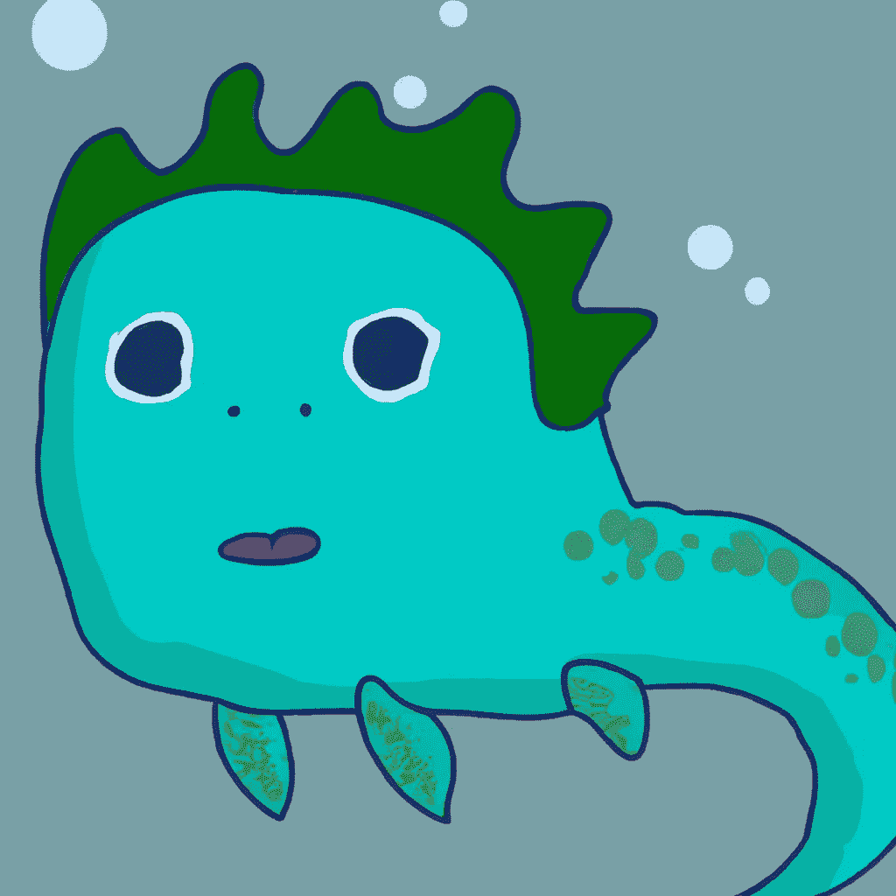
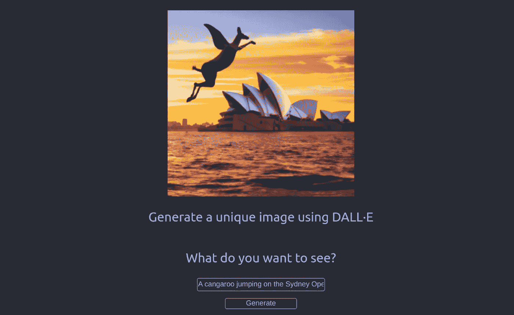
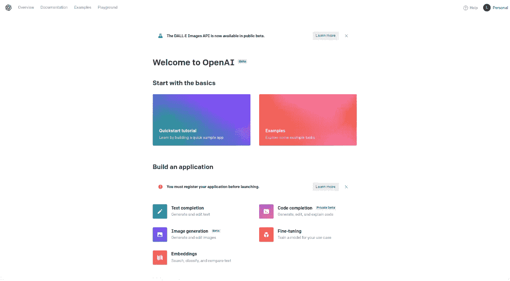
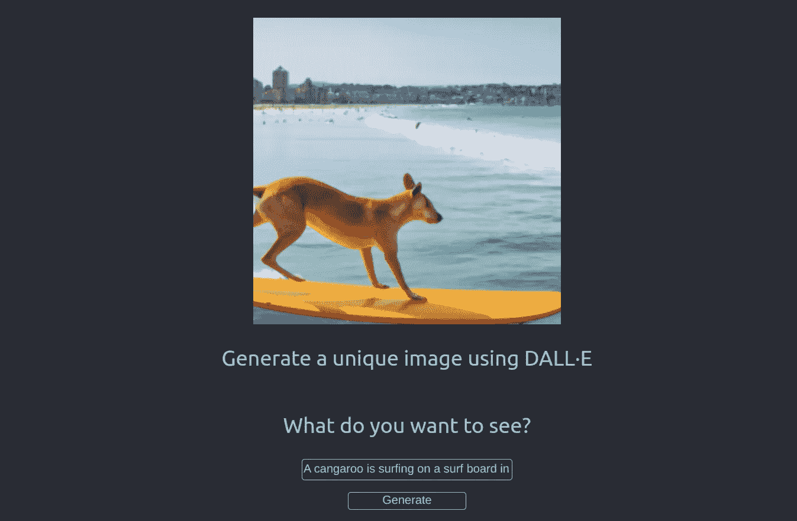
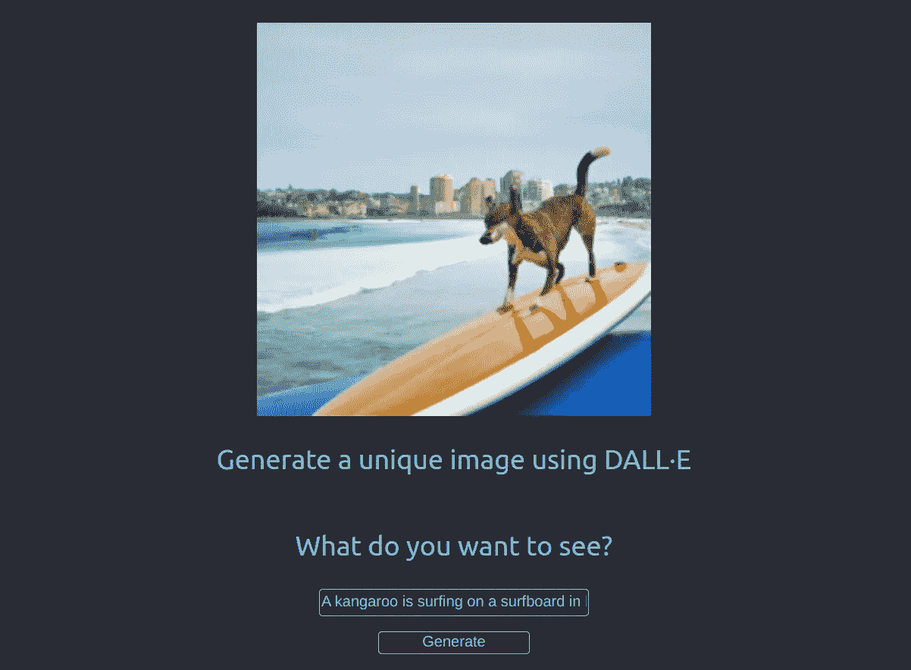

# 使用 DALL-E API 构建一个 React 应用程序

> 原文：<https://betterprogramming.pub/build-a-react-app-using-dall-e-api-bd15d5d67b31>

## 使用 DALL E OpenAI 和 React 创建独特的图像



在全栈 React & Node 应用上使用 DALL E 生成的图像。

这是我创作的第一幅图像，我很喜欢它。

11 月 4 日，我收到了一封来自 OpenAI 的邮件。

> DALL E 现在作为一个 API 提供
> 
> 现在，您可以通过我们新的 DALL E API 将最先进的图像生成功能直接集成到您的应用和产品中。

我忍不住了，就跳进去试了试！

下面是构建一个简单的 React 应用程序的快速指南，该应用程序将描述作为输入，并使用新的 DALLE API 生成一个独特的图像。

该应用程序是一个简单的 React 前端，但我正在开发一个简单的全栈 React 和 Node 应用程序，以便更恰当地使用 OpenAI 和 DALLE。关注，订阅，保存，书签，在手机上设置闹钟！

该应用程序将如下所示:



React 应用程序使用 DALLE API 生成图像

我使用了提示:“*一只袋鼠在美丽的日落时分跳上悉尼歌剧院*”

我不知道袋鼠有翅膀，但我从未见过。此外，我的错别字没有帮助 DALLE，我想。

无论如何，创造你自己的给我看！开始吧！

# 获取 DALLE API 密钥

DALLE 2 是一个生成语言模型，它基于文本输入等生成原始图像。

DALLE 2 产生的照片分辨率比 DALLE 高 4 倍，人类法官在字幕匹配和照片真实感方面有+70%的时间倾向于它。

正如[文档](https://beta.openai.com/docs/models/overview)、*中所报道的，OpenAI API 由一系列具有不同功能和价位的模型支持。您还可以根据您的具体使用情况，通过微调定制我们的基本型号。*

这些模型是:

*   [GPT-3](https://beta.openai.com/docs/models/gpt-3) —一套能够理解并生成自然语言的模型
*   [Codex](https://beta.openai.com/docs/models/codex-series-private-beta) —一组能够理解并生成代码的模型，包括将自然语言翻译成代码。这是目前在私人测试
*   [内容过滤器](https://beta.openai.com/docs/models/content-filter) —一个可以检测文本是否敏感或不安全的微调模型

## 如何为 DALLE 获取 API 密钥

这是在 React 中构建我们的图像生成应用程序的第一步。



[OpenAI 概述页面](https://beta.openai.com/)

1.  进入 [OpenAI 概述页面](https://beta.openai.com/)，
2.  登录并转到个人(右上角)
3.  点击查看 API 密钥
4.  单击创建新的密钥按钮

把它保存在某个地方，因为你不会再看到它了。

正如他们网站上报道的那样:

"*下面列出了您的秘密 API 密钥。请注意，在您生成 API 密匙后，我们不会再显示它们。*

*不要与他人共享您的 API 密钥，也不要在浏览器或其他客户端代码中暴露它。为了保护你账户的安全，OpenAI 可能会自动轮换任何我们发现已经公开泄露的 API 密钥。*

## 不要公开您的 API 密钥

这只是常识！

因此，不使用这个 API 部署前端应用程序可能是明智的。如果你这样做:

*   人们可能会窃取您的 API 密钥，
*   你可能会被收费，因为有人正在使用你的钥匙
*   他们可能会删除它，但你可以创建更多

# 创建 React 应用

我们可以使用以下命令创建一个 React 应用程序:

```
npx create-react-app demodalle
```

其中`demodalle`是应用程序的名称。

然后我们使用`cd ./demodalle`移动到该文件夹。

## 安装 OpenAI 库

现在我们需要安装 OpenAI 库。

正如[报道的](https://beta.openai.com/docs/api-reference/introduction),“*你可以通过任何语言的 HTTP 请求，通过我们官方的 Python 绑定，我们官方的 Node.js 库，或者社区维护的库，与 API 进行交互。*

从应用程序的根文件夹运行以下命令:

```
npm install openai
```

安装完成后，您应该在`package.json`的依赖项中看到 OpenAI 包。

```
"dependencies": {
    ...
    "openai": "^3.1.0",
    "react": "^18.2.0",
    "react-dom": "^18.2.0",
    ...
  },
```

## 初始配置

我们将在`App.js`中工作，并大致遵循[文档](https://beta.openai.com/docs/guides/images/image-generation-beta)来使用 OpenAI 创建图像。

Images API 提供了三种与图像交互的方法，在下面的应用程序中，我们将使用允许根据文本提示从头开始创建图像的方法。

让我们从在`App.js`的顶部添加一些配置信息开始:

```
const { Configuration, OpenAIApi } = require("openai");
const configuration = new Configuration({
  apiKey: "your-api-key-string-goes-here",
});
const openai = new OpenAIApi(configuration);
```

首先我们导入`Configuration`和`OpenAIApi`。

其次，我们初始化一个配置变量，它使用 OpenAI 库提供的新的`Configuration` 来准备配置数据。这里我们需要将秘密 API 密钥的值作为字符串传递给`apiKey`。

第三，我们初始化另一个变量`openai`。这是使用 API 的配置的最后一步。

请注意，如果您将代码上传到任何公共存储库，您的 API 密钥将会暴露。我们知道这是不好的。

## 使用环境变量

隐藏秘密 API 密钥的一种方法是使用一个`.env`文件。

如果您使用 Create React App 创建了 React 应用程序，则环境变量是现成的。

您需要遵循以下步骤:

1.  将一个`.env`文件添加到 React 项目的根文件夹中，例如，与`package.json`、`node_modules`等在同一层。不要误会。
2.  在`.env`文件中，写下以下内容，末尾不带引号或分号。
    `REACT_APP_API_KEY=your-secret-key-with-no-quotation-marks`
    `REACT_APP_`前缀是必须的，不要省略。否则，您将无法从 React 应用程序访问该值。
3.  最后，从应用程序中访问环境变量。你会在`process.env.REACT_APP_API_KEY`找到它。

如果您这样做，请记住按如下方式更新您的配置变量:

```
const configuration = new Configuration({
  apiKey: process.env.REACT_APP_API_KEY,
});
```

## 初始代码

现在配置已经完成，让我们编写代码来获取用户输入。

下面的代码来自你通过用 CRA 创建一个 React 应用程序得到的样板文件(例如，我们在上面使用`npx create-react-app`所做的)。

在第 2 行，我们将状态变量`userPrompt`声明为空字符串。记得在你的`App.js file`顶部导入`useState`钩子:

```
import { useState } from "react";
```

每当用户在第 14 行的 input 元素中键入内容时，状态变量`userPrompt`就会更新。

在第 16 行，`onChange`事件处理程序获取输入的值(例如，用户编写的文本)并通过使用`useState`钩子提供的 setter 函数`setUserPrompt`将其分配给`userPrompt`。

DALLE —使用 openai API 的 React 图像生成应用程序的初始代码

在第 3 行，我们声明了另一个状态钩子。我们将使用状态变量`imageUrl`来存储 DALLE 创建的图像的 URL。

该应用程序将显示反应标志，直到我们没有一个图像。只要`imageUrl`为 falsy，第 7 行到第 11 行的代码就会显示 React 标志。

## 触发器创建

用户应该能够点击第 18 行上的按钮来创建图像。

从技术上讲，我们希望在用户点击按钮时触发一个针对 OpenAI API 的 HTTP POST 请求。

首先，我们向按钮添加一个事件处理程序:

```
<button onClick={() => generateImage()}>Generate</button>
```

当按钮被单击时，它会触发调用 API 的 generateImage 函数。让我们创建函数。

DALLE —使用 openai API 的图像生成应用程序的功能

如图所示，我们创建了一个名为`generateImage`的异步函数。

在第 2 行，我们创建了一个名为`imageParameters`的对象，它有三个键:`prompt`、`n`、`size`。

它们分别是`userPrompt`(例如，来自输入元素的文本)、想要创建的图像数量以及这些图像的大小。

我把图像的数量和大小硬编码了，因为创建图像是很昂贵的。你可能会得到 18 美元开始。否则，您需要为每个创作付费。

第 7 行是魔法开始的地方。我们调用 openai API 的`createMethod`，并传递上面创建的`imageParameters`对象。

注意，我们使用 await 关键字来等待，直到我们在将数据分配给`response`之前获得数据。

在第 8 行，我们从`response`中提取 URL 信息并保存在`urlData`中。这是一个简单的 URL 字符串，指向你独特的人工智能生成的图像。

最后，我们通过使用第 10 行的`setImageUrl`函数来更新`imageUrl`的状态。

# 就是这样！

一旦您的图像准备就绪，您将 URL 保存在`imageUrl`中，这将评估为真值，您的图像将显示在您的应用程序中。

这可能需要 5-10 秒，添加一个加载微调器来通知用户有事情发生是一个好主意。

所以，在这里我留下我最后的创作:“一只袋鼠正在邦迪海滩的冲浪板上冲浪。”正如你所看到的，不是所有的袋鼠都有翅膀！



React 应用程序使用 DALLE API 生成图像

但是，所有没有错别字的袋鼠都和狗很像！这是“一只袋鼠在邦迪海滩的冲浪板上冲浪。”



React 应用程序使用 DALLE API 生成图像

如果你在嘲笑这只袋鼠狗，你正在享受你的应用程序。然而，这些奇怪的事情凸显了人工智能更大的一面。

文章的技术部分到此结束。下面我介绍一些你应该知道的人工智能的方面。一些图片可能会伤害你的感受力，所以请随意停止。

我期待看到你的作品！

# 结论

> 与常规软件相比，人工智能的失败方式非常不同

你不会得到任何大的红色错误，说生成的图像不是袋鼠。你也不会被告知这个图像可能传达了一个意想不到的意思。

最多，你得到一个笑话。

在最坏的情况下，你会得到更难消化的东西。

"一匹马睡在一滩红色液体中的照片."

同样，可能很难理解偏见和刻板印象等微妙的含义。此外，DALLE 在图像中拼写单词也相当糟糕。

这一切都表明我们取得了不可思议的进步，但路途依然漫长！