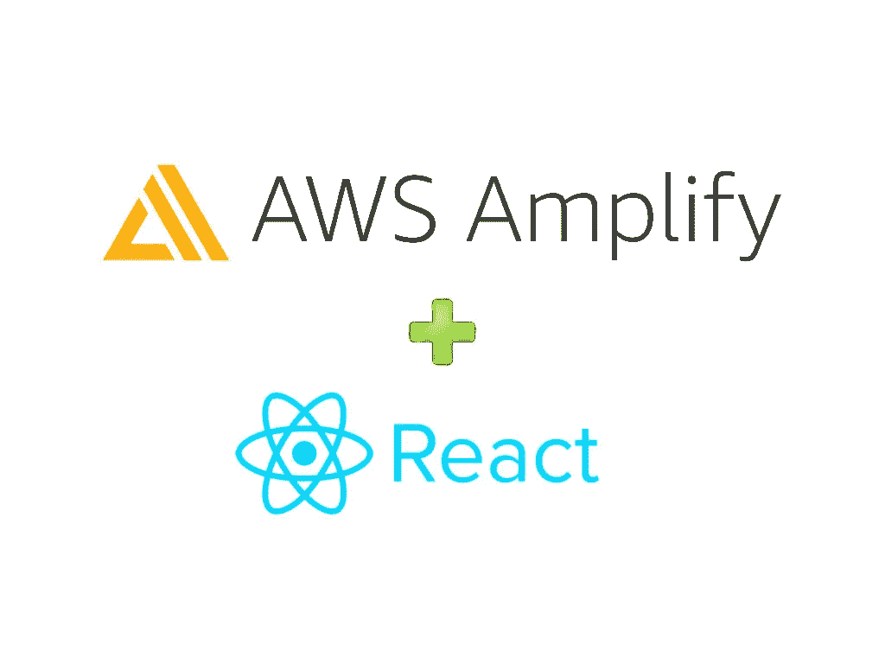
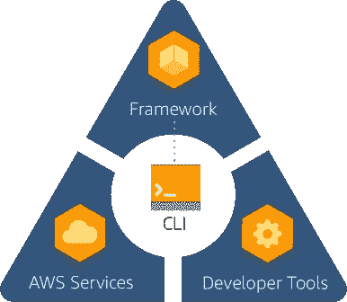
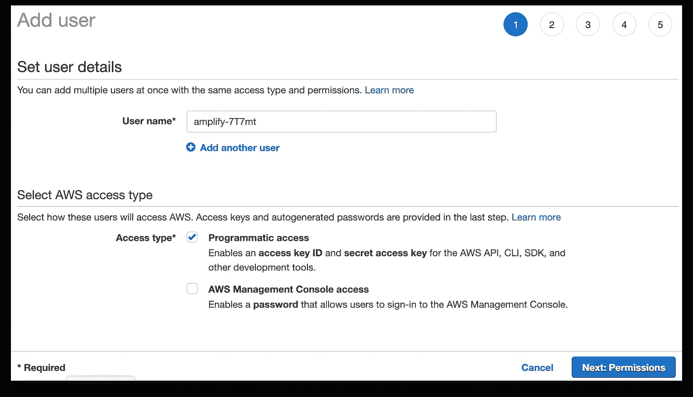
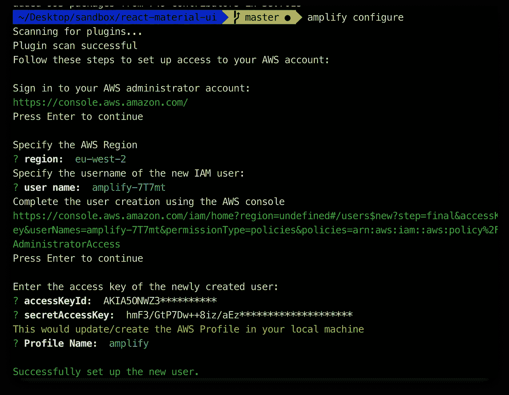
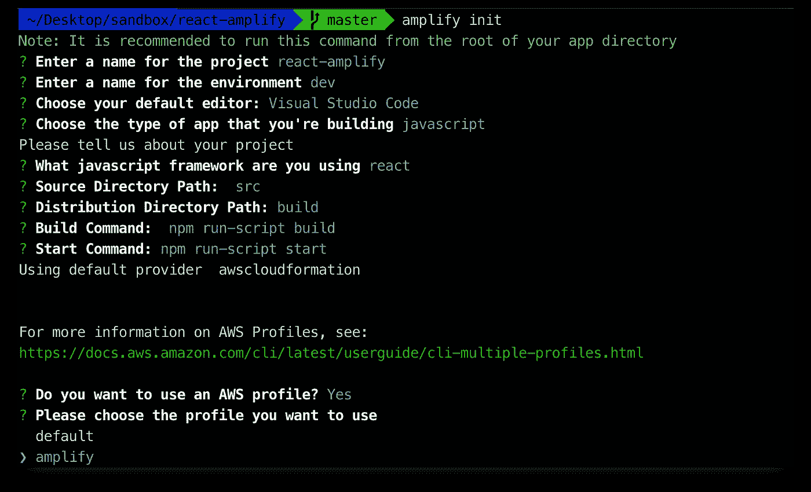
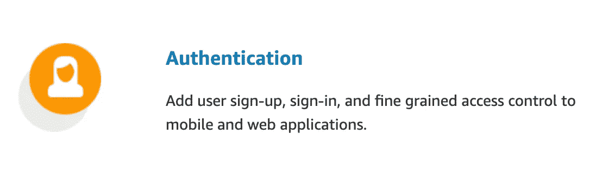
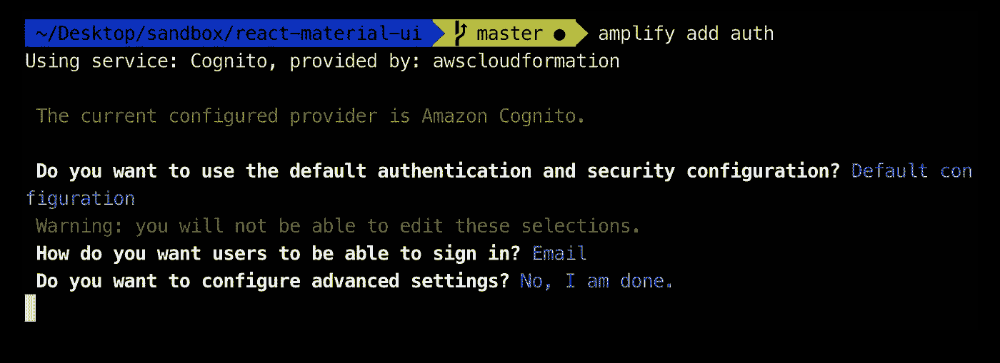
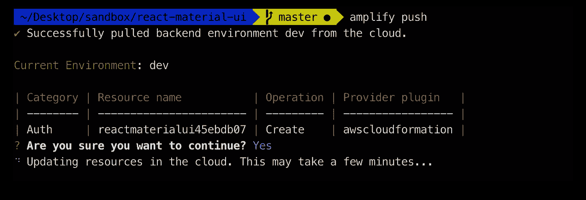
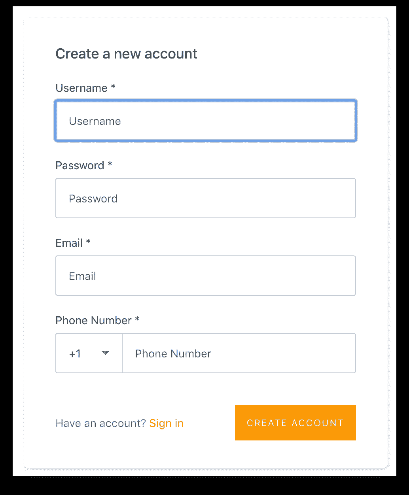
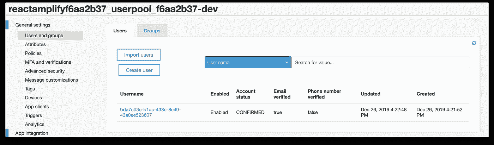

# 通过简单的步骤使用 AWS Amplify 构建一个 React 应用程序(第 1 部分)

> 原文：<https://betterprogramming.pub/build-a-react-app-with-authentication-using-aws-amplify-49db1dfdc290>

## 向 React 应用程序添加一个完整的身份验证流



# 什么是 AWS Amplify？

[AWS Amplify](https://aws.amazon.com/amplify/) 于 2017 年 11 月宣布，作为一个开源库，面向希望在网络或移动平台上使用 JavaScript 构建云连接应用的开发人员。

你听说过谷歌的 [Firebase](https://firebase.google.com/) 吗？这是一个非常相似的概念，但是在 AWS 中运行。

AWS Amplify 允许您以令人难以置信的速度构建应用程序，利用亚马逊提供的服务，而无需管理任何基础设施。

AWS Amplify 是一个开发平台，用于构建安全、可扩展的移动和 web 应用程序。

Amplify 提供了一系列功能，如 auth、analytics、API ( [GraphQL](https://graphql.org/) 和 REST)、交互、预测、发布、存储、推送通知和 XR，使您能够构建由 AWS 服务支持的功能丰富的无服务器应用程序。

Amplify 涵盖了从版本控制和代码测试到生产部署的完整移动应用程序开发工作流程，它可以轻松地随着您的业务从数千用户扩展到数千万用户。

作为 Amplify 框架的一部分，Amplify 库和 CLI 是开源的，并提供了一个可插拔的接口，使您能够定制和创建自己的插件。



来自 AWS Amplify

听起来很棒，所以让我们看看这是如何工作的！

在这篇关于 AWS Amplify 的第一篇文章中，我将通过简单的步骤介绍安装、配置 Amplify 和创建一个带有完整身份验证的 React 应用程序的过程。

# 基本设置

首先，如果你还没有 Node，下载并安装它。

[](https://nodejs.org/en/download/) [## 下载| Node.js

### Node.js 是基于 Chrome 的 V8 JavaScript 引擎构建的 JavaScript 运行时。

nodejs.org](https://nodejs.org/en/download/) 

你还需要一个 AWS 账户来运行 Amplify。如果您还没有 AWS 帐户，请创建一个。

[](https://aws.amazon.com/) [## 亚马逊网络服务(AWS) -云计算服务

### 使用唯一 100%开源的 Elasticsearch 构建、培训和部署工具来搜索和分析您的日志…

aws.amazon.com](https://aws.amazon.com/) 

# 增强

现在，基本设置完成后，让我们开始。

## 安装 Amplify CLI

Amplify 命令行界面(CLI)是一个统一的工具链，用于为您的应用程序创建、集成和管理 AWS 云服务。

```
$ sudo npm install -g @aws-amplify/cli 
```

## 配置放大器

登录您的 AWS 帐户并运行:

```
$ amplify configure
```

按 Enter 键，指定 AWS 区域、用户名，然后再次输入。

```
amplify configure
Scanning for plugins...
Plugin scan successful
Follow these steps to set up access to your AWS account:Sign in to your AWS administrator account:
[https://console.aws.amazon.com/](https://console.aws.amazon.com/)
Press Enter to continueSpecify the AWS Region
? region:  eu-west-2
Specify the username of the new IAM user:
? user name:  amplify-7T7mt
Complete the user creation using the AWS console
[https://console.aws.amazon.com/iam/home?region=undefined#/users$new?step=final&accessKey&userNames=amplify-7T7mt&permissionType=policies&policies=arn:aws:iam::aws:policy%2FAdministratorAccess](https://console.aws.amazon.com/iam/home?region=undefined#/users$new?step=final&accessKey&userNames=amplify-7T7mt&permissionType=policies&policies=arn:aws:iam::aws:policy%2FAdministratorAccess)
Press Enter to continue
```



AWS 扩大用户创造

完成 AWS Amplify 用户创建，下载凭证，并在终端中添加剩余信息:



放大配置

您已经完成了 Amplify 设置，现在让我们构建我们的应用程序。

# 反应应用程序

使用 [create-react-app](https://github.com/facebook/create-react-app) 创建您的 React 应用程序:

```
$ npx create-react-app react-amplify
$ cd react-amplify
```

现在，让我们通过运行下面的命令来初始化我们的应用程序:

```
$ amplify init
```

这个命令将初始化我们的 AWS 配置，并在应用程序的根目录下创建一个配置文件。

根据您的配置进行以下选择:



放大初始化

一些后续步骤:

*   将显示您已经添加的内容，以及它是本地配置还是部署的。
*   `amplify <category> add`:允许您添加用户登录或后端 API 等功能。
*   `amplify push`:将构建您所有的本地后端资源，并在云中提供。
*   `amplify console`:打开 Amplify 控制台，查看您的项目状态。
*   `amplify publish` : 构建您所有的本地后端和前端资源(如果您添加了托管类别)并在云中提供。

## 配置您的 React 应用

让我们在 React 应用程序中安装 AWS Amplify 软件包:

```
$ sudo npm install aws-amplify @aws-amplify/ui-react
```

# 证明

让我们继续向应用程序添加身份验证。



来自 AWS Amplify

Amplify 中的认证使用 [Amazon Cognito](https://docs.aws.amazon.com/cognito/latest/developerguide/cognito-user-identity-pools.html) 。

```
$ amplify add auth
```

根据您的配置进行以下选择:



放大添加授权

该命令将引导我们回答一系列问题。每个问题都是为我们的应用程序配置身份验证。

如果您不确定需要什么配置，请选择第一个问题的`Yes, use the default configuration`。您可以随时返回并通过运行命令`amplify update auth`重新配置这些设置。

现在，我们已经为应用程序配置了身份验证模块。但是，我们仍然需要将这个配置部署到我们的 AWS 帐户。幸运的是，这也是由 Amplify CLI 处理的。

让我们使用下面的命令将配置推送到云中:

```
$ amplify push
```



放大推送

这将为我们的 AWS 帐户创建和部署必要的更改，以支持我们的身份验证模块。名为`aws-exports.js`的配置文件将被复制到您配置的源目录，例如`./src`。

## 在 React 应用中配置 Amplify

现在，让我们将 Amplify auth 服务添加到 React 应用程序中。

打开您最喜欢的 IDE 并编辑`index.js`文件:

索引. js

接下来，将放大验证器添加到您的`App.js`文件中:

导入`withAuthenticator`并包装 React app。

```
import { withAuthenticator, AmplifySignOut } from "@aws-amplify/ui-react";
...
export default withAuthenticator(App);
```

App.js

现在，我们准备测试应用程序。

使用以下方式运行应用程序:

```
npm run start
```

您的浏览器将加载一个用于登录的安全页面。您的应用程序现在受到 Amplify 的保护。


创建新帐户:



AWS 将发送一封带有确认码的电子邮件。输入您的验证码，用户就创建好了。

登录并欢迎使用您的安全 React 应用程序:


登录您的 AWS 帐户，转到 Cognito 服务，您现在可以看到在 AWS Cognito 中创建的新用户:



AWS 认知控制台

# 后续步骤

这只是使用 Amplify with React 的开始。在接下来的文章中，我将扩展应用程序，添加:

*   API:使用 REST 和 GraphQL 轻松安全地发出 HTTP 请求。
*   分析:跟踪用户会话、属性和应用内指标的嵌入式分析。
*   存储:在云中或设备上安全地管理用户内容。

**所有源代码都在我的** [**GitHub**](https://github.com/mlomboglia/react-amplify) **中。**

*   [第 1 部分-认证](https://github.com/mlomboglia/react-amplify/tree/master/part-1-authentication)
*   [第 2 部分— GraphQL API](https://github.com/mlomboglia/react-amplify/tree/master/part-2-graphql)

# 更新

*   使用 AWS Amplify 以简单的步骤构建 React 应用程序([第 2 部分](https://medium.com/better-programming/build-a-react-app-using-aws-amplify-in-simple-steps-part-2-59812ea29192))现已推出。将 AWS AppSync GraphQL API 添加到 React 应用程序中。
*   2020–05–21:更新了代码以放大版本 3

**快乐编码！**