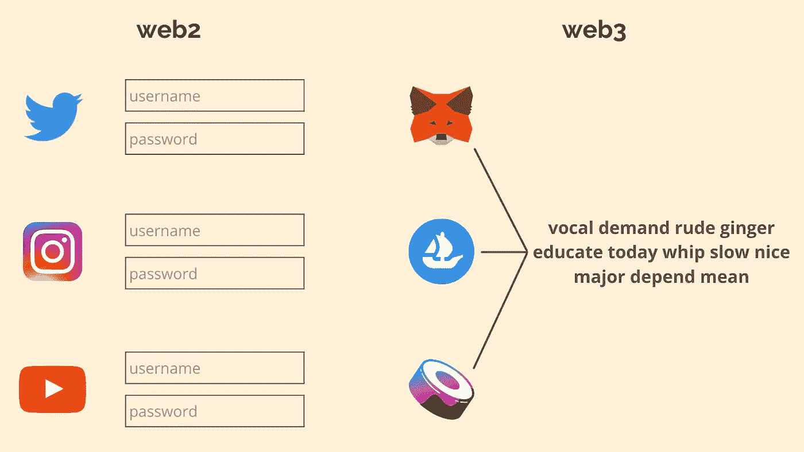
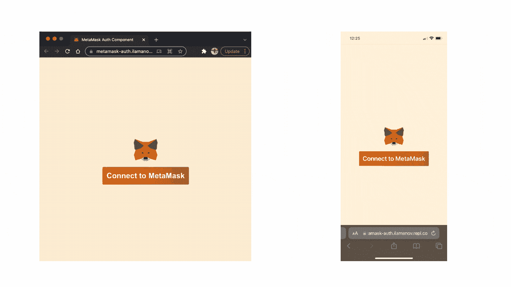
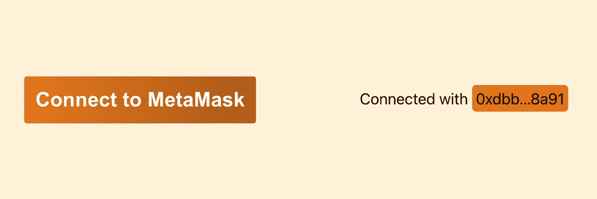
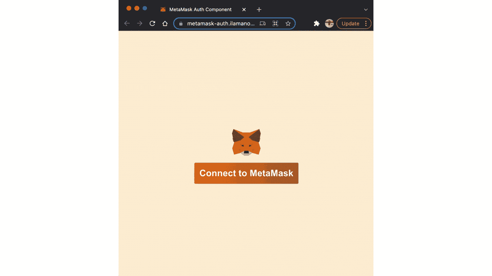
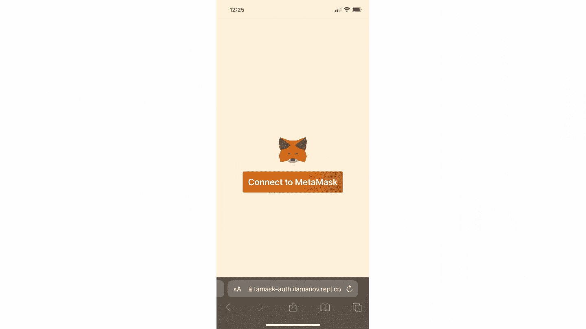

# 为元掩码身份验证构建一个反应组件

> 原文：<https://betterprogramming.pub/build-a-react-component-for-metamask-auth-10b7ecba5c3f>

## 适用于桌面和移动设备



对于所有平台，一个种子短语将替换您的用户名/密码组合

web3 认证…很不错吧？不再需要密码管理，您的凭证可以在所有应用程序中使用。比老是点“忘记密码”好多了。

但是如何连接 MetaMask 呢？由于元掩码是大多数用户的默认钱包，因此您的应用程序支持元掩码身份验证非常重要。

在本文中，我将向您展示如何构建一个简单的 React 组件来处理元掩码验证。最棒的是——它也可以在手机上运行！



React 组件在桌面(左)和移动(右)上工作

你可以在这个 [Github repo](https://github.com/ilamanov/metamask-react-auth) 中找到完整的代码。

# 开始构建组件

我们将从一个非常简单的组件开始:

我来解释一下上面的代码:

*   我们使用一个状态变量`userAddress`来存储用户的连接地址
*   当组件第一次安装到`window`时，我们检查用户是否已经连接了他们的钱包(我们稍后将填充`checkIfWalletIsConnected`功能)
*   每当`userAddress`状态变量改变时，我们使用提供给我们的`onAddressChanged`回调。(这是为了防止父组件可能需要知道连接的用户地址是什么。)
*   如果`userAddress`为空，我们显示“连接到元掩码”按钮，否则，我们显示“连接到…”消息。这是它们的样子



这是这两个的代码:

如果你感兴趣的话，以下是这些组件的样式:

我们已经完成了用户界面。

# 连接逻辑

现在我们已经完成了 UI，让我们继续将 UI 组件连接到 MetaMask 浏览器扩展的逻辑。

我们需要填写 2 个函数:

*   `checkIfWalletIsConnected` —第一次加载页面时选中
*   `connect` —当用户单击“连接到元掩码”按钮时调用

这些函数如下所示:

## 连接功能

让我们来解释一下`connect`功能:

*   当 MetaMask 作为浏览器扩展安装时，它会在每一页上将`ethereum`对象插入到`window`对象中。如果没有`ethereum`对象，这意味着没有安装元掩码，我们显示“获取元掩码！”警惕。
*   但是如果它存在，我们使用 MetaMask API 的`eth_requestAccounts`方法请求连接到用户的钱包。这将从 MetaMask 中触发一个弹出窗口，要求用户授权我们的应用程序访问用户的地址。



*   MetaMask API 将返回用户授权访问的所有帐户的列表。我们使用第一个可用的账户`accounts[0]`并调用`onConnected`回调。

如果你对 MetaMask API 还能做什么感兴趣，请阅读 MetaMask [文档页面](https://docs.metamask.io/guide/getting-started.html#connecting-to-metamask)。

## checkIfWalletIsConnected 函数

*   我们再次检查`ethereum`对象是否存在。
*   如果是，我们将获得用户已经通过元掩码 API 的`eth_accounts`方法授予访问权限的所有帐户。
*   我们采用第一个可用的帐户，并将其用作`userAddress`。

此时，我们的组件应该可以在桌面上工作了。现在让我们添加移动支持。这会有点棘手，因为移动浏览器没有扩展。但是有一种方法可以绕过它。

# 添加移动支持

首先，我们需要一种方法来检测我们的用户是否在移动设备上:

我用了[这个](https://stackoverflow.com/a/23493107/13344574)栈溢出答案

我们现在需要修改我们的`Connect`组件来支持移动:

绕过没有移动浏览器扩展这个事实的方法是… **深层链接**！我们可以使用深度链接在用户的移动设备上打开 MetaMask 应用程序(如果用户没有安装 MetaMask，它将在 AppStore 中打开链接进行安装)。

您可以使用 MetaMask 的[深度链接生成器](https://metamask.github.io/metamask-deeplinks/)工具为各种用例创建深度链接，如“打开 dapp”或“支付请求”。我们将需要“打开一个 dapp”的深层链接。

深度链接的格式非常简单，所以我们甚至不需要使用深度链接生成器工具。深层链接应该看起来像`[https://metamask.app.link/dapp/[YOUR_APP_URL]](https://metamask.app.link/dapp/[YOUR_APP_URL])`，其中`YOUR_DAPP_URL`是你的网站将被托管的 URL。

当用户点击这个链接时，它将打开 MetaMask 应用程序，应用程序将自动导航到`YOUR_DAPP_URL` (MetaMask 有一个内置的浏览器🤯).但是现在用户已经在 MetaMask 的浏览器中打开了您的网站，什么也没有发生。用户需要再次单击“连接到元掩码”按钮来连接元掩码。

让我们这样做，用户不必再次点击按钮。只需将下面的`if(isMobileDevice())`检查添加到`checkIfWalletIsConnected`功能中

这将在 MetaMask 应用程序的初始页面加载期间触发`connect`函数调用。结果将如下所示:



后台发生的事情是，MetaMask 应用程序将把`ethereum`对象注入到`window`中，就像 Chrome 扩展在桌面上做的那样。所以剩下的代码也可以在手机上运行。谢谢，元面具！

在手机上使用深度链接可能会有点烦人。您可能想知道是否有可能避免打开另一个应用程序，而完全在移动浏览器中进行身份验证。确实是！通过[墙连接](https://walletconnect.com/)。它不需要深层链接，只需在手机浏览器中运行即可。如果你想让我做一个关于 WalletConnect 的教程，请在评论中告诉我。

就是这样！你可以在这个 [GitHub repo](https://github.com/ilamanov/metamask-react-auth) 中找到这个组件的完整代码。

一个现场演示可以在这里找到:[https://metamask-auth.ilamanov.repl.co/](https://metamask-auth.ilamanov.repl.co/)
演示的代码在这里:[https://replit.com/@ilamanov/metamask-auth?v=1](https://replit.com/@ilamanov/metamask-auth?v=1)

```
**Want to Connect With the Author?**Follow me on [Twitter](https://twitter.com/nazar_ilamanov).
```