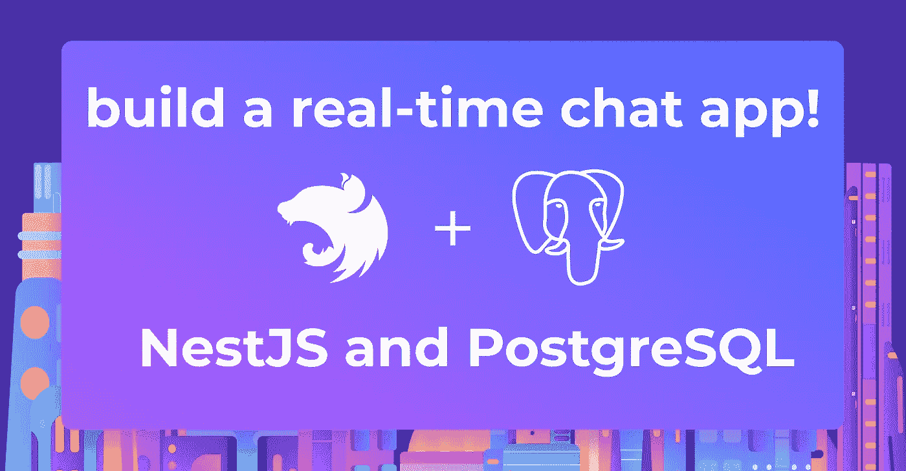
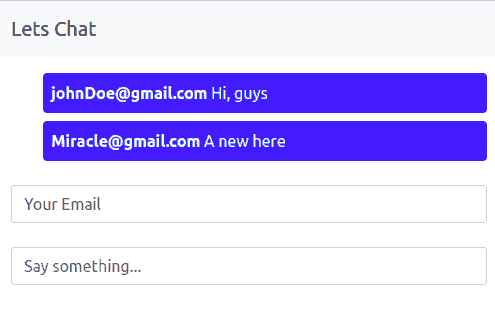
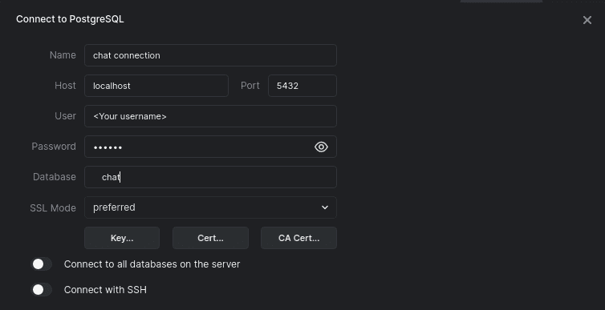
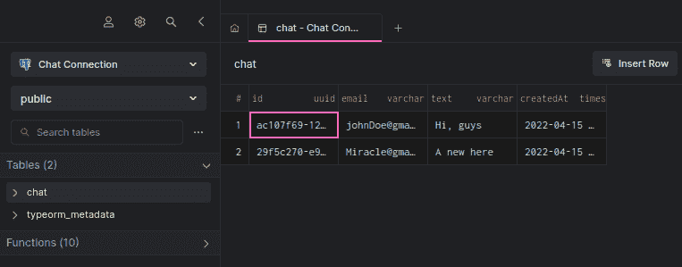
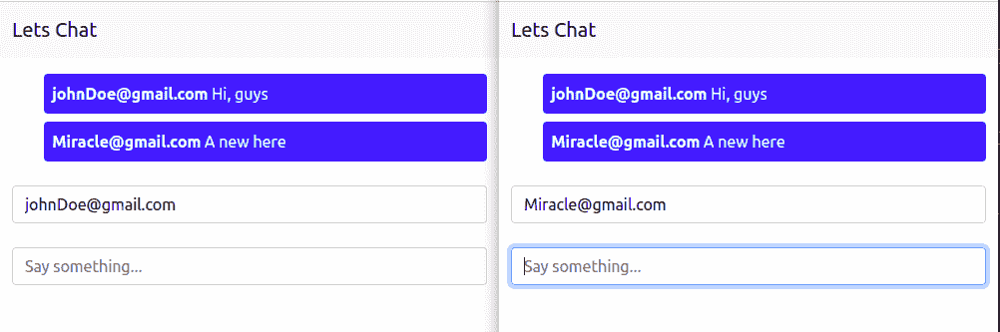

# 用 Nestjs 和 PostgreSQL 构建实时聊天应用程序

> 原文：<https://betterprogramming.pub/build-a-real-time-chat-application-with-nestjs-and-postgresql-a212502eb436>

## 在本教程中，您将学习使用 web sockets 为您的 Nestjs web 应用程序添加实时聊天功能



本教程的代码可以在我的 [Github 库](https://github.com/icode247/Chat-with-Nestjs)上找到。当您按照步骤操作时，可以随意克隆它。我们开始吧！

# 什么是 NestJS？

NestJS 是一个 Node.js 框架，用于创建快速、可测试、可伸缩、松散耦合的使用 TypeScript 的服务器端应用程序。它利用了 Express 或 Fastify 等强大的 HTTP 服务器框架。

Nest 为 Node.js 框架增加了一个抽象层，并向开发人员公开了它们的 API。它支持像 PostgreSQL 和 MySQL 这样的数据库管理系统。NestJS 还提供依赖注入 Websockets 和 APIGetaways。

# 什么是 Websocket？

WebSocket 是一种计算机通信协议，它通过单个 TCP 连接提供全双工通信通道。IETF 在 2011 年将 WebSocket 协议标准化为 RFC 6455。

当前的规范被称为 HTML 生活标准。与 HTTP/HTTPS 不同，Websocket 是有状态协议，这意味着服务器和客户端之间建立的连接将是活动的，除非被服务器或客户端终止；一旦 WebSocket 连接被一端关闭，它就会扩展到另一端。

## 先决条件

本教程是一个实践演示。要继续操作，请确保您已经安装了以下软件:

*   [弧型](https://arctype.com/)
*   [NodeJS](https://nodejs.org/)
*   [PostgreSQL](https://www.postgresql.org/download/)

# 项目设置

在开始编码之前，让我们建立我们的 NestJS 项目和项目结构。我们将从创建项目文件夹开始。然后，打开您的终端并运行以下命令:

```
mkdir chatapp && cd chatapp
```

# 创建项目文件夹

然后使用下面的命令安装 NestJS CLI:

```
npm i -g @nestjs/cli
```

安装完成后，运行下面的命令来搭建一个 NestJS 项目。

```
nest new chat
```

选择您首选的 npm 软件包管理器。对于本教程，我们将使用`npm`并等待安装必要的包。安装完成后，用下面的命令安装`WebSocket`和`Socket.io`:

```
npm i --save @nestjs/websockets @nestjs/platform-socket.io
```

然后，使用下面的命令创建一个网关应用程序:

```
nest g gateway app
```

现在，让我们通过运行以下命令来启动我们的服务器:

```
npm run start:dev
```

# 建立 Postgres 数据库

我们现在可以设置我们的 Postgres 数据库，用我们的服务器设置来存储我们的用户记录。

首先，我们将使用 [TypeORM](https://www.sqlalchemy.org/) (对象关系映射器)来连接我们的数据库和应用程序。首先，我们需要通过以下步骤创建一个数据库。首先，切换到系统的 Postgres 用户帐户。

```
sudo su - postgres
```

然后，使用下面的命令创建一个新的用户帐户。

```
createuser --interactive
```

接下来，创建一个新的数据库。您可以使用以下命令来实现这一点:

```
createdb chat
```

现在，我们将连接到刚刚创建的数据库。首先，打开 app.module.ts 文件，在`imports[]`的数组中添加下面的代码片段:

```
...
import { TypeOrmModule } from '@nestjs/typeorm';
import { Chat } from './chat.entity';
imports: [
   TypeOrmModule.forRoot({
     type: 'postgres',
     host: 'localhost',
     username: '<USERNAME>',
     password: '<PASSWORD>',
     database: 'chat',
     entities: [Chat],
     synchronize: true,
   }),
   TypeOrmModule.forFeature([Chat]),
 ],
...
```

在上面的代码片段中，我们使用`TypeOrmModule` `forRoot`方法将我们的应用程序连接到 PostgresSQL 数据库，并传入我们的数据库凭证。用您为`chat`数据库创建的用户名和密码替换`<USERNAME>`和`<PASSWORD>`。

# 创建我们的聊天实体

现在我们已经将应用程序连接到您的数据库，创建一个聊天实体来保存用户的消息。为此，在 src 文件夹中创建一个`chat.entity.ts`文件，并添加下面的代码片段:

```
import {
 Entity,
 Column,
 PrimaryGeneratedColumn,
 CreateDateColumn,
} from 'typeorm';

@Entity()
export class Chat {
 @PrimaryGeneratedColumn('uuid')
 id: number;

 @Column()
 email: string;

 @Column({ unique: true })
 text: string;

 @CreateDateColumn()
 createdAt: Date;
}
```

在上面的代码片段中，我们使用 TypeOrm 提供的`**Entity**`、`**Column**`、`**CreatedDateColumn**`和`**PrimaryGenerateColumn**` 装饰器为我们的聊天创建了列。

# 设置 web 套接字

让我们在服务器中设置一个 Web 套接字连接来发送实时消息。首先，我们将使用下面的代码片段导入所需的模块。

```
import {
 SubscribeMessage,
 WebSocketGateway,
 OnGatewayInit,
 WebSocketServer,
 OnGatewayConnection,
 OnGatewayDisconnect,
} from '@nestjs/websockets';
import { Socket, Server } from 'socket.io';
import { AppService } from './app.service';
import { Chat } from './chat.entity';
```

在上面的代码片段中，我们导入了`SubscribeMessage()`来监听来自客户端的事件，`WebSocketGateway()`，这将提供对 socket.io 的访问；我们还导入了`OnGatewayInit`、`OnGatewayConnection`和`OnGatewayDisconnect`实例。

这个 WebSocket 实例使您能够了解应用程序的状态。例如，当一个服务器加入或断开聊天时，我们可以让我们的服务器做一些事情。然后我们导入了`Chat`实体和`AppService`，它们公开了保存用户消息所需的方法。

```
@WebSocketGateway({
 cors: {
   origin: '*',
 },
})
```

为了使我们的客户端能够与服务器通信，我们通过初始化`WebSocketGateway`来启用 CORS。

```
export class AppGateway
 implements OnGatewayInit, OnGatewayConnection, OnGatewayDisconnect
{
 constructor(private appService: AppService) {}

 @WebSocketServer() server: Server;

 @SubscribeMessage('sendMessage')
 async handleSendMessage(client: Socket, payload: Chat): Promise<void> {
   await this.appService.createMessage(payload);
   this.server.emit('recMessage', payload);
 }

 afterInit(server: Server) {
   console.log(server);
   //Do stuffs
 }

 handleDisconnect(client: Socket) {
   console.log(`Disconnected: ${client.id}`);
   //Do stuffs
 }

 handleConnection(client: Socket, ...args: any[]) {
   console.log(`Connected ${client.id}`);
   //Do stuffs
 }
}
```

接下来，在我们的`**AppGateWay**` 类中，我们实现了上面导入的 WebSocket 实例。我们创建了一个构造器方法，并绑定我们的 AppService 来访问它的方法。我们从`**WebSocketServer**`decorator 创建了一个服务器实例。

然后，我们使用`@SubscribeMessage()`实例和`handleMessage()`方法创建一个`handleSendMessage`,将数据发送到我们的客户端。

当一个消息从客户端发送到这个函数时，我们将它保存在我们的数据库中，并将消息发送回客户端所有连接的用户。

我们还有许多其他方法可以尝试，比如`afterInit`，它在客户端连接后被触发，`handleDisconnect`，它在用户断开连接时被触发。`handleConnection`方法在用户加入连接时开始。

# 创建控制器/服务

现在让我们创建我们的服务和控制器来保存聊天并呈现我们的静态页面。打开`app.service.ts`文件，用下面的代码片段更新内容:

```
import { Injectable } from '@nestjs/common';
import { InjectRepository } from '@nestjs/typeorm';
import { Repository } from 'typeorm';
import { Chat } from './chat.entity';

@Injectable()
export class AppService {
 constructor(
   @InjectRepository(Chat) private chatRepository: Repository<Chat>,
 ) {}
 async createMessage(chat: Chat): Promise<Chat> {
   return await this.chatRepository.save(chat);
 }

 async getMessages(): Promise<Chat[]> {
   return await this.chatRepository.find();
 }
}
```

然后用下面的代码片段更新`app.controller.ts` 文件:

```
import { Controller, Render, Get, Res } from '@nestjs/common';
import { AppService } from './app.service';
import { Chat } from './chat.entity';

@Controller()
export class AppController {
 constructor(private readonly appService: AppService) {}

 @Get('/chat')
 @Render('index')
 Home() {
   return;
 }

 @Get('/api/chat')
 async Chat(@Res() res) {
   const messages = await this.appService.getMessages();
   res.json(messages);
 }
}
```

在上面的代码片段中，我们创建了两条路由来呈现静态页面和用户消息。

# 为我们的静态页面服务

现在让我们配置应用程序来呈现静态文件和页面。为此，我们将实现服务器端渲染。首先，在您的`main.ts`文件中，使用下面的命令将应用程序配置为静态服务器文件:

```
async function bootstrap() {
 ...
 app.useStaticAssets(join(__dirname, '..', 'static'));
 app.setBaseViewsDir(join(__dirname, '..', 'views'));
 app.setViewEngine('ejs');
 ...
}
```

接下来，在您的`src`目录中创建一个`static`和一个`views`文件夹。在 views 文件夹中，创建一个`index.ejs`文件，并添加以下代码片段:

```
<!DOCTYPE html>
<html lang="en">

<head>
 <!-- Required meta tags -->
 <meta charset="utf-8" />
 <meta name="viewport" content="width=device-width, initial-scale=1" />

 <!-- Bootstrap CSS -->
 <link href="https://cdn.jsdelivr.net/npm/bootstrap@5.0.2/dist/css/bootstrap.min.css" rel="stylesheet"
   integrity="sha384-EVSTQN3/azprG1Anm3QDgpJLIm9Nao0Yz1ztcQTwFspd3yD65VohhpuuCOmLASjC" crossorigin="anonymous" />

 <title>Let Chat</title>
</head>

<body>
 <nav class="navbar navbar-light bg-light">
   <div class="container-fluid">
     <a class="navbar-brand">Lets Chat</a>
   </div>
 </nav>
 <div class="container">
   <div class="mb-3 mt-3">
     <ul style="list-style: none" id="data-container"></ul>
   </div>
   <div class="mb-3 mt-4">
     <input class="form-control" id="email" rows="3" placeholder="Your Email" />
   </div>
   <div class="mb-3 mt-4">
     <input class="form-control" id="exampleFormControlTextarea1" rows="3" placeholder="Say something..." />
   </div>
 </div>
 <script src="https://cdn.socket.io/4.3.2/socket.io.min.js"
   integrity="sha384-KAZ4DtjNhLChOB/hxXuKqhMLYvx3b5MlT55xPEiNmREKRzeEm+RVPlTnAn0ajQNs"
   crossorigin="anonymous"></script>
 <script src="app.js"></script>
 <!-- Option 1: Bootstrap Bundle with Popper -->
 <script src="https://cdn.jsdelivr.net/npm/bootstrap@5.0.2/dist/js/bootstrap.bundle.min.js"
   integrity="sha384-MrcW6ZMFYlzcLA8Nl+NtUVF0sA7MsXsP1UyJoMp4YLEuNSfAP+JcXn/tWtIaxVXM"
   crossorigin="anonymous"></script>
</body>
</html>
```

为了加快模板的速度，我们使用 Bootstrap 添加了一些样式。然后我们添加了两个输入字段和一个无序列表来显示用户的消息。我们还包含了我们的`app.js`文件，我们将在本节稍后创建该文件，以及一个到`socket.io`客户端的链接。

现在创建一个`app.js`文件，并添加下面的代码片段:

```
const socket = io('http://localhost:3002');
const msgBox = document.getElementById('exampleFormControlTextarea1');
const msgCont = document.getElementById('data-container');
const email = document.getElementById('email');

//get old messages from the server
const messages = [];
function getMessages() {
 fetch('http://localhost:3002/api/chat')
   .then((response) => response.json())
   .then((data) => {
     loadDate(data);
     data.forEach((el) => {
       messages.push(el);
     });
   })
   .catch((err) => console.error(err));
}
getMessages();

//When a user press the enter key,send message.
msgBox.addEventListener('keydown', (e) => {
 if (e.keyCode === 13) {
   sendMessage({ email: email.value, text: e.target.value });
   e.target.value = '';
 }
});

//Display messages to the users
function loadDate(data) {
 let messages = '';
 data.map((message) => {
   messages += ` <li class="bg-primary p-2 rounded mb-2 text-light">
      <span class="fw-bolder">${message.email}</span>
      ${message.text}
    </li>`;
 });
 msgCont.innerHTML = messages;
}

//socket.io
//emit sendMessage event to send message
function sendMessage(message) {
 socket.emit('sendMessage', message);
}
//Listen to recMessage event to get the messages sent by users
socket.on('recMessage', (message) => {
 messages.push(message);
 loadDate(messages);
})
```

在上面的代码片段中，我们创建了一个 socket.io 实例，并监听服务器上的事件，以发送和接收来自服务器的消息。我们希望当用户默认加入聊天时，旧的聊天仍然可用。我们的应用程序应该看起来像下面的截图:



# 使用 Arctype 查看用户数据

我们现在已经成功地创建了我们的聊天应用程序。首先，让我们看看 Arctype 的用户数据。首先，启动 Arctype，单击 MySQL 选项卡，并输入以下 MySQL 凭据，如下面的屏幕截图所示:



然后，点击聊天表格显示用户的聊天消息，如下图截图所示:



# 测试应用程序

现在，在两个不同的选项卡或窗口中打开应用程序，并尝试使用不同的电子邮件地址发送邮件，如下图所示:



此外，当您查看控制台时，您会看到用户加入服务器和从服务器断开时的日志，这些日志由`handleDisconnect`和`handleConnection`方法处理。

# 结论

在本教程中，我们探讨了如何使用 Nestjs 和 PostgreSQL 创建实时聊天应用程序。我们首先简要介绍了 Nestjs 和 WebSockets。然后，我们创建了一个演示应用程序来演示实现。希望你得到了你想要的知识。也许您可以从 Nestjs [文档](https://docs.nestjs.com/websockets/gateways)中了解更多关于 WebSocket 实现的知识，并添加扩展应用程序。