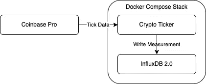
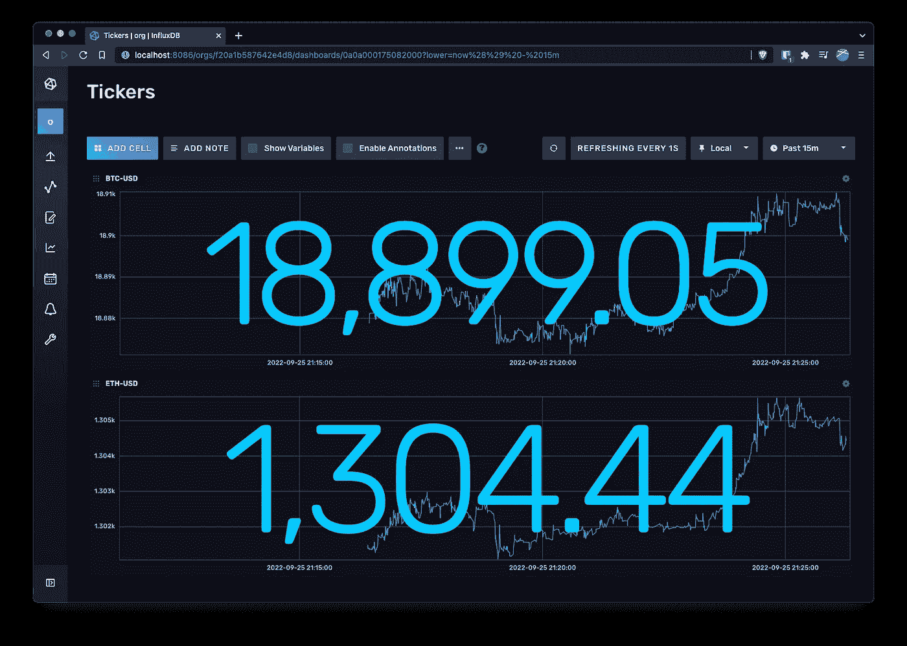

# 使用比特币基地 API 构建一个带有 Go 和 InfluxDB 2 的实时加密跑马灯

> 原文：<https://betterprogramming.pub/build-a-real-time-crypto-ticker-with-go-and-influxdb-2-89e968c65b7e>


杰里米·贝赞格在 [Unsplash](https://unsplash.com/s/photos/crypto?utm_source=unsplash&utm_medium=referral&utm_content=creditCopyText) 上的照片

我们将看到如何在 Go 中使用来自比特币基地 Pro API 和 Influx DB 2 的实时数据实现一个加密跑马灯来存储和绘制数据。这个故事的所有代码都可以在我的 [GitHub 库](https://github.com/bquenin/go-crypto-ticker-influxdb2)中找到。

# 体系结构



*   crypto ticker 使用 WebSocket 连接到比特币基地专业应用编程接口，并订阅给定货币对的加密货币价格信息，例如 BTC-美元。
*   比特币基地服务器开始将价格数据流式传输到 ticker，ticker 将价格数据作为度量值插入 InfluxDB。
*   最后，我们连接到 [http://localhost:8086/](http://localhost:8086/signin) 上的数据库 UI

# 加密股票行情

跑马灯的作用非常简单:

*   连接到 InfluxDB:

*   使用 WebSocket 订阅比特币基地 API。幸运的是，比特币基地的 WebSocket API 允许匿名访问，访问分笔成交点数据不需要创建 API 密钥:

*   每次收到一个 tick 时，将其写入 InfluxDB:

# InfluxDB

InfluxDB 是一个非常适合我们用例的时间序列数据库。因为我们正在构建一个实时的 ticker，所以每当有交易时，我们就从比特币基地接收事件，每秒钟多次。这种时间分辨率非常精确，允许各种实时计算。

然而，大约一个小时后，我们的数据就过时了，所以我们相应地配置我们的存储桶保留。InfluxDB 将简单地为我们丢弃过时的数据。

## 将 InfluxDB 作为容器运行

要配置 InfluxDB 容器，我们必须在[自动设置模式](https://github.com/docker-library/docs/blob/master/influxdb/README.md#automated-setup)下运行它。InfluxDB 映像包含一些自动引导系统的功能。这是通过在运行容器时将`DOCKER_INFLUXDB_INIT_MODE`环境变量设置为值`setup`来实现的:

InfluxDB 2.0 自动安装

*   `DOCKER_INFLUXDB_INIT_USERNAME`:为系统初始超级用户设置的用户名(必选)。
*   `DOCKER_INFLUXDB_INIT_PASSWORD`:为系统初始超级用户设置的密码(必填)。
*   `DOCKER_INFLUXDB_INIT_ORG`:为系统初始组织设置的名称(必选)。
*   `DOCKER_INFLUXDB_INIT_BUCKET`:为系统初始桶设置的名称(必选)。
*   `DOCKER_INFLUXDB_INIT_RETENTION`:系统初始桶的持续时间应保留数据。我们的用例需要一个小时。
*   `DOCKER_INFLUXDB_INIT_ADMIN_TOKEN`:与系统初始超级用户关联的认证令牌。如果未设置，令牌将由系统自动生成。

我使用 [direnv](https://direnv.net/) 为 Docker 合成文件提供[环境变量替换](https://docs.docker.com/compose/environment-variables/#substitute-environment-variables-in-compose-files)。

我们还向主机公开了 InfluxDB 端口，以便我们可以连接到 UI。

最后，我们在`/docker-entrypoint-initdb.d`文件夹中提供了一个[初始化脚本](https://github.com/docker-library/docs/blob/master/influxdb/README.md#initialization-files)来导入一个预定义的仪表板。我们正在安装`./influxdb/init`文件夹:

```
influxdb
└── init
    ├── init.sh
    └── templates
        └── tickers.yaml
```

# 把一切都包起来

现在我们已经配置好了一切，我们可以使用以下命令启动堆栈:

```
make start
```

您现在可以连接到 [http://localhost:8086/](http://localhost:8086/signin) 上的用户界面，并查看仪表板:



使用 InfluxDB UI 的加密报价器

Tada！现在，您已经有了自己的实时加密收报机并开始运行。您现在可以学习更多关于 [Flux 语言](https://docs.influxdata.com/flux/v0.x/get-started/)的知识来构建您自己的指标！