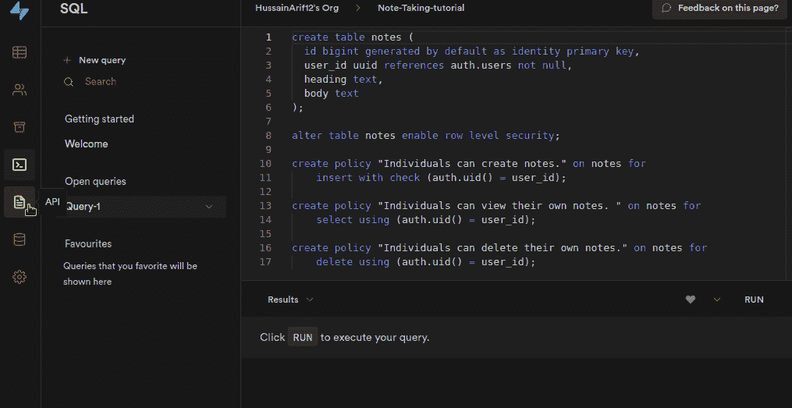
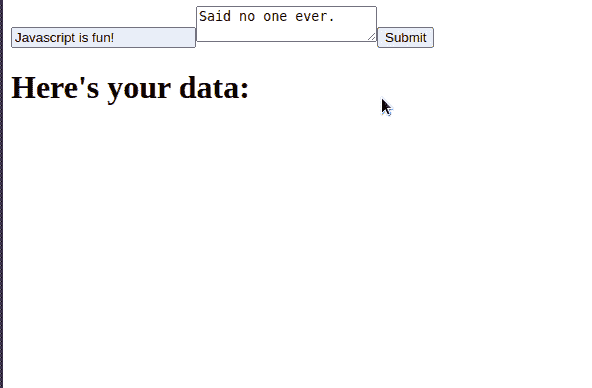
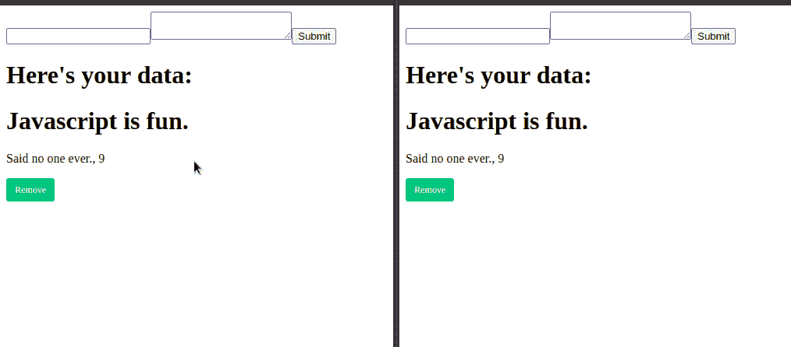

# 用 JavaScript 构建一个实时笔记应用程序

> 原文：<https://betterprogramming.pub/build-a-real-time-note-taking-app-in-javascript-bc6e8d149d51>

## 利用 Supabase 的实时引擎和 Next.js 的强大功能

照片由[思想目录](https://unsplash.com/@thoughtcatalog)上的 [*Unsplash*](http://unsplash.com) *。*

[要使用 Next.js](/build-a-note-taking-app-with-google-authentication-in-next-js-f0835d14034e) 构建笔记应用程序，您需要遵循以下步骤:

*   使用 [NextAuth](https://next-auth.js.org/) 构建您的登录系统。
*   将其绑定到 MongoDB，以便将您的用户保存在数据库中。
*   如果你想要实时同步，那么写一个事件系统。如果发生数据库事件，这将触发一个事件。通过此方法，您的应用程序可以在每次事件发生时显示更改。

虽然这看起来很容易，但是编写事件监听器并不容易。这可能会导致难以维护的低效代码。

这就是 Supabase 的用武之地。它是 Firebase 的开源竞争对手，为你的应用繁荣提供了许多你需要的服务。如果您选择 Supabase 作为您的笔记应用程序，您将执行以下操作:

*   使用在几行代码中提供许多第三方授权提供者的 [Auth](https://supabase.io/docs/guides/auth) 服务。
*   使用[实时引擎](https://supabase.io/docs/guides/database#realtime)，它为你处理实时的麻烦。所有你需要做的就是告诉你的前端显示任何变化，如果一个事件发生。

如果你想了解更多关于这个库的信息，请查看这篇由[超级策略](https://medium.com/u/ca10c2ee6015#policies)。总之，它告诉 Supabase 用户只能对自己的记录执行数据库操作。

完成后，我们现在需要配置我们的表来使用[实时](https://supabase.io/docs/guides/database#realtime) API。为此，请执行以下步骤:

为我们的表启用实时

这意味着用户每删除或添加一条记录，Supabase 都会通知 app。这样，应用程序可以显示这些变化，而无需刷新网页。

我们完事了。现在让我们开始为我们的应用程序编写额外的助手函数。他们将在我们的数据库上执行 CRUD 操作。

## 效用函数

在你的`utils`文件夹中，创建一个名为`note.js`的文件。在这里，编写以下代码:

*   第 4-7 行:从`notes`表中取出用户的记录，然后按照升序`id`排序。
*   第 13-16 行:在表格中插入一个注释。
*   第 24-27 行:找到带有所需`id`的注释，然后删除它。

完成后，现在是时候构建一个允许用户创建笔记的界面了。

## AddForm 组件

转到您的`/components/`目录并创建一个名为`AddForm.js`的文件。在这里，编写以下代码:

*   第 8-9 行:`body`和`heading`文本字段的占位符值将为空。
*   第 11-13 行:当用户提交表单时，调用`add`方法。这将把记录插入数据库。
*   第 16-17 行:创建我们的`heading`和`body`文本字段。

现在我们的`AddForm`组件已经完成，是时候创建一个 GUI 让用户阅读和删除他们的笔记了。

## 注释页和启用订阅

在您的`/pages`文件夹中，创建一个名为`note.js`的文件。在这里，编写以下代码:

*   第 8-10 行:创建钩子来存储用户的注释，这样我们就可以将它们显示到 DOM 中。
*   第 14-18 行:从数据库获取数据，并将结果存储到`data`钩子中。
*   第 21-30 行:[订阅](https://supabase.io/docs/reference/javascript/subscribe)数据库`notes`表中的实时变化。如果用户创建了一个记录(一个`INSERT`事件)，那么将新记录存储到`newData`钩子中。此外，如果用户删除一条记录(一个`DELETE`事件)，那么将`deletedData`的值设置为被删除的笔记。

我们现在需要编写逻辑来处理记录的创建或删除。为此，在`pages/note.js`中添加以下代码:

*   第 2-3 行:当组件第一次挂载时，运行`getData`函数并运行我们的订阅方法。
*   第 6 行:取消实时订阅。这将防止内存泄漏。
*   第 12-14 行:如果`newData`不是`null`，则将`newData`的值加到`data`数组中。
*   第 19 行:如果`deletedData`有一个值，那么从`data`数组中删除相关的项目。

我们剩下要做的就是渲染界面。为此，在`/pages/note.js`中编写以下代码:

*   第 3 行:呈现`AddForm`元素，并将我们的用户数据作为道具传入。
*   第 5-10 行:在我们的`data`数组上调用`map`方法，并显示每一项的`heading`、`body`和`id`字段。
*   第 11 行:单击时，删除有问题的注释。

运行代码并转到`/note`目录。结果应该是这样的:

代码的输出

我们完事了。要显示实时功能，请打开同一个应用程序的两个实例:

实时作品！

请注意，我们不必刷新应用程序来查看我们的更改。这证明了 Supabase 的实时工作零缺陷！

最后，`/pages/note.js`应该是这样的:

# 额外资源

## GitHub 知识库

这个应用程序的代码。

## 进一步阅读

*   [Next.js 和 Supabase 待办事项](https://github.com/supabase/supabase/tree/master/examples/nextjs-todo-list)
*   [使用 Vue + Supabase 的实时订阅](https://dev.to/ftonato/realtime-subscriptions-using-vue-supabase-1e11)
*   [带授权和实时的松弛克隆](https://www.youtube.com/watch?v=LUMxJ4w-MUU)

# 结论

Supabase 是一个易于使用的库，它包含了大量的特性来帮助开发者获得更好的体验。由于 Supabase 运行在开源上，所以对于喜欢在应用程序中使用开放技术的程序员来说，这是一个很好的选择。如果你有一个需要认证和其他特性的项目，那么 Supabase 非常适合你的工具箱。

非常感谢您的阅读！