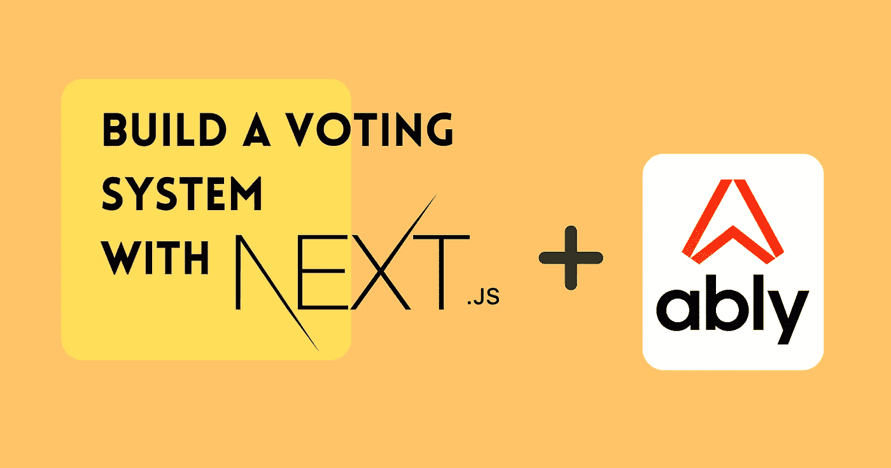

# 用 Next.js 和 Ably 搭建一个实时投票 App

> 原文：<https://betterprogramming.pub/build-a-real-time-voting-app-with-next-js-and-ably-4e14d8c6dba>

## 听取意见的深度指南



封面图片来自作者，由 Canva 制作

在本文中，我将向您展示如何使用 Ably(一个实时交流平台)来创建一个用户可以分享他们的投票的应用程序。我们将使用 MongoDB 来存储所有的投票数据。

下面的演示展示了实际应用:

投票应用程序的演示视频

# 先决条件

*   [对 Next.js 的基本了解](https://nextjs.org/docs/getting-started)
*   [了解 getServerSideProps](https://nextjs.org/docs/basic-features/data-fetching/get-server-side-props)
*   [巧妙地叙述](https://ably.com/)
*   [MongoDB 图集数据库](https://www.mongodb.com/basics/create-database)
*   [您系统上安装的 Redis】](https://redis.io/docs/getting-started/installation/)
*   [顺风 CSS](https://tailwindcss.com/) ( [带 Next.js](https://tailwindcss.com/docs/guides/nextjs) )

# 安装

用 Typescript 创建一个新的 Next.js 项目，然后安装以下包:

```
npm i @ably-labs/react-hooks ably axios chart.js connect-redis date-fns ioredis jotai mongoose react-chartjs-2 react-feather next-session
```

如果这看起来很多，下面是详细情况:

*   `@ably-labs/react-hooks` -提供了一个 React 钩子接口来简化操作
*   `ably`-Ably real time 和 REST APIs 的客户端库
*   `axios` -易于使用的 HTTP 客户端
*   `chart.js` -灵活的图表库，与`react-chartjs-2`一起反应
*   `connect-redis` -围绕 Redis 实例创建会话存储包装
*   MongoDB 的对象建模，包括模式验证、类型转换和查询构建助手
*   Node.js 的高性能 Redis 客户端
*   `jotai`-React 中的简单状态管理
*   `react-feather` -为来自[羽化](https://feathericons.com/)的图标提供 React 包装器

现在确保 Ably API 密钥和 MongoDB 连接 URI 等秘密存储在一个`.env.local`文件中。

```
ABLY_API_KEY=******
MONGODB_URI=******
```

# 创建数据库模型

Mongoose 将您的 MongoDB 文档建模为模型。创建模型时，会根据模式验证数据。模式可以定义文档的属性和数据类型。Mongoose 模式还可以使用其他验证器，比如长度、枚举检查和正则表达式匹配。

对于我们的投票应用程序，我们需要的唯一模型是投票。让我们创建一个名为`models/Poll.ts`的文件并创建模式。

```
import mongoose, { InferSchemaType } from "mongoose";
const { Schema } = mongoose;

const pollSchema = new Schema({
    creator: { type: String, required: true },
    title: { type: String, required: true },

    // `results` contains current votes i.e. {[candidate: string]: string[]}
    // , where the array value represents the voters
    results: { type: Map, of: [String], required: true },
    privacy: { type: Boolean, required: true, default: false },
    end: { type: Date, required: true },
});

// Creates a type interface from the given schema
// The _id field is needed to identify any given document
export type Poll = InferSchemaType<typeof pollSchema> & { _id: string };

// Uses types which can be serialised into Next.js page props
export type PollPrimitive = Omit<Omit<Poll, "end">, "results"> & {
    end: string;
    results: { [key: string]: string[] };
};

// Avoids re-initialisation of the model class
export default mongoose.models.Poll || mongoose.model("Poll", pollSchema);
```

# 连接到数据库

在名为`lib`的项目中创建一个新文件夹。在这个文件夹中，创建一个名为`dbConnect.ts`的文件。该文件将导出一个函数来返回到数据库的缓存连接。

```
import mongoose from "mongoose";

const MONGODB_URI = process.env.MONGODB_URI;

if (!MONGODB_URI) {
    throw new Error(
        "Please define the MONGODB_URI environment variable inside .env.local"
    );
}

/**
 * Global is used here to maintain a cached connection across hot reloads
 * in development. This prevents connections growing exponentially
 * during API Route usage.
 */

declare global {
    var mongoose: {
        conn: typeof import("mongoose") | null;
        promise: Promise<typeof import("mongoose")> | null;
    };
}

let cached = global.mongoose;

if (!cached) {
    cached = global.mongoose = { conn: null, promise: null };
}

async function dbConnect() {
    if (!MONGODB_URI) return;

    if (cached.conn) {
        return cached.conn;
    }

    if (!cached.promise) {
        const opts = {
            bufferCommands: false,
        };

        cached.promise = mongoose.connect(MONGODB_URI, opts);
    }

    try {
        cached.conn = await cached.promise;
    } catch (e) {
        cached.promise = null;
        throw e;
    }

    return cached.conn;
}

export default dbConnect;
```

我们的应用程序将由以下页面路径组成:

*   `/` -列出所有投票
*   `/[id]` -查看特定投票
*   `/[id]/edit` -编辑特定投票
*   `/new` -创建投票

并使用这些 API 路由:

*   `/api/ably-token` -生成令牌请求，以便与 Ably 进行身份验证
*   `/api/polls`(帖子)-创建投票
*   `/api/polls/[id]`(上传，删除)-修改投票
*   `/api/vote` (POST) -将当前用户添加到给定的投票选项中

首先，我们将从上面的 API 路线开始。

# API 路线

# 会议

为了简化我们的应用程序，每个用户将由他们的会话 id 来表示，而不是传统的用户名-密码解决方案。尽管用户不可能永远保持同一个会话 id，但这样做的好处是不涉及任何身份验证过程。所以使用应用会更方便。

在`lib`文件夹中，创建一个名为`getSession.ts`的新文件。还记得 Redis 吗？我们在这里用它来存储会话数据。

```
import nextSession from "next-session";
import { expressSession, promisifyStore } from "next-session/lib/compat";
import RedisStoreFactory from "connect-redis";
import Redis from "ioredis";

const RedisStore = RedisStoreFactory(expressSession);
export const getSession = nextSession({
    autoCommit: false,
    store: promisifyStore(
        new RedisStore({
            client: new Redis(),
        })
    ),
});
```

此外，确保将`autoCommit`设置为`false`。当设置为`true`时，`next-session`仅在会话改变时保存会话，但我们将仅访问 id，不做任何改变。因此，无论何时访问会话，我们都必须调用`await session.commit()`。

# /ably-token

这里我们为 Ably REST API 初始化一个客户端对象。然后(在路由中)，客户机 id 被设置为会话 id，令牌请求被发送到客户机。

```
import type { NextApiRequest, NextApiResponse } from "next";
import { getSession } from "lib/getSession";
import Ably from "ably/promises";

const rest = new Ably.Rest(process.env.ABLY_API_KEY as string);

export default async function handler(
    req: NextApiRequest,
    res: NextApiResponse
) {
    const session = await getSession(req, res);
    await session.commit();

    const tokenParams = {
        clientId: session.id,
    };

    const tokenRequest = await rest.auth.createTokenRequest(tokenParams);
    res.status(200).json(tokenRequest);
}
```

# /民意调查

在这个 API 路径中，我们将使用 POST 请求来构建一个新的`Poll`模型。如前所述，`Poll`的创建者将是会话 id。

```
import type { NextApiRequest, NextApiResponse } from "next";
import Poll from "models/Poll";
import { getSession } from "lib/getSession";
import dbConnect from "lib/dbConnect";

export default async function handler(
    req: NextApiRequest,
    res: NextApiResponse
) {
    if (req.method !== "POST") {
        res.status(405).end(`Method ${req.method} Not Allowed`);
        return;
    }

    await dbConnect();
    const session = await getSession(req, res);
    await session.commit();

    const { title, options, end, privacy } = req.body;

    const poll = new Poll({
        creator: session.id,
        title: title,
        results: options.map((option: string) => [option, []]),
        end: end && new Date(end),
        privacy: privacy,
    });

    await poll.save();
    res.status(200).json(poll);
}
```

# /polls/[id]

更新或删除轮询时，客户端必须向该 API 路由发送请求。我们需要首先检查指定的`Poll`是否存在。然后我们检查用户是否已经创建了`Poll`。

在投票被更新之后，一个消息被发布到 Ably 通道。该消息包含更新的信息。这样可以实时查看属性的变化，如投票的标题。

```
import type { NextApiRequest, NextApiResponse } from "next";
import Ably from "ably/promises";
import Poll from "models/Poll";
import { getSession } from "lib/getSession";
import dbConnect from "lib/dbConnect";

const rest = new Ably.Rest(process.env.ABLY_API_KEY as string);

export default async function handler(
    req: NextApiRequest,
    res: NextApiResponse
) {
    await dbConnect();
    const session = await getSession(req, res);
    await session.commit();

    const { id } = req.query;

    let poll = await Poll.findById(id).exec();

    if (!poll) {
        res.status(404).send("Cannot find poll at requested ID");
        return;
    }

    if (poll.creator !== session.id) {
        res.status(403).end("Unauthorized access to poll");
        return;
    }

    switch (req.method) {
        case "PUT":
            const { title, options, end, privacy } = req.body;

            // Any new options will have empty arrays for their voters,
            // but existing options requested will be overwritten
            // by their previous value
            let results = Object.fromEntries(
                options.map((option: string) => [option, []])
            );
            results = { ...results, ...Object.fromEntries(poll.results) };

            poll.title = title;
            poll.results = results;
            poll.end = new Date(end);
            poll.privacy = privacy;

            // Save the updated document and return it
            poll = await poll.save();

            const channel = rest.channels.get(`polls:${id}`);
            await channel.publish("update-info", poll);
            res.status(200).end();
            break;
        case "DELETE":
            await poll.delete();
            res.status(200).end();
            break;
        default:
            res.status(405).end(`Method ${req.method} Not Allowed`);
    }
}
```

# /投票

当用户选择一个选项时，这个 API 路由首先检查该选项是否有效。然后，如果用户没有投票，它将会话 id 添加到选项的投票者数组中。

```
import type { NextApiRequest, NextApiResponse } from "next";
import Ably from "ably/promises";
import Poll from "models/Poll";
import { getSession } from "lib/getSession";
import dbConnect from "lib/dbConnect";

const rest = new Ably.Rest(process.env.ABLY_API_KEY as string);

export default async function handler(
    req: NextApiRequest,
    res: NextApiResponse
) {
    if (req.method !== "POST") {
        res.status(405).end(`Method ${req.method} Not Allowed`);
        return;
    }

    await dbConnect();
    const session = await getSession(req, res);
    await session.commit();

    const { id, option } = req.body;

    const poll = await Poll.findById(id).exec();

    if (!poll) {
        res.status(404).send("Cannot find poll at requested ID");
        return;
    }

    const results = Object.fromEntries(poll.results);

    if (!Object.keys(results).includes(option)) {
        res.status(400).json(`Invalid option "${option}"`);
        return;
    }

    let voters: string[];

    for (let candidate of Object.keys(results)) {
        voters = results[candidate];
        if (voters.includes(session.id)) {
            // Already voted, stop from voting again
            res.status(403).json(`Already voted for "${candidate}"`);
            return;
        }
    }

    results[option].push(session.id);

    poll.results = results;
    await poll.save();

    // Publish update to the channel
    const channel = rest.channels.get(`polls:${id}`);
    channel.publish("update-votes", results);

    res.status(200).end();
}
```

注意，每次我们需要会话时，我们都必须调用`session.commit()`。如何消除这种冗余？

# 页

# _app

在做任何事情之前，我们必须确保我们已经为客户端进行了适当的配置。我们还需要注册显示图表所需的元素。

```
import "../styles/globals.css";
import type { AppProps } from "next/app";
import { configureAbly } from "@ably-labs/react-hooks";
import {
    Chart as ChartJS,
    CategoryScale,
    LinearScale,
    BarElement,
} from "chart.js";

ChartJS.register(CategoryScale, LinearScale, BarElement);

// Change this URL if necessary
configureAbly({ authUrl: "http://localhost:3000/api/ably-token" });

export default function App({ Component, pageProps }: AppProps) {
    return <Component {...pageProps} />;
}
```

# 索引(/)

我们需要获取列表页面上所有投票的数据。所请求的投票被过滤为公共投票或来自投票创建者的投票。在返回页面属性之前，数据必须序列化为[原始数据类型](https://www.tutorialspoint.com/What-are-primitive-data-types-in-JavaScript)。

```
import dbConnect from "lib/dbConnect";
import { getSession } from "lib/getSession";
import Poll, { PollPrimitive } from "models/Poll";
import { GetServerSideProps, NextPage } from "next";

const Home: NextPage<{ polls: PollPrimitive[] }> = ({ polls }) => {
    // ...
    return <div />;
};

export const getServerSideProps: GetServerSideProps = async ({
    req,
    res,
    query,
}) => {
    // If `personal` is "true", filter by only the current user's polls
    const { personal } = query;
    const session = await getSession(req, res);
    await session.commit();

    await dbConnect();

    const filter =
        personal === "true" ? { creator: session.id } : { privacy: false };

    // Serialize ObjectId and Date to string
    const result = await Poll.find(filter);
    const polls = result.map((doc) => {
        const poll = doc.toJSON();
        poll._id = poll._id.toString();
        poll.end = poll.end.toString();
        return poll;
    });

    return {
        props: { polls },
    };
};

export default Home;
```

在页面组件中，我们显示所有可用的投票，如果没有投票，则显示一条消息。另外，确保为这个 Next.js 项目配置了 TailwindCSS。

```
import AppBar from "components/AppBar";
import PollDisplay from "components/PollDisplay";
import dbConnect from "lib/dbConnect";
import { getSession } from "lib/getSession";
import Poll, { PollPrimitive } from "models/Poll";
import { GetServerSideProps, NextPage } from "next";
import Head from "next/head";
import { Terminal } from "react-feather";

const Home: NextPage<{ polls: PollPrimitive[] }> = ({ polls }) => {
    return (
        <>
            <Head>
                <title>VotR</title>
                <meta
                    name="description"
                    content="Generated by create next app"
                />
                <link rel="icon" href="/favicon.ico" />
            </Head>
            <AppBar />
            <main className="p-3">
                {polls.length === 0 && (
                    <div className="h-80 w-full flex flex-col justify-center items-center space-y-5 text-2xl font-semibold">
                        <h3>No polls created.</h3>
                        <Terminal className="w-9 h-9" />
                        <h3>Create one now!</h3>
                    </div>
                )}
                <div className="grid gap-2 grid-cols-1 sm:grid-cols-2 md:grid-cols-3 lg:grid-cols-4">
                    {polls.map((poll) => (
                        <PollDisplay key={poll._id} data={poll} />
                    ))}
                </div>
            </main>
        </>
    );
};

// ...
```

现在用它的第一个文件`AppBar.tsx`创建一个名为`components`的新文件夹。该组件创建一个更改投票过滤器的按钮和一个创建投票的按钮。

将以下代码添加到文件中:

```
import { useRouter } from "next/router";
import React from "react";
import { Plus, Filter } from "react-feather";

export default function AppBar() {
    const router = useRouter();

    const viewingPersonal = router.query.personal === "true";

    const openYourPolls = () => {
        const newUrl = `/?personal=${(!viewingPersonal).toString()}`;
        router.replace(newUrl, newUrl);
    };

    const openCreate = () => {
        router.push("/new");
    };

    return (
        <header className="py-6 px-5 h-20 w-full border-b-2 border-b-gray-300 flex flex-row justify-between">
            <h1 className="text-3xl font-bold">VotR</h1>
            <div className="flex flex-row justify-center space-x-3">
                <button
                    onClick={openYourPolls}
                    type="button"
                    className="bg-blue-500 rounded-xl border-white border-2 h-10 px-2 text-white"
                >
                    <Filter className="inline mr-2" />
                    {viewingPersonal ? "All Polls" : "Your Polls"}
                </button>
                <button
                    onClick={openCreate}
                    type="button"
                    className="bg-blue-500 rounded-xl border-white border-2 h-10 px-2 text-white"
                >
                    <Plus className="inline mr-2" />
                    Create
                </button>
            </div>
        </header>
    );
}
```

现在，在同一个文件夹中创建一个名为`PollDisplay.tsx`的新文件，并插入以下代码。该组件以轮询数据为道具，显示一些基本信息:

*   标题
*   总共有多少用户投票了
*   有多少种选择

```
import { PollPrimitive } from "models/Poll";
import { useRouter } from "next/router";
import React from "react";
import { User, MapPin } from "react-feather";

export default function PollDisplay({ data }: { data: PollPrimitive }) {
    const router = useRouter();

    const voters = Object.values(data.results).reduce(
        (acc, curr) => acc + curr.length,
        0
    );

    const options = Object.keys(data.results).length;

    const openPoll = () => {
        router.push(`/${data._id}`);
    };

    return (
        <div
            onClick={openPoll}
            className="mx-auto sm:m-0 rounded-xl border-gray-300 border-4 bg-slate-200 flex flex-col p-4 w-60 h-40 items-center justify-around hover:cursor-pointer"
        >
            <h3 className="text-xl font-semibold text-center">{data.title}</h3>
            <span
                className="flex flex-row"
                title={`${options} options available`}
            >
                <MapPin className="mr-1" /> {options}
            </span>
            <span className="flex flex-row" title={`${voters} people voted`}>
                <User className="mr-1" /> {voters}
            </span>
        </div>
    );
}
```

# /[id]

在这个动态路由中，我们获取轮询数据，并将其作为 props 连同会话 id 一起返回。在`pages`文件夹内的`[id]`文件夹内的`index.tsx`文件中创建路由文件。

```
import React from "react";
import type { GetServerSideProps, NextPage } from "next";
import { PollPrimitive } from "../../models/Poll";
import dbConnect from "lib/dbConnect";
import { getSession } from "lib/getSession";
import getPoll from "lib/getPoll";

const PollPage: NextPage<{ poll: PollPrimitive; sessionId: string }> = (
    props
) => {
    // ...
    return <div />;
};

export const getServerSideProps: GetServerSideProps = async ({
    params,
    req,
    res,
}) => {
    const session = await getSession(req, res);
    await session.commit();

    await dbConnect();
    const id = params?.id as string;
    const poll = await getPoll(id);

    if (!poll) {
        return {
            notFound: true,
        };
    }

    return {
        props: {
            poll,
            sessionId: session.id,
        },
    };
};

export default PollPage;
```

您需要创建包含函数的`lib/getPoll.ts`文件，以便从数据库中获取投票。

```
import Poll, { PollPrimitive } from "models/Poll";

export default async function getPoll(
    id: string
): Promise<PollPrimitive | null> {
    const poll = await Poll.findById(id).lean();

    if (!poll) {
        return null;
    }

    poll._id = poll._id.toString();
    poll.end = poll.end.toString();

    return poll;
}
```

转到页面组件，下面是文件导入的完整列表:

```
import React, { useEffect, useMemo } from "react";
import type { GetServerSideProps, NextPage } from "next";
import { PollPrimitive } from "../../models/Poll";
import dbConnect from "lib/dbConnect";
import Head from "next/head";
import { useChannel } from "@ably-labs/react-hooks";
import { useAtom } from "jotai";
import { pollAtom, sessionIdAtom } from "lib/store";
import { getSession } from "lib/getSession";
import VotesDisplay from "components/VotesDisplay";
import VotesControl from "components/VotesControl";
import { Clipboard, Edit2, Home, Trash } from "react-feather";
import { useRouter } from "next/router";
import { differenceInMinutes } from "date-fns";
import EndResult from "components/EndResult";
import getPoll from "lib/getPoll";
import axios from "axios";
```

注意我们从`lib/store`导入的两个原子。在我们的页面上，我们将创建一个`Provider`组件来初始化这些原子的值。这意味着我们可以跨组件共享数据。

使用我们的`PollPrimitve`类型和`jotai`从`lib/store.ts`导出两个原子:

```
import { atom } from "jotai";
import { PollPrimitive } from "models/Poll";

export const pollAtom = atom<PollPrimitive>({
    _id: "",
    creator: "",
    title: "",
    results: {},
    privacy: false,
    end: "",
});
export const sessionIdAtom = atom("");
```

现在，将以下代码添加到`page`组件中:

```
// ...

const PollPage: NextPage<{ poll: PollPrimitive; sessionId: string }> = (
    props
) => {
    const router = useRouter();
    const [sessionId, setSessionId] = useAtom(sessionIdAtom);
    const [poll, setPoll] = useAtom(pollAtom);

    const hasVoted = useMemo(() => {
        for (let voters of Object.values(poll.results)) {
            if (voters.includes(sessionId)) {
                return true;
            }
        }
        return false;
    }, [poll, sessionId]);

    useEffect(() => {
        setPoll(props.poll);
        setSessionId(props.sessionId);
        // eslint-disable-next-line react-hooks/exhaustive-deps
    }, [props]);

    // ...
});

// ...
```

这段代码主要做三件事:

1.  它消耗了我们的两个原子
2.  计算属性以检查用户是否已经在投票中投票
3.  用 props 中的数据更新原子值

现在原子被初始化了，我们可以监听来自 Ably 的任何更新来再次更新原子。

```
// ...

useChannel(`polls:${poll._id}`, "update-votes", (message) => {
    setPoll((oldValue: PollPrimitive) => ({
        ...oldValue,
        results: message.data,
    }));
});

useChannel(`polls:${poll._id}`, "update-info", (message) => {
    setPoll(message.data);
});

// ...
```

渲染期间实现的条件渲染来自以下三个变量:

```
const isCreator = poll.creator === sessionId;
const hasEnded = differenceInMinutes(new Date(), new Date(poll.end)) > 0;
const showDisplay = hasEnded || isCreator || hasVoted;
```

*   如果`isCreator`是`true`，我们将显示编辑投票和删除投票的按钮，如前所述
*   如果`hasEnded`是`true`，我们将显示投票的获胜选项
*   如果其中一个是`true`或`hasVoted`是`true`，我们将显示结果的条形图，而不是投票选项

现在，从组件返回以下代码:

```
return (
    <>
        <Head>
            <title>{poll.title}</title>
        </Head>
        <div className="w-full flex flex-row justify-between absolute top-0 left-0 space-x-3 p-4">
            <div className="flex flex-row space-x-3">
                <button
                    type="button"
                    title="Go home"
                    onClick={() => router.push("/")}
                    className="p-3 rounded-full bg-blue-300 hover:ring"
                >
                    <Home className="text-white" />
                </button>
                {isCreator && (
                    <button
                        type="button"
                        title="Open edit page"
                        onClick={() => router.push(`/${poll._id}/edit`)}
                        className="p-3 rounded-full bg-blue-300 hover:ring"
                    >
                        <Edit2 className="text-white" />
                    </button>
                )}
            </div>
            <div className="flex flex-row space-x-3">
                <button
                    type="button"
                    title="Copy the link to this poll"
                    onClick={() =>
                        navigator.clipboard.writeText(window.location.href)
                    }
                    className="p-3 rounded-full bg-blue-300 hover:ring active:scale-90"
                >
                    <Clipboard className="text-white" />
                </button>
                {isCreator && (
                    <button
                        type="button"
                        title="Delete this poll"
                        onClick={onDelete}
                        className="p-3 rounded-full bg-red-300 hover:ring ring-fuchsia-400"
                    >
                        <Trash className="text-white" />
                    </button>
                )}
            </div>
        </div>
        <main className="p-5 h-screen w-screen flex flex-col">
            <h1 className="font-bold text-4xl text-center my-5 underline">
                {poll.title}
            </h1>
            <div className="px-5 flex-1 flex flex-col justify-center items-center">
                {showDisplay ? <VotesDisplay /> : <VotesControl />}
                {hasEnded && <EndResult />}
            </div>
        </main>
    </>
);
```

# /[id]/编辑

要更改现有的投票数据，该路由必须首先获取数据以填写表单。在之前创建的`pages/[id]`文件夹中创建该路线。

```
import React from "react";
import type { GetServerSideProps, NextPage } from "next";
import Head from "next/head";
import axios from "axios";
import { useRouter } from "next/router";
import { PollPrimitive } from "models/Poll";
import PollEditForm from "components/PollEditForm";
import dbConnect from "lib/dbConnect";
import getPoll from "lib/getPoll";
import { format } from "date-fns";
import { getSession } from "lib/getSession";

const EditPage: NextPage<{ poll: PollPrimitive }> = ({ poll }) => {
    // ...
    return <div />;
};

export const getServerSideProps: GetServerSideProps = async ({
    params,
    req,
    res,
}) => {
    const session = await getSession(req, res);
    await session.commit();

    await dbConnect();
    const id = params?.id as string;
    const poll = await getPoll(id);

    if (!poll) {
        return {
            notFound: true,
        };
    }

    if (poll.creator !== session.id) {
        // Only allow the poll creator at the route
        return {
            redirect: {
                destination: `/${id}`,
                permanent: false,
            },
        };
    }

    return {
        props: {
            poll,
        },
    };
};

export default EditPage;
```

现在，在页面组件中，我们格式化投票数据并呈现一个表单来编辑投票。将以下代码添加到文件中:

```
const EditPage: NextPage<{ poll: PollPrimitive }> = ({ poll }) => {
    const router = useRouter();
    const id = router.query.id;

    const onSubmit = async (data: any) => {
        await axios.put(`/api/polls/${id}`, data);
        router.push(`/${id}`);
    };

    const end = new Date(poll.end);
    const time = format(end, "HH:mm");
    const date = format(end, "yyyy-MM-dd");
    const options = Object.keys(poll.results);

    const title = `Votr - Editing "${poll.title}"`;

    return (
        <div className="w-screen h-screen bg-slate-500 overflow-x-hidden">
            <Head>
                <title>{title}</title>
            </Head>
            <main
                className="
            p-5 flex flex-col
            justify-center items-center"
            >
                <h1
                    className="
                    font-bold text-4xl
                    text-center mb-5 text-gray-200"
                >
                    Edit Poll
                </h1>
                <PollEditForm
                    initialData={{
                        title: poll.title,
                        options,
                        privacy: poll.privacy,
                        time,
                        date,
                    }}
                    onSubmit={onSubmit}
                />
            </main>
        </div>
    );
};
```

# /新

除了没有初始数据提取之外，这条路线的工作方式与前一条路线类似。另外，请记住，我们将数据提交到不同的 API 路径。

```
import React from "react";
import type { NextPage } from "next";
import Head from "next/head";
import axios from "axios";
import { useRouter } from "next/router";
import PollEditForm from "components/PollEditForm";

const NewPage: NextPage = () => {
    const router = useRouter();

    const onSubmit = async (data: any) => {
        const response = await axios.post("/api/polls", data);
        const poll = response.data;
        router.push(`/${poll._id}`);
    };

    return (
        <div className="w-screen h-screen bg-slate-500 overflow-x-hidden">
            <Head>
                <title>Votr - New Poll</title>
            </Head>
            <main
                className="
            p-5 flex flex-col
            justify-center items-center"
            >
                <h1
                    className="
                    font-bold text-4xl
                    text-center mb-5 text-gray-200"
                >
                    New Poll
                </h1>
                <PollEditForm onSubmit={onSubmit} />
            </main>
        </div>
    );
};

export default NewPage;
```

# 投票编辑/创建表单

我们使用相同的组件来呈现用于创建和编辑投票的表单。不同之处在于，在编辑时，我们将使用现有数据初始化字段。

在`components`文件夹中创建一个名为`PollEditForm.tsx`的新文件。

该文件包括主表单组件和每个字段的单独组件。我们将从定义主要导出开始。

```
import { differenceInMinutes, format } from "date-fns";
import React, { useEffect, useRef, useState } from "react";
import { PlusSquare, XCircle } from "react-feather";

type PollData = {
    title: string;
    options: string[];
    end: Date;
    privacy: boolean;
};

interface PollEditFormProps {
    onSubmit: (data: PollData) => void;
    initialData?: Omit<PollData, "end"> & { time: string; date: string };
}

export default function PollEditForm(props: PollEditFormProps) {
    // ...
}
```

`PollData`表示提交表单时发送给 API 路由的值。

现在，在组件内部，添加以下代码:

```
// ...

const [title, setTitle] = useState(props.initialData?.title ?? "");

// At least 2 options are needed to have a poll
const [options, setOptions] = useState(
    props.initialData?.options ?? ["", ""]
);
const [time, setTime] = useState(props.initialData?.time ?? "");
const [date, setDate] = useState(props.initialData?.date ?? "");
const [privacy, setPrivacy] = useState(props.initialData?.privacy ?? false);

const onSubmit = (event: React.FormEvent) => {
    event.preventDefault();
    const [hours, minutes] = time.split(":");
    const end = new Date(
        new Date(date).setHours(parseInt(hours), parseInt(minutes))
    );
    return props.onSubmit({ title, options, end, privacy });
};

// ...
```

首先，状态变量由 props 中的任何初始数据集创建和覆盖。接下来在`onSubmit`中，`date`和`time`变量被转换成一个`Date`对象，然后`onSubmit` prop 函数被调用。

添加以下代码以返回字段组件和提交按钮。代码如下:

```
return (
    <form
        onSubmit={onSubmit}
        className="
        bg-gray-200/30
        rounded-lg
        border-gray-50
        border-2 px-6 py-3
        text-gray-200 w-96
        min-h-[500px] shadow-lg
        flex flex-col
        items-center space-y-4"
    >
        <TitleInput title={title} setTitle={setTitle} />
        <DateTimeInput
            date={date}
            setDate={setDate}
            time={time}
            setTime={setTime}
        />
        <OptionsInput options={options} setOptions={setOptions} />
        <PrivacyInput privacy={privacy} setPrivacy={setPrivacy} />
        <button
            type="submit"
            className="self-end rounded-2xl p-3 font-bold font-mono1 bg-gray-600 hover:bg-gray-700 focus:ring focus:border-indigo-500"
        >
            Submit
        </button>
    </form>
);
```

从现在开始，这些`*Input`组件呈现带有验证的受控表单输入。

按照从最简单到最复杂的大致顺序:

## **标题输入**

```
const TitleInput = ({
    title,
    setTitle,
}: {
    title: string;
    setTitle: React.Dispatch<React.SetStateAction<string>>;
}) => (
    <div className="flex flex-col w-full">
        <label className="font-bold text-sm mb-2" htmlFor="title">
            Title
        </label>
        <input
            type="text"
            id="title"
            value={title}
            onChange={(event) => setTitle(event.target.value)}
            required
            className="
                rounded-xl bg-transparent
                focus:border-indigo-300 focus:ring
                focus:ring-indigo-200 focus:ring-opacity-50"
        />
    </div>
);
```

## **隐私输入**

```
const PrivacyInput = ({
    privacy,
    setPrivacy,
}: {
    privacy: boolean;
    setPrivacy: React.Dispatch<React.SetStateAction<boolean>>;
}) => (
    <div className="flex flex-row w-full items-center">
        <label htmlFor="privacy" className="font-bold text-sm mr-2">
            Private
        </label>
        <input
            type="checkbox"
            id="privacy"
            title="Display poll on listing page"
            checked={privacy}
            onChange={(event) => setPrivacy(event.target.checked)}
            className="focus:ring-0 active:ring-0 focus:border-0 rounded-xl w-8 h-6"
        />
    </div>
);
```

## **日期时间输入**

注意`useEffect`中的验证。

```
const DateTimeInput = ({
    date,
    time,
    setDate,
    setTime,
}: {
    date: string;
    time: string;
    setDate: React.Dispatch<React.SetStateAction<string>>;
    setTime: React.Dispatch<React.SetStateAction<string>>;
}) => {
    const timeInput = useRef<HTMLInputElement | null>(null);

    useEffect(() => {
        if (!timeInput.current) return;

        const now = new Date();

        const [hours, minutes] = time.split(":");
        const newDateTime = new Date(date).setHours(
            parseInt(hours),
            parseInt(minutes)
        );

        if (differenceInMinutes(newDateTime, now) < 5) {
            timeInput.current.setCustomValidity(
                "Time set must be at least 5 minutes from now"
            );
            timeInput.current.reportValidity();
        } else {
            timeInput.current.setCustomValidity("");
        }
    }, [date, time]);

    return (
        <div className="flex flex-col w-full">
            <label className="font-bold text-sm mb-2">End Date & Time</label>
            <input
                required
                type="date"
                value={date}
                onChange={(event) => setDate(event.target.value)}
                min={format(new Date(), "yyyy-MM-dd")}
                className="mb-2 bg-white/50 h-12 rounded-xl focus:ring-gray-400 text-gray-800"
            />
            <input
                required
                type="time"
                value={time}
                onChange={(event) => setTime(event.target.value)}
                ref={timeInput}
                className="bg-white/50 h-12 rounded-xl focus:ring-gray-400 text-gray-800"
            />
        </div>
    );
};
```

## **选项输入**

该组件有四个主要特性:

*   两个函数来改变状态数组，使用`array.splice`
*   为每个选项呈现文本输入以更新选项
*   如果已经有两个以上的选项，则为每个选项呈现一个按钮来移除该选项
*   添加新选项的按钮，用空字符串表示

# 显示投票

在`components`文件夹中创建一个名为`VotesDisplay.tsx`的文件。这里我们使用`chart.js`来呈现结果的条形图:

```
import React, { useMemo } from "react";
import { ChartData, ChartOptions } from "chart.js";
import { Bar } from "react-chartjs-2";
import { pollAtom } from "lib/store";
import { useAtomValue } from "jotai";

const chartOptions: ChartOptions<"bar"> = {
    scales: {
        y: {
            beginAtZero: true,
            ticks: {
                precision: 0,
            },
        },
    },
};

export default function VotesDisplay() {
    const { results } = useAtomValue(pollAtom);

    const chartData = useMemo<ChartData<"bar">>(() => {
        return {
            labels: Object.keys(results),
            datasets: [
                {
                    data: Object.values(results).map((voters) => voters.length),
                    borderWidth: 5,
                },
            ],
        };
    }, [results]);

    return <Bar data={chartData} options={chartOptions} />;
}
```

# 选择选项

在同一个文件夹中创建一个名为`VotesControl.tsx`的文件。添加以下代码为每个选项呈现一个按钮。当用户点击任何按钮时，向`/api/vote`发送一个请求。

```
import React from "react";
import { useAtomValue } from "jotai";
import { pollAtom } from "lib/store";
import axios from "axios";

export default function VotesControl() {
    const { _id: id, results } = useAtomValue(pollAtom);
    const onVote = (option: string) => {
        return axios.post("/api/vote", {
            id,
            option,
        });
    };

    return (
        <div className="mt-3 p-4 w-full grid gap-3 h-full ">
            {Object.keys(results).map((name) => (
                <button
                    key={name}
                    type="button"
                    onClick={() => onVote(name)}
                    className={`h-32 bg-sky-400 rounded-lg px-4 py-3 text-white border-gray-200 text-3xl`}
                >
                    {name}
                </button>
            ))}
        </div>
    );
}
```

# 介绍获胜者

这个最终组件(`EndResult.tsx`)向获胜的选项显示一个金像奖徽章。然而，投票仍可能以平局告终。

所以，我们必须有一系列拥有最多投票者的选择。因此，我们可以根据获奖者的数量显示不同的消息。

最后，将以下代码添加到组件中:

```
import React from "react";
import { useAtomValue } from "jotai";
import { pollAtom } from "lib/store";
import { Award } from "react-feather";

const listFormatter = new Intl.ListFormat("en");

export default function EndResult() {
    const { results } = useAtomValue(pollAtom);

    let winningVotes = 0;
    let winners: string[] = [];

    for (let [candidate, voters] of Object.entries(results)) {
        if (voters.length > winningVotes) {
            winningVotes = voters.length;
            winners = [candidate];
        } else if (voters.length === winningVotes) {
            winners.push(candidate);
        }
    }

    const isDraw = winners.length > 1;
    const bgColor = isDraw ? "bg-slate-400" : "bg-yellow-400";

    let message: string;

    if (winners.length === Object.keys(results).length) {
        message = "Nobody wins. It's a draw!";
    } else if (isDraw) {
        message = `It's a tie between ${listFormatter.format(winners)}`;
    } else {
        message = `Winner is ${winners[0]}`;
    }

    return (
        <div
            className={`cursor-pointer w-80 rounded-xl px-6 py-4 border-2 border-gray-100 flex flex-col justify-center items-center ${bgColor} text-white`}
        >
            <Award className="w-10 h-10 mb-2" />
            <h2 className="text-2xl font-bold text-center">{message}</h2>
        </div>
    );
}
```

用`sudo redis-server start`启动 Redis 服务器，然后试着用`npm run dev`运行项目，看看它是否工作！

# 包扎

如果你能走到这一步，我很感激。今天我们已经学习了如何使用 Next.js、Ably 和 Mongoose 来创建投票应用程序。

这里有一些额外的东西需要考虑:

*   移动响应能力
*   显示投票的浏览量
*   在投票中显示图像
*   添加范围投票(范围从 1 到 10)以及单一选项

要查看最终结果，您可以在这里找到本文[的完整代码。](https://github.com/WoolDoughnut310/NextVotingSystem)

# 进一步阅读

[关键概念/文件|非常实时](https://ably.com/docs/key-concepts)

[认证/核心功能/文档|实时性](https://ably.com/docs/core-features/authentication)

[猫鼬 6.7.5:模式(](https://mongoosejs.com/docs/guide.html)[mongoosejs.com](http://mongoosejs.com)[)](https://mongoosejs.com/docs/guide.html)

*原发布于*[*https://cs 310 . hash node . dev*](https://cs310.hashnode.dev/build-a-realtime-voting-app-with-nextjs-and-ably)*。*